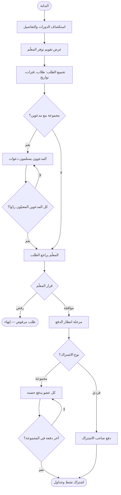
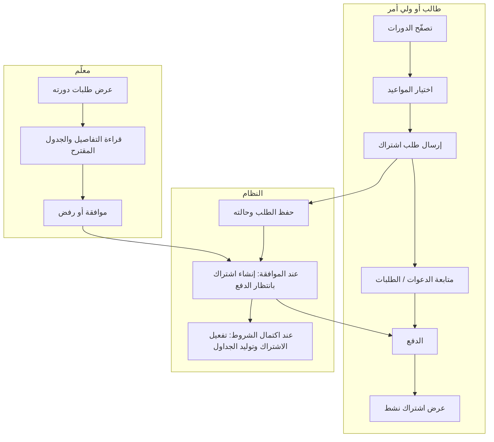
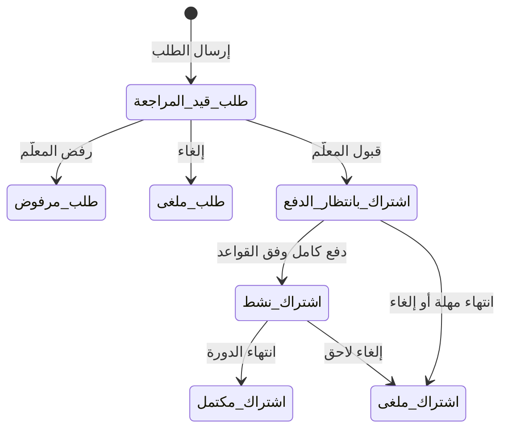

# رحلة التصميم: الدورات والاشتراك والدفع  
## دليل لفريق التصميم (طالب / ولي أمر / معلّم)

هذا المستند يصف **تسلسل الشاشات والحالات والبيانات التي يعرضها التطبيق أو يجمعها من المستخدم**، بلغة مقروءة للمصممين. مسارات الـ API تُذكر كمرجع تقني مختصر؛ التفاصيل البرمجية الكاملة للمطورين موجودة في الشيفرة وفي [`ENROLLMENT_FLOW.md`](ENROLLMENT_FLOW.md).

**المصادقة:** الواجهات التي تخدم الطالب أو ولي الأمر تتطلب حسابًا بدور **طالب / ولي أمر**. واجهات المعلّم تتطلب حسابًا بدور **معلّم**. التطبيق يرسل رمز المصادقة مع كل طلب (لا يُعرض للمستخدم النهائي).

---

## 1. أنواع المستخدمين في هذه الرحلة

| الدور في الواجهة | السلوك المتوقع |
|------------------|----------------|
| طالب بالغ | يتصفح، يقدّم الطلب، يدفع لنفسه، يستجيب للدعوات الجماعية بنفسه |
| ولي أمر | يتصفح نيابة عن الأبناء، يقدّم الطلب، يدفع عن القاصرين، يستجيب للدعوات عن القاصر |
| طالب مدعو في مجموعة | يتلقى دعوة؛ يقبل أو يرفض أو يلغي المشاركة؛ يدفع حصته إن وافق |
| معلّم | يدير دوراته، يراجع طلبات الاشتراك، يوافق أو يرفض |

---

## 2. مخططات توضيحية

### 2.1 تدفّق الرحلة (من الاستكشاف حتى اشتراك نشط)

### 2.2 مسارات متوازية (أعمدة أدوار)

### 2.3 حالات الطلب والاشتراك والدفع (مبسّط)

**جدول مرجعي للحالات (ربط الواجهة بالكود)**

| ما يُعرض للمستخدم (عربي) | الغرض | اسم تقني للمطور |
|--------------------------|--------|-----------------|
| قيد المراجعة، مقبول، مرفوض، ملغى | حالة **طلب الاشتراك** | `RequestStatus` |
| في انتظار الرد، وافق، رفض، ألغى المشاركة | حالة **عضو مدعو** ضمن الطلب | `GroupMemberConfirmationStatus` |
| بانتظار الدفع، نشط، مكتمل، ملغى | حالة **الاشتراك في الدورة** | `EnrollmentStatus` |
| لم يُدفع بعد، تم الدفع، فشل، أُلغي، مُسترد | حالة **عملية الدفع** | `PaymentStatus` |
| مسودة، منشورة، متوقفة مؤقتًا | حالة **نشر الدورة** (شاشات المعلّم) | `CourseStatus` |

**حالة خانة التقويم للمعلّم (طالب يختار موعدًا)**

| ما يعنيه للمستخدم | اسم تقني |
|-------------------|-----------|
| متاح للاختيار | `Free` |
| محجوز مسبقًا | `Booked` |
| غير متاح (استثناء للمعلّم) | `Blocked` |

---

## 3. مرجع سريع — حالات الدورة للمعلّم

| للعرض على بطاقة الدورة للمعلّم | المعنى للمصمم |
|--------------------------------|---------------|
| مسودة | لم تُنشر للطلاب بعد |
| منشورة | تظهر في كتالوج الطالب |
| متوقفة مؤقتًا | مخفية أو موقوفة عن الاستقبال حسب سياسة المنتج |

---

# الجزء أ — الطالب وولي الأمر

مسار المرجع للـ API: البادئة `GET/POST … /Api/V1/Student/…` ما لم يُذكر خلاف ذلك.

---

### أ.1 قائمة الدورات (كتالوج)

**هدف الشاشة:** استعراض الدورات المنشورة مع تصفية مناسبة للطالب أو للابن المختار.

| ما يعرضه التطبيق بعد التحميل |
|------------------------------|
| قائمة بطاقات: عنوان الدورة، صورة الغلاف إن وُجدت، السعر، اسم المعلّم كما يعرضه النظام، متوسط تقييم المعلّم، أسماء المجال والمنهج والمستوى والصف والمادة (عربي/إنجليزي حسب ما يوفّره الخادم)، نمط التدريس ونوع الجلسة، عدد الجلسات أو إشارة إلى أن الجدولة «مرنة»، مدة الجلسة الواحدة، إجمالي المدة بالدقائق عندما يكون محسوبًا |

| ما يختاره المستخدم | إلزامي |
|-------------------|--------|
| رقم الصفحة وحجم الصفحة للتصفح | نعم تقنيًا؛ للمصمم يمكن افتراض التحميل التدريجي |
| الطالب المعني (ابن) عند ولي الأمر | اختياري؛ يحدّد لمن التصفّح والتوافق مع الملف التعليمي |
| تصفيات إضافية: مجال، مادة، نمط التدريس، … | اختياري |

**مرجع تقني:** `GET /Api/V1/Student/Courses`

---

### أ.2 دورات مقترحة

**هدف الشاشة:** عرض عدد محدود من الدورات الموافقة لمجال الطالب التعليمي.

| ما يعرضه التطبيق | ملاحظة تصميم |
|------------------|--------------|
| بطاقات مشابهة لكتالوج أغنى قليلًا من قائمة الفهرس | الخادم يتحقق أن الطالب «لمستخدم الطلب» أو من أبناء ولي الأمر |

| ما يختاره المستخدم | إلزامي |
|-------------------|--------|
| الطالب الذي تُعرض له التوصيات | نعم |

**مرجع تقني:** `GET /Api/V1/Student/Courses/Recommended?StudentId=…`

---

### أ.3 تفاصيل دورة

**هدف الشاشة:** قراءة كامل وصف الدورة وجلساتها (إن لم تكن مرنة) قبل الطلب.

| ما يعرضه التطبيق |
|-------------------|
| عنوان، وصف، معرف المعلّم للاستخدام الداخلي في الشاشة التالية، اسم المعلّم المعروض، التصنيفات التعليمية، السعر، الحد الأقصى للطلاب والمقاعد المتاحة إن وُجدت، نمط الجلسات والتدريس، هل الدورة مرنة، عدد الجلسات ومدة الجلسة، **قائمة الجلسات** (رقم، عنوان، مدة، ملاحظات) عندما لا تكون مرنة |

**مرجع تقني:** `GET /Api/V1/Student/Courses/{id}`

---

### أ.4 تقويم توفر المعلّم

**هدف الشاشة:** تمكين المستخدم من رؤية الفترات المتاحة ضمن نطاق تواريخ، مجمّعة منطقيًا للعرض.

| ما يعرضه التطبيق |
|-------------------|
| معرف المعلّم، أول وآخر يوم في النطاق، ثم مجموعة **أيام الأسبوع** التي للمعلّم فيها أصلًا مواعيد متكررة؛ تحت كل يوم **فترات زمنية**؛ لكل فترة **قائمة تواريخ** ضمن النطاق مع حالة كل تاريخ: متاح، محجوز، غير متاح |

| ما يختاره المستخدم عبر الاستعلام | إلزامي |
|----------------------------------|--------|
| تاريخ البداية | اختياري؛ الافتراض في الخادم: اليوم |
| تاريخ النهاية | اختياري؛ حتى حد أقصى للنطاق يحدده الخادم |

**ملاحظة للعرض:** ترتيب أيام الأسبوع في البيانات يضع **السبت أولًا** ثم بقية الأيام حسب منطق النظام الحالي — يُفضّل مواءمة الواجهة مع ذلك لتجنب قفزات بصرية.

**مرجع تقني:** `GET /Api/V1/Student/Teachers/{teacherId}/Availability?fromDate=…&toDate=…`  
البنية: `Weekdays` ← `Slots` ← لكل slot قائمة `Dates` مع الحالة.

---

### أ.5 إنشاء طلب اشتراك

**هدف الشاشة:** إرسال طلب للمعلّم مع الطلاب المعنيين والمواعيد المختارة والمدى الزمني المفضل.

| ما يملأه أو يختاره المستخدم | إلزامي |
|----------------------------|--------|
| الدورة المراد الاشتراك بها | نعم |
| قائمة الطلاب «الأساسيين» المملوكة للطالب أو الأبناء في حساب ولي الأمر | نعم (واحد على الأقل منطقيًا للمنتج) |
| قائمة طلاب **مدعوين** للمجموعة | اختياري |
| المواعيد المختارة من تقويم المعلّم (معرفات الفترات) | مطلوب وفق قواعد الخادم |
| تاريخ أقرب بداية مقبولة للدورة | نعم |
| تاريخ نهاية مقبولة يغطي الجلسات | نعم |
| لمحة أو ملاحظات للمعلّم | اختياري |
| تصور الجلسات (رقم، مدة، عنوان، ملاحظات) | مطلوب لـ **الدورات المرنة** فقط؛ للدورة ذات جلسات ثابتة يأخذ النظام الهيكل من الدورة |

**بعد النجاح — ما يلمسه المستخدم:**

| ما يعرضه التطبيق |
|-------------------|
| صفحة أو بطاقة تأكيد تحوي ملخص الطلب: الدورة، الحالة «قيد المراجعة»، إجمالي الدقائق والسعر التقديري، الأعضاء مع تمييز صاحب الطلب مقابل مدعو وحالة تأكيد كل مدعو، الجلسات المقترحة، وقائمة **تواريخ الجدول المقترحة** المحسوبة عند العرض من الخادم |

**عند الخطأ:** رسائل توضح تعارض المواعيد أو نقص البيانات حسب استجابة الخادم (تصميم حالة خطأ عامة + إعادة المحاولة).

**مرجع تقني:** `POST /Api/V1/Student/EnrollmentRequests` — الجسم يتضمن كتلة الطلب التي تحوي الحقول أعلاه.

---

### أ.6 قائمة طلباتي

**هدف الشاشة:** متابعة كل الطلبات المقدمة من المستخدم.

| ما يعرضه التطبيق لكل عنصر |
|---------------------------|
| رقم الطلب، الدورة، نمط التدريس، **حالة الطلب**، تاريخ الإنشاء، ملاحظات مختصرة، تاريخ البداية والنهاية المفضّلين |

**مرجع تقني:** `GET /Api/V1/Student/EnrollmentRequests` (مع تصفح الصفحات)

---

### أ.7 تفاصيل طلب واحد

**هدف الشاشة:** قراءة كامل الطلب قبل وبعد قرار المعلّم.

| ما يعرضه التطبيق |
|-------------------|
| عنوان الدورة، وصف مختصر، السعر، أنماط التدريس والجلسة، **حالة الطلب**، التواريخ المفضّلة، إجمالي الدقائق والسعر التقديري، قائمة المواعيد المختارة، الأعضاء مع الاسم المعروض وحالة كل مدعو، هيكل الجلسات المقترحة، **جدول التواريخ المقترحة** (تاريخ الجلسة، الرقم، المدة، عنوان الجلسة إن وُجد) |

**مرجع تقني:** `GET /Api/V1/Student/EnrollmentRequests/{id}`

---

### أ.8 الدعوات (للمجموعات)

**هدف الشاشة:** قائمة الدعوات **المعلقة** للطالب نفسه أو لأبناء ولي الأمر.

| ما يعرضه التطبيق لكل دعوة |
|---------------------------|
| معرف الدعوة والطلب والدورة، اسم الطالب المدعو، اسم من أرسل الطلب، تاريخ الإنشاء، حالة التأكيد الحالية |

**مرجع تقني:** `GET /Api/V1/Student/Invitations`

---

### أ.9 الرد على دعوة جماعية

**هدف الشاشة:** قبول أو رفض أو إلغاء المشاركة كمدعو.

| ما يملأه المستخدم | إلزامي |
|-------------------|--------|
| الطالب الذي يخصّه القرار | نعم |
| القرار: موافقة، رفض، أو إلغاء مشاركة | نعم |

**قيود تجربية:** القاصر يُجيب عن دعوته ولي الأمر فقط؛ البالغ بنفسه فقط — وفق رسائل الخادم.

**بعد النجاح:** رسالة تأكيد حفظ الرد؛ تحديث قائمة الدعوات والطلب إن رُفع الطلب للمعلّم.

**مرجع تقني:** `POST /Api/V1/Student/EnrollmentRequests/{enrollmentRequestId}/Members/Response`

---

### أ.10 الأبناء (ولي الأمر فقط)

**هدف الشاشة:** اختيار الابن عند التصفح أو الطلب أو الدفع.

| ما يعرضه التطبيق |
|-------------------|
| قائمة الأبناء المرتبطة بالحساب مع ما يكفي للعرض والاختيار |

**مرجع تقني:** `GET /Api/V1/Student/MyChildren`

---

### أ.11 البحث عن طلاب لإضافتهم للمجموعة

**هدف الشاشة:** العثور على طلاب آخرين بالاسم أو البريد لإرسال دعوة.

| ما يختاره المستخدم | إلزامي |
|-------------------|--------|
| نص البحث، حد أقصى للنتائج | حسب تصميم النموذج |

**مرجع تقني:** `GET /Api/V1/Student/Students/Search` و `GET /Api/V1/Student/Search` — الأول موجه لمجموعات الطلب؛ الثاني بحث أوسع مع تصفح.

---

### أ.12 الدفع — ملخص فردي

**هدف الشاشة:** عرض المبلغ وحالة الدفع قبل تنفيذ الدفع.

| ما يعرضه التطبيق |
|-------------------|
| حالة الاشتراك، المبلغ المستحق، المدفوع، حالة الدفع، مهلة الدفع إن وُجدت، العملة |

**مرجع تقني:** `GET /Api/V1/Student/Payments/Enrollment/{enrollmentId}/Summary`

---

### أ.13 تنفيذ الدفع — اشتراك فردي

**هدف الشاشة:** إتمام الدفع (النظام الحالي يستخدم **بوابة وهمية**؛ النجاح يعتمد على تحقق الخادم من الشروط).

| ما يملأه المستخدم | إلزامي |
|-------------------|--------|
| معرف الاشتراك المراد دفعه | نعم |

**بعد النجاح — ما يعرضه التطبيق:**

| العنصر | المعنى للمستخدم |
|--------|-----------------|
| تم الدفع بنجاح | حالة الدفع |
| المبلغ والعملة والتاريخ | تأكيد مالي |
| تفعّل الاشتراك الآن؟ | إذا نعم، الانتقال لعرض «نشط» |
| عدد الجداول التي أُنشئت | إشارة إلى أن المواعيد أصبحت محجوزة في النظام |

**مرجع تقني:** `POST /Api/V1/Student/Payments/Enrollment`

---

### أ.14 الدفع — مجموعة

**هدف الشاشة:** متابعة من دفع ومقدار حصة كل عضو؛ كل عضو (أو وليه) يدفع على حدة.

| ما يعرضه ملخص المجموعة |
|-------------------------|
| حالة المجموعة، مهلة الدفع، إجمالي المبلغ، المدفوع والمتبقي، قائمة الأعضاء: اسم الطالب، حصته، حالة دفعه، تاريخ الدفع إن وُجد |

**مرجع تقني:** `GET /Api/V1/Student/Payments/GroupEnrollment/{groupEnrollmentId}/Summary`

| ما يملأه الدافع | إلزامي |
|-----------------|--------|
| معرف مجموعة الاشتراك | نعم |
| الطالب الذي تُسدَّد حصته | نعم |

**بعد آخر دفعة مطلوبة:** نفس فكرة التفعيل وتوليد الجداول كما في الفردي.

**مرجع تقني:** `POST /Api/V1/Student/Payments/GroupMember`

---

### أ.15 اشتراكاتي (بعد الموافقة والدفع حسب المرحلة)

**هدف الشاشة:** قائمة الاشتراكات وحالة كل واحد.

| ما يعرضه التطبيق في القائمة |
|-----------------------------|
| الدورة، حالة الاشتراك، تاريخ الموافقة، اسم المعلّم المعروض |

| ما يعرضه التطبيق في التفاصيل |
|-------------------------------|
| عنوان ووصف الدورة، السعر، حالة الاشتراك، تاريخ الموافقة، اسم المعلّم، أنماط التدريس والجلسة |

**مرجع تقني:** `GET /Api/V1/Student/Enrollments` و `GET /Api/V1/Student/Enrollments/{id}`

---

# الجزء ب — المعلّم

مسار المرجع للـ API: البادئة ` /Api/V1/Teacher/…`.

---

### ب.1 إدارة الدورات

**هدف الشاشة:** إنشاء وتعديل وحذف وعرض قائمة دورات المعلّم.

| ما يعرضه التطبيق في القائمة | ما يُدخل في الإنشاء/التعديل (مختصر للمصمم) |
|-----------------------------|------------------------------------------|
| عنوان، وصف مختصر، مجال ومادة، أنماط التدريس والجلسة، **حالة النشر**، السعر، تفعيل | عنوان، وصف، ربط المادة المعتمدة للمعلّم، الأنماط، مرونة الدورة، مدة الجلسة، السعر، الحد الأقصى للطلاب، الجلسات عند عدم المرونة، صورة الغلاف إن كانت الواجهة تدعمها وفق النموذج |

**مراجع تقنية:**  
`GET / POST / PUT / DELETE /Api/V1/Teacher/TeacherCourse` و `…/TeacherCourse/{id}` — التعديل الأساسي للدورة بـ PUT؛ تغيير مخطط الجلسات قد يكون عبر نقاط مخصصة أخرى انظر وحدة التحكم في المشروع.

---

### ب.2 قائمة طلبات الاشتراك لدورة محددة

**هدف الشاشة:** مراجعة الطلبات الواردة مع تصفية بالحالة.

| ما يعرضه التطبيق لكل طلب |
|--------------------------|
| رقم الطلب، الدورة، اسم مقدّم الطلب، الحالة، التاريخ، إجمالي الدقائق والسعر التقديري، عدد أعضاء المجموعة، أسماء نمط التدريس والجلسة، المدى الزمني المفضل |

| ما يختاره المستخدم | إلزامي |
|-------------------|--------|
| الدورة | نعم |
| حالة الطلب للتصفية | اختياري |
| ترقيم الصفحات | نعم تقنيًا |

**مرجع تقني:** `GET /Api/V1/Teacher/EnrollmentRequests?CourseId=…`

---

### ب.3 تفاصيل طلب اشتراك (معلّم)

**هدف الشاشة:** اتخاذ قرار مدروس بناءً على البيانات الكاملة.

| ما يعرضه التطبيق |
|-------------------|
| الدورة ومقدّم الطلب، الحالة، التواريخ المفضّلة، الإجماليات، الملاحظات، سبب الرفض إن وُجد سابقًا، المواعيد المختارة، الأعضاء مع الأسماء وحالات التأكيد، جدول الجلسات المقترحة، **التواريخ المقترحة للتنفيذ** |

**مرجع تقني:** `GET /Api/V1/Teacher/EnrollmentRequests/{id}`

---

### ب.4 الموافقة على الطلب

**هدف الشاشة:** قبول الطلب وإنشاء مرحلة الدفع للطرف الطالب.

| ما يملأه المستخدم | إلزامي |
|-------------------|--------|
| لا حقول في الطلب الحالي | — |

**بعد النجاح للطالب:** تظهر له **اشتراك بانتظار الدفع** مع مهلة؛ يجب تصميم تذكير واضح بالمهلة.

**مرجع تقني:** `POST /Api/V1/Teacher/EnrollmentRequests/{id}/Approve`

---

### ب.5 رفض الطلب

**هدف الشاشة:** إغلاق الطلب برسالة واضحة للطالب.

| ما يملأه المستخدم | إلزامي |
|-------------------|--------|
| سبب الرفض (نص) | اختياري حسب المنتج؛ الحقل موجود في النموذج |

**مرجع تقني:** `POST /Api/V1/Teacher/EnrollmentRequests/{id}/Reject`

---

## 4. ملحق للمطورين — ربط سريع (اختياري للتصميم)

| موضوع | ملف في المستودع |
|--------|------------------|
| مسارات موحّدة | `Qalam.Data/AppMetaData/Router.cs` |
| نماذج الدورات للطالب | `Qalam.Data/DTOs/Course/CourseDtos.cs` |
| نماذج الطلبات والاشتراكات | `Qalam.Data/DTOs/Course/EnrollmentDtos.cs` |
| نماذج الدفع | `Qalam.Data/DTOs/Payment/PaymentDtos.cs` |
| نماذج طلبات المعلّم | `Qalam.Data/DTOs/Teacher/TeacherEnrollmentRequestDtos.cs` |
| تقويم التوفر للطالب | `Qalam.Data/DTOs/Teacher/TeacherAvailabilityDtos.cs` |

**ملاحظة:** بعض الأسماء المعروضة قد تأتي بالإنجليزية فقط من الخادم؛ يمكن للواجهة ترجمتها أو طلب تعزيز الحقول لاحقًا.

---

*آخر تحديث للمحتوى يستند إلى نماذج المشروع الحالية؛ عند تغيير الـ API يُرجى مراجعة الملفات أعلاه.*
