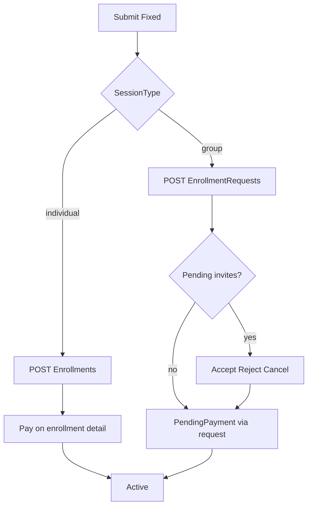

# Enrollment Flow — Frontend Integration Guide

**Business model (current):** courses are **Fixed only**. Grouping (**Individual | Group**) remains. Flexible courses are removed from product (API rejects create/update with `isFlexible=true`).

**Design / UX (Arabic):** see **[DESIGN_COURSE_ENROLLMENT_JOURNEY_AR.md](DESIGN_COURSE_ENROLLMENT_JOURNEY_AR.md)** (may still mention Flexible historically — prefer this file for API truth).

For date/availability internals see [DATE_RANGE_AND_AVAILABILITY.md](DATE_RANGE_AND_AVAILABILITY.md).

---

## Canonical rules

1. **Fixed only** — predefined sessions; Group requests **auto-Approve** on submit.
2. **Individual** creates **Enrollment directly** (no `CourseEnrollmentRequest`).
3. **Group** always uses `CourseEnrollmentRequest` (accept flow when invitees exist).
4. **Teacher tracks** invites → payment → Active/Cancelled; **cannot Reject**.
5. **Single payer** — owner pays full `AmountDue` **once**. Invitees never pay.
6. **Pay gate (Group)** — owner cannot pay until every invitee Accepts, Rejects, or is cancel-invited.
7. **Cancel before pay** — owner may cancel a Group **request** (and linked unpaid enrollment) or a **PendingPayment enrollment** (Individual/Group).
8. Pay success → Enrollment **Active** (+ schedules). Deadline unpaid → **Cancelled**.
9. Free courses (`AmountDue <= 0`) → Individual creates as **Active** with schedules immediately.

---

## Actors

| Actor | What they do |
|-------|--------------|
| **Owner** (adult/guardian who submitted) | Individual: create enrollment, pay, or **cancel before pay**. Group: submit request; cancel pending invites; **cancel whole request** before pay; pay full total once |
| **Invitee / guardian of invitee** | Accept/Reject invite; **no Pay** |
| **Teacher** | Track flow read-only; teach when Active; no Reject |

---

## Individual vs Group (Fixed)

| Kind | Endpoint | After submit | Pay |
|------|----------|--------------|-----|
| Individual | `POST /Student/Enrollments` | Enrollment `PendingPayment` (or Active if free). **No request row** | Enrollment detail `canPay` |
| Group | `POST /Student/EnrollmentRequests` | Approved request; Enrollment when no pending invites | Request detail `canPay` (also enrollment detail when enrollment exists) |
| Group + invites | Same | No enrollment until all invites resolved | Pay only after last respond |

**Wrong path:** Individual on EnrollmentRequests → 400. Group on Enrollments → 400.

**Finalization (group + invites):** when no Invited is still `Pending` and ≥1 member is `Confirmed`, server creates Enrollment with `AmountDue` = estimate; `OwnerUserId` = request owner.

---

## Key student endpoints

| Method | Path | Notes |
|--------|------|-------|
| POST | `/Api/V1/Student/Enrollments` | **Individual only.** Returns `id`, `enrollmentStatus`, `amountDue`, `paymentDeadline`, `payParticipantId`, `canPay`. |
| GET | `/Api/V1/Student/Enrollments/{id}` | Owner or participant. Flags: `isOwner`, `canPay`, `canCancel`, `amountDue`, `paymentDeadline`, `payParticipantId`. |
| POST | `/Api/V1/Student/Enrollments/{id}/Cancel` | Owner; `PendingPayment` only. Cancels enrollment (+ linked request if any). |
| GET | `/Api/V1/Student/Enrollments` | My enrollments list (Individual + Group after enrollment exists). |
| POST | `/Api/V1/Student/EnrollmentRequests` | **Group only.** Fixed → Approved. `proposedSessions` must be `[]`. |
| GET | `/Api/V1/Student/EnrollmentRequests/{id}` | Owner **or** invitee/guardian. Flags: `isOwner`, `canPay`, `canCancel`, `canCancelInvite`, `actionableMemberStudentIds`, `enrollmentId`, `enrollmentStatus`, `amountDue`, `paymentDeadline`, `payParticipantId`. |
| POST | `/Api/V1/Student/EnrollmentRequests/{id}/Cancel` | Owner; Pending/Approved; cancels request + PendingPayment enrollment; pending invites → Cancelled. |
| POST | `.../Members/Response` | `{ data: { studentId, decision: Confirmed\|Rejected } }` |
| POST | `.../Members/{studentId}/Cancel` | Owner cancel pending invite |
| GET | `/Api/V1/Student/Invitations` | Pending invites |
| POST | `/Api/V1/Student/Payments/Participants` | Owner only; `{ data: { participantId } }` charges **full** AmountDue; activates enrollment + schedules |

Course catalog detail includes `sessionTypeCode` (`group` / `individual`) for client branching.

---

## Mobile CTA matrix

### Enrollment detail (Individual primary; Group after enrollment exists)

| State | Owner | Non-owner |
|-------|-------|-----------|
| PendingPayment | **Pay** + **Cancel enrollment** (`canCancel`) | Read-only |
| Active | Read-only (sessions) | Read-only |
| Cancelled | Read-only | Read-only |

### Request detail (Group only)

| State | Owner | Invitee |
|-------|-------|---------|
| Pending invites | Cancel invite; **Cancel request**; **no Pay** | Accept / Reject |
| PendingPayment | Pay (`canPay`); **Cancel request** | Waiting for owner |
| Active | View enrollment | View enrollment |
| Cancelled | Status | Status |

### Activity lists

| Tab | Individual after book | Group + invites | Group pending pay |
|-----|----------------------|-----------------|-------------------|
| Requests | **Not listed** | Waiting invites | Awaiting payment |
| Enrollments | PendingPayment → detail (Pay) | Hidden until enrollment | Listed when exists |
| Invitations | Empty | Pending invite rows | — |

### Navigation after book

| Kind | Success navigation | System back |
|------|-------------------|-------------|
| Individual | `go` enrollment detail | Not BookingReview |
| Group | enrollment-request success → view request | Not BookingReview / not Success after View request |

---

## Teacher

- Create/update courses: Fixed only (sessions required).
- Enrollment requests: track Invites → Payment → Active; **Reject returns 400**.
- Lists include in-progress requests and PendingPayment enrollments.

---

## Payment

- One `Payment` for full `AmountDue`; all participants `Succeeded`; `Enrollment.PaidByUserId` set.
- Owner = `Enrollment.OwnerUserId` when no request; else `EnrollmentRequest.RequestedByUserId`.
- Schedules generated from request slots **or** `EnrollmentSelectedSessionSlots` for Individual.
- Non-owner → 400.
