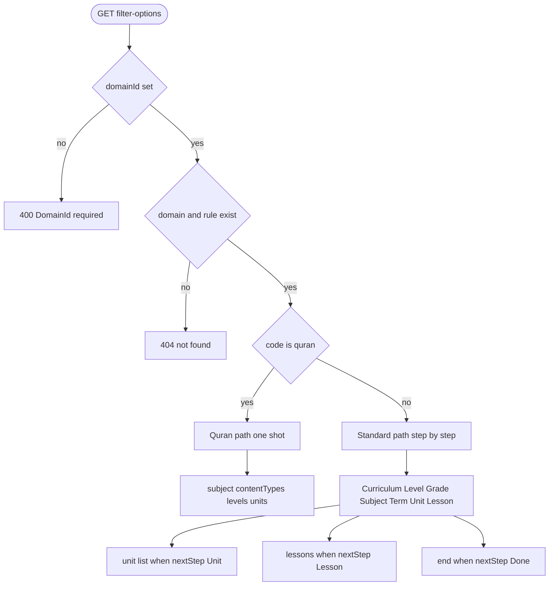
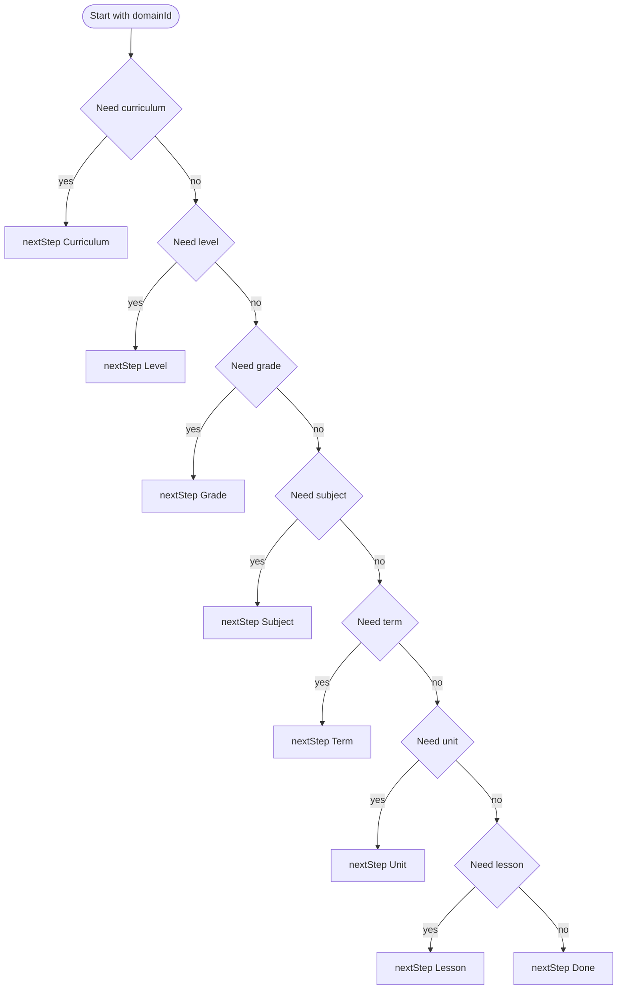
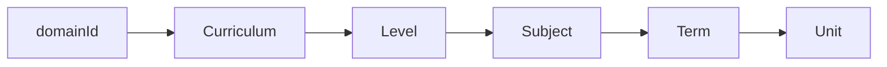
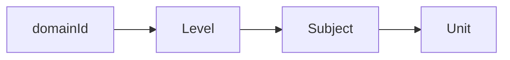
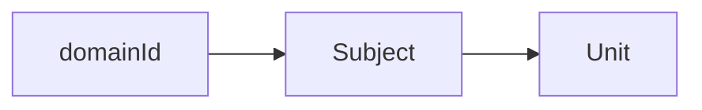
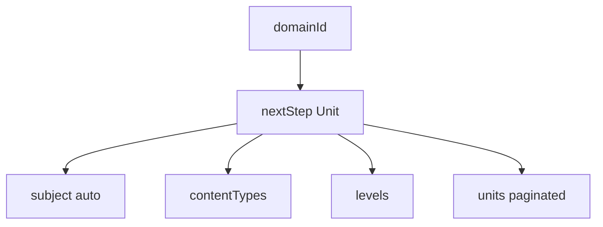

# دليل `filter-options` — منصة قلم التعليمية

> مرجع API لمعالج اختيار المجال → المادة → الوحدات | آخر تحديث: مايو 2026  
> **المصدر:** `EducationController` → `EducationFilterService`

**متطلب مسبق:** `GET /Api/V1/Education/Domains` — لاختيار `domainId` (استخدم `code` وليس رقماً ثابتاً).  
**إدارة CRUD (مشرف):** [Education-Management-CRUD.md](../../../docs/Education-Management-CRUD.md)

---

## جدول المحتويات

1. [نظرة عامة](#نظرة-عامة)
2. [شجرة القرار الرئيسية](#شجرة-القرار-الرئيسية)
3. [شجرة المسار القياسي](#شجرة-المسار-القياسي)
4. [أشجار المجالات](#أشجار-المجالات)
5. [أعلام القواعد `rule`](#أعلام-القواعد-rule)
6. [حالات `nextStep`](#حالات-nextstep)
7. [معاملات الاستعلام](#معاملات-الاستعلام)
8. [شكل الاستجابة](#شكل-الاستجابة)
   - [غلاف API](#غلاف-api)
   - [حقول data](#حقول-data)
   - [استجابة حسب nextStep](#استجابة-حسب-nextstep)
9. [خوارزمية الخادم](#خوارزمية-الخادم)
10. [أمثلة حسب المجال](#أمثلة-حسب-المجال)
11. [الحالات النهائية والحالات الحدية](#الحالات-النهائية-والحالات-الحدية)
12. [أخطاء API](#أخطاء-api)

---

## نظرة عامة

```http
GET /Api/V1/Education/filter-options
Authorization: Bearer {token}
```

| البند | القيمة |
|-------|--------|
| المصادقة | أي مستخدم مسجّل |
| حالة المعالج | **لا تُخزَّن على الخادم** — كل الاختيارات في query string |
| المبدأ | كل استدعاء يرسل **كل** المعرّفات المختارة حتى الآن |

**حقول الاستجابة الأساسية:**

| الحقل | الدور |
|-------|------|
| `nextStep` | الخطوة التالية (`Curriculum` … `Unit` … `Done`) |
| `options[]` | خيارات الخطوة الحالية |
| `unit[]` | الوحدات عند `nextStep === "Unit"` |
| `rule` | أي خطوات مفعّلة لهذا المجال |
| `currentState` | echo لمعاملات الاستعلام |
| `subject`, `contentTypes`, `levels` | قرآن فقط |

---

## شجرة القرار الرئيسية

### Mermaid



### ASCII

```
filter-options
│
├─ domainId مفقود ─────────────────────────────► 400
├─ مجال/قاعدة غير موجودة ─────────────────────► 404
│
└─ domain.code == "quran"?
       │
       ├─ نعم ──► Unit (دفعة واحدة)
       │          ├─ subject (تلقائي)
       │          ├─ contentTypes[]
       │          ├─ levels[]
       │          └─ unit[] + totalCount/pageNumber/pageSize
       │
       └─ لا ──► مسار قياسي (خطوة/استدعاء):
                  Curriculum? → Level? → Grade? → Subject → Term? → Unit → Lesson? → Done
```

---

## شجرة المسار القياسي

يُطبَّق عندما `domain.code ≠ "quran"`. كل عقدة تُقيَّم بالترتيب؛ أول شرط غير مُحقَّق يحدد `nextStep`.



> **شروط العقد:** `Need curriculum` = `hasCurriculum` ولا `curriculumId` · `Need level` = `hasEducationLevel` ولا `levelId` · `Need grade` = `hasGrade` ولا `gradeId` · `Need subject` = لا `subjectId` · `Need term` = `hasAcademicTerm` ولا `termIds` · `Need unit` = `hasContentUnits` ولا `contentUnitId` · `Need lesson` = `hasLessons` و`contentUnitId` ولا `skipLessons` ولا `lessonIds`

```
المسار القياسي (شجرة نصية)
domainId
├── [hasCurriculum && !curriculumId]     → Curriculum  (+ curriculumId)
├── [hasEducationLevel && !levelId]      → Level       (+ levelId)
├── [hasGrade && !gradeId]               → Grade       (+ gradeId)  ※ يتطلب levelId
├── [!subjectId]                         → Subject     (+ subjectId)  ※ دائماً بعد الخطوات السابقة
├── [hasAcademicTerm && !termIds]        → Term        (+ termIds[])  ※ بعد subjectId
├── [hasContentUnits && !contentUnitId]  → Unit        (unit[])
├── [hasLessons && contentUnitId && !skipLessons && !lessonIds] → Lesson (options[])
└── [else]                               → Done
```

> **ترتيب مهم:** المادة **قبل** الفصل. المواد لا تُفلتر بـ `termId` عند الاختيار.

---

## أشجار المجالات

كل مجال = فرع من `GET /Education/Domains` ثم استدعاءات `filter-options` حسب الشجرة.

### شجرة عامة — كل المجالات

```
Education/Domains
├── school      → Curriculum → Level → Grade → Subject → Term → Unit → Lesson? → Done
├── university  → Curriculum → Level ──────────→ Subject → Term → Unit → Lesson? → Done
├── language    → Level ──────────────────────→ Subject → Unit → Lesson? → Done
├── skills      → Subject → Unit → Lesson? → Done
└── quran       → Unit (واحد: subject + contentTypes + levels + unit[])
```

### `school` — تعليم مدرسي


```
school
└── curriculumId
    └── levelId
        └── gradeId
            └── subjectId
                └── termIds[]  (اختياري متعدد — يفلتر unit[])
                    └── unit[]
                        └── contentUnitId
                            └── lessonIds[] أو skipLessons=true → Done
```

### `university` — تعليم جامعي



```
university
└── curriculumId
    └── levelId          ← لا خطوة Grade
        └── subjectId
            └── termIds[]
                └── unit[]
```

### `language` — لغات



### `skills` — مهارات عامة



### `quran` — قرآن كريم



```
quran  (استدعاء واحد)
├── unitTypeCode: QuranPart (افتراضي) | QuranSurah
├── pageNumber / pageSize  (ترقيم الوحدات فقط)
├── subject        (مادة واحدة — تلقائي)
├── contentTypes[] (حفظ / تلاوة / تجويد)
├── levels[]       (نوراني … متقدم)
└── unit[]
```

---

## أعلام القواعد `rule`

| المجال | `code` | منهج | مرحلة | صف | فصل | وحدات | قرآن نوع/مستوى |
|--------|--------|:---:|:---:|:---:|:---:|:---:|:---:|
| تعليم مدرسي | `school` | ✅ | ✅ | ✅ | ✅ | ✅ | — |
| قرآن | `quran` | — | — | — | — | ✅ | تلميح UI |
| لغات | `language` | — | ✅ | — | — | ✅ | — |
| مهارات | `skills` | — | — | — | — | ✅ | — |
| جامعة | `university` | ✅ | ✅ | — | ✅ | ✅ | — |

| حقل `rule` | المعنى |
|------------|--------|
| `hasCurriculum` | خطوة المنهج |
| `hasEducationLevel` | خطوة المرحلة |
| `hasGrade` | خطوة الصف |
| `hasAcademicTerm` | خطوة الفصل (متعدد) |
| `hasContentUnits` | إرجاع `unit[]` |
| `hasLessons` | خطوة الدرس (اختيارية بعد `contentUnitId` عندما `hasLessons === true`) |
| `requiresQuranContentType` | تلميح — نوع محتوى قرآني |
| `requiresQuranLevel` | تلميح — مستوى قرآني |
| `requiresUnitTypeSelection` | تلميح — جزء vs سورة |

> الخادم يفرّع القرآن بـ `domain.code === "quran"` وليس برقم `domainId`.

---

## حالات `nextStep`

| `nextStep` | `options[]` | المعامل المُضاف للاستعلام التالي | ملاحظات |
|------------|-------------|----------------------------------|---------|
| `Curriculum` | مناهج | `curriculumId` | — |
| `Level` | مراحل | `levelId` | — |
| `Grade` | صفوف | `gradeId` | يتطلب `levelId` |
| `Subject` | مواد | `subjectId` | إلزامي بعد الخطوات السابقة |
| `Term` | فصول | `termIds` (متكرر: `termIds=1&termIds=2`) | اختياري؛ يفلتر `unit[]` |
| `Unit` | فارغ | `contentUnitId` | `unit[]` مملوء — اختر وحدة ثم أعد الطلب |
| `Lesson` | دروس | `lessonIds` (متكرر) أو `skipLessons=true` | فقط عند `hasLessons`؛ اختياري |
| `Done` | فارغ | — | اكتمل الاختيار |

---

## معاملات الاستعلام

| المعامل | النوع | مطلوب | ملاحظات |
|---------|------|:---:|---------|
| `domainId` | int | **نعم** | **400** إن غاب |
| `curriculumId` | int? | حسب الخطوة | — |
| `levelId` | int? | حسب الخطوة | قبل `gradeId` |
| `gradeId` | int? | حسب الخطوة | — |
| `termIds` | int[] | حسب الخطوة | `?termIds=1&termIds=2` |
| `subjectId` | int? | بعد Subject | — |
| `contentUnitId` | int? | بعد Unit | يُرسل بعد اختيار وحدة من `unit[]` |
| `lessonIds` | int[] | بعد Lesson | `?lessonIds=101&lessonIds=102` — اختياري متعدد |
| `skipLessons` | bool | اختياري | افتراضي `false` — عند `true` مع `contentUnitId` يتخطى خطوة الدرس → `Done` |
| `quranContentTypeId` | int? | اختياري | **echo فقط** — لا يفلتر الوحدات |
| `quranLevelId` | int? | اختياري | **echo فقط** |
| `unitTypeCode` | string? | قرآن | `QuranPart` (افتراضي), `QuranSurah` |
| `pageNumber` | int | قرآن | افتراضي `1` — **يُتجاهل** في المسار القياسي |
| `pageSize` | int | قرآن | افتراضي `20` — **يُتجاهل** في المسار القياسي |

معاملات زائدة أو خاطئة للمجال **تُتجاهل** (لا 400).

---

## شكل الاستجابة

### غلاف API

كل استدعاء ناجح يعيد نفس الغلاف:

```json
{
  "statusCode": 200,
  "succeeded": true,
  "message": null,
  "data": { },
  "errors": null
}
```

استدعاء فاشل:

```json
{
  "statusCode": 400,
  "succeeded": false,
  "message": "DomainId is required",
  "data": null,
  "errors": null
}
```

### حقول `data`

| الحقل | النوع | متى يُملأ |
|-------|------|----------|
| `currentState` | object | دائماً |
| `rule` | object | دائماً |
| `nextStep` | string | دائماً |
| `options` | `FilterOptionDto[]` | خطوات وسيطة (`Curriculum` … `Term`, `Lesson`) |
| `unit` | `FilterOptionDto[]` \| null | `nextStep === "Unit"` |
| `subject` | `FilterOptionDto` \| null | قرآن فقط |
| `contentTypes` | `FilterOptionDto[]` \| null | قرآن فقط |
| `levels` | `FilterOptionDto[]` \| null | قرآن فقط |
| `totalCount` | int \| null | قرآن (`Unit`) أو مسار قياسي (`Unit`) |
| `pageNumber` | int \| null | قرآن (`Unit`) |
| `pageSize` | int \| null | قرآن (`Unit`) |
| `totalPages` | int \| null | قرآن (`Unit`) |

#### `currentState`

| الحقل | النوع | الوصف |
|-------|------|--------|
| `domainId` | int | المجال |
| `curriculumId` | int \| null | المنهج |
| `levelId` | int \| null | المرحلة |
| `gradeId` | int \| null | الصف |
| `termIds` | int[] \| null | الفصول المختارة |
| `subjectId` | int \| null | المادة |
| `contentUnitId` | int \| null | الوحدة المختارة |
| `lessonIds` | int[] \| null | الدروس المختارة (اختياري) |
| `skipLessons` | bool | تخطي خطوة الدرس |
| `quranContentTypeId` | int \| null | echo فقط (قرآن) |
| `quranLevelId` | int \| null | echo فقط (قرآن) |
| `unitTypeCode` | string \| null | نوع الوحدة (قرآن) |

#### `FilterOptionDto`

```json
{
  "id": 1,
  "nameAr": "المنهج السعودي",
  "nameEn": "Saudi Curriculum",
  "code": "saudi"
}
```

`code` اختياري — يظهر غالباً في وحدات القرآن (`QuranPart`, `QuranSurah`).

### استجابة حسب `nextStep`

| `nextStep` | `options` | `unit` | `subject` | `contentTypes` | `levels` | ترقيم |
|------------|-----------|--------|-----------|----------------|----------|-------|
| `Curriculum` | مناهج | null | null | null | null | null |
| `Level` | مراحل | null | null | null | null | null |
| `Grade` | صفوف | null | null | null | null | null |
| `Subject` | مواد | null | null | null | null | null |
| `Term` | فصول | null | null | null | null | null |
| `Unit` | `[]` | وحدات | قرآن | قرآن | قرآن | قرآن فقط |
| `Lesson` | دروس | null | null | null | null | null |
| `Done` | `[]` | null | null | null | null | null |

#### قالب — خطوة وسيطة (`options`)

```json
{
  "statusCode": 200,
  "succeeded": true,
  "message": null,
  "data": {
    "currentState": {
      "domainId": 1,
      "curriculumId": null,
      "levelId": null,
      "gradeId": null,
      "termIds": null,
      "subjectId": null,
      "quranContentTypeId": null,
      "quranLevelId": null,
      "unitTypeCode": null
    },
    "rule": {
      "hasCurriculum": true,
      "hasEducationLevel": true,
      "hasGrade": true,
      "hasAcademicTerm": true,
      "hasContentUnits": true,
      "hasLessons": true,
      "requiresQuranContentType": false,
      "requiresQuranLevel": false,
      "requiresUnitTypeSelection": false
    },
    "nextStep": "Curriculum",
    "options": [
      { "id": 1, "nameAr": "...", "nameEn": "...", "code": null }
    ],
    "unit": null,
    "totalCount": null,
    "pageNumber": null,
    "pageSize": null,
    "totalPages": null,
    "contentTypes": null,
    "levels": null,
    "subject": null
  },
  "errors": null
}
```

#### قالب — خطوة `Unit` (مسار قياسي)

```json
{
  "statusCode": 200,
  "succeeded": true,
  "message": null,
  "data": {
    "currentState": {
      "domainId": 1,
      "curriculumId": 1,
      "levelId": 2,
      "gradeId": 5,
      "termIds": [1, 2],
      "subjectId": 12,
      "quranContentTypeId": null,
      "quranLevelId": null,
      "unitTypeCode": null
    },
    "rule": { "hasCurriculum": true, "hasEducationLevel": true, "hasGrade": true,
              "hasAcademicTerm": true, "hasContentUnits": true, "hasLessons": true,
              "requiresQuranContentType": false, "requiresQuranLevel": false,
              "requiresUnitTypeSelection": false },
    "nextStep": "Unit",
    "options": [],
    "unit": [
      { "id": 201, "nameAr": "...", "nameEn": "...", "code": "SchoolUnit" }
    ],
    "totalCount": 3,
    "pageNumber": 1,
    "pageSize": 3,
    "totalPages": 1,
    "contentTypes": null,
    "levels": null,
    "subject": null
  },
  "errors": null
}
```

#### قالب — `Unit` (قرآن)

```json
{
  "statusCode": 200,
  "succeeded": true,
  "message": null,
  "data": {
    "currentState": {
      "domainId": 2,
      "curriculumId": null,
      "levelId": null,
      "gradeId": null,
      "termIds": null,
      "subjectId": 499,
      "quranContentTypeId": null,
      "quranLevelId": null,
      "unitTypeCode": "QuranPart"
    },
    "rule": {
      "hasCurriculum": false,
      "hasEducationLevel": false,
      "hasGrade": false,
      "hasAcademicTerm": false,
      "hasContentUnits": true,
      "hasLessons": false,
      "requiresQuranContentType": true,
      "requiresQuranLevel": true,
      "requiresUnitTypeSelection": true
    },
    "nextStep": "Unit",
    "options": [],
    "unit": [
      { "id": 115, "nameAr": "الجزء الأول", "nameEn": "Part 1", "code": "QuranPart" }
    ],
    "totalCount": 30,
    "pageNumber": 1,
    "pageSize": 20,
    "totalPages": 2,
    "subject": { "id": 499, "nameAr": "القرآن الكريم", "nameEn": "Quran", "code": "quran" },
    "contentTypes": [
      { "id": 1, "nameAr": "حفظ", "nameEn": "Memorization", "code": null },
      { "id": 2, "nameAr": "تلاوة", "nameEn": "Recitation", "code": null },
      { "id": 3, "nameAr": "تجويد", "nameEn": "Tajweed", "code": null }
    ],
    "levels": [
      { "id": 1, "nameAr": "نوراني", "nameEn": "Noorani", "code": null },
      { "id": 2, "nameAr": "مبتدئ", "nameEn": "Beginner", "code": null },
      { "id": 3, "nameAr": "متوسط", "nameEn": "Intermediate", "code": null },
      { "id": 4, "nameAr": "متقدم", "nameEn": "Advanced", "code": null }
    ]
  },
  "errors": null
}
```

**قرآن — مراجع سريعة:**

| الحقل | القيم |
|-------|-------|
| `contentTypes` | 1 حفظ · 2 تلاوة · 3 تجويد |
| `levels` | 1 نوراني · 2 مبتدئ · 3 متوسط · 4 متقدم |
| `unitTypeCode` | `QuranPart` (30 جزء) · `QuranSurah` (114 سورة) |

---

## خوارزمية الخادم

(`EducationFilterService`)

1. **تحقق:** `domainId` مطلوب → المجال + `EducationRule` موجودان.
2. **تفرع:** `code == "quran"` → مسار قرآن؛ وإلا مسار قياسي.
3. **قرآن:** مادة واحدة تلقائية، `unitTypeCode` افتراضي `QuranPart`، `contentTypes` + `levels` + `unit[]` مرقّم → `nextStep: Unit`.
4. **قياسي:** بالترتيب — Curriculum → Level → Grade → **Subject** → Term → Unit → Lesson (اختياري) → Done.
5. **قرآن post-process:** المادة تُنقل من `options` إلى `subject` ويُفرَّغ `options`.

---

## أمثلة حسب المجال

> كل مثال: **طلب** (`http`) ثم **استجابة** (`json`) بنفس غلاف API. للقوالب العامة راجع [شكل الاستجابة](#شكل-الاستجابة).

### مثال 1 — `school`

| # | `nextStep` | معاملات الاستعلام التراكمية |
|:-:|------------|---------------------------|
| 1 | `Curriculum` | `domainId=1` |
| 2 | `Level` | `+ curriculumId=1` |
| 3 | `Grade` | `+ levelId=2` |
| 4 | `Subject` | `+ gradeId=5` |
| 5 | `Term` | `+ subjectId=12` |
| 6 | `Unit` | `+ termIds=1&termIds=2` |
| 7 | `Lesson` | `+ contentUnitId=44` |
| 8a | `Done` | `+ lessonIds=101&lessonIds=102` |
| 8b | `Done` | `+ skipLessons=true` (بدون `lessonIds`) |

#### 1 — Curriculum

**Request**

```http
GET /Api/V1/Education/filter-options?domainId=1
Authorization: Bearer {token}
```

**Response**

```json
{
  "statusCode": 200,
  "succeeded": true,
  "message": null,
  "data": {
    "currentState": {
      "domainId": 1, "curriculumId": null, "levelId": null, "gradeId": null,
      "termIds": null, "subjectId": null,
      "quranContentTypeId": null, "quranLevelId": null, "unitTypeCode": null
    },
    "rule": {
      "hasCurriculum": true, "hasEducationLevel": true, "hasGrade": true,
      "hasAcademicTerm": true, "hasContentUnits": true, "hasLessons": true,
      "requiresQuranContentType": false, "requiresQuranLevel": false,
      "requiresUnitTypeSelection": false
    },
    "nextStep": "Curriculum",
    "options": [
      { "id": 1, "nameAr": "المنهج السعودي", "nameEn": "Saudi Curriculum", "code": "saudi" },
      { "id": 2, "nameAr": "المنهج البريطاني", "nameEn": "British Curriculum", "code": "british" }
    ],
    "unit": null,
    "totalCount": null, "pageNumber": null, "pageSize": null, "totalPages": null,
    "contentTypes": null, "levels": null, "subject": null
  },
  "errors": null
}
```

#### 4 — Subject

**Request**

```http
GET /Api/V1/Education/filter-options?domainId=1&curriculumId=1&levelId=2&gradeId=5
Authorization: Bearer {token}
```

**Response**

```json
{
  "statusCode": 200,
  "succeeded": true,
  "message": null,
  "data": {
    "currentState": {
      "domainId": 1, "curriculumId": 1, "levelId": 2, "gradeId": 5,
      "termIds": null, "subjectId": null,
      "quranContentTypeId": null, "quranLevelId": null, "unitTypeCode": null
    },
    "rule": {
      "hasCurriculum": true, "hasEducationLevel": true, "hasGrade": true,
      "hasAcademicTerm": true, "hasContentUnits": true, "hasLessons": true,
      "requiresQuranContentType": false, "requiresQuranLevel": false,
      "requiresUnitTypeSelection": false
    },
    "nextStep": "Subject",
    "options": [
      { "id": 12, "nameAr": "الرياضيات", "nameEn": "Mathematics", "code": null },
      { "id": 13, "nameAr": "العلوم", "nameEn": "Science", "code": null }
    ],
    "unit": null,
    "totalCount": null, "pageNumber": null, "pageSize": null, "totalPages": null,
    "contentTypes": null, "levels": null, "subject": null
  },
  "errors": null
}
```

#### 6 — Unit

**Request**

```http
GET /Api/V1/Education/filter-options?domainId=1&curriculumId=1&levelId=2&gradeId=5&subjectId=12&termIds=1&termIds=2
Authorization: Bearer {token}
```

**Response**

```json
{
  "statusCode": 200,
  "succeeded": true,
  "message": null,
  "data": {
    "currentState": {
      "domainId": 1, "curriculumId": 1, "levelId": 2, "gradeId": 5,
      "subjectId": 12, "termIds": [1, 2],
      "quranContentTypeId": null, "quranLevelId": null, "unitTypeCode": null
    },
    "rule": {
      "hasCurriculum": true, "hasEducationLevel": true, "hasGrade": true,
      "hasAcademicTerm": true, "hasContentUnits": true, "hasLessons": true,
      "requiresQuranContentType": false, "requiresQuranLevel": false,
      "requiresUnitTypeSelection": false
    },
    "nextStep": "Unit",
    "options": [],
    "unit": [
      { "id": 201, "nameAr": "الأعداد والعمليات", "nameEn": "Numbers and Operations", "code": "SchoolUnit" },
      { "id": 202, "nameAr": "الكسور والنسب", "nameEn": "Fractions and Ratios", "code": "SchoolUnit" }
    ],
    "totalCount": 2, "pageNumber": 1, "pageSize": 2, "totalPages": 1,
    "contentTypes": null, "levels": null, "subject": null
  },
  "errors": null
}
```


---

### مثال 2 — `quran`

| # | `nextStep` | معاملات الاستعلام |
|:-:|------------|-------------------|
| 1 | `Unit` | `domainId={quran}&unitTypeCode=QuranPart&pageNumber=1&pageSize=20` |

#### 1 — Unit (استدعاء واحد)

**Request — أجزاء (افتراضي)**

```http
GET /Api/V1/Education/filter-options?domainId=2&pageNumber=1&pageSize=20
Authorization: Bearer {token}
```

**Request — سور**

```http
GET /Api/V1/Education/filter-options?domainId=2&unitTypeCode=QuranSurah&pageNumber=1&pageSize=50
Authorization: Bearer {token}
```

**Response**

```json
{
  "statusCode": 200,
  "succeeded": true,
  "message": null,
  "data": {
    "currentState": {
      "domainId": 2, "curriculumId": null, "levelId": null, "gradeId": null,
      "termIds": null, "subjectId": 499,
      "quranContentTypeId": null, "quranLevelId": null, "unitTypeCode": "QuranPart"
    },
    "rule": {
      "hasCurriculum": false, "hasEducationLevel": false, "hasGrade": false,
      "hasAcademicTerm": false, "hasContentUnits": true, "hasLessons": false,
      "requiresQuranContentType": true, "requiresQuranLevel": true,
      "requiresUnitTypeSelection": true
    },
    "nextStep": "Unit",
    "options": [],
    "unit": [
      { "id": 115, "nameAr": "الجزء الأول", "nameEn": "Part 1", "code": "QuranPart" }
    ],
    "totalCount": 30, "pageNumber": 1, "pageSize": 20, "totalPages": 2,
    "subject": { "id": 499, "nameAr": "القرآن الكريم", "nameEn": "Quran", "code": "quran" },
    "contentTypes": [
      { "id": 1, "nameAr": "حفظ", "nameEn": "Memorization", "code": null },
      { "id": 2, "nameAr": "تلاوة", "nameEn": "Recitation", "code": null },
      { "id": 3, "nameAr": "تجويد", "nameEn": "Tajweed", "code": null }
    ],
    "levels": [
      { "id": 1, "nameAr": "نوراني", "nameEn": "Noorani", "code": null },
      { "id": 2, "nameAr": "مبتدئ", "nameEn": "Beginner", "code": null },
      { "id": 3, "nameAr": "متوسط", "nameEn": "Intermediate", "code": null },
      { "id": 4, "nameAr": "متقدم", "nameEn": "Advanced", "code": null }
    ]
  },
  "errors": null
}
```

---

### مثال 3 — `language`

| # | `nextStep` | معاملات الاستعلام التراكمية |
|:-:|------------|---------------------------|
| 1 | `Level` | `domainId=3` |
| 2 | `Subject` | `+ levelId=1` |
| 3 | `Unit` | `+ subjectId=42` |

#### 1 — Level

**Request**

```http
GET /Api/V1/Education/filter-options?domainId=3
Authorization: Bearer {token}
```

**Response**

```json
{
  "statusCode": 200,
  "succeeded": true,
  "message": null,
  "data": {
    "currentState": {
      "domainId": 3, "curriculumId": null, "levelId": null, "gradeId": null,
      "termIds": null, "subjectId": null,
      "quranContentTypeId": null, "quranLevelId": null, "unitTypeCode": null
    },
    "rule": {
      "hasCurriculum": false, "hasEducationLevel": true, "hasGrade": false,
      "hasAcademicTerm": false, "hasContentUnits": true, "hasLessons": true,
      "requiresQuranContentType": false, "requiresQuranLevel": false,
      "requiresUnitTypeSelection": false
    },
    "nextStep": "Level",
    "options": [
      { "id": 1, "nameAr": "مبتدئ", "nameEn": "Beginner", "code": null },
      { "id": 2, "nameAr": "متوسط", "nameEn": "Intermediate", "code": null }
    ],
    "unit": null,
    "totalCount": null, "pageNumber": null, "pageSize": null, "totalPages": null,
    "contentTypes": null, "levels": null, "subject": null
  },
  "errors": null
}
```

#### 3 — Unit

**Request**

```http
GET /Api/V1/Education/filter-options?domainId=3&levelId=1&subjectId=42
Authorization: Bearer {token}
```

**Response**

```json
{
  "statusCode": 200,
  "succeeded": true,
  "message": null,
  "data": {
    "currentState": {
      "domainId": 3, "curriculumId": null, "levelId": 1, "gradeId": null,
      "termIds": null, "subjectId": 42,
      "quranContentTypeId": null, "quranLevelId": null, "unitTypeCode": null
    },
    "rule": {
      "hasCurriculum": false, "hasEducationLevel": true, "hasGrade": false,
      "hasAcademicTerm": false, "hasContentUnits": true, "hasLessons": true,
      "requiresQuranContentType": false, "requiresQuranLevel": false,
      "requiresUnitTypeSelection": false
    },
    "nextStep": "Unit",
    "options": [],
    "unit": [
      { "id": 301, "nameAr": "النحو الأساسي", "nameEn": "Basic Grammar", "code": "LanguageModule" },
      { "id": 302, "nameAr": "المفردات", "nameEn": "Vocabulary", "code": "LanguageModule" }
    ],
    "totalCount": 2, "pageNumber": 1, "pageSize": 2, "totalPages": 1,
    "contentTypes": null, "levels": null, "subject": null
  },
  "errors": null
}
```

---

### مثال 4 — `skills`

| # | `nextStep` | معاملات الاستعلام التراكمية |
|:-:|------------|---------------------------|
| 1 | `Subject` | `domainId=4` |
| 2 | `Unit` | `+ subjectId=10` |

#### 1 — Subject

**Request**

```http
GET /Api/V1/Education/filter-options?domainId=4
Authorization: Bearer {token}
```

**Response**

```json
{
  "statusCode": 200,
  "succeeded": true,
  "message": null,
  "data": {
    "currentState": {
      "domainId": 4, "curriculumId": null, "levelId": null, "gradeId": null,
      "termIds": null, "subjectId": null,
      "quranContentTypeId": null, "quranLevelId": null, "unitTypeCode": null
    },
    "rule": {
      "hasCurriculum": false, "hasEducationLevel": false, "hasGrade": false,
      "hasAcademicTerm": false, "hasContentUnits": true, "hasLessons": true,
      "requiresQuranContentType": false, "requiresQuranLevel": false,
      "requiresUnitTypeSelection": false
    },
    "nextStep": "Subject",
    "options": [
      { "id": 10, "nameAr": "البرمجة", "nameEn": "Programming", "code": null },
      { "id": 11, "nameAr": "التصوير", "nameEn": "Photography", "code": null }
    ],
    "unit": null,
    "totalCount": null, "pageNumber": null, "pageSize": null, "totalPages": null,
    "contentTypes": null, "levels": null, "subject": null
  },
  "errors": null
}
```

#### 2 — Unit

**Request**

```http
GET /Api/V1/Education/filter-options?domainId=4&subjectId=10
Authorization: Bearer {token}
```

**Response**

```json
{
  "statusCode": 200,
  "succeeded": true,
  "message": null,
  "data": {
    "currentState": {
      "domainId": 4, "curriculumId": null, "levelId": null, "gradeId": null,
      "termIds": null, "subjectId": 10,
      "quranContentTypeId": null, "quranLevelId": null, "unitTypeCode": null
    },
    "rule": {
      "hasCurriculum": false, "hasEducationLevel": false, "hasGrade": false,
      "hasAcademicTerm": false, "hasContentUnits": true, "hasLessons": true,
      "requiresQuranContentType": false, "requiresQuranLevel": false,
      "requiresUnitTypeSelection": false
    },
    "nextStep": "Unit",
    "options": [],
    "unit": [
      { "id": 401, "nameAr": "أساسيات بايثون", "nameEn": "Python Basics", "code": "SchoolUnit" }
    ],
    "totalCount": 1, "pageNumber": 1, "pageSize": 1, "totalPages": 1,
    "contentTypes": null, "levels": null, "subject": null
  },
  "errors": null
}
```

---

### مثال 5 — `university`

| # | `nextStep` | معاملات الاستعلام التراكمية |
|:-:|------------|---------------------------|
| 1 | `Curriculum` | `domainId=5` |
| 2 | `Level` | `+ curriculumId=2` |
| 3 | `Subject` | `+ levelId=3` |
| 4 | `Term` | `+ subjectId=20` |
| 5 | `Unit` | `+ termIds=1` |

> لا خطوة `Grade` لهذا المجال.

#### 1 — Curriculum

**Request**

```http
GET /Api/V1/Education/filter-options?domainId=5
Authorization: Bearer {token}
```

**Response**

```json
{
  "statusCode": 200,
  "succeeded": true,
  "message": null,
  "data": {
    "currentState": {
      "domainId": 5, "curriculumId": null, "levelId": null, "gradeId": null,
      "termIds": null, "subjectId": null,
      "quranContentTypeId": null, "quranLevelId": null, "unitTypeCode": null
    },
    "rule": {
      "hasCurriculum": true, "hasEducationLevel": true, "hasGrade": false,
      "hasAcademicTerm": true, "hasContentUnits": true, "hasLessons": true,
      "requiresQuranContentType": false, "requiresQuranLevel": false,
      "requiresUnitTypeSelection": false
    },
    "nextStep": "Curriculum",
    "options": [
      { "id": 2, "nameAr": "بكالوريوس علوم الحاسب", "nameEn": "BSc Computer Science", "code": "bsc_cs" }
    ],
    "unit": null,
    "totalCount": null, "pageNumber": null, "pageSize": null, "totalPages": null,
    "contentTypes": null, "levels": null, "subject": null
  },
  "errors": null
}
```

#### 5 — Unit

**Request**

```http
GET /Api/V1/Education/filter-options?domainId=5&curriculumId=2&levelId=3&subjectId=20&termIds=1
Authorization: Bearer {token}
```

**Response**

```json
{
  "statusCode": 200,
  "succeeded": true,
  "message": null,
  "data": {
    "currentState": {
      "domainId": 5, "curriculumId": 2, "levelId": 3, "gradeId": null,
      "termIds": [1], "subjectId": 20,
      "quranContentTypeId": null, "quranLevelId": null, "unitTypeCode": null
    },
    "rule": {
      "hasCurriculum": true, "hasEducationLevel": true, "hasGrade": false,
      "hasAcademicTerm": true, "hasContentUnits": true, "hasLessons": true,
      "requiresQuranContentType": false, "requiresQuranLevel": false,
      "requiresUnitTypeSelection": false
    },
    "nextStep": "Unit",
    "options": [],
    "unit": [
      { "id": 501, "nameAr": "المصفوفات", "nameEn": "Arrays", "code": "SchoolUnit" },
      { "id": 502, "nameAr": "القوائم المتصلة", "nameEn": "Linked Lists", "code": "SchoolUnit" }
    ],
    "totalCount": 2, "pageNumber": 1, "pageSize": 2, "totalPages": 1,
    "contentTypes": null, "levels": null, "subject": null
  },
  "errors": null
}
```

---

## الحالات النهائية والحالات الحدية

### الحالات النهائية

| `nextStep` | المعنى |
|------------|--------|
| `Unit` | `unit[]` جاهزة — انتهى المعالج |
| `Done` | `hasContentUnits == false` — لا وحدات (نادر في البذرة الحالية) |

### حالات حدية

- معاملات مجال خاطئ **تُتجاهل** (مثلاً `gradeId` في `skills`).
- `pageNumber` / `pageSize` فعّالان في **القرآن فقط**؛ المسار القياسي يعيد كل الوحدات دفعة واحدة (`totalPages: 1`).
- `termIds` فارغ أو غائب → يبقى `nextStep: Term` حتى يُرسل قيمة واحدة على الأقل.
- `quranContentTypeId` / `quranLevelId` في الاستعلام: echo في `currentState` فقط.
- لا يوجد `hasSubject` في `rule` — خطوة المادة إلزامية بعد الخطوات المطلوبة.
- المواد عند Subject **لا تُفلتر بالفصل** (`termId: null` في الاستعلام الداخلي).
- تخطي Term: أرسل كل `termIds` دفعة واحدة للانتقال مباشرة إلى `Unit`.
- JSON: `unit`, `subject`, `contentTypes`, `levels` بأسماء `[JsonPropertyName]` صريحة.

---

## أخطاء API

### جدول الأخطاء

| السبب | HTTP | `message` |
|-------|:---:|-----------|
| غياب `domainId` | 400 | `DomainId is required` |
| مجال بلا `EducationRule` | 404 | `Domain with ID '{id}' not found or has no rules configured` |
| مجال غير موجود | 404 | `Domain with ID '{id}' not found` |
| قرآن بلا مادة مبذورة | 404 | `Quran subject not found` |
| `gradeId` بدون `levelId` | 404 | `LevelId is required before selecting Grade` |
| Term بلا `curriculumId` | 404 | `CurriculumId is required before selecting Term` |
| توكن غير صالح | 401 | — |

### أمثلة استجابة خطأ

**Request**

```http
GET /Api/V1/Education/filter-options
Authorization: Bearer {token}
```

**Response**

```json
{
  "statusCode": 400,
  "succeeded": false,
  "message": "DomainId is required",
  "data": null,
  "errors": null
}
```

**Request**

```http
GET /Api/V1/Education/filter-options?domainId=99999
Authorization: Bearer {token}
```

**Response**

```json
{
  "statusCode": 404,
  "succeeded": false,
  "message": "Domain with ID '99999' not found or has no rules configured",
  "data": null,
  "errors": null
}
```

---

**الكود:** `Qalam.Service/Implementations/EducationFilterService.cs` · `Qalam.Data/DTOs/FilterOptionsResponseDto.cs`