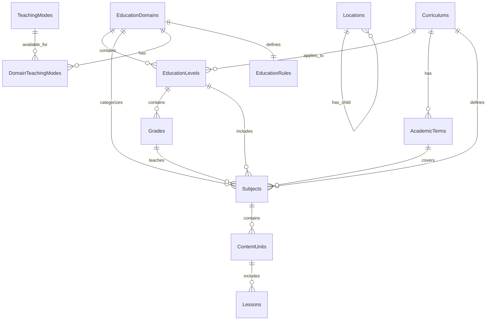

# تصميم قاعدة بيانات المنصة التعليمية الذكية

## 🎯 المبادئ الأساسية للتصميم

1. **فصل واضح**: البنية الإدارية منفصلة عن العمليات التشغيلية
2. **قيم ثابتة**: التدريس (حضوري/عن بعد) والجلسات (فردي/جماعي) قيم ثابتة
3. **مرونة**: دعم إضافة مجالات تعليمية جديدة بدون Refactor
4. **تخصصية**: دعم خاص لتعليم القرآن الكريم
5. **معيارية**: دعم مناهج متعددة (سعودي، مصري، إلخ)

---

## 📋 الأقسام الرئيسية

### القسم 1: البنية الإدارية (Admin Infrastructure)

- مجالات التعليم والمناهج
- المراحل والصفوف والمواد
- تعليم القرآن الكريم
- طرق التدريس والقواعد

### القسم 2: المستخدمين (موجود - سيتم توسعته)

- Teachers, Students, Roles

### القسم 3: التوفر والجدولة (مستقبلاً)

### القسم 4: الدورات والجلسات (مستقبلاً)

### القسم 5: المدفوعات (مستقبلاً)

---

## 🗄️ القسم 1: البنية الإدارية (Admin Infrastructure)

### Schema: `education`

---

### 1.1 مجالات التعليم الرئيسية

#### `EducationDomains` - نطاقات التعليم

```csharp
public class EducationDomain : AuditableEntity
{
    public int Id { get; set; }
    
    [Required, MaxLength(100)]
    public string NameAr { get; set; } = default!;
    
    [Required, MaxLength(100)]
    public string NameEn { get; set; } = default!;
    
    [Required, MaxLength(50)]
    public string Code { get; set; } = default!; // school, quran, language, skills
    
    public bool HasCurriculum { get; set; } // هل يحتاج منهج رسمي؟
    
    [MaxLength(500)]
    public string? DescriptionAr { get; set; }
    
    [MaxLength(500)]
    public string? DescriptionEn { get; set; }
    
    public bool IsActive { get; set; } = true;
    
    // Navigation Properties
    public ICollection<EducationLevel> EducationLevels { get; set; } = new List<EducationLevel>();
    public ICollection<Subject> Subjects { get; set; } = new List<Subject>();
    public ICollection<DomainTeachingMode> DomainTeachingModes { get; set; } = new List<DomainTeachingMode>();
    public EducationRule? EducationRule { get; set; }
}
```

**بيانات أساسية (Seed Data):**

- تعليم مدرسي (school) - HasCurriculum: true
- قرآن كريم (quran) - HasCurriculum: false
- لغات (language) - HasCurriculum: false
- مهارات عامة (skills) - HasCurriculum: false

---

#### `Curriculums` - المناهج الدراسية

```csharp
public class Curriculum : AuditableEntity
{
    public int Id { get; set; }
    
    [Required, MaxLength(100)]
    public string NameAr { get; set; } = default!;
    
    [Required, MaxLength(100)]
    public string NameEn { get; set; } = default!;
    
    [MaxLength(100)]
    public string? Country { get; set; } // السعودية، مصر، إلخ
    
    [MaxLength(500)]
    public string? DescriptionAr { get; set; }
    
    [MaxLength(500)]
    public string? DescriptionEn { get; set; }
    
    public bool IsActive { get; set; } = true;
    
    // Navigation Properties
    public ICollection<EducationLevel> EducationLevels { get; set; } = new List<EducationLevel>();
    public ICollection<AcademicTerm> AcademicTerms { get; set; } = new List<AcademicTerm>();
    public ICollection<Subject> Subjects { get; set; } = new List<Subject>();
}
```

**بيانات أساسية:**

- المنهج السعودي
- المنهج المصري
- المنهج الأمريكي

---

### 1.2 المراحل والصفوف التعليمية

#### `EducationLevels` - المراحل التعليمية

```csharp
public class EducationLevel : AuditableEntity
{
    public int Id { get; set; }
    
    public int DomainId { get; set; }
    public EducationDomain Domain { get; set; } = default!;
    
    public int? CurriculumId { get; set; } // nullable للمجالات بدون منهج
    public Curriculum? Curriculum { get; set; }
    
    [Required, MaxLength(100)]
    public string NameAr { get; set; } = default!;
    
    [Required, MaxLength(100)]
    public string NameEn { get; set; } = default!;
    
    public int OrderIndex { get; set; } // ترتيب العرض
    
    public bool IsActive { get; set; } = true;
    
    // Navigation Properties
    public ICollection<Grade> Grades { get; set; } = new List<Grade>();
    public ICollection<Subject> Subjects { get; set; } = new List<Subject>();
}
```

**أمثلة:**

- **مدرسي (سعودي)**: ابتدائي، متوسط، ثانوي
- **قرآن**: تمهيدي، مبتدئ، متوسط، متقدم
- **لغات**: مبتدئ، متوسط، متقدم

---

#### `Grades` - الصفوف الدراسية

```csharp
public class Grade : AuditableEntity
{
    public int Id { get; set; }
    
    public int LevelId { get; set; }
    public EducationLevel Level { get; set; } = default!;
    
    [Required, MaxLength(50)]
    public string NameAr { get; set; } = default!;
    
    [Required, MaxLength(50)]
    public string NameEn { get; set; } = default!;
    
    public int OrderIndex { get; set; }
    
    public bool IsActive { get; set; } = true;
    
    // Navigation Properties
    public ICollection<Subject> Subjects { get; set; } = new List<Subject>();
}
```

**أمثلة:**

- ابتدائي: الأول، الثاني، ... السادس
- متوسط: الأول، الثاني، الثالث
- ثانوي: الأول، الثاني، الثالث

---

#### `AcademicTerms` - الفصول الدراسية

```csharp
public class AcademicTerm : AuditableEntity
{
    public int Id { get; set; }
    
    public int CurriculumId { get; set; }
    public Curriculum Curriculum { get; set; } = default!;
    
    [Required, MaxLength(50)]
    public string NameAr { get; set; } = default!;
    
    [Required, MaxLength(50)]
    public string NameEn { get; set; } = default!;
    
    public int OrderIndex { get; set; }
    
    public bool IsMandatory { get; set; } = true; // إلزامي؟
    
    public bool IsActive { get; set; } = true;
    
    // Navigation Properties
    public ICollection<Subject> Subjects { get; set; } = new List<Subject>();
}
```

**أمثلة:**

- الفصل الأول
- الفصل الثاني
- الفصل الثالث (للمناهج ذات 3 فصول)

---

### 1.3 المواد والمحتوى التعليمي

#### `Subjects` - المواد الدراسية

```csharp
public class Subject : AuditableEntity
{
    public int Id { get; set; }
    
    public int DomainId { get; set; }
    public EducationDomain Domain { get; set; } = default!;
    
    public int? CurriculumId { get; set; }
    public Curriculum? Curriculum { get; set; }
    
    public int? LevelId { get; set; }
    public EducationLevel? Level { get; set; }
    
    public int? GradeId { get; set; }
    public Grade? Grade { get; set; }
    
    public int? TermId { get; set; }
    public AcademicTerm? Term { get; set; }
    
    [Required, MaxLength(100)]
    public string NameAr { get; set; } = default!;
    
    [Required, MaxLength(100)]
    public string NameEn { get; set; } = default!;
    
    [MaxLength(500)]
    public string? DescriptionAr { get; set; }
    
    [MaxLength(500)]
    public string? DescriptionEn { get; set; }
    
    public bool IsActive { get; set; } = true;
    
    // Navigation Properties
    public ICollection<ContentUnit> ContentUnits { get; set; } = new List<ContentUnit>();
    public ICollection<TeacherSubject> TeacherSubjects { get; set; } = new List<TeacherSubject>();
}
```

**أمثلة:**

- **مدرسي**: رياضيات، علوم، لغة عربية، لغة إنجليزية
- **لغات**: English, French, German
- **مهارات**: برمجة، تصميم، إدارة مشاريع

---

#### `ContentUnits` - الوحدات التعليمية

```csharp
public class ContentUnit : AuditableEntity
{
    public int Id { get; set; }
    
    public int SubjectId { get; set; }
    public Subject Subject { get; set; } = default!;
    
    [Required, MaxLength(200)]
    public string NameAr { get; set; } = default!;
    
    [Required, MaxLength(200)]
    public string NameEn { get; set; } = default!;
    
    public int OrderIndex { get; set; }
    
    public bool IsActive { get; set; } = true;
    
    // Navigation Properties
    public ICollection<Lesson> Lessons { get; set; } = new List<Lesson>();
}
```

---

#### `Lessons` - الدروس

```csharp
public class Lesson : AuditableEntity
{
    public int Id { get; set; }
    
    public int UnitId { get; set; }
    public ContentUnit Unit { get; set; } = default!;
    
    [Required, MaxLength(200)]
    public string NameAr { get; set; } = default!;
    
    [Required, MaxLength(200)]
    public string NameEn { get; set; } = default!;
    
    public int OrderIndex { get; set; }
    
    public bool IsActive { get; set; } = true;
}
```

---

### 1.4 تعليم القرآن الكريم (Quran-Specific)

#### `QuranLevels` - مستويات القرآن

```csharp
public class QuranLevel : AuditableEntity
{
    public int Id { get; set; }
    
    [Required, MaxLength(50)]
    public string NameAr { get; set; } = default!;
    
    [Required, MaxLength(50)]
    public string NameEn { get; set; } = default!;
    
    public int OrderIndex { get; set; }
    
    [MaxLength(300)]
    public string? DescriptionAr { get; set; }
    
    [MaxLength(300)]
    public string? DescriptionEn { get; set; }
    
    public bool IsActive { get; set; } = true;
}
```

**بيانات أساسية:**

- تمهيدي
- مبتدئ
- متوسط
- متقدم

---

#### `QuranContentTypes` - أنواع المحتوى القرآني

```csharp
public class QuranContentType : AuditableEntity
{
    public int Id { get; set; }
    
    [Required, MaxLength(50)]
    public string NameAr { get; set; } = default!;
    
    [Required, MaxLength(50)]
    public string NameEn { get; set; } = default!;
    
    [Required, MaxLength(30)]
    public string Code { get; set; } = default!; // memorization, recitation, tajweed
    
    public bool IsActive { get; set; } = true;
}
```

**بيانات أساسية:**

- حفظ (memorization)
- تلاوة (recitation)
- تجويد (tajweed)

---

#### `QuranParts` - أجزاء القرآن

```csharp
public class QuranPart
{
    public int Id { get; set; }
    
    [Range(1, 30)]
    public int PartNumber { get; set; }
    
    [Required, MaxLength(100)]
    public string NameAr { get; set; } = default!;
    
    [Required, MaxLength(100)]
    public string NameEn { get; set; } = default!;
}
```

**بيانات أساسية:** 1-30 (جميع الأجزاء)---

#### `QuranSurahs` - سور القرآن

```csharp
public class QuranSurah
{
    public int Id { get; set; }
    
    [Range(1, 114)]
    public int SurahNumber { get; set; }
    
    [Required, MaxLength(100)]
    public string NameAr { get; set; } = default!;
    
    [Required, MaxLength(100)]
    public string NameEn { get; set; } = default!;
    
    public int AyahCount { get; set; }
    
    public int? PartNumber { get; set; } // الجزء الذي تبدأ فيه السورة
}
```

**بيانات أساسية:** 1-114 (جميع السور)---

### 1.5 طرق التدريس والجلسات

#### `TeachingModes` - طرق التدريس

```csharp
public class TeachingMode
{
    public int Id { get; set; }
    
    [Required, MaxLength(30)]
    public string Code { get; set; } = default!; // in_person, online
    
    [Required, MaxLength(50)]
    public string NameAr { get; set; } = default!;
    
    [Required, MaxLength(50)]
    public string NameEn { get; set; } = default!;
    
    [MaxLength(200)]
    public string? DescriptionAr { get; set; }
    
    [MaxLength(200)]
    public string? DescriptionEn { get; set; }
    
    // Navigation Properties
    public ICollection<DomainTeachingMode> DomainTeachingModes { get; set; } = new List<DomainTeachingMode>();
}
```

**قيم ثابتة فقط:**

- حضوري (in_person)
- عن بُعد (online)

---

#### `DomainTeachingModes` - ربط المجالات بطرق التدريس

```csharp
public class DomainTeachingMode
{
    public int Id { get; set; }
    
    public int DomainId { get; set; }
    public EducationDomain Domain { get; set; } = default!;
    
    public int TeachingModeId { get; set; }
    public TeachingMode TeachingMode { get; set; } = default!;
    
    public bool IsAllowed { get; set; } = true;
    
    // Unique constraint: (DomainId, TeachingModeId)
}
```

**أمثلة:**| Domain | حضوري | عن بعد ||--------|-------|--------|| مدرسي | ✓ | ✓ || قرآن | ✓ | ✓ || لغات | ✗ | ✓ || مهارات | ✓ | ✓ |---

#### `SessionTypes` - أنواع الجلسات (بنية الجلسة)

```csharp
public class SessionType
{
    public int Id { get; set; }
    
    [Required, MaxLength(30)]
    public string Code { get; set; } = default!; // individual, group
    
    [Required, MaxLength(50)]
    public string NameAr { get; set; } = default!;
    
    [Required, MaxLength(50)]
    public string NameEn { get; set; } = default!;
    
    [MaxLength(200)]
    public string? DescriptionAr { get; set; }
    
    [MaxLength(200)]
    public string? DescriptionEn { get; set; }
}
```

**قيم ثابتة فقط:**

- فردية (individual)
- جماعية (group)

---

### 1.6 القواعد التعليمية

#### `EducationRules` - قواعد المجالات التعليمية

```csharp
public class EducationRule : AuditableEntity
{
    public int Id { get; set; }
    
    public int DomainId { get; set; }
    public EducationDomain Domain { get; set; } = default!;
    
    // قواعد الجلسات
    public int MinSessions { get; set; } = 1;
    public int MaxSessions { get; set; } = 100;
    public int DefaultSessionDurationMinutes { get; set; } = 60;
    
    // المرونة
    public bool AllowExtension { get; set; } = true;
    public bool AllowFlexibleCourses { get; set; } = true;
    
    // الجلسات الجماعية
    public int? MaxGroupSize { get; set; }
    public int? MinGroupSize { get; set; }
    
    // ملاحظات
    [MaxLength(500)]
    public string? NotesAr { get; set; }
    
    [MaxLength(500)]
    public string? NotesEn { get; set; }
    
    // Unique constraint: DomainId
}
```

**أمثلة:**

- **قرآن**: min=8, max=40, duration=45, allowExtension=false
- **مدرسي**: min=4, max=50, duration=60, allowExtension=true

---

### 1.7 المواقع الجغرافية

#### `Locations` - المواقع (هيكل هرمي)

```csharp
public class Location : AuditableEntity
{
    public int Id { get; set; }
    
    [Required, MaxLength(100)]
    public string NameAr { get; set; } = default!;
    
    [Required, MaxLength(100)]
    public string NameEn { get; set; } = default!;
    
    public int? ParentLocationId { get; set; }
    public Location? ParentLocation { get; set; }
    
    public LocationType Type { get; set; } // Country/Region/City/District
    
    public decimal? Latitude { get; set; }
    public decimal? Longitude { get; set; }
    
    public bool IsActive { get; set; } = true;
    
    // Navigation Properties
    public ICollection<Location> ChildLocations { get; set; } = new List<Location>();
}

public enum LocationType
{
    Country = 1,
    Region = 2,
    City = 3,
    District = 4
}
```

---

### 1.8 الفترات الزمنية

#### `TimeSlots` - الفترات الزمنية القياسية

```csharp
public class TimeSlot : AuditableEntity
{
    public int Id { get; set; }
    
    public TimeSpan StartTime { get; set; }
    public TimeSpan EndTime { get; set; }
    public int DurationMinutes { get; set; }
    
    [MaxLength(50)]
    public string? LabelAr { get; set; } // مثل: "فترة الصباح"
    
    [MaxLength(50)]
    public string? LabelEn { get; set; }
    
    public bool IsActive { get; set; } = true;
}
```

**بيانات أساسية:**

- 08:00-09:00, 09:00-10:00, ... 22:00-23:00

---

### 1.9 إعدادات النظام

#### `SystemSettings` - إعدادات عامة

```csharp
public class SystemSetting : AuditableEntity
{
    public int Id { get; set; }
    
    [Required, MaxLength(100)]
    public string Key { get; set; } = default!;
    
    [Required]
    public string Value { get; set; } = default!;
    
    [MaxLength(200)]
    public string? DescriptionAr { get; set; }
    
    [MaxLength(200)]
    public string? DescriptionEn { get; set; }
    
    public SettingType Type { get; set; } // String/Number/Boolean/JSON
    
    public bool IsPublic { get; set; } = false;
    
    // Unique constraint: Key
}

public enum SettingType
{
    String = 1,
    Number = 2,
    Boolean = 3,
    JSON = 4
}
```

**أمثلة:**

- `PlatformCommissionPercentage`: 15
- `DefaultSessionDuration`: 60
- `AllowTeacherSelfRegistration`: true

---

## 📊 مخطط العلاقات (ER Diagram)



---

## 🔧 التنفيذ

### المرحلة 1: إنشاء Entities

#### مجلد: `Qalam.Data/Entity/Education/`

- `EducationDomain.cs`
- `Curriculum.cs`
- `EducationLevel.cs`
- `Grade.cs`
- `AcademicTerm.cs`
- `Subject.cs`
- `ContentUnit.cs`
- `Lesson.cs`

#### مجلد: `Qalam.Data/Entity/Quran/`

- `QuranLevel.cs`
- `QuranContentType.cs`
- `QuranPart.cs`
- `QuranSurah.cs`

#### مجلد: `Qalam.Data/Entity/Teaching/`

- `TeachingMode.cs`
- `SessionType.cs`
- `DomainTeachingMode.cs`
- `EducationRule.cs`

#### مجلد: `Qalam.Data/Entity/Common/`

- `Location.cs`
- `TimeSlot.cs`
- `SystemSetting.cs`

---

### المرحلة 2: تحديث ApplicationDBContext

```csharp
// Schema: education
public DbSet<EducationDomain> EducationDomains { get; set; }
public DbSet<Curriculum> Curriculums { get; set; }
public DbSet<EducationLevel> EducationLevels { get; set; }
public DbSet<Grade> Grades { get; set; }
public DbSet<AcademicTerm> AcademicTerms { get; set; }
public DbSet<Subject> Subjects { get; set; }
public DbSet<ContentUnit> ContentUnits { get; set; }
public DbSet<Lesson> Lessons { get; set; }

// Schema: quran
public DbSet<QuranLevel> QuranLevels { get; set; }
public DbSet<QuranContentType> QuranContentTypes { get; set; }
public DbSet<QuranPart> QuranParts { get; set; }
public DbSet<QuranSurah> QuranSurahs { get; set; }

// Schema: teaching
public DbSet<TeachingMode> TeachingModes { get; set; }
public DbSet<SessionType> SessionTypes { get; set; }
public DbSet<DomainTeachingMode> DomainTeachingModes { get; set; }
public DbSet<EducationRule> EducationRules { get; set; }

// Schema: common
public DbSet<Location> Locations { get; set; }
public DbSet<TimeSlot> TimeSlots { get; set; }
public DbSet<SystemSetting> SystemSettings { get; set; }
```

---

### المرحلة 3: إنشاء Configurations

#### مجلد: `Qalam.Infrastructure/Configurations/Education/`

- تحديد العلاقات
- Indexes للأداء
- Constraints

**مثال:**

```csharp
public class EducationDomainConfiguration : IEntityTypeConfiguration<EducationDomain>
{
    public void Configure(EntityTypeBuilder<EducationDomain> builder)
    {
        builder.ToTable("EducationDomains", "education");
        
        builder.HasIndex(e => e.Code).IsUnique();
        
        builder.HasMany(e => e.EducationLevels)
               .WithOne(l => l.Domain)
               .HasForeignKey(l => l.DomainId)
               .OnDelete(DeleteBehavior.Restrict);
    }
}
```

---

### المرحلة 4: إنشاء Seeders

#### `EducationDomainsSeeder.cs`

```csharp
public class EducationDomainsSeeder
{
    public async Task SeedAsync(ApplicationDBContext context)
    {
        if (!await context.EducationDomains.AnyAsync())
        {
            var domains = new List<EducationDomain>
            {
                new() { NameAr = "تعليم مدرسي", NameEn = "School Education", Code = "school", HasCurriculum = true },
                new() { NameAr = "قرآن كريم", NameEn = "Quran", Code = "quran", HasCurriculum = false },
                new() { NameAr = "لغات", NameEn = "Languages", Code = "language", HasCurriculum = false },
                new() { NameAr = "مهارات عامة", NameEn = "General Skills", Code = "skills", HasCurriculum = false }
            };
            
            await context.EducationDomains.AddRangeAsync(domains);
            await context.SaveChangesAsync();
        }
    }
}
```


#### Seeders إضافية:

- `TeachingModesSeeder` (in_person, online)
- `SessionTypesSeeder` (individual, group)
- `QuranPartsSeeder` (1-30)
- `QuranSurahsSeeder` (1-114)
- `TimeSlotsSeeder` (08:00-23:00)

---

### المرحلة 5: Migration

```bash
dotnet ef migrations add AddEducationalInfrastructure --project Qalam.Infrastructure --startup-project Qalam.Api
```

---

### المرحلة 6: Documentation

#### `DATABASE_SCHEMA_ADMIN.md`

- توثيق جميع الجداول الإدارية
- العلاقات والقيود
- أمثلة على الاستعلامات
- حالات الاستخدام

---

## ✅ التوصيات النهائية

### الأمان

- تشفير `SystemSettings` الحساسة
- Audit Log لجميع التغييرات الإدارية
- Role-Based Access Control للإدارة

### الأداء

- Indexes على: `Code`, `IsActive`, Foreign Keys
- Caching للجداول الثابتة (Domains, TeachingModes)
- Materialized Views للإحصائيات

### قابلية التوسع

- تصميم يسمح بإضافة مجالات جديدة
- دعم مناهج متعددة
- JSON للبيانات المرنة (SystemSettings)

### الصيانة

- Soft Delete للجداول المهمة