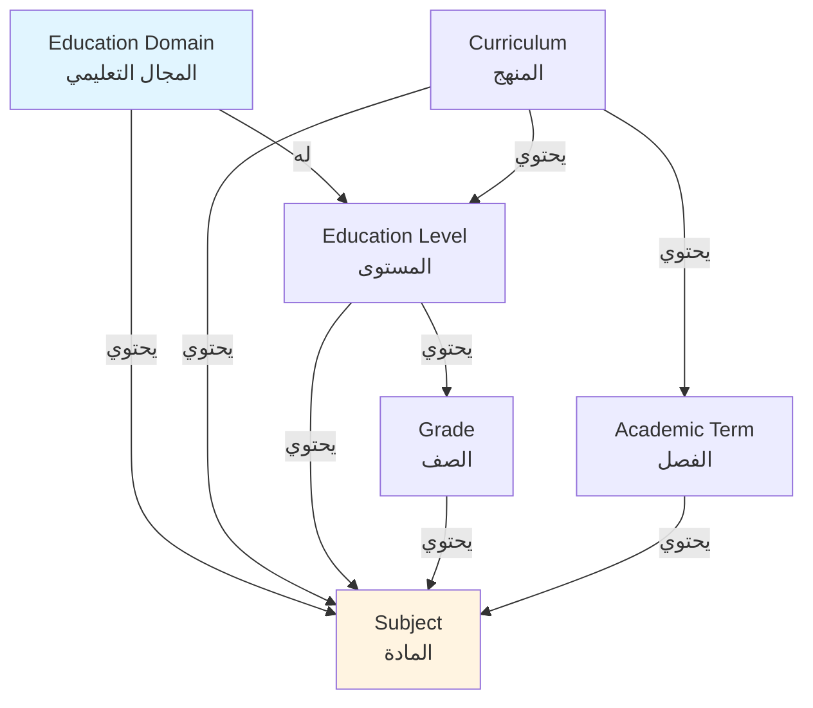

# Seeding Structure - هيكل البيانات المبدئية 🌱

## شجرة الملفات

```
Qalam.Infrastructure/Seeding/
│
├── DatabaseSeeder.cs                    [المنسق الرئيسي - ينفذ جميع Seeders بالترتيب الصحيح]
│
├── 📁 Core Infrastructure (البنية الأساسية)
│   ├── EducationDomainsSeeder.cs        [المجالات التعليمية الأربعة الأساسية]
│   ├── CurriculumsSeeder.cs            [المناهج الدراسية - المنهج السعودي]
│   ├── TeachingModesSeeder.cs          [طرق التدريس: فردي، مجموعة، أونلاين]
│   ├── SessionTypesSeeder.cs           [أنواع الجلسات: عادية، مراجعة، اختبار]
│   ├── TimeSlotsSeeder.cs              [الأوقات المتاحة للجلسات]
│   └── QuranContentTypesSeeder.cs      [أنواع محتوى القرآن]
│
├── 📁 School Domain (المجال المدرسي)
│   ├── SaudiEducationLevelsSeeder.cs   [المستويات: ابتدائي، متوسط، ثانوي]
│   ├── SaudiGradesSeeder.cs           [الصفوف: 1-6 ابتدائي، 1-3 متوسط، 1-3 ثانوي]
│   ├── SaudiAcademicTermsSeeder.cs    [الفصول الدراسية: الأول، الثاني، الثالث]
│   └── SaudiSubjectsSeeder.cs         [189 مادة دراسية سعودية]
│
├── 📁 Quran Domain (مجال القرآن)
│   ├── QuranLevelsSeeder.cs           [مستويات تعلم القرآن]
│   └── QuranSubjectsSeeder.cs         [246 مادة قرآنية متنوعة]
│
├── 📁 Languages Domain (مجال اللغات)
│   ├── LanguageLevelsSeeder.cs        [المستويات: A1-A2, B1-B2, C1-C2]
│   └── LanguageSubjectsSeeder.cs      [161 مادة لغوية]
│
└── 📁 Skills Domain (مجال المهارات)
    └── GeneralSkillsSubjectsSeeder.cs  [356 مهارة حياتية ومهنية وتقنية]
```

---

## التفاصيل الكاملة

### 🔷 1. DatabaseSeeder.cs - المنسق الرئيسي

**الغرض:** تنفيذ جميع الـ Seeders بالترتيب الصحيح لضمان عدم وجود مشاكل في العلاقات بين الجداول.

**ترتيب التنفيذ:**

```csharp
public static async Task SeedAllAsync(ApplicationDBContext context)
{
    // المرحلة 1: البنية الأساسية
    await EducationDomainsSeeder.SeedAsync(context);      // 4 مجالات
    await CurriculumsSeeder.SeedAsync(context);           // 1 منهج (سعودي)
    await TeachingModesSeeder.SeedAsync(context);         // 3 طرق تدريس
    await SessionTypesSeeder.SeedAsync(context);          // 3 أنواع جلسات
    await QuranLevelsSeeder.SeedAsync(context);           // 7 مستويات قرآن
    await QuranContentTypesSeeder.SeedAsync(context);     // 5 أنواع محتوى قرآن
    await TimeSlotsSeeder.SeedAsync(context);             // أوقات الجلسات
    
    // المرحلة 2: النظام التعليمي السعودي
    await SaudiEducationLevelsSeeder.SeedAsync(context);  // 3 مستويات
    await SaudiGradesSeeder.SeedAsync(context);           // 12 صف
    await SaudiAcademicTermsSeeder.SeedAsync(context);    // 3 فصول
    await SaudiSubjectsSeeder.SeedAsync(context);         // 189 مادة
    
    // المرحلة 3: مجال القرآن
    await QuranSubjectsSeeder.SeedAsync(context);         // 246 مادة
    
    // المرحلة 4: مجال اللغات
    await LanguageLevelsSeeder.SeedAsync(context);        // 3 مستويات + 6 درجات
    await LanguageSubjectsSeeder.SeedAsync(context);      // 161 مادة
    
    // المرحلة 5: المهارات العامة
    await GeneralSkillsSubjectsSeeder.SeedAsync(context); // 356 مهارة
}
```

---

## 📚 Core Infrastructure (البنية الأساسية)

### 1.1 EducationDomainsSeeder.cs

**البيانات:** 4 مجالات تعليمية أساسية

| ID | Code | الاسم بالعربية | الاسم بالإنجليزية | HasCurriculum |
|----|------|----------------|-------------------|---------------|
| 1  | school | تعليم مدرسي | School Education | ✅ Yes |
| 2  | quran | قرآن كريم | Quran | ❌ No |
| 3  | language | لغات | Languages | ❌ No |
| 4  | skills | مهارات عامة | General Skills | ❌ No |

**الاستخدام:**
- المجال المدرسي يحتوي على منهج ثابت ومحدد
- المجالات الأخرى أكثر مرونة بدون مناهج محددة

---

### 1.2 CurriculumsSeeder.cs

**البيانات:** 1 منهج (المنهج السعودي)

```json
{
  "id": 1,
  "nameAr": "المنهج السعودي",
  "nameEn": "Saudi Curriculum",
  "country": "Saudi Arabia",
  "descriptionAr": "المنهج التعليمي المعتمد في المملكة العربية السعودية",
  "descriptionEn": "The official educational curriculum of Saudi Arabia"
}
```

**التوسع المستقبلي:**
- يمكن إضافة مناهج أخرى: المنهج المصري، الأردني، الأمريكي، البريطاني، إلخ

---

### 1.3 TeachingModesSeeder.cs

**الوظيفة:** 📍 تحديد **المكان** (أين ستتم الجلسة؟)

**البيانات:** 2 طريقة تدريس

| ID | Code | الاسم بالعربية | الاسم بالإنجليزية | الوصف |
|----|------|----------------|-------------------|-------|
| 1  | `in_person` | حضوري | In-Person | الجلسة في موقع فعلي (مركز، منزل، مدرسة، مسجد) |
| 2  | `online` | أونلاين | Online | الجلسة عبر الإنترنت (Zoom, Teams, Google Meet) |

**ملاحظة:** ❌ لا يوجد خيار "هجين" - كل جلسة إما حضورية أو أونلاين فقط.

**مثال الاستخدام:**
- درس في المنزل → `teachingModeId = 1` (حضوري)
- درس عبر Zoom → `teachingModeId = 2` (أونلاين)

---

### 1.4 SessionTypesSeeder.cs

**الوظيفة:** 👥 تحديد **الحجم/العدد** (كم عدد الطلاب في الجلسة؟)

**البيانات:** 2 نوع جلسة

| ID | Code | الاسم بالعربية | الاسم بالإنجليزية | الوصف |
|----|------|----------------|-------------------|-------|
| 1  | `individual` | فردي | Individual | معلم واحد + طالب واحد (درس خصوصي) |
| 2  | `group` | جماعي | Group | معلم واحد + مجموعة طلاب |

**ملاحظة:** ✅ **مستقل تماماً عن TeachingMode** - يمكن دمجها بـ 4 طرق:

| # | TeachingMode + SessionType | مثال عملي |
|---|----------------------------|-----------|
| 1️⃣ | حضوري + فردي | درس قرآن خصوصي في المسجد |
| 2️⃣ | حضوري + جماعي | محاضرة رياضيات في مركز (25 طالب) |
| 3️⃣ | أونلاين + فردي | جلسة Zoom للإنجليزية (1 على 1) |
| 4️⃣ | أونلاين + جماعي | ويبينار برمجة عبر Teams (100 طالب) |

---

### 1.5 QuranLevelsSeeder.cs

**البيانات:** 7 مستويات لتعلم القرآن

| ID | الاسم بالعربية | الاسم بالإنجليزية | الترتيب | الوصف |
|----|----------------|-------------------|---------|-------|
| 1  | مبتدئ - تعلم الحروف | Beginner - Learning Letters | 1 | تعلم الحروف الهجائية والحركات |
| 2  | مبتدئ - تعلم القراءة | Beginner - Learning Reading | 2 | القراءة البسيطة للكلمات |
| 3  | متوسط - تجويد أساسي | Intermediate - Basic Tajweed | 3 | أحكام التجويد الأساسية |
| 4  | متوسط - تجويد متقدم | Intermediate - Advanced Tajweed | 4 | أحكام التجويد المتقدمة |
| 5  | متقدم - حفظ | Advanced - Memorization | 5 | حفظ القرآن الكريم |
| 6  | متقدم - مراجعة | Advanced - Revision | 6 | مراجعة المحفوظ |
| 7  | إتقان - إجازة | Mastery - Ijazah | 7 | الإجازة في القرآن الكريم |

---

### 1.6 QuranContentTypesSeeder.cs

**البيانات:** 5 أنواع محتوى قرآني

| ID | الاسم بالعربية | الاسم بالإنجليزية | الوصف |
|----|----------------|-------------------|-------|
| 1  | حفظ | Memorization | حفظ آيات وسور القرآن |
| 2  | تلاوة | Recitation | تلاوة القرآن بشكل صحيح |
| 3  | تجويد | Tajweed | أحكام وقواعد التجويد |
| 4  | تفسير | Tafsir | شرح معاني الآيات |
| 5  | قراءات | Qira'at | القراءات المختلفة للقرآن |

---

### 1.7 TimeSlotsSeeder.cs

**البيانات:** فترات زمنية للجلسات على مدار اليوم

مثال:
- صباحاً: 6:00 AM - 12:00 PM
- ظهراً: 12:00 PM - 4:00 PM  
- مساءً: 4:00 PM - 8:00 PM
- ليلاً: 8:00 PM - 11:00 PM

---

## 🏫 School Domain (المجال المدرسي السعودي)

### 2.1 SaudiEducationLevelsSeeder.cs

**البيانات:** 3 مستويات تعليمية

| ID | الاسم بالعربية | الاسم بالإنجليزية | الترتيب | الأعمار |
|----|----------------|-------------------|---------|---------|
| 1  | المرحلة الابتدائية | Elementary | 1 | 6-12 سنة |
| 2  | المرحلة المتوسطة | Intermediate | 2 | 12-15 سنة |
| 3  | المرحلة الثانوية | Secondary | 3 | 15-18 سنة |

---

### 2.2 SaudiGradesSeeder.cs

**البيانات:** 12 صف دراسي

#### المرحلة الابتدائية (6 صفوف)
- الصف الأول الابتدائي (Grade 1)
- الصف الثاني الابتدائي (Grade 2)
- الصف الثالث الابتدائي (Grade 3)
- الصف الرابع الابتدائي (Grade 4)
- الصف الخامس الابتدائي (Grade 5)
- الصف السادس الابتدائي (Grade 6)

#### المرحلة المتوسطة (3 صفوف)
- الصف الأول المتوسط (Grade 7)
- الصف الثاني المتوسط (Grade 8)
- الصف الثالث المتوسط (Grade 9)

#### المرحلة الثانوية (3 صفوف)
- الصف الأول الثانوي (Grade 10)
- الصف الثاني الثانوي (Grade 11)
- الصف الثالث الثانوي (Grade 12)

---

### 2.3 SaudiAcademicTermsSeeder.cs

**البيانات:** 3 فصول دراسية

| ID | الاسم | المدة | ملاحظات |
|----|-------|-------|---------|
| 1  | الفصل الدراسي الأول | ~17 أسبوع | سبتمبر - ديسمبر |
| 2  | الفصل الدراسي الثاني | ~17 أسبوع | يناير - أبريل |
| 3  | الفصل الدراسي الثالث | ~13 أسبوع | أبريل - يونيو |

**ملاحظة:** النظام الجديد في السعودية يحتوي على 3 فصول دراسية (بدلاً من 2)

---

### 2.4 SaudiSubjectsSeeder.cs

**البيانات:** 189 مادة دراسية موزعة على المراحل الثلاث

#### المرحلة الابتدائية (الصفوف 1-6)

**المواد المشتركة لجميع الصفوف:**
1. اللغة العربية (Arabic Language)
2. التربية الإسلامية (Islamic Education)
3. الرياضيات (Mathematics)
4. العلوم (Science)
5. التربية الفنية (Art Education)
6. التربية البدنية (Physical Education)

**يُضاف من الصف الرابع:**
7. اللغة الإنجليزية (English Language)
8. المهارات الرقمية (Digital Skills)

**الإجمالي:** ~42 مادة في المرحلة الابتدائية

---

#### المرحلة المتوسطة (الصفوف 1-3)

**المواد لجميع الصفوف (10 مواد × 3 صفوف = 30 مادة):**
1. اللغة العربية
2. التربية الإسلامية
3. الرياضيات
4. العلوم
5. اللغة الإنجليزية
6. الدراسات الاجتماعية
7. التربية الفنية
8. التربية البدنية
9. المهارات الرقمية
10. التفكير الناقد

**الإجمالي:** 30 مادة في المرحلة المتوسطة

---

#### المرحلة الثانوية (الصفوف 1-3)

**المواد لجميع الصفوف (11 مادة × 3 صفوف = 33 مادة):**
1. اللغة العربية (أدب، نقد، بلاغة)
2. التربية الإسلامية (دراسات إسلامية متقدمة)
3. الرياضيات (تفاضل، تكامل)
4. اللغة الإنجليزية (متقدم)
5. الفيزياء
6. الكيمياء
7. الأحياء
8. التاريخ
9. الجغرافيا
10. الحاسب الآلي
11. التربية البدنية

**الإجمالي:** 33 مادة في المرحلة الثانوية

---

## 📖 Quran Domain (مجال القرآن)

### 3.1 QuranSubjectsSeeder.cs

**البيانات:** 246 مادة قرآنية

#### التوزيع:

**1. حسب المستوى (7 مستويات):**
- مبتدئ - تعلم الحروف
- مبتدئ - تعلم القراءة
- متوسط - تجويد أساسي
- متوسط - تجويد متقدم
- متقدم - حفظ
- متقدم - مراجعة
- إتقان - إجازة

**2. حسب نوع المحتوى (5 أنواع):**
- حفظ (Memorization)
- تلاوة (Recitation)
- تجويد (Tajweed)
- تفسير (Tafsir)
- قراءات (Qira'at)

**3. حسب تقسيم القرآن:**
- حفظ الأجزاء: جزء عم، جزء تبارك، إلخ (30 جزء)
- حفظ السور: الفاتحة، البقرة، آل عمران، إلخ (114 سورة)
- تلاوة بالأحكام: المدود، الإدغام، القلقلة، إلخ

**أمثلة:**

```
- حفظ جزء عم - مستوى مبتدئ
- تجويد سورة البقرة - مستوى متوسط
- تفسير سورة الكهف - مستوى متقدم
- قراءة حفص عن عاصم - مستوى إتقان
- حفظ ربع يس - مستوى متوسط
```

**الإجمالي:** 246 مادة قرآنية متنوعة

---

## 🌍 Languages Domain (مجال اللغات)

### 4.1 LanguageLevelsSeeder.cs

**البيانات:** 3 مستويات + 6 درجات (CEFR Standard)

#### المستويات الرئيسية:
1. **Beginner (مبتدئ)**
   - A1 - Basic Beginner (مبتدئ أساسي)
   - A2 - Elementary (مبتدئ متقدم)

2. **Intermediate (متوسط)**
   - B1 - Intermediate (متوسط أساسي)
   - B2 - Upper Intermediate (متوسط متقدم)

3. **Advanced (متقدم)**
   - C1 - Advanced (متقدم)
   - C2 - Proficiency (إتقان)

**معيار CEFR:** Common European Framework of Reference for Languages

---

### 4.2 LanguageSubjectsSeeder.cs

**البيانات:** 161 مادة لغوية

#### اللغات المتاحة:

**1. اللغة الإنجليزية (English)**
- General English
- Business English
- Academic English
- English for Kids
- IELTS Preparation
- TOEFL Preparation
- Conversation Practice

**2. اللغة العربية (Arabic)**
- Modern Standard Arabic
- Colloquial Arabic (Egyptian, Gulf, Levantine)
- Arabic for Non-Native Speakers
- Classical Arabic

**3. اللغة الفرنسية (French)**
- General French
- Business French
- DELF/DALF Preparation

**4. اللغة الإسبانية (Spanish)**
- General Spanish
- Latin American Spanish
- DELE Preparation

**5. اللغة الألمانية (German)**
- General German
- Business German
- Goethe-Zertifikat Preparation

**6. اللغة الصينية (Chinese - Mandarin)**
- HSK Preparation
- Business Chinese
- Conversational Chinese

**7. اللغة التركية (Turkish)**
- General Turkish
- Business Turkish

**8. اللغة اليابانية (Japanese)**
- JLPT Preparation
- Business Japanese

**9. اللغة الكورية (Korean)**
- TOPIK Preparation
- K-Drama Korean

**10. اللغة الإيطالية (Italian)**

**لكل لغة:**
- مواد موزعة على 6 مستويات (A1, A2, B1, B2, C1, C2)
- تركيز على: المحادثة، القواعد، القراءة، الكتابة، الاستماع

**الإجمالي:** 161 مادة لغوية

---

## 🎯 Skills Domain (مجال المهارات العامة)

### 5.1 GeneralSkillsSubjectsSeeder.cs

**البيانات:** 356 مهارة موزعة على 3 فئات

---

### الفئة 1️⃣: Life Skills (مهارات حياتية) - 8 مهارات

| # | المهارة بالعربية | المهارة بالإنجليزية | الوصف |
|---|------------------|----------------------|-------|
| 1 | مهارات التواصل | Communication Skills | التواصل الفعال مع الآخرين |
| 2 | التفكير النقدي | Critical Thinking | التفكير النقدي والتحليلي |
| 3 | حل المشكلات | Problem Solving | أساليب وتقنيات حل المشكلات |
| 4 | إدارة الوقت | Time Management | تنظيم وإدارة الوقت بفعالية |
| 5 | الثقافة المالية | Financial Literacy | الإدارة المالية الشخصية |
| 6 | مهارات القيادة | Leadership Skills | القدرات القيادية وإدارة الفرق |
| 7 | الذكاء العاطفي | Emotional Intelligence | الوعي الذاتي والذكاء العاطفي |
| 8 | التخطيط الشخصي | Personal Planning | التخطيط وتحديد الأهداف |

---

### الفئة 2️⃣: Professional Skills (مهارات مهنية) - 7 مهارات

| # | المهارة بالعربية | المهارة بالإنجليزية | الوصف |
|---|------------------|----------------------|-------|
| 1 | إدارة المشاريع | Project Management | منهجيات إدارة المشاريع |
| 2 | التواصل المهني | Business Communication | التواصل في بيئة العمل |
| 3 | ريادة الأعمال | Entrepreneurship | بدء وإدارة المشاريع الريادية |
| 4 | أساسيات التسويق | Marketing Basics | التسويق والترويج |
| 5 | الخطابة والعرض | Public Speaking | الإلقاء والعرض أمام الجمهور |
| 6 | السيرة الذاتية والمقابلات | Resume & Interview Skills | كتابة CV والتحضير للمقابلات |
| 7 | التفاوض وحل النزاعات | Negotiation & Conflict Resolution | التفاوض الفعال |

---

### الفئة 3️⃣: Technical Skills (مهارات تقنية) - 19 مهارة

#### البرمجة والتطوير:
1. البرمجة بلغة بايثون (Python Programming)
2. البرمجة بلغة جافا سكريبت (JavaScript Programming)
3. تطوير الويب (Web Development - HTML, CSS, JS)
4. تطوير تطبيقات الموبايل (Mobile App Development)
5. قواعد البيانات (Database Management - SQL)

#### تحليل البيانات والذكاء الاصطناعي:
6. تحليل البيانات (Data Analysis)
7. أساسيات الذكاء الاصطناعي (AI & Machine Learning Basics)

#### التصميم والإبداع:
8. التصميم الجرافيكي (Graphic Design)
9. مونتاج الفيديو (Video Editing)
10. النمذجة ثلاثية الأبعاد (3D Modeling)

#### الأمن والبنية التحتية:
11. أساسيات الأمن السيبراني (Cybersecurity Basics)
12. الحوسبة السحابية (Cloud Computing)
13. إنترنت الأشياء (Internet of Things - IoT)

#### التسويق الرقمي:
14. التسويق الرقمي (Digital Marketing)
15. تحسين محركات البحث (SEO)

**الإجمالي:** 34 مهارة تقنية × مستويات مختلفة = **356 مادة**

---

## 📊 الإحصائيات الإجمالية

### ملخص البيانات المبدئية

| الفئة | العدد | التفاصيل |
|------|-------|----------|
| **المجالات التعليمية** | 4 | مدرسي، قرآن، لغات، مهارات |
| **المناهج** | 1 | المنهج السعودي |
| **طرق التدريس (المكان)** | 2 | حضوري، أونلاين |
| **أنواع الجلسات (الحجم)** | 2 | فردي، جماعي |
| **مستويات القرآن** | 7 | من مبتدئ إلى إتقان |
| **أنواع محتوى القرآن** | 5 | حفظ، تلاوة، تجويد، تفسير، قراءات |
| | | |
| **المستويات المدرسية** | 3 | ابتدائي، متوسط، ثانوي |
| **الصفوف المدرسية** | 12 | 6 ابتدائي + 3 متوسط + 3 ثانوي |
| **الفصول الدراسية** | 3 | الأول، الثاني، الثالث |
| **المواد المدرسية** | 189 | موزعة على جميع الصفوف |
| | | |
| **المواد القرآنية** | 246 | جميع أنواع المحتوى والمستويات |
| | | |
| **مستويات اللغات** | 6 | A1, A2, B1, B2, C1, C2 |
| **المواد اللغوية** | 161 | 10 لغات × مستويات متعددة |
| | | |
| **مواد المهارات** | 356 | حياتية + مهنية + تقنية |
| | | |
| **📈 الإجمالي الكلي** | **~1,000** | **إجمالي السجلات المُدخلة** |

---

## 🔄 تسلسل العلاقات



---

## 🎯 حالات الاستخدام

### مثال 1: طالب يبحث عن مدرس رياضيات
```
Domain: School (1)
└── Curriculum: Saudi (1)
    └── Level: Elementary (1)
        └── Grade: Grade 4 (4)
            └── Subject: Mathematics (الرياضيات)
```

### مثال 2: طالب يريد حفظ جزء عم
```
Domain: Quran (2)
└── Level: Advanced - Memorization (5)
    └── ContentType: Memorization (1)
        └── Subject: Memorizing Juz Amma (حفظ جزء عم)
```

### مثال 3: موظف يريد تعلم الإنجليزية
```
Domain: Languages (3)
└── Level: Intermediate (2)
    └── Grade: B1 - Intermediate (3)
        └── Subject: Business English - B1
```

### مثال 4: مبتدئ يريد تعلم البرمجة
```
Domain: Skills (4)
└── Subject: Python Programming (البرمجة بلغة بايثون)
```

---

## ⚙️ كيفية استخدام الـ Seeding

### 1. تشغيل يدوي (Manual)

```csharp
using (var scope = serviceProvider.CreateScope())
{
    var context = scope.ServiceProvider.GetRequiredService<ApplicationDBContext>();
    await DatabaseSeeder.SeedAllAsync(context);
}
```

### 2. عبر Migration (في حالة الحاجة)

```bash
# إنشاء Migration جديد
dotnet ef migrations add SeedInitialData --project Qalam.Infrastructure

# تطبيق Migration
dotnet ef database update --project Qalam.Infrastructure --startup-project Qalam.Api
```

### 3. تشغيل Seeder محدد

```csharp
// فقط المواد القرآنية
await QuranSubjectsSeeder.SeedAsync(context);

// فقط المواد اللغوية
await LanguageSubjectsSeeder.SeedAsync(context);
```

---

## 🔍 التحقق من البيانات

### استعلامات مفيدة:

```sql
-- عدد المواد في كل مجال
SELECT 
    d.NameEn AS Domain,
    COUNT(s.Id) AS SubjectCount
FROM EducationDomains d
LEFT JOIN Subjects s ON s.DomainId = d.Id
GROUP BY d.Id, d.NameEn;

-- المواد المدرسية حسب الصف
SELECT 
    g.NameAr AS Grade,
    COUNT(s.Id) AS SubjectCount
FROM Grades g
LEFT JOIN Subjects s ON s.GradeId = g.Id
GROUP BY g.Id, g.NameAr;

-- مستويات اللغات
SELECT 
    el.NameEn AS Level,
    COUNT(g.Id) AS GradeCount
FROM EducationLevels el
LEFT JOIN Grades g ON g.LevelId = el.Id
WHERE el.DomainId = 3
GROUP BY el.Id, el.NameEn;
```

---

## 📝 ملاحظات مهمة

### ✅ مميزات البنية:

1. **المرونة:** يمكن إضافة مجالات ومناهج جديدة بسهولة
2. **التنظيم:** بنية واضحة ومنطقية
3. **القابلية للتوسع:** سهولة إضافة بيانات جديدة
4. **الدعم متعدد اللغات:** كل بيان له نسخة عربية وإنجليزية
5. **التوافق مع المعايير:** مثل CEFR للغات

### ⚠️ نقاط الانتباه:

1. **الترتيب مهم:** يجب تنفيذ Seeders بالترتيب الصحيح
2. **التحقق من الوجود:** كل Seeder يتحقق من وجود البيانات قبل الإدخال
3. **العلاقات:** بعض Seeders تعتمد على بيانات من Seeders أخرى
4. **الأداء:** Seeding قد يستغرق بعض الوقت (خاصة SaudiSubjects و GeneralSkills)

---

## 🚀 التوسع المستقبلي

### يمكن إضافة:

1. **مناهج جديدة:**
   - المنهج المصري
   - المنهج الأمريكي (Common Core)
   - المنهج البريطاني (Cambridge)
   - المنهج الدولي (IB)

2. **لغات إضافية:**
   - لغة برتغالية
   - لغة روسية
   - لغة هندية (Hindi)
   - لغة أردية (Urdu)

3. **مهارات جديدة:**
   - التصوير الفوتوغرافي
   - الطبخ
   - الخياطة
   - الموسيقى
   - الرياضات المختلفة

4. **تخصصات جامعية:**
   - الهندسة
   - الطب
   - القانون
   - إدارة الأعمال

---

*آخر تحديث: يناير 2026*
