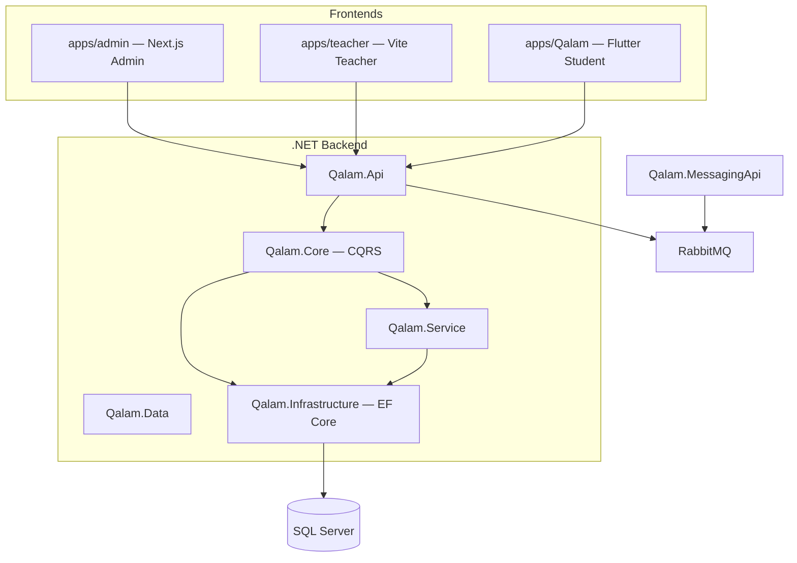

# Qalam Platform — Architecture

Monorepo for the Qalam education platform: .NET 8 backend, three frontend apps, Docker deployment, and extensive domain documentation.

## System overview



## Repository layout

| Path | Description |
|------|-------------|
| `Qalam.sln` | .NET solution |
| `Qalam.Api/` | ASP.NET Core HTTP API |
| `Qalam.Core/` | MediatR commands/queries, validators, mappings |
| `Qalam.Service/` | Domain services (auth, enrollment, OSR, filters) |
| `Qalam.Data/` | Entities, DTOs, route constants (`Router.cs`) |
| `Qalam.Infrastructure/` | EF Core context, migrations, seeders |
| `Qalam.MessagingApi/` | Notifications + OSS uploads (RabbitMQ consumers) |
| `Qalam.Service.Tests/` | Service layer tests |
| `apps/admin/` | Admin web — **git submodule** |
| `apps/teacher/` | Teacher web — **git submodule** |
| `apps/Qalam/` | Student Flutter app |
| `docs/` | Feature guides, deployment, user stories |
| `scripts/dev/` | PowerShell local dev scripts |
| `Postman/` | API collections |

## Backend architecture

Clean architecture + CQRS (MediatR):

```
Controller (Qalam.Api)
  → Mediator.Send(Command|Query)
    → Handler (Qalam.Core)
      → Service (Qalam.Service) / DbContext (Qalam.Infrastructure)
        → Response<T>
```

### Backend architecture

Clean architecture + CQRS (MediatR):

```
Controller → Command/Query → Handler → Repository + Service → Response<T>
```

- **Repositories** (`Qalam.Infrastructure/Abstracts/`) — data access, enhanced query projections
- **Services** (`Qalam.Service/`) — reusable domain logic across handlers
- **Enhanced queries** — `AsNoTracking()`, project to DTOs, narrow SELECTs (see `IOpenSessionRequestRepository`)
- **Session complaints** — `SessionComplaint`, `SessionAuditLog`, admin `/Admin/Sessions` APIs, earnings `OnHold` until blocking complaints resolve (see `BUSINESS_LOGIC.md` §10)

### Education domains

Domains identified by `code` (never hardcode DB ids):

| Code | Tree |
|------|------|
| `school` | Curriculum → Level → Grade → Subject → Term → Unit → Lesson |
| `university` | University → College → Department → Program → Level → Subject → … |
| `language` | Level → Subject → Unit → Lesson |
| `skills` | Subject → Unit → Lesson |
| `quran` | One-shot unit list with content types + levels |

See `docs/STUDENT-FILTER-OPTIONS.md` and `BUSINESS_LOGIC.md`.

## Frontend apps

### Admin (`apps/admin`)

- **Stack:** Next.js 16, React 19, TanStack Query/DB, Tailwind 4
- **Purpose:** Education hierarchy CRUD, teacher onboarding review, enrollments, **session tracking & complaints**, system settings
- **Env:** `NEXT_PUBLIC_API_URL`
- **Port:** 3005

### Teacher (`apps/teacher`)

- **Stack:** Vite 7, TanStack Start/Router, React 19, Tailwind 4
- **Purpose:** Registration, course CRUD, enrollment approval, live sessions
- **Env:** `VITE_API_URL`
- **Port:** 3000

### Student (`apps/Qalam`)

- **Stack:** Flutter, Riverpod, go_router, easy_localization
- **Architecture:** Thkel (data/domain/presentation + core services)
- **Docs:** `apps/Qalam/docs/ARCHITECTURE.md`
- **Cursor rules:** `apps/Qalam/.cursor/rules/` (`thkel-architecture.mdc` always on)

## Deployment

| Environment | Compose file | API port |
|-------------|--------------|----------|
| Local | `docker-compose.yml` | 8080 (Docker) / 62900 (native) |
| Staging | `docker-compose.staging.yml` | 8081 |

See `DEPLOYMENT.md`, `DOCKER_README.md`, `docs/deployment/README.md`.

## Authoritative business docs

| Doc | Content |
|-----|---------|
| `BUSINESS_LOGIC.md` | Domain rules, entities, flows (Arabic/English) |
| `docs/USER-STORIES-Scenarios-1-and-2.md` | S1 enrollment + S2 OSR (code is source of truth) |
| `docs/S2-FLOW-AND-ENDPOINTS.md` | Open session request API flow |
| `docs/OPERATIONS_RUNBOOK.md` | Production migrations, backups |

## Cursor AI rules

Root rules in `.cursor/rules/`:

| Rule | Scope |
|------|-------|
| `qalam-monorepo-core.mdc` | Always applied |
| `dotnet-backend.mdc` | All .NET projects |
| `admin-frontend.mdc` | `apps/admin/` |
| `teacher-frontend.mdc` | `apps/teacher/` |
| `student-flutter.mdc` | `apps/Qalam/` (links to nested rules) |
| `deployment-env.mdc` | Docker, env, scripts |

Student app also has detailed rules in `apps/Qalam/.cursor/rules/`.

Generate rules for other projects: [CURSOR-RULES-PROMPT.md](./CURSOR-RULES-PROMPT.md)
