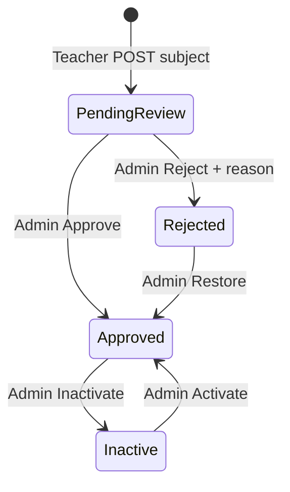

# Admin teacher subjects — Frontend guide

Guide for the **admin panel** and **teacher app** UIs that manage or display teacher teaching subjects (catalog offerings with optional unit scope).

**API base:** `/Api/V1/Admin/TeacherManagement`  
**Auth:** `Authorization: Bearer <admin-jwt>` — roles `Admin` or `SuperAdmin`  
**Postman:** `Postman/Admin/TeacherManagement.postman_collection.json`

Related:

- [Teacher-Registration-Guide.md](Teacher-Registration-Guide.md) — admin review flow (documents + activation)
- [TEACHER_PROFILE_SETTINGS_GUIDE.md](../TEACHER_PROFILE_SETTINGS_GUIDE.md) — teacher **Subjects & Units** screen
- [Teacher-Availability-and-Subjects.md](Teacher-Availability-and-Subjects.md) — teacher add-subject wizard and schemas

---

## Overview

When a teacher adds subjects via `POST /Api/V1/Teacher/TeacherSubject`, each row starts as **`Pending`** (`verificationStatus = 1`, `isActive = true`). An admin approves or rejects after comparing the subject/units against uploaded **certificate** documents on the teacher profile.

Teachers can add subjects **before account activation** (during `AwaitingDocuments`, `PendingVerification`, or `DocumentsRejected`). The teacher account becomes **Active** only when admin calls `POST /TeacherManagement/{teacherId}/Activate` after all documents and subjects are approved.

Rejected or inactive subjects (and pending subjects):

- Cannot be used for **new courses**
- Are excluded from **student–teacher matching** by subject
- **Existing published courses** tied to that subject stay published (v1)



| Admin action | `isActive` | `verificationStatus` | `rejectionReason` |
|--------------|------------|----------------------|-------------------|
| *(teacher adds)* | `true` | `Pending` (1) | `null` |
| Approve | `true` | `Approved` (2) | cleared |
| Inactivate | `false` | unchanged | unchanged |
| Activate | `true` | unchanged (must not be `Rejected`) | unchanged |
| Reject | `false` | `Rejected` (3) | required text |
| Restore | `true` | `Approved` (2) | cleared |

`verificationStatus` uses `DocumentVerificationStatus`: `Pending = 1`, `Approved = 2`, `Rejected = 3`.

---

## Response envelope

All endpoints return the standard wrapper:

```json
{
  "statusCode": "OK",
  "succeeded": true,
  "message": "Success",
  "data": { },
  "errors": null,
  "meta": null
}
```

Paginated list (`GET /Subjects`) puts rows in `data` and pagination in `meta`:

```json
{
  "meta": {
    "pageNumber": 1,
    "pageSize": 10,
    "totalCount": 42,
    "totalPages": 5,
    "hasPreviousPage": false,
    "hasNextPage": true
  }
}
```

---

## TypeScript shapes

```ts
type DocumentVerificationStatus = 1 | 2 | 3; // Pending | Approved | Rejected

interface TeacherSubjectUnit {
  id: number;
  unitId: number;
  unitNameAr: string;
  unitNameEn: string;
  unitTypeCode: string | null;
  quranContentTypeId: number | null;
  quranContentTypeNameAr: string | null;
  quranContentTypeNameEn: string | null;
  quranLevelId: number | null;
  quranLevelNameAr: string | null;
  quranLevelNameEn: string | null;
}

interface AdminTeacherSubject {
  id: number;
  teacherId: number;
  teacherFullName: string;
  subjectId: number;
  subjectNameAr: string;
  subjectNameEn: string;
  domainCode: string | null;
  canTeachFullSubject: boolean;
  isActive: boolean;
  verificationStatus: DocumentVerificationStatus;
  rejectionReason: string | null;
  reviewedAt: string | null; // ISO UTC
  createdAt: string;
  units: TeacherSubjectUnit[];
}

interface TeacherSubjectSummary {
  totalSubjects: number;
  activeSubjects: number;
  inactiveSubjects: number;
  rejectedSubjects: number;
}

interface RejectReasonBody {
  reason: string; // required, max 500 chars
}
```

---

## Admin UI — Teacher detail **Subjects** tab

Load subjects from the teacher preview (recommended — one request for documents + subjects):

```http
GET /Api/V1/Admin/TeacherManagement/{teacherId}
Authorization: Bearer <admin-jwt>
```

`data.subjects` is `AdminTeacherSubject[]`. `data.subjectSummary` has count badges for the tab header.

### Sample `subjectSummary` + `subjects`

```json
{
  "subjectSummary": {
    "totalSubjects": 3,
    "activeSubjects": 2,
    "inactiveSubjects": 0,
    "rejectedSubjects": 1
  },
  "subjects": [
    {
      "id": 101,
      "teacherId": 12,
      "teacherFullName": "Ahmed Ali",
      "subjectId": 5,
      "subjectNameAr": "الرياضيات",
      "subjectNameEn": "Mathematics",
      "domainCode": "general_education",
      "canTeachFullSubject": true,
      "isActive": true,
      "verificationStatus": 2,
      "rejectionReason": null,
      "reviewedAt": null,
      "createdAt": "2026-05-20T10:00:00Z",
      "units": []
    },
    {
      "id": 102,
      "teacherId": 12,
      "teacherFullName": "Ahmed Ali",
      "subjectId": 8,
      "subjectNameAr": "القرآن",
      "subjectNameEn": "Quran",
      "domainCode": "quran",
      "canTeachFullSubject": false,
      "isActive": false,
      "verificationStatus": 3,
      "rejectionReason": "Qualification for this subject could not be verified.",
      "reviewedAt": "2026-05-21T14:30:00Z",
      "createdAt": "2026-05-19T09:00:00Z",
      "units": [
        {
          "id": 201,
          "unitId": 44,
          "unitNameAr": "سورة البقرة",
          "unitNameEn": "Surah Al-Baqarah",
          "unitTypeCode": "surah",
          "quranContentTypeId": 1,
          "quranContentTypeNameAr": "حفظ",
          "quranContentTypeNameEn": "Memorization",
          "quranLevelId": 2,
          "quranLevelNameAr": "مبتدئ",
          "quranLevelNameEn": "Beginner"
        }
      ]
    }
  ]
}
```

### Card layout (per subject)

| Element | Source |
|---------|--------|
| Title | `subjectNameEn` / `subjectNameAr` (locale) |
| Scope line | `canTeachFullSubject` → "Full subject" else `${units.length} units` |
| Status pill | See **Status pill logic** below |
| Rejection block | When `verificationStatus === 3`: show `rejectionReason` + formatted `reviewedAt` |
| Units list | Expandable; render `units[]` with Quran badges when `domainCode === "quran"` |
| Actions | See **Action buttons** below |

### Status pill logic

```ts
function subjectStatusLabel(s: AdminTeacherSubject): 'Pending' | 'Active' | 'Inactive' | 'Rejected' {
  if (s.verificationStatus === 3) return 'Rejected';
  if (s.verificationStatus === 1) return 'Pending';
  if (!s.isActive) return 'Inactive';
  return 'Active';
}
```

Suggested colors: Pending = amber, Active = green, Inactive = gray, Rejected = red (match document pills on the same page).

### Certificate comparison (manual)

On teacher detail (`GET /{teacherId}`), show **certificate** documents (`documentType === 2`) beside each pending subject card. Admin compares subject name, domain, and unit scope against certificate title, issuer, and issue date before **Approve** or **Reject**.

### Action buttons

| Current state | Show | API |
|---------------|------|-----|
| Pending (`verificationStatus === 1`) | **Approve**, **Reject** | POST `.../Approve`, POST `.../Reject` |
| Active (`isActive && verificationStatus === 2`) | **Inactivate**, **Reject** | POST `.../Inactivate`, POST `.../Reject` |
| Inactive (`!isActive && verificationStatus === 2`) | **Activate**, **Reject** | POST `.../Activate`, POST `.../Reject` |
| Rejected (`verificationStatus === 3`) | **Restore** only | POST `.../Restore` |

Do **not** show **Activate** on rejected rows — the API returns 400: *"Rejected subjects must be restored before activation."*

**Reject** opens a modal with a required reason field (max 500 chars). Reuse the same body shape as document reject:

```json
{ "reason": "Subject qualification not verified." }
```

After any action succeeds, re-fetch `GET /{teacherId}` or `GET /{teacherId}/Subjects` to refresh the list.

### Dedicated subjects list (same teacher)

If the tab lazy-loads subjects only:

```http
GET /Api/V1/Admin/TeacherManagement/{teacherId}/Subjects
```

Returns `data: AdminTeacherSubject[]`. 404 if teacher does not exist.

Single row detail (e.g. side panel):

```http
GET /Api/V1/Admin/TeacherManagement/{teacherId}/Subjects/{teacherSubjectId}
```

---

## Admin UI — Global subjects list (optional)

Operations view across all teachers:

```http
GET /Api/V1/Admin/TeacherManagement/Subjects?pageNumber=1&pageSize=10
```

Optional query filters:

| Param | Type | Example |
|-------|------|---------|
| `teacherId` | int | `12` |
| `subjectId` | int | `5` |
| `isActive` | bool | `true` |
| `verificationStatus` | int | `3` (rejected only) |

Table columns: teacher name, subject name, scope, status pill, `createdAt`, link to teacher detail **Subjects** tab.

---

## Command endpoints

All commands are `POST`, no body except **Reject**.

| Action | Path | Body |
|--------|------|------|
| Approve | `/{teacherId}/Subjects/{teacherSubjectId}/Approve` | — |
| Inactivate | `/{teacherId}/Subjects/{teacherSubjectId}/Inactivate` | — |
| Activate | `/{teacherId}/Subjects/{teacherSubjectId}/Activate` | — |
| Reject | `/{teacherId}/Subjects/{teacherSubjectId}/Reject` | `{ "reason": "..." }` |
| Restore | `/{teacherId}/Subjects/{teacherSubjectId}/Restore` | — |

Success `data` is a string message, e.g. `"Teacher subject inactivated successfully."`

### Example — Reject

```http
POST /Api/V1/Admin/TeacherManagement/12/Subjects/102/Reject
Authorization: Bearer <admin-jwt>
Content-Type: application/json

{ "reason": "Qualification for this subject could not be verified." }
```

---

## Teacher app — display only

Teachers see status on **Subjects & Units** via:

```http
GET /Api/V1/Teacher/TeacherSubject
Authorization: Bearer <teacher-jwt>
```

Each item includes `isActive`, `verificationStatus`, `rejectionReason`, `reviewedAt`. The GET returns **all** subjects (active, inactive, rejected).

UI details: [TEACHER_PROFILE_SETTINGS_GUIDE.md §2](../TEACHER_PROFILE_SETTINGS_GUIDE.md).

Teachers **cannot** self-deactivate or delete a subject (DELETE is not implemented). To offer the subject again after rejection, they use **+ Add Subject** (creates a new row if the signature differs).

Course create/update only accepts subjects where `isActive === true` and `verificationStatus === 2`. Hide inactive/rejected subjects from the course subject picker.

---

## Error handling

| HTTP | When | UX |
|------|------|-----|
| 400 | Missing reject reason; activate on rejected subject | Toast with `message` |
| 401 | Missing/expired token | Redirect to admin login |
| 403 | JWT lacks Admin/SuperAdmin | Permission denied |
| 404 | Unknown `teacherId` or `teacherSubjectId` | Empty state or "Subject not found" |

```json
{
  "statusCode": "BadRequest",
  "succeeded": false,
  "message": "Rejected subjects must be restored before activation.",
  "data": null
}
```

---

## Screen flow (admin)

```
Teacher list / Pending queue
    → GET /Pending
    → Tap teacher
        → GET /{teacherId}  (documents + subjects + summary)
        → Subjects tab
            → Row actions: Inactivate | Activate | Reject | Restore
            → Reject modal → POST .../Reject
            → On success → refresh GET /{teacherId}

(Optional) Global subjects ops
    → GET /Subjects?filters...
    → Link to teacher detail Subjects tab
```

---

## Checklist for implementers

- [ ] Subjects tab on teacher detail with summary chips (`total` / `active` / `inactive` / `rejected`)
- [ ] Status pill + conditional action buttons per state diagram
- [ ] Reject modal with required reason (max 500)
- [ ] Expandable units list with Quran specialization badges
- [ ] Refresh list after each command
- [ ] Teacher app: show inactive/rejected pills and rejection reason
- [ ] Teacher course wizard: filter picker to approved+active subjects only