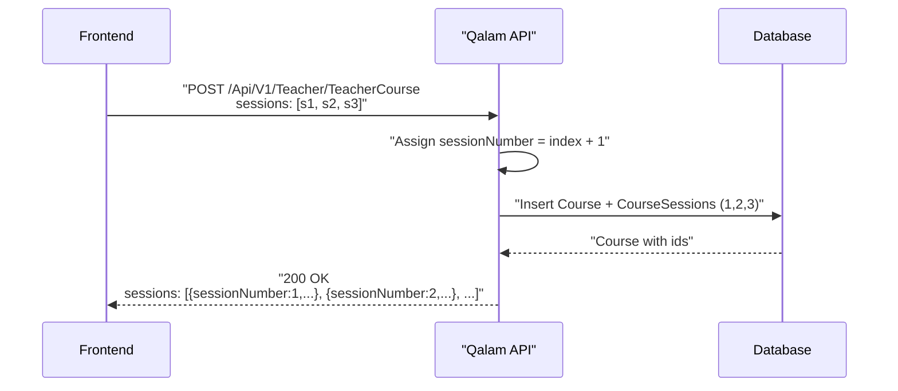

---

## Data flow



---

## Two modes — what to send

### Non-flexible course (fixed plan)

The teacher knows the whole session outline up-front.

- `isFlexible`: `false`
- `sessionDurationMinutes`: required, > 0 (default duration for the course)
- `sessions`: required, non-empty. Each item = one session in display order.

### Flexible course (on-demand)

Sessions are booked as needed; no plan at creation time.

- `isFlexible`: `true`
- `sessionDurationMinutes`: `null` / omit it
- `sessions`: `null` / omit it

---

## Request fields

| Field | Type | Required | Notes |
| --- | --- | --- | --- |
| `title` | string (≤ 200) | yes | |
| `description` | string (≤ 2000) | no | |
| `teacherSubjectId` | int (> 0) | yes | One of the teacher's active subjects (from their profile). |
| `teachingModeId` | int (> 0) | yes | From the teaching-modes lookup (Online / In-Person). |
| `sessionTypeId` | int (> 0) | yes | From the session-types lookup (Individual / Group). |
| `isFlexible` | bool | yes | Drives the rules for `sessionDurationMinutes` and `sessions`. |
| `sessionDurationMinutes` | int? (> 0) | **required if `isFlexible=false`**; must be `null` if `isFlexible=true` | |
| `price` | decimal (≥ 0) | yes | Hourly rate. |
| `maxStudents` | int? (≥ 2) | **required (≥ 2) for Group sessions**; must be `null` for Individual | |
| `canIncludeInPackages` | bool | no | |
| `sessions` | array | **required and non-empty if `isFlexible=false`**; must be empty/null if `isFlexible=true` | See below. |

### `sessions[]` item

| Field | Type | Required | Notes |
| --- | --- | --- | --- |
| `durationMinutes` | int (> 0) | yes | Per-session duration. Can differ from `sessionDurationMinutes`. |
| `title` | string (≤ 150) | no | |
| `notes` | string (≤ 500) | no | |
| `units` | array (≤ 20) | no | Per-session unit/lesson coverage. Each item attaches one `ContentUnit` **or** one `Lesson`. See below. |

> Do NOT send `sessionNumber` (or any order/index field). The array order **is** the session order. The server will assign `sessionNumber = 1, 2, 3, ...` following your array order.

### `sessions[].units[]` item

| Field | Type | Required | Notes |
| --- | --- | --- | --- |
| `contentUnitId` | int? (> 0) | **required if `lessonId` is null** | Attaches a whole unit. |
| `lessonId` | int? (> 0) | **required if `contentUnitId` is null** | Attaches a specific lesson within a unit. |

Rules:

- Each `units[]` item must set **exactly one** of `contentUnitId` or `lessonId` — never both, never neither.
- Every selected `ContentUnit` / `Lesson` must belong to the course's subject (the one resolved from `teacherSubjectId`). Cross-subject selections are rejected with `400 Bad Request`.
- Max **20** units/lessons per session.
- Sending `units: []` or omitting the field is valid — the session simply has no curriculum tagging.

---

## Examples

### A) Non-flexible group course

**Request**

```http
POST /Api/V1/Teacher/TeacherCourse
Authorization: Bearer <teacher-jwt>
Content-Type: application/json
```

```json
{
  "title": "Algebra Intensive",
  "description": "3-session intensive review.",
  "teacherSubjectId": 12,
  "teachingModeId": 1,
  "sessionTypeId": 2,
  "isFlexible": false,
  "sessionDurationMinutes": 60,
  "price": 75.00,
  "maxStudents": 6,
  "canIncludeInPackages": true,
  "sessions": [
    { "durationMinutes": 60, "title": "Intro",      "notes": null, "units": [ { "contentUnitId": 3 }, { "contentUnitId": 4 } ] },
    { "durationMinutes": 60, "title": "Equations",  "notes": null, "units": [ { "lessonId": 21 }, { "lessonId": 22 } ] },
    { "durationMinutes": 90, "title": "Quadratics", "notes": null, "units": [ { "contentUnitId": 5 }, { "lessonId": 31 } ] }
  ]
}
```

**Response — `200 OK`**

```json
{
  "statusCode": "OK",
  "succeeded": true,
  "message": "Success",
  "data": {
    "id": 42,
    "title": "Algebra Intensive",
    "description": "3-session intensive review.",
    "isActive": true,
    "teacherId": 7,
    "teacherDisplayName": "Ali Hassan",
    "domainId": 2,
    "domainNameEn": "STEM",
    "teacherSubjectId": 12,
    "subjectNameEn": "Mathematics",
    "curriculumId": 3,
    "curriculumNameEn": "National",
    "levelId": 4,
    "levelNameEn": "Secondary",
    "gradeId": 10,
    "gradeNameEn": "Grade 10",
    "teachingModeId": 1,
    "teachingModeNameEn": "In-Person",
    "sessionTypeId": 2,
    "sessionTypeNameEn": "Group",
    "isFlexible": false,
    "sessionsCount": 3,
    "sessionDurationMinutes": 60,
    "price": 75.00,
    "maxStudents": 6,
    "canIncludeInPackages": true,
    "status": "Published",
    "units": null,
    "sessions": [
      { "id": 101, "sessionNumber": 1, "durationMinutes": 60, "title": "Intro",      "notes": null,
        "units": [
          { "id": 1, "contentUnitId": 3, "contentUnitNameEn": "Algebraic Foundations", "contentUnitNameAr": "أساسيات الجبر", "lessonId": null, "lessonNameEn": null, "lessonNameAr": null },
          { "id": 2, "contentUnitId": 4, "contentUnitNameEn": "Number Systems",        "contentUnitNameAr": "النظم العددية", "lessonId": null, "lessonNameEn": null, "lessonNameAr": null }
        ] },
      { "id": 102, "sessionNumber": 2, "durationMinutes": 60, "title": "Equations",  "notes": null,
        "units": [
          { "id": 3, "contentUnitId": null, "contentUnitNameEn": null, "contentUnitNameAr": null, "lessonId": 21, "lessonNameEn": "Linear Equations",   "lessonNameAr": "المعادلات الخطية" },
          { "id": 4, "contentUnitId": null, "contentUnitNameEn": null, "contentUnitNameAr": null, "lessonId": 22, "lessonNameEn": "Systems of Equations","lessonNameAr": "أنظمة المعادلات" }
        ] },
      { "id": 103, "sessionNumber": 3, "durationMinutes": 90, "title": "Quadratics", "notes": null,
        "units": [
          { "id": 5, "contentUnitId": 5, "contentUnitNameEn": "Quadratic Forms", "contentUnitNameAr": "الصيغ التربيعية", "lessonId": null, "lessonNameEn": null, "lessonNameAr": null },
          { "id": 6, "contentUnitId": null, "contentUnitNameEn": null, "contentUnitNameAr": null, "lessonId": 31, "lessonNameEn": "Factoring", "lessonNameAr": "التحليل" }
        ] }
    ]
  },
  "errors": null,
  "meta": null
}
```

### B) Flexible individual course

**Request**

```json
{
  "title": "On-demand Tutoring",
  "description": "Book sessions as needed.",
  "teacherSubjectId": 12,
  "teachingModeId": 2,
  "sessionTypeId": 1,
  "isFlexible": true,
  "sessionDurationMinutes": null,
  "price": 40.00,
  "maxStudents": null,
  "canIncludeInPackages": false,
  "sessions": null
}
```

**Response highlights**

```json
{
  "data": {
    "isFlexible": true,
    "sessionsCount": null,
    "sessionDurationMinutes": null,
    "sessions": null
  }
}
```

---

## Response shape the UI renders from

Everything the UI needs for the course page comes back in `data` (a `CourseDetailDto`). Key pieces:

- `id`, `title`, `description`
- Display labels: `teacherDisplayName`, `subjectNameEn`, `teachingModeNameEn`, `sessionTypeNameEn`, `domainNameEn`, `curriculumNameEn`, `levelNameEn`, `gradeNameEn`
- `price`, `maxStudents`, `canIncludeInPackages`
- `status` = `"Published"`, `isActive` = `true`
- **Sessions block**
  - `sessionsCount`: number for non-flexible, `null` for flexible. (It equals `sessions.length`; you can use either.)
  - `sessionDurationMinutes`: default duration; `null` for flexible.
  - `sessions`: array ordered by `sessionNumber` ascending. Use `sessionNumber` for labels, e.g. `Session {{sessionNumber}}`.

Minimal session-list render contract:

```ts
type CourseSession = {
  id: number;
  sessionNumber: number; // server-assigned, 1..N
  durationMinutes: number;
  title: string | null;
  notes: string | null;
};
```

---

## Errors the UI should surface

All errors come back with `succeeded: false` and a `message` / `errors[]`. Most will be `400 Bad Request`.

Validation errors (driven by input):

| When | Message | Suggested UI |
| --- | --- | --- |
| `isFlexible=false` and `sessions` missing/empty | `Sessions are required when course is not flexible.` | Inline error on the Sessions list. |
| `isFlexible=true` and `sessions` provided | `Sessions must be empty when course is flexible.` | Hide / clear the list when user toggles to flexible. |
| `isFlexible=true` and `sessionDurationMinutes` set | `SessionDurationMinutes must be null when course is flexible.` | Clear the duration field on toggle. |
| Any session item with `durationMinutes <= 0` | `'Duration Minutes' must be greater than '0'.` | Inline error on that row. |
| Any session item with `title.length > 150` | `'Title' must be 150 characters or fewer.` | Inline error on that row. |
| Any session item with `notes.length > 500` | `'Notes' must be 500 characters or fewer.` | Inline error on that row. |
| A `units[]` item has both `contentUnitId` and `lessonId`, or neither | `Exactly one of ContentUnitId or LessonId must be set (not both, not neither).` | Force the picker to a single selection per row. |
| A session has more than 20 entries in `units[]` | `Max 20 units/lessons per session.` | Cap the picker. |
| Selected `ContentUnit` / `Lesson` is on a different subject than the course | `Selected units/lessons must belong to the course's subject.` | Filter the picker by `teacherSubjectId.subjectId` so this never happens. |

Business-rule errors (driven by the teacher's account / lookups):

| When | Message |
| --- | --- |
| The `teacherSubjectId` is not one of the teacher's active subjects | `Invalid subject selection. Please select a subject from your active teaching subjects.` |
| Group session without capacity | `MaxStudents is required and must be >= 2 for group courses.` |
| Individual session with capacity | `MaxStudents must be null for individual courses.` |
| Non-flexible without `sessionDurationMinutes` | `SessionDurationMinutes is required when course is not flexible.` |
| Invalid lookup ids | `Invalid TeachingModeId.` / `Invalid SessionTypeId.` |

`401 Unauthorized` — missing/invalid token, or the account is not a teacher.

---

## Reordering / editing sessions later

This endpoint creates the course **and** its sessions in one shot. Editing or reordering sessions after creation is not supported here — it needs a separate endpoint. For now, if the teacher wants to change the session plan, re-create the course.

### Replacing a session's units/lessons

The per-session **units/lessons** can be replaced without touching the rest of the session plan — useful when the teacher refines the curriculum coverage after creation:

```http
PUT /Api/V1/Teacher/TeacherCourse/{courseId}/Sessions/{sessionId}/Units
Authorization: Bearer <teacher-jwt>
Content-Type: application/json
```

```json
{
  "units": [
    { "contentUnitId": 3 },
    { "lessonId": 21 }
  ]
}
```

Semantics:

- **Full replace** — all existing `CourseSessionUnit` rows on the session are deleted and the new set is inserted in a single round trip.
- Same validation as create (`exactly one of ContentUnitId/LessonId`, max 20, must belong to the course's subject).
- Safe even when the course has live enrollments — the session itself (and its schedule) is untouched, only the curriculum tagging changes.
- Returns the new units list with hydrated `ContentUnitNameEn/Ar` and `LessonNameEn/Ar` so the UI can re-render without a follow-up fetch.

`404 Not Found` if the course or session doesn't exist or isn't owned by the calling teacher.

---

## cURL (for quick manual tests)

```sh
curl -X POST "https://<host>/Api/V1/Teacher/TeacherCourse" \
  -H "Authorization: Bearer <teacher-jwt>" \
  -H "Content-Type: application/json" \
  -d '{
    "title": "Algebra Intensive",
    "teacherSubjectId": 12,
    "teachingModeId": 1,
    "sessionTypeId": 2,
    "isFlexible": false,
    "sessionDurationMinutes": 60,
    "price": 75.00,
    "maxStudents": 6,
    "canIncludeInPackages": true,
    "sessions": [
      {"durationMinutes":60,"title":"Intro","notes":null},
      {"durationMinutes":60,"title":"Equations","notes":null},
      {"durationMinutes":90,"title":"Quadratics","notes":null}
    ]
  }'
```

---

## What happens on the server (reference only)

- Input is validated (`CreateCourseCommandValidator`).
- The course is inserted with `Status = Published`, `IsActive = true`.
- For each item in your `sessions` array (in order), a `CourseSession` row is created with `SessionNumber = index + 1`.
- `sessionsCount` is derived at read time from `sessions.length` for non-flexible courses; it's not stored as a column.
- Responses always return `sessions` ordered by `sessionNumber` ascending — i.e. the same order you sent them in.