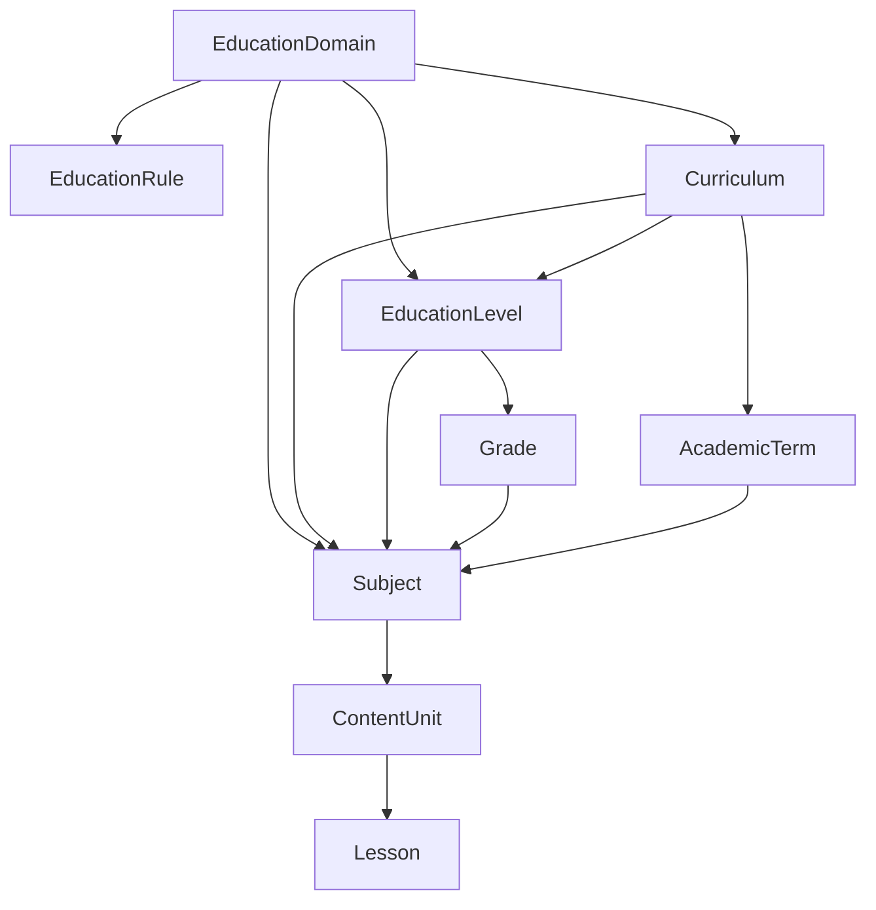

# Education management — Admin CRUD guide
## إدارة المحتوى التعليمي — دليل CRUD للمشرف

> **Audience:** Admin panel, SuperAdmin, backend/QA  
> **Base API:** `/Api/V1`  
> **Source of truth:** `Qalam.Api/Controllers/Education/*` (codebase, May 2026)

**Related docs**

| Topic | File |
|-------|------|
| Wizard / `filter-options` (read-only tree navigation) | [Education_Business_Logic.md](../Qalam.Data/AppMetaData/docs/Education_Business_Logic.md) |
| Teacher subject picker (uses `filter-options`) | [Teacher-Availability-and-Subjects.md](Teacher-Availability-and-Subjects.md) |
| Postman samples | `Qalam.postman_collection.json` → **Education Management** |

---

## Table of contents

1. [Overview](#1-overview)
2. [Entity hierarchy](#2-entity-hierarchy)
3. [Auth & roles](#3-auth--roles)
4. [Response envelope](#4-response-envelope)
5. [Endpoint summary](#5-endpoint-summary)
6. [Domains](#6-domains)
7. [Curriculum](#7-curriculum)
8. [Levels & grades](#8-levels--grades)
9. [Subjects](#9-subjects)
10. [Content units & lessons](#10-content-units--lessons)
11. [Reference data (read-only)](#11-reference-data-read-only)
12. [Filter-options (wizard)](#12-filter-options-wizard)
13. [Gaps & limitations](#13-gaps--limitations)
14. [Source code index](#14-source-code-index)

---

## 1. Overview

The education catalog is a **tree** rooted at **Domain**. Each domain has an **`EducationRule`** (seeded) that controls which levels appear in the UI wizard (`filter-options`) and which FKs are required when creating subjects/units.

| Layer | Entity | Admin CRUD in API |
|-------|--------|-------------------|
| Root | `EducationDomain` | **Full CRUD** |
| Rule | `EducationRule` | **Dedicated rules page** (`PUT` with `educationRule`); `rulesConfigured` gates catalog UIs |
| Branch | `Curriculum` | **Full CRUD** + toggle active |
| Branch | `EducationLevel` | **Create + list** |
| Branch | `Grade` | **Create + list** |
| Branch | `AcademicTerm` | **Full CRUD** (`/Education/Terms`) |
| Leaf | `Subject` | **Full CRUD** |
| Content | `ContentUnit` | **Full CRUD** |
| Content | `Lesson` | **Full CRUD** |
| Quran ref | `QuranLevel`, `QuranPart`, `QuranSurah` | **Read-only lists** |
| Teaching ref | `TeachingMode`, `SessionType`, `TimeSlot`, `DayOfWeek` | **Read-only lists** |

Default seeded domain codes: `school`, `quran`, `language`, `skills`, `university` — see `EducationDomainsSeeder`.

---

## 2. Entity hierarchy



**Typical admin build order (school domain):**

1. Domain (or use seeded) → 2. Curriculum → 3. Level → 4. Grade → 5. Subject → 6. Content unit → 7. Lesson

**Quran domain:** Subject (auto-selected) → `QuranContentType` → `QuranLevel` → units (`QuranSurah` / `QuranPart`) → lessons. Seeded Surah/Juz units stay read-only in admin; lessons are scoped per `(contentUnitId, quranContentTypeId, quranLevelId)`.

---

## 3. Auth & roles

| Operation | Roles |
|-----------|-------|
| **List / get** (domains, curriculum, subjects, units, lessons, reference data) | Any authenticated user (`[Authorize]`) |
| **Create / update / delete domain** | `Admin`, `SuperAdmin` |
| **Create level, grade** | `Admin`, `SuperAdmin` |
| **Create / update / delete subject** | `Admin`, `SuperAdmin` |
| **Create curriculum, update, delete, toggle** | Any authenticated user *(no Admin role on controller today)* |
| **Create content unit, lesson** | `Admin`, `SuperAdmin`, `Teacher` |

```http
Authorization: Bearer <jwt>
```

Admin login: `POST /Api/V1/Authentication/Admin/Login`

---

## 4. Response envelope

```json
{
  "statusCode": "OK",
  "succeeded": true,
  "message": "Success",
  "data": { },
  "errors": null,
  "meta": {
    "pageNumber": 1,
    "pageSize": 10,
    "totalCount": 42,
    "totalPages": 5,
    "hasPreviousPage": false,
    "hasNextPage": true
  }
}
```

List endpoints return rows in `data` and pagination in `meta`. Command endpoints return the created/updated entity in `data`, or a boolean/string on delete.

**Common errors**

| HTTP | When |
|------|------|
| 400 | Validation failure; delete blocked by children; route `id` ≠ body `id` |
| 401 | Missing / expired token |
| 403 | Role not allowed for write |
| 404 | Entity not found |

---

## 5. Endpoint summary

| Resource | GET list | GET by id | POST | PUT | DELETE | Other |
|----------|----------|-----------|------|-----|--------|-------|
| **Domains** | `/Education/Domains` | `/Education/Domains/{id}` | ✓ Admin | ✓ Admin | ✓ Admin | — |
| **Curriculum** | `/Curriculum` | `/Curriculum/{id}` | ✓ | ✓ | ✓ | `PATCH …/toggle-status` |
| **Levels** | `/Education/Levels` | `/Education/Levels/{id}` | ✓ Admin | ✓ Admin | ✓ Admin | — |
| **Grades** | `/Education/Grades` | `/Education/Grades/{id}` | ✓ Admin | ✓ Admin | ✓ Admin | — |
| **Academic terms** | `/Education/Terms` | `/Education/Terms/{id}` | ✓ Admin | ✓ Admin | ✓ Admin | `?curriculumId=` filter |
| **Subjects** | `/Subjects` | `/Subjects/{id}` | ✓ Admin | ✓ Admin | ✓ Admin | `/Subjects/Grade/{gradeId}` |
| **Content units** | `/Content/Units` | `/Content/Units/{id}` | ✓ Admin/Teacher | ✓ Admin/Teacher | ✓ Admin | — |
| **Lessons** | `/Content/Lessons` | `/Content/Lessons/{id}` | ✓ Admin/Teacher | ✓ Admin/Teacher | ✓ Admin | — |
| **Filter wizard** | `/Education/filter-options` | — | — | — | — | see §12 |
| **Teaching modes** | `/Teaching/Modes` | — | — | — | — | read-only |
| **Session types** | `/Teaching/SessionTypes` | — | — | — | — | read-only |
| **Time slots** | `/Teaching/TimeSlots` | — | — | — | — | read-only |
| **Days of week** | `/Teaching/DaysOfWeek` | — | — | — | — | read-only |
| **Quran levels** | `/Quran/Levels` | — | — | — | — | read-only |
| **Quran parts** | `/Quran/Parts` | — | — | — | — | read-only |
| **Quran surahs** | `/Quran/Surahs` | — | — | — | — | read-only |

---

## 6. Domains

Controller: `EducationController`

### List domains

```http
GET /Api/V1/Education/Domains?pageNumber=1&pageSize=10&search=school
Authorization: Bearer <token>
```

| Query | Description |
|-------|-------------|
| `pageNumber`, `pageSize` | Pagination (defaults 1 / 10) |
| `search` | Substring on `nameAr`, `nameEn`, `code` |

### Get domain by id

```http
GET /Api/V1/Education/Domains/{id}
```

### Create domain (Admin)

```http
POST /Api/V1/Education/Domains
Authorization: Bearer <admin-jwt>
Content-Type: application/json
```

```json
{
  "nameAr": "تعليم مدرسي",
  "nameEn": "School Education",
  "code": "school",
  "descriptionAr": "اختياري",
  "descriptionEn": "Optional",
  "isActive": true
}
```

**Response** (`201`) — the handler returns `Created(entity: …)` with the **raw saved entity** in `data` (not a slim DTO), so audit fields and empty navigation collections are included:

```json
{
  "statusCode": "Created",
  "succeeded": true,
  "message": "Created",
  "data": {
    "id": 6,
    "nameAr": "تعليم مدرسي",
    "nameEn": "School Education",
    "code": "school",
    "descriptionAr": "اختياري",
    "descriptionEn": "Optional",
    "isActive": true,
    "createdAt": "2026-05-20T10:15:00Z",
    "updatedAt": null,
    "createdBy": 1,
    "updatedBy": null,
    "curricula": [],
    "educationLevels": [],
    "subjects": [],
    "domainTeachingModes": [],
    "educationRule": null
  },
  "errors": null,
  "meta": null
}
```

> All **create** endpoints in this guide follow the same pattern: `201` with `statusCode: "Created"` and the saved entity echoed in `data`. A duplicate `code` returns `400` with `message` describing the conflict.

| Field | Rules |
|-------|-------|
| `nameAr`, `nameEn` | Required, max 200 |
| `code` | Required, max 50, pattern `^[a-z0-9_]+$`, unique |
| `isActive` | Default `true` |
| `educationRule` | Optional on create; if omitted, code-based defaults are applied with `rulesConfigured: false`. Admins must save rules on `/domains/{id}/rules` before adding catalog content in hierarchy/tree. |

**Admin flow (split create vs rules):**

1. `/domains/new` — domain identity only (`POST` without `educationRule`).
2. Redirect to `/domains/{id}/rules?setup=1` — configure `EducationRule` (`PUT` with `educationRule`).
3. `/domains/{id}/edit` — domain metadata only (no `educationRule` in body).
4. Hierarchy (`/hierarchy`) and domain tree (`/domains/{id}/tree`) block **Add** until `educationRule.rulesConfigured` is `true`.

**`educationRule` fields:** `hasCurriculum`, `hasEducationLevel`, `hasGrade`, `hasAcademicTerm`, `hasContentUnits`, `hasLessons`, `requiresQuranContentType`, `requiresQuranLevel`, `requiresUnitTypeSelection`, `minSessions`, `maxSessions`, `defaultSessionDurationMinutes`, `minGroupSize`, `maxGroupSize`, `allowExtension`, `allowFlexibleCourses`, `notesAr`, `notesEn`, `rulesConfigured` (read-only on GET; set `true` when rules are saved via PUT with `educationRule`).

Example rules save body (`PUT /Api/V1/Education/Domains/{id}`):

```json
{
  "nameAr": "المدرسة",
  "nameEn": "School",
  "code": "school",
  "descriptionAr": null,
  "descriptionEn": null,
  "isActive": true,
  "educationRule": {
    "hasCurriculum": true,
    "hasEducationLevel": true,
    "hasGrade": true,
    "hasAcademicTerm": true,
    "hasContentUnits": true,
    "hasLessons": true,
    "requiresQuranContentType": false,
    "requiresQuranLevel": false,
    "requiresUnitTypeSelection": false,
    "minSessions": 1,
    "maxSessions": 200,
    "defaultSessionDurationMinutes": 45,
    "minGroupSize": 1,
    "maxGroupSize": 30,
    "allowExtension": true,
    "allowFlexibleCourses": true,
    "notesAr": null,
    "notesEn": null
  }
}
```

Creating a domain **auto-creates** an `EducationRule` (from body or code-based defaults). `GET /Education/Domains/{id}` includes `educationRule` with `rulesConfigured`.

### Update domain (Admin)

```http
PUT /Api/V1/Education/Domains/{id}
```

Body: domain identity fields + `"id": {id}` (must match route). Omit `educationRule` to change name/code/descriptions only. Include `educationRule` to save rules (sets `rulesConfigured: true`).

### Delete domain (Admin)

```http
DELETE /Api/V1/Education/Domains/{id}
```

**Blocked** when the domain has any `EducationLevel` rows → 400 *"Cannot delete domain with existing education levels"*.

---

## 7. Curriculum

Controller: `CurriculumController`

### List curriculums

```http
GET /Api/V1/Curriculum?pageNumber=1&pageSize=10&search=saudi&domainId=1
```

| Query | Description |
|-------|-------------|
| `search` | Name filter |
| `domainId` | Filter by domain |

### Get / create / update / delete

```http
GET    /Api/V1/Curriculum/{id}
POST   /Api/V1/Curriculum
PUT    /Api/V1/Curriculum/{id}
DELETE /Api/V1/Curriculum/{id}
PATCH  /Api/V1/Curriculum/{id}/toggle-status
```

**Create body**

```json
{
  "domainId": 1,
  "nameAr": "منهج سعودي",
  "nameEn": "Saudi Curriculum",
  "country": "SA",
  "descriptionAr": null,
  "descriptionEn": null,
  "isActive": true
}
```

**Delete rule:** blocked if curriculum has `EducationLevel` children.

---

## 8. Levels & grades

### Levels

```http
GET  /Api/V1/Education/Levels?pageNumber=1&pageSize=10&domainId=1&curriculumId=1&search=
POST /Api/V1/Education/Levels          # Admin only
```

**Create body**

```json
{
  "nameAr": "المرحلة الابتدائية",
  "nameEn": "Primary",
  "domainId": 1,
  "curriculumId": 1,
  "orderIndex": 1,
  "isActive": true
}
```

| Query (list) | Description |
|--------------|-------------|
| `domainId` | Filter by domain |
| `curriculumId` | Filter by curriculum |
| `search` | Name search |

**No update/delete API** for levels today.

### Grades

```http
GET  /Api/V1/Education/Grades?pageNumber=1&pageSize=10&levelId=2&search=
POST /Api/V1/Education/Grades          # Admin only
```

**Create body**

```json
{
  "nameAr": "الصف الأول",
  "nameEn": "Grade 1",
  "levelId": 2,
  "orderIndex": 1,
  "isActive": true
}
```

| Query (list) | Description |
|--------------|-------------|
| `levelId` | Filter by parent level |

**No update/delete API** for grades today.

### Academic terms

`Router.EducationTerms` is defined but **no controller actions** exist. Terms are seeded under curriculums and surfaced through `filter-options` when `EducationRule.HasAcademicTerm === true`.

---

## 9. Subjects

Controller: `SubjectsController`

### List subjects

```http
GET /Api/V1/Subjects?pageNumber=1&pageSize=10&gradeId=5&termId=1&search=math
```

| Query | Description |
|-------|-------------|
| `gradeId` | Filter by grade |
| `termId` | Filter by academic term |
| `search` | Name search |

Shortcut:

```http
GET /Api/V1/Subjects/Grade/{gradeId}
```


Returns up to 100 subjects for that grade.

### Get / create / update / delete

```http
GET    /Api/V1/Subjects/{id}
POST   /Api/V1/Subjects              # Admin
PUT    /Api/V1/Subjects/{id}         # Admin
DELETE /Api/V1/Subjects/{id}         # Admin
```

**Create / update body**

```json
{
  "nameAr": "رياضيات",
  "nameEn": "Mathematics",
  "descriptionAr": null,
  "descriptionEn": null,
  "domainId": 1,
  "curriculumId": 1,
  "levelId": 2,
  "gradeId": 5,
  "termId": 1,
  "isActive": true
}
```

| Field | Notes |
|-------|-------|
| `domainId` | Required on create |
| `curriculumId`, `levelId`, `gradeId`, `termId` | Optional FKs — align with domain `EducationRule` |
| `isActive` | Default `true` on create |

**Delete rule:** blocked if subject has `ContentUnit` rows → 400 *"Cannot delete subject with existing content units"*.

---

## 10. Content units & lessons

Controller: `ContentController`

### List content units

```http
GET /Api/V1/Content/Units?pageNumber=1&pageSize=10&subjectId=12&termIds=1&termIds=2&unitTypeCode=SchoolUnit&search=
```

| Query | Description |
|-------|-------------|
| `subjectId` | Filter by subject |
| `termIds` | Repeat param for multiple terms |
| `unitTypeCode` | `SchoolUnit`, `QuranSurah`, `QuranPart`, `LanguageModule` |
| `search` | Name search |

### Create content unit

```http
POST /Api/V1/Content/Units
Authorization: Bearer <admin-jwt>
Content-Type: application/json
```

**School unit example**

```json
{
  "nameAr": "الوحدة الأولى",
  "nameEn": "Unit 1",
  "subjectId": 12,
  "termId": 1,
  "orderIndex": 1,
  "unitTypeCode": "SchoolUnit"
}
```

**Quran surah unit example**

```json
{
  "nameAr": "سورة البقرة",
  "nameEn": "Surah Al-Baqarah",
  "subjectId": 499,
  "termId": null,
  "orderIndex": 1,
  "unitTypeCode": "QuranSurah",
  "quranSurahId": 2
}
```

| `unitTypeCode` | Required extras |
|----------------|-----------------|
| `SchoolUnit` | `termId` required |
| `QuranSurah` | `quranSurahId`; `termId` must be null |
| `QuranPart` | `quranPartId`; `termId` must be null |
| `LanguageModule` | No Quran FKs |

**No update/delete API** for units or lessons today.

### List / create lessons

```http
GET  /Api/V1/Content/Lessons?contentUnitId=44&subjectId=12&quranContentTypeId=1&quranLevelId=2&search=
POST /Api/V1/Content/Lessons
```

**Create body (school / language / skills)**

```json
{
  "nameAr": "الدرس 1",
  "nameEn": "Lesson 1",
  "unitId": 44,
  "orderIndex": 1
}
```

**Create body (Quran unit — `QuranSurah` or `QuranPart`)**

Both `quranContentTypeId` and `quranLevelId` are **required**; `orderIndex` is unique per `(unitId, quranContentTypeId, quranLevelId)`.

```json
{
  "nameAr": "آية 1-5",
  "nameEn": "Ayah 1-5",
  "unitId": 44,
  "orderIndex": 1,
  "quranContentTypeId": 1,
  "quranLevelId": 2
}
```

| Query (list) | Description |
|--------------|-------------|
| `contentUnitId` | Filter by unit |
| `subjectId` | Filter by subject |
| `quranContentTypeId` | Quran lesson scope (with `quranLevelId`) |
| `quranLevelId` | Quran lesson scope (with `quranContentTypeId`) |

---

## 11. Reference data (read-only)

Use these to populate dropdowns; **no admin CRUD** in current API.

### Teaching configuration

```http
GET /Api/V1/Teaching/Modes
GET /Api/V1/Teaching/SessionTypes
GET /Api/V1/Teaching/TimeSlots
GET /Api/V1/Teaching/DaysOfWeek
```

All support `pageNumber` / `pageSize` query params.

### Quran catalog

```http
GET /Api/V1/Quran/Levels
GET /Api/V1/Quran/Parts
GET /Api/V1/Quran/Surahs
```

`Quran/Parts` returns all juz (no pagination). Surahs support pagination and filters via query object.

---

## 12. Filter-options (wizard)

**Not CRUD** — stateless read API that drives admin/teacher/student pickers.

```http
GET /Api/V1/Education/filter-options?domainId=1&curriculumId=1&levelId=2&gradeId=5&subjectId=12&termIds=1
Authorization: Bearer <token>
```

Returns `nextStep`, `options[]`, `unit[]`, `rule`, and domain-specific fields (`subject`, `contentTypes`, `levels` for Quran).

**Standard path after Unit:** when `rule.hasLessons === true`, send `contentUnitId` → `nextStep: Lesson` with lessons in `options[]`. Finish with `lessonIds` (multi) or `skipLessons=true` → `Done`.

**Quran path:** `Subject` (auto) → `QuranContentType` → `QuranLevel` → `Unit` (`unit[]`, paginated; `unitTypeCode=QuranSurah|QuranPart`) → `Lesson` (`options[]` filtered by unit + type + level) → `Done`. Seeded `quran` domain has `hasLessons: true`.

**Full reference:** [Education_Business_Logic.md](../Qalam.Data/AppMetaData/docs/Education_Business_Logic.md)

### Admin content tree (`/domains/{id}/tree`)

Visual read-only canvas of enabled `EducationRule` steps (via `@xyflow/react`) plus a step panel that lists catalog items from `filter-options` and creates new rows through existing POST endpoints (Curriculum → Level → Grade → Subject → Unit → Lesson). Academic **Term** is list-only in v1 (no Terms REST API).

| Active step | List source | Create API |
|-------------|-------------|------------|
| Curriculum | `filter-options` `nextStep=Curriculum` | `POST /Curriculum` |
| Level | `nextStep=Level` | `POST /Education/Levels` |
| Grade | `nextStep=Grade` | `POST /Education/Grades` |
| Subject | `nextStep=Subject` | `POST /Subjects` |
| Term | `nextStep=Term` | Read-only (seeded) |
| QuranContentType | `nextStep=QuranContentType` | Read-only (seeded) |
| QuranLevel | `nextStep=QuranLevel` | Read-only (seeded) |
| Unit | `unit[]` | `POST /Content/Units` |
| Lesson | `nextStep=Lesson` | `POST /Content/Lessons` (Quran: include `quranContentTypeId` + `quranLevelId` from breadcrumb) |

### Teacher wizard alignment (subjects survey)

Shared helpers in `apps/teacher/src/lib/education/` drive group creation and unit picking from the same `rule` + `nextStep` contract:

- camelCase query params (`domainId`, `curriculumId`, `termIds`, `contentUnitId`, `quranContentTypeId`, `quranLevelId`, `skipLessons`)
- Term multi-select (or “show all units” = all term IDs) before units load
- Quran branch when `rule.requiresQuranContentType` (not only `domainCode === 'quran'`)

### Hand-add sample data (language & skills)

Copy-paste POST bodies for manual catalog entry (admin tree or REST):

→ [`docs/seed-data/education-catalog-language-skills.json`](seed-data/education-catalog-language-skills.json)  
→ [`docs/seed-data/README.md`](seed-data/README.md)

| Domain | Typical code | Wizard steps | Unit type for hand-add |
|--------|--------------|--------------|-------------------------|
| Languages | `language` | Level → Subject → Unit → Lesson | `LanguageModule`, `termId: null` |
| General skills | `skills` | Subject → Unit → Lesson | `LanguageModule` (not `SchoolUnit` — term required) |

Resolve `domainId` from `GET /Api/V1/Education/Domains` before posting. **University** catalog hand-add is deferred until the multi-institution model in [`university-multi-tenant-outline.md`](university-multi-tenant-outline.md) is implemented.

---

## 13. Gaps & limitations

| Gap | Impact |
|-----|--------|
| **Curriculum** writes not Admin-gated | Any authenticated user can mutate curriculum |
| **Subject list** — `domainId` / `curriculumId` / `levelId` filters commented out in code | Use `gradeId`, `termId`, or `filter-options` |
| **Subjects by domain** route commented out | Use list + `domainId` filter when re-enabled |
| Domain delete | Blocked if levels exist (not if subjects exist directly on domain) |
| Level delete | Blocked if grades exist |
| Grade delete | Blocked if subjects reference grade |
| Term delete | Blocked if subjects reference term |
| Unit delete | Blocked if lessons exist |
| Quran seeded units | Read-only in admin hierarchy UI (no create/edit/delete) |
| Quran content types / levels | Read-only wizard steps; lessons scoped per unit + type + level |

### Admin hierarchy manager (`/hierarchy`)

- ReactFlow canvas with step columns and dynamic catalog nodes
- Add / edit / delete per node type via `entityCrud.ts` + `EntityCrudDrawer`
- Step-based create driven by `filter-options` `nextStep`
- Full CRUD: Domain, Curriculum, Level, Grade, Subject, Term, Unit, Lesson (except Quran units; Quran lessons require content type + level in breadcrumb)
- `filter-options` returns `canDelete` on each option (and on `unit[]` when `nextStep` is `Unit`); hierarchy UI hides delete when `canDelete` is `false` (child data exists). Domain delete is unchanged.

---

## 14. Source code index

| Area | Path |
|------|------|
| Domains, levels, grades, filter-options | `Qalam.Api/Controllers/Education/EducationController.cs` |
| Curriculum | `Qalam.Api/Controllers/Education/CurriculumController.cs` |
| Subjects | `Qalam.Api/Controllers/Education/SubjectsController.cs` |
| Units & lessons | `Qalam.Api/Controllers/Education/ContentController.cs` |
| Teaching ref data | `Qalam.Api/Controllers/Education/TeachingController.cs` |
| Quran ref data | `Qalam.Api/Controllers/Education/QuranController.cs` |
| Route constants | `Qalam.Data/AppMetaData/Router.cs` |
| Domain service (delete rules) | `Qalam.Service/Implementations/EducationDomainService.cs` |
| Subject service | `Qalam.Service/Implementations/SubjectService.cs` |
| Curriculum service | `Qalam.Service/Implementations/CurriculumService.cs` |
| Filter wizard | `Qalam.Service/Implementations/EducationFilterService.cs` |
| Default domains + rules | `Qalam.Infrastructure/Seeding/EducationDomainsSeeder.cs` |

---

## Admin panel checklist

- [ ] Domain list with search; create/edit/deactivate (delete only when no levels)
- [ ] Curriculum CRUD per domain + toggle active
- [ ] Level → grade → subject wizard aligned with `EducationRule` for each domain
- [ ] Subject form with optional curriculum/level/grade/term FKs
- [ ] Content unit form with `unitTypeCode` branching (school vs Quran vs language)
- [ ] Lesson list under unit; create lesson with `orderIndex`
- [x] Hierarchy manager canvas with per-step Add and full CRUD per node type
- [x] Hierarchy UI disables delete when `filter-options` returns `canDelete: false` (children exist)
- [ ] Handle 400 on delete when children exist (show server `message`) — fallback if client guard bypassed