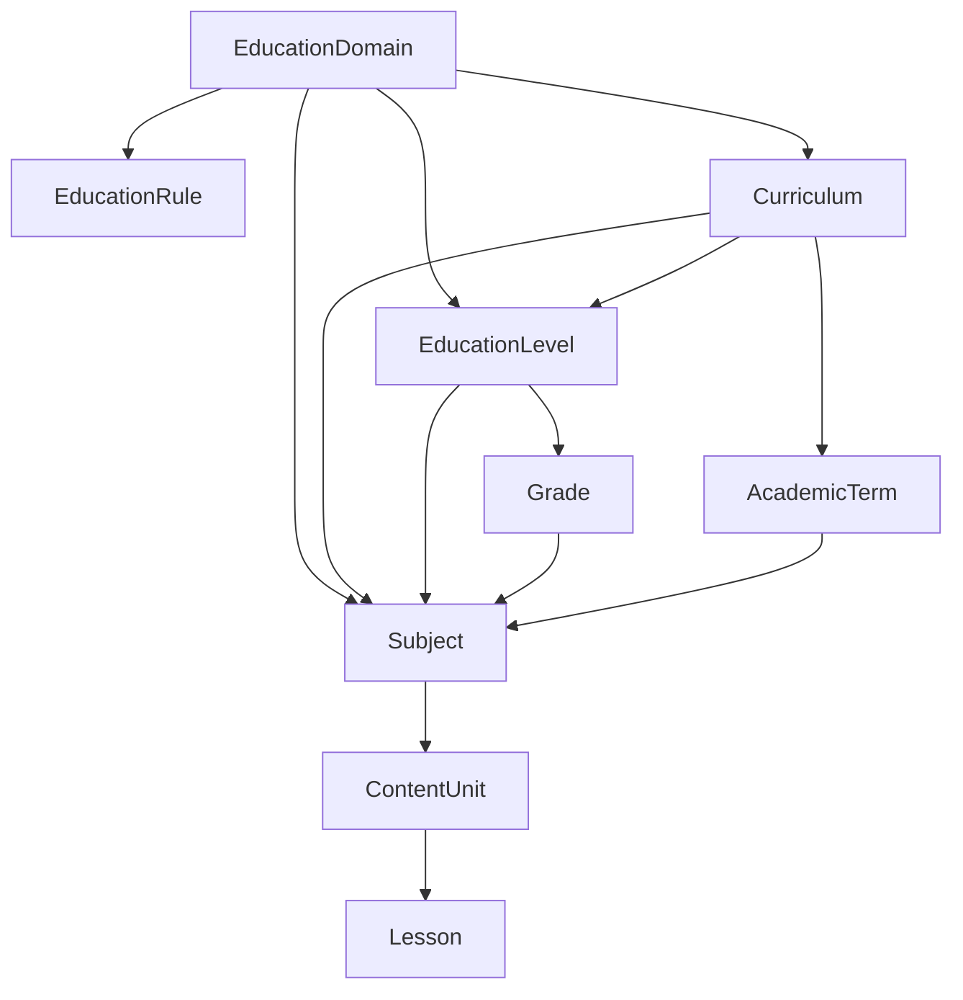

# Education management — Admin CRUD guide
## إدارة المحتوى التعليمي — دليل CRUD للمشرف

> **Audience:** Admin panel, SuperAdmin, backend/QA  
> **Base API:** `/Api/V1`  
> **Source of truth:** `Qalam.Api/Controllers/Education/*` (codebase, May 2026)

**Related docs**

| Topic | File |
|-------|------|
| Wizard / `filter-options` (read-only tree navigation) | [Education_Business_Logic.md](../Qalam.Data/AppMetaData/docs/Education_Business_Logic.md) |
| Teacher subject picker (uses `filter-options`) | [Teacher-Availability-and-Subjects.md](Teacher-Availability-and-Subjects.md) |
| Postman samples | `Qalam.postman_collection.json` → **Education Management** |

---

## Table of contents

1. [Overview](#1-overview)
2. [Entity hierarchy](#2-entity-hierarchy)
3. [Auth & roles](#3-auth--roles)
4. [Response envelope](#4-response-envelope)
5. [Endpoint summary](#5-endpoint-summary)
6. [Domains](#6-domains)
7. [Curriculum](#7-curriculum)
8. [Levels & grades](#8-levels--grades)
9. [Subjects](#9-subjects)
10. [Content units & lessons](#10-content-units--lessons)
11. [Reference data (read-only)](#11-reference-data-read-only)
12. [Filter-options (wizard)](#12-filter-options-wizard)
13. [Gaps & limitations](#13-gaps--limitations)
14. [Source code index](#14-source-code-index)

---

## 1. Overview

The education catalog is a **tree** rooted at **Domain**. Each domain has an **`EducationRule`** (seeded) that controls which levels appear in the UI wizard (`filter-options`) and which FKs are required when creating subjects/units.

| Layer | Entity | Admin CRUD in API |
|-------|--------|-------------------|
| Root | `EducationDomain` | **Full CRUD** |
| Rule | `EducationRule` | **Seed / DB only** (no REST API) |
| Branch | `Curriculum` | **Full CRUD** + toggle active |
| Branch | `EducationLevel` | **Create + list** |
| Branch | `Grade` | **Create + list** |
| Branch | `AcademicTerm` | **No REST API** (seeded; exposed via `filter-options`) |
| Leaf | `Subject` | **Full CRUD** |
| Content | `ContentUnit` | **Create + list** |
| Content | `Lesson` | **Create + list** |
| Quran ref | `QuranLevel`, `QuranPart`, `QuranSurah` | **Read-only lists** |
| Teaching ref | `TeachingMode`, `SessionType`, `TimeSlot`, `DayOfWeek` | **Read-only lists** |

Default seeded domain codes: `school`, `quran`, `language`, `skills`, `university` — see `EducationDomainsSeeder`.

---

## 2. Entity hierarchy



**Typical admin build order (school domain):**

1. Domain (or use seeded) → 2. Curriculum → 3. Level → 4. Grade → 5. Subject → 6. Content unit → 7. Lesson

**Quran domain:** Subject → units (`QuranSurah` / `QuranPart` unit types); no curriculum/grade/term on units.

---

## 3. Auth & roles

| Operation | Roles |
|-----------|-------|
| **List / get** (domains, curriculum, subjects, units, lessons, reference data) | Any authenticated user (`[Authorize]`) |
| **Create / update / delete domain** | `Admin`, `SuperAdmin` |
| **Create level, grade** | `Admin`, `SuperAdmin` |
| **Create / update / delete subject** | `Admin`, `SuperAdmin` |
| **Create curriculum, update, delete, toggle** | Any authenticated user *(no Admin role on controller today)* |
| **Create content unit, lesson** | `Admin`, `SuperAdmin`, `Teacher` |

```http
Authorization: Bearer <jwt>
```

Admin login: `POST /Api/V1/Authentication/Admin/Login`

---

## 4. Response envelope

```json
{
  "statusCode": "OK",
  "succeeded": true,
  "message": "Success",
  "data": { },
  "errors": null,
  "meta": {
    "pageNumber": 1,
    "pageSize": 10,
    "totalCount": 42,
    "totalPages": 5,
    "hasPreviousPage": false,
    "hasNextPage": true
  }
}
```

List endpoints return rows in `data` and pagination in `meta`. Command endpoints return the created/updated entity in `data`, or a boolean/string on delete.

**Common errors**

| HTTP | When |
|------|------|
| 400 | Validation failure; delete blocked by children; route `id` ≠ body `id` |
| 401 | Missing / expired token |
| 403 | Role not allowed for write |
| 404 | Entity not found |

---

## 5. Endpoint summary

| Resource | GET list | GET by id | POST | PUT | DELETE | Other |
|----------|----------|-----------|------|-----|--------|-------|
| **Domains** | `/Education/Domains` | `/Education/Domains/{id}` | ✓ Admin | ✓ Admin | ✓ Admin | — |
| **Curriculum** | `/Curriculum` | `/Curriculum/{id}` | ✓ | ✓ | ✓ | `PATCH …/toggle-status` |
| **Levels** | `/Education/Levels` | — | ✓ Admin | — | — | — |
| **Grades** | `/Education/Grades` | — | ✓ Admin | — | — | — |
| **Subjects** | `/Subjects` | `/Subjects/{id}` | ✓ Admin | ✓ Admin | ✓ Admin | `/Subjects/Grade/{gradeId}` |
| **Content units** | `/Content/Units` | — | ✓ Admin/Teacher | — | — | — |
| **Lessons** | `/Content/Lessons` | — | ✓ Admin/Teacher | — | — | — |
| **Filter wizard** | `/Education/filter-options` | — | — | — | — | see §12 |
| **Teaching modes** | `/Teaching/Modes` | — | — | — | — | read-only |
| **Session types** | `/Teaching/SessionTypes` | — | — | — | — | read-only |
| **Time slots** | `/Teaching/TimeSlots` | — | — | — | — | read-only |
| **Days of week** | `/Teaching/DaysOfWeek` | — | — | — | — | read-only |
| **Quran levels** | `/Quran/Levels` | — | — | — | — | read-only |
| **Quran parts** | `/Quran/Parts` | — | — | — | — | read-only |
| **Quran surahs** | `/Quran/Surahs` | — | — | — | — | read-only |

---

## 6. Domains

Controller: `EducationController`

### List domains

```http
GET /Api/V1/Education/Domains?pageNumber=1&pageSize=10&search=school
Authorization: Bearer <token>
```

| Query | Description |
|-------|-------------|
| `pageNumber`, `pageSize` | Pagination (defaults 1 / 10) |
| `search` | Substring on `nameAr`, `nameEn`, `code` |

### Get domain by id

```http
GET /Api/V1/Education/Domains/{id}
```

### Create domain (Admin)

```http
POST /Api/V1/Education/Domains
Authorization: Bearer <admin-jwt>
Content-Type: application/json
```

```json
{
  "nameAr": "تعليم مدرسي",
  "nameEn": "School Education",
  "code": "school",
  "descriptionAr": "اختياري",
  "descriptionEn": "Optional",
  "isActive": true
}
```

| Field | Rules |
|-------|-------|
| `nameAr`, `nameEn` | Required, max 200 |
| `code` | Required, max 50, pattern `^[a-z0-9_]+$`, unique |
| `isActive` | Default `true` |

**Note:** Creating a domain via API does **not** auto-create an `EducationRule`. Seeded domains include rules; custom domains may need a DB rule row for `filter-options` to work.

### Update domain (Admin)

```http
PUT /Api/V1/Education/Domains/{id}
```

Body: same fields as create + `"id": {id}` (must match route).

### Delete domain (Admin)

```http
DELETE /Api/V1/Education/Domains/{id}
```

**Blocked** when the domain has any `EducationLevel` rows → 400 *"Cannot delete domain with existing education levels"*.

---

## 7. Curriculum

Controller: `CurriculumController`

### List curriculums

```http
GET /Api/V1/Curriculum?pageNumber=1&pageSize=10&search=saudi&domainId=1
```

| Query | Description |
|-------|-------------|
| `search` | Name filter |
| `domainId` | Filter by domain |

### Get / create / update / delete

```http
GET    /Api/V1/Curriculum/{id}
POST   /Api/V1/Curriculum
PUT    /Api/V1/Curriculum/{id}
DELETE /Api/V1/Curriculum/{id}
PATCH  /Api/V1/Curriculum/{id}/toggle-status
```

**Create body**

```json
{
  "domainId": 1,
  "nameAr": "منهج سعودي",
  "nameEn": "Saudi Curriculum",
  "country": "SA",
  "descriptionAr": null,
  "descriptionEn": null,
  "isActive": true
}
```

**Delete rule:** blocked if curriculum has `EducationLevel` children.

---

## 8. Levels & grades

### Levels

```http
GET  /Api/V1/Education/Levels?pageNumber=1&pageSize=10&domainId=1&curriculumId=1&search=
POST /Api/V1/Education/Levels          # Admin only
```

**Create body**

```json
{
  "nameAr": "المرحلة الابتدائية",
  "nameEn": "Primary",
  "domainId": 1,
  "curriculumId": 1,
  "orderIndex": 1,
  "isActive": true
}
```

| Query (list) | Description |
|--------------|-------------|
| `domainId` | Filter by domain |
| `curriculumId` | Filter by curriculum |
| `search` | Name search |

**No update/delete API** for levels today.

### Grades

```http
GET  /Api/V1/Education/Grades?pageNumber=1&pageSize=10&levelId=2&search=
POST /Api/V1/Education/Grades          # Admin only
```

**Create body**

```json
{
  "nameAr": "الصف الأول",
  "nameEn": "Grade 1",
  "levelId": 2,
  "orderIndex": 1,
  "isActive": true
}
```

| Query (list) | Description |
|--------------|-------------|
| `levelId` | Filter by parent level |

**No update/delete API** for grades today.

### Academic terms

`Router.EducationTerms` is defined but **no controller actions** exist. Terms are seeded under curriculums and surfaced through `filter-options` when `EducationRule.HasAcademicTerm === true`.

---

## 9. Subjects

Controller: `SubjectsController`

### List subjects

```http
GET /Api/V1/Subjects?pageNumber=1&pageSize=10&gradeId=5&termId=1&search=math
```

| Query | Description |
|-------|-------------|
| `gradeId` | Filter by grade |
| `termId` | Filter by academic term |
| `search` | Name search |

Shortcut:

```http
GET /Api/V1/Subjects/Grade/{gradeId}
```


Returns up to 100 subjects for that grade.

### Get / create / update / delete

```http
GET    /Api/V1/Subjects/{id}
POST   /Api/V1/Subjects              # Admin
PUT    /Api/V1/Subjects/{id}         # Admin
DELETE /Api/V1/Subjects/{id}         # Admin
```

**Create / update body**

```json
{
  "nameAr": "رياضيات",
  "nameEn": "Mathematics",
  "descriptionAr": null,
  "descriptionEn": null,
  "domainId": 1,
  "curriculumId": 1,
  "levelId": 2,
  "gradeId": 5,
  "termId": 1,
  "isActive": true
}
```

| Field | Notes |
|-------|-------|
| `domainId` | Required on create |
| `curriculumId`, `levelId`, `gradeId`, `termId` | Optional FKs — align with domain `EducationRule` |
| `isActive` | Default `true` on create |

**Delete rule:** blocked if subject has `ContentUnit` rows → 400 *"Cannot delete subject with existing content units"*.

---

## 10. Content units & lessons

Controller: `ContentController`

### List content units

```http
GET /Api/V1/Content/Units?pageNumber=1&pageSize=10&subjectId=12&termIds=1&termIds=2&unitTypeCode=SchoolUnit&search=
```

| Query | Description |
|-------|-------------|
| `subjectId` | Filter by subject |
| `termIds` | Repeat param for multiple terms |
| `unitTypeCode` | `SchoolUnit`, `QuranSurah`, `QuranPart`, `LanguageModule` |
| `search` | Name search |

### Create content unit

```http
POST /Api/V1/Content/Units
Authorization: Bearer <admin-jwt>
Content-Type: application/json
```

**School unit example**

```json
{
  "nameAr": "الوحدة الأولى",
  "nameEn": "Unit 1",
  "subjectId": 12,
  "termId": 1,
  "orderIndex": 1,
  "unitTypeCode": "SchoolUnit"
}
```

**Quran surah unit example**

```json
{
  "nameAr": "سورة البقرة",
  "nameEn": "Surah Al-Baqarah",
  "subjectId": 499,
  "termId": null,
  "orderIndex": 1,
  "unitTypeCode": "QuranSurah",
  "quranSurahId": 2
}
```

| `unitTypeCode` | Required extras |
|----------------|-----------------|
| `SchoolUnit` | `termId` required |
| `QuranSurah` | `quranSurahId`; `termId` must be null |
| `QuranPart` | `quranPartId`; `termId` must be null |
| `LanguageModule` | No Quran FKs |

**No update/delete API** for units or lessons today.

### List / create lessons

```http
GET  /Api/V1/Content/Lessons?contentUnitId=44&subjectId=12&search=
POST /Api/V1/Content/Lessons
```

**Create body**

```json
{
  "nameAr": "الدرس 1",
  "nameEn": "Lesson 1",
  "unitId": 44,
  "orderIndex": 1
}
```

| Query (list) | Description |
|--------------|-------------|
| `contentUnitId` | Filter by unit |
| `subjectId` | Filter by subject |

---

## 11. Reference data (read-only)

Use these to populate dropdowns; **no admin CRUD** in current API.

### Teaching configuration

```http
GET /Api/V1/Teaching/Modes
GET /Api/V1/Teaching/SessionTypes
GET /Api/V1/Teaching/TimeSlots
GET /Api/V1/Teaching/DaysOfWeek
```

All support `pageNumber` / `pageSize` query params.

### Quran catalog

```http
GET /Api/V1/Quran/Levels
GET /Api/V1/Quran/Parts
GET /Api/V1/Quran/Surahs
```

`Quran/Parts` returns all juz (no pagination). Surahs support pagination and filters via query object.

---

## 12. Filter-options (wizard)

**Not CRUD** — stateless read API that drives admin/teacher/student pickers.

```http
GET /Api/V1/Education/filter-options?domainId=1&curriculumId=1&levelId=2&gradeId=5&subjectId=12&termIds=1
Authorization: Bearer <token>
```

Returns `nextStep`, `options[]`, `unit[]`, `rule`, and domain-specific fields (`subject`, `contentTypes`, `levels` for Quran).

**Standard path after Unit:** when `rule.hasLessons === true`, send `contentUnitId` → `nextStep: Lesson` with lessons in `options[]`. Finish with `lessonIds` (multi) or `skipLessons=true` → `Done`. Quran domain skips the lesson step (`hasLessons: false`).

**Full reference:** [Education_Business_Logic.md](../Qalam.Data/AppMetaData/docs/Education_Business_Logic.md)

---

## 13. Gaps & limitations

| Gap | Impact |
|-----|--------|
| No **Terms** REST API | Manage terms via seeds/DB; use `filter-options` to list |
| No **EducationRule** API | Rule flags edited in DB or seeder only |
| **Levels / grades** — create only | No update, delete, or get-by-id |
| **Units / lessons** — create only | No update or delete |
| **Curriculum** writes not Admin-gated | Any authenticated user can mutate curriculum |
| **Subject list** — `domainId` / `curriculumId` / `levelId` filters commented out in code | Use `gradeId`, `termId`, or `filter-options` |
| **Subjects by domain** route commented out | Use list + `domainId` filter when re-enabled |
| Domain delete | Blocked if levels exist (not if subjects exist directly on domain) |

---

## 14. Source code index

| Area | Path |
|------|------|
| Domains, levels, grades, filter-options | `Qalam.Api/Controllers/Education/EducationController.cs` |
| Curriculum | `Qalam.Api/Controllers/Education/CurriculumController.cs` |
| Subjects | `Qalam.Api/Controllers/Education/SubjectsController.cs` |
| Units & lessons | `Qalam.Api/Controllers/Education/ContentController.cs` |
| Teaching ref data | `Qalam.Api/Controllers/Education/TeachingController.cs` |
| Quran ref data | `Qalam.Api/Controllers/Education/QuranController.cs` |
| Route constants | `Qalam.Data/AppMetaData/Router.cs` |
| Domain service (delete rules) | `Qalam.Service/Implementations/EducationDomainService.cs` |
| Subject service | `Qalam.Service/Implementations/SubjectService.cs` |
| Curriculum service | `Qalam.Service/Implementations/CurriculumService.cs` |
| Filter wizard | `Qalam.Service/Implementations/EducationFilterService.cs` |
| Default domains + rules | `Qalam.Infrastructure/Seeding/EducationDomainsSeeder.cs` |

---

## Admin panel checklist

- [ ] Domain list with search; create/edit/deactivate (delete only when no levels)
- [ ] Curriculum CRUD per domain + toggle active
- [ ] Level → grade → subject wizard aligned with `EducationRule` for each domain
- [ ] Subject form with optional curriculum/level/grade/term FKs
- [ ] Content unit form with `unitTypeCode` branching (school vs Quran vs language)
- [ ] Lesson list under unit; create lesson with `orderIndex`
- [ ] Link to `filter-options` doc for picker UX (teacher/student flows)
- [ ] Handle 400 on delete when children exist (show server `message`)