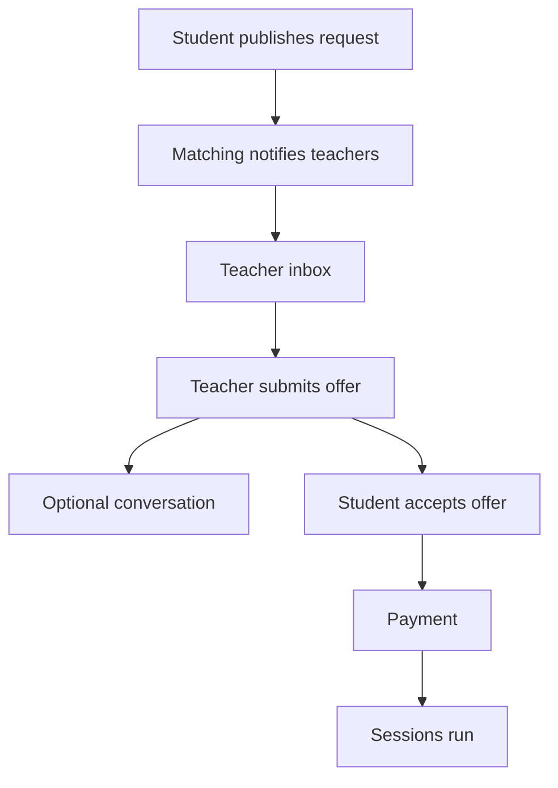
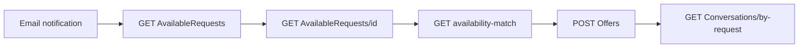
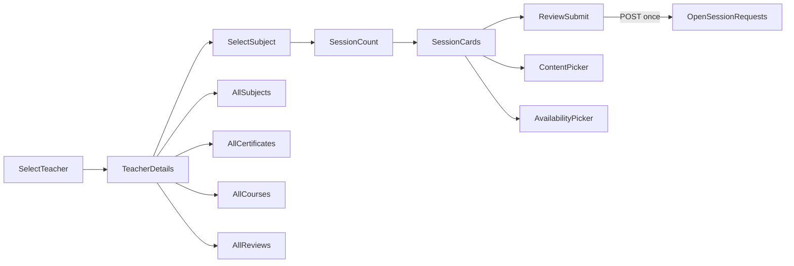

# Scenario 2 — Open Session Request: Flow & API Reference
## السيناريو الثاني: طلب جلسات مفتوح — التدفق وواجهات البرمجة

> **Purpose:** Quick reference for frontend, backend, and QA — flows and **backend endpoints only** (no acceptance criteria).
>
> **Related:** [User stories & entities](USER-STORIES-Scenario-2.md) · [Teacher role](TEACHER-ROLE-Scenario2.md) · [Admin role](ADMIN-ROLE-Scenario2.md) · [Combined index](USER-STORIES-Scenarios-1-and-2.md)
>
> **Source of truth:** [`Router.cs`](../Qalam.Data/AppMetaData/Router.cs) + controllers under `Qalam.Api/Controllers/`. Code wins over BRD where they diverge.

---

## Table of contents

1. [Maturity snapshot](#1-maturity-snapshot)
2. [End-to-end flows](#2-end-to-end-flows)
3. [Backend API — implemented](#3-backend-api--implemented)
4. [Backend API — supporting (wizard)](#4-backend-api--supporting-wizard)
5. [Backend API — planned](#5-backend-api--planned)
6. [Targeted-teacher wizard (screen → endpoint map)](#6-targeted-teacher-wizard-screen--endpoint-map)
7. [Publish contract](#7-publish-contract)
8. [Known gaps](#8-known-gaps)

---

## 1. Maturity snapshot

| Area | Status |
|------|--------|
| Student publish / list / detail / cancel / attachments | **Implemented** |
| Broadcast + targeted matching (`targetedTeacherId`) | **Implemented** |
| Teacher inbox / offers / withdraw | **Implemented** |
| HTTP chat (cursor-paginated) | **Implemented** |
| Student teacher profile APIs (wizard Screen 2) | **Implemented** |
| Student accept offer / compare offers | **Planned** (S2-ST-009, S2-ST-010) |
| S2 payment after accept | **Planned** (S2-ST-011) |
| Server-side wizard draft | **Planned** (S2-ST-008) |
| Admin S2 dashboard / moderation | **Planned** (S2-AD-001–008) |
| SignalR chat hub | **Not in codebase** |

---

## 2. End-to-end flows

### 2.1 Main lifecycle



**Planned (no handler today):** accept → pay → sessions.

### 2.2 Publish paths

| Path | `targetedTeacherId` | Matching |
|------|---------------------|----------|
| **Broadcast** | omitted / null | All qualified teachers get `OpenSessionRequestTarget` + email |
| **Targeted** | set on `POST` | Broadcast skipped; one teacher validated (subject + units) |

Controller: [`StudentOpenSessionRequestController`](../Qalam.Api/Controllers/Student/StudentOpenSessionRequestController.cs) → `Create`.

### 2.3 Teacher inbox



Target status enum: `Notified` → `Viewed` → `OfferSubmitted` / `Skipped`.

### 2.4 Chat

- One conversation per `(requestId, teacherId)` — exists **before** any offer.
- HTTP only; poll `GET …/messages` with cursor pagination.
- Entry: `GET /Api/V1/Conversations/by-request/{requestId}/teacher/{teacherId}`.

### 2.5 Targeted-teacher wizard (6 screens)



Client holds `WizardDraft` in memory until single `POST` (S2-ST-008 server draft = planned).

---

## 3. Backend API — implemented

Base path: `/Api/V1`. Envelope: `{ "succeeded": true, "data": … }` unless noted.

### 3.1 Student — open session requests

**Controller:** [`StudentOpenSessionRequestController`](../Qalam.Api/Controllers/Student/StudentOpenSessionRequestController.cs)  
**Auth:** `Student`, `Guardian`

| Method | Path | Action | MediatR handler | Story |
|--------|------|--------|-----------------|-------|
| POST | `/Student/OpenSessionRequests` | `Create` | `CreateOpenSessionRequestCommandHandler` | S2-ST-001, S2-ST-001b |
| GET | `/Student/OpenSessionRequests/my` | `GetMy` | `GetMyOpenSessionRequestsQueryHandler` | S2-ST-002 |
| GET | `/Student/OpenSessionRequests/{id}` | `GetById` | `GetOpenSessionRequestByIdQueryHandler` | S2-ST-003 |
| POST | `/Student/OpenSessionRequests/{id}/Cancel` | `Cancel` | `CancelOpenSessionRequestCommandHandler` | S2-ST-004 |
| POST | `/Student/OpenSessionRequests/{id}/Attachments` | `UploadAttachment` | `UploadOpenSessionRequestAttachmentCommandHandler` | S2-ST-005 |
| DELETE | `/Student/OpenSessionRequests/{id}/Attachments/{attachmentId}` | `DeleteAttachment` | `DeleteOpenSessionRequestAttachmentCommandHandler` | S2-ST-006 |

**Controller:** [`OpenSessionRequestMembershipController`](../Qalam.Api/Controllers/Student/OpenSessionRequestMembershipController.cs)

| Method | Path | Action | MediatR handler | Story |
|--------|------|--------|-----------------|-------|
| POST | `/Student/OpenSessionRequests/{openSessionRequestId}/Members/Response` | `Respond` | `RespondToOpenSessionRequestInvitationCommandHandler` | S2-ST-007 |

### 3.2 Student — teacher discovery (targeted wizard)

**Controller:** [`StudentTeacherController`](../Qalam.Api/Controllers/Student/StudentTeacherController.cs)  
**Auth:** `Student`, `Guardian`

| Method | Path | Action | MediatR handler | Story |
|--------|------|--------|-----------------|-------|
| GET | `/Student/Teachers` | `GetList` | `GetTeachersListQueryHandler` | S2-ST-001b |
| GET | `/Student/Teachers/Recommended` | `GetRecommended` | `GetRecommendedTeachersQueryHandler` | Wizard S1 |
| GET | `/Student/Teachers/{teacherId}` | `GetProfile` | `GetStudentTeacherProfileQueryHandler` | Wizard S2 |
| GET | `/Student/Teachers/{teacherId}/Subjects` | `GetSubjects` | `GetStudentTeacherSubjectsQueryHandler` | Wizard S2/S3 |
| GET | `/Student/Teachers/{teacherId}/Reviews` | `GetReviews` | `GetStudentTeacherReviewsQueryHandler` | Wizard S2 |
| GET | `/Student/Teachers/{teacherId}/Certificates` | `GetCertificates` | `GetStudentTeacherCertificatesQueryHandler` | Wizard S2 |

**Controller:** [`StudentCourseController`](../Qalam.Api/Controllers/Student/StudentCourseController.cs)

| Method | Path | Action | MediatR handler | Story |
|--------|------|--------|-----------------|-------|
| GET | `/Student/Teachers/{teacherId}/Availability` | `GetTeacherAvailabilityByRange` | `GetTeacherAvailabilityByRangeQueryHandler` | Wizard S5 |
| GET | `/Student/Courses` | `GetPublishedCourses` | `GetPublishedCoursesListQueryHandler` | Wizard S2 (`teacherId` query) |

### 3.3 Teacher — inbox

**Controller:** [`TeacherAvailableRequestsController`](../Qalam.Api/Controllers/Teacher/TeacherAvailableRequestsController.cs)  
**Auth:** `Teacher`  
**Route prefix:** `/Teacher/AvailableRequests`

| Method | Path | Action | MediatR handler | Story |
|--------|------|--------|-----------------|-------|
| GET | `/` | `List` | `GetAvailableRequestsQueryHandler` | S2-TE-002 |
| GET | `/{id}` | `GetById` | `GetAvailableRequestByIdQueryHandler` | S2-TE-003 |
| PUT | `/{id}/mark-viewed` | `MarkViewed` | `MarkAvailableRequestViewedCommandHandler` | S2-TE-004 |
| POST | `/{id}/dismiss` | `Dismiss` | `DismissAvailableRequestCommandHandler` | S2-TE-004 |
| GET | `/{id}/availability-match` | `AvailabilityMatch` | `GetAvailableRequestAvailabilityMatchQueryHandler` | S2-TE-003 |

### 3.4 Teacher — offers

**Controller:** [`TeacherSessionOffersController`](../Qalam.Api/Controllers/Teacher/TeacherSessionOffersController.cs)  
**Auth:** `Teacher`  
**Route prefix:** `/Teacher/Offers`

| Method | Path | Action | MediatR handler | Story |
|--------|------|--------|-----------------|-------|
| POST | `/` | `Create` | `CreateSessionOfferCommandHandler` | S2-TE-005 |
| PUT | `/{id}` | `Update` | `UpdateSessionOfferCommandHandler` | S2-TE-007 |
| POST | `/{id}/withdraw` | `Withdraw` | `WithdrawSessionOfferCommandHandler` | S2-TE-008 |
| GET | `/my` | `GetMy` | `GetMyOffersQueryHandler` | S2-TE-006 |
| GET | `/{id}` | `GetById` | `GetMyOfferByIdQueryHandler` | S2-TE-006 |

### 3.5 Shared — conversations

**Controller:** [`OfferConversationsController`](../Qalam.Api/Controllers/Common/OfferConversationsController.cs)  
**Auth:** JWT (`Student`, `Guardian`, `Teacher`)

| Method | Path | Action | MediatR handler | Story |
|--------|------|--------|-----------------|-------|
| GET | `/Conversations/by-request/{requestId}/teacher/{teacherId}` | `GetOrCreateByRequest` | `GetOrCreateConversationByRequestQueryHandler` | S2-ST-012, S2-TE-009 |
| GET | `/Conversations/{conversationId}/messages` | `GetMessages` | `GetConversationMessagesQueryHandler` | S2-ST-012, S2-TE-009 |
| POST | `/Conversations/{conversationId}/messages` | `PostMessage` | `PostConversationMessageCommandHandler` | S2-ST-012, S2-TE-009 |
| POST | `/Conversations/{conversationId}/read` | `MarkRead` | `MarkConversationReadCommandHandler` | S2-ST-012, S2-TE-009 |

---

## 4. Backend API — supporting (wizard)

Used during targeted-teacher wizard; not S2-specific controllers but required for publish payload.

| Method | Path | Controller | Purpose |
|--------|------|------------|---------|
| GET | `/Education/filter-options` | `EducationController` | Session rules (`minSessions`, `maxSessions`, `defaultSessionDurationMinutes`); content tree |
| GET | `/Education/Domains` | `EducationController` | Domain filter (Screen 1) |
| GET | `/Teaching/Modes` | `TeachingController` | `teachingModeId` (required on POST) |
| GET | `/Teaching/TimeSlots` | `TeachingController` | `timeSlotId` labels |
| GET | `/Teaching/DaysOfWeek` | `TeachingController` | Optional weekday labels |
| GET | `/Content/Units` | `ContentController` | Content picker units |
| GET | `/Content/Lessons` | `ContentController` | Content picker lessons |
| GET | `/Quran/Levels` | `QuranController` | Quran domain sessions |
| GET | `/Quran/ContentTypes` | `QuranController` | Quran domain sessions |
| GET | `/Quran/Parts`, `/Quran/Surahs` | `QuranController` | Optional Quran refs |

DTO: [`CreateOpenSessionRequestDto`](../Qalam.Data/DTOs/OpenSessionRequests/OpenSessionRequestDtos.cs).

---

## 5. Backend API — planned

| Need | Story | Notes |
|------|-------|-------|
| List/compare offers for a request | S2-ST-009 | No dedicated student endpoint |
| Accept offer | S2-ST-010 | No handler; no `Enrollment` from S2 |
| S2 payment | S2-ST-011 | Reuse S1 payment pattern — not wired |
| Wizard draft save/resume | S2-ST-008 | No `PATCH` draft endpoint |
| Admin S2 dashboard, requests, offers, disputes, reports | S2-AD-001–008 | See [ADMIN-ROLE-Scenario2.md](ADMIN-ROLE-Scenario2.md) |
| SignalR chat hub | — | HTTP polling only today |
| Per-session attachment FK | — | Request-level attachments only (S2-ST-005) |

---

## 6. Targeted-teacher wizard (screen → endpoint map)

| Screen | User action | Backend endpoints (implemented) |
|--------|-------------|-------------------------------|
| **1 — Select teacher** | Browse/search teachers | `GET /Student/Teachers`, `GET /Student/Teachers/Recommended` |
| **2 — Teacher details** | Profile, stats, previews | `GET /Student/Teachers/{id}`, `/Subjects`, `/Reviews`, `/Certificates`, `GET /Student/Courses?teacherId=` |
| **2a–d — See all** | Full lists | Same endpoints as Screen 2 (paginated where applicable) |
| **3 — Select subject** | Pick subject + mode | `GET /Student/Teachers/{id}/Subjects`, `GET /Education/filter-options`, `GET /Teaching/Modes` |
| **4 — Session count** | Preset count | `GET /Education/filter-options?domainId=&subjectId=` (client-only step) |
| **5 — Session cards** | Content, date, slot, notes | `GET /Education/filter-options`, `/Content/Units`, `/Content/Lessons`, `GET /Student/Teachers/{id}/Availability`, `GET /Teaching/TimeSlots` |
| **6 — Review & submit** | Validate + publish | `POST /Student/OpenSessionRequests` |
| **Post-submit** | Attachments, detail | `POST …/Attachments`, `GET …/OpenSessionRequests/{id}` |

Flutter: [`apps/Qalam`](../apps/Qalam/) — `TargetedTeacherWizardScreen`, `TeacherDetailsScreen`.

---

## 7. Publish contract

**Endpoint:** `POST /Api/V1/Student/OpenSessionRequests`  
**Body envelope:** `{ "data": { …CreateOpenSessionRequestDto } }`

**Targeted example:**

```json
{
  "data": {
    "studentId": 1,
    "domainId": 2,
    "subjectId": 3,
    "teachingModeId": 1,
    "targetedTeacherId": 42,
    "totalSessionsCount": 5,
    "studentNotes": "optional",
    "sessions": [
      {
        "sequenceNumber": 1,
        "preferredDate": "2026-07-15",
        "timeSlotId": 3,
        "durationMinutes": 60,
        "notes": "optional",
        "units": [
          { "contentUnitId": 200, "includesAllLessons": true }
        ]
      }
    ]
  }
}
```

**Broadcast:** omit `targetedTeacherId`.  
**Group invite:** add `invitations[]` → request stays `PendingInvitations` until all respond (S2-ST-007).

---

## 8. Known gaps

| Item | Status | Workaround |
|------|--------|------------|
| Per-session file upload | **Gap** | Request-level `POST …/Attachments` after publish; or `sessions[i].notes` |
| Wizard draft on server | **Planned** | Client-held `WizardDraft` until submit |
| Accept offer / payment | **Planned** | — |
| Targeted path `TeacherSubject` approval vs broadcast | **Discrepancy** | See [USER-STORIES-Scenario-2.md §12](USER-STORIES-Scenario-2.md#12-discrepancies-brd-vs-code) |

---

_Last updated: 2026-07-10. Handlers verified against `Qalam.Api` controllers._
