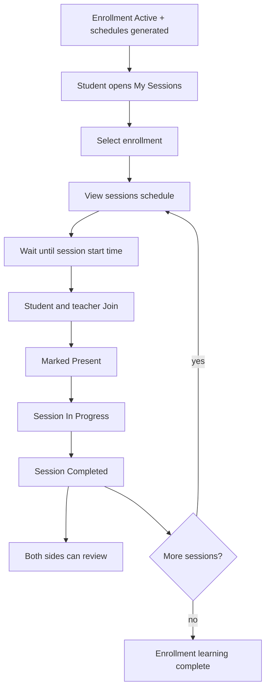

# Sessions Learning Flow

Flow-only description of how a student and teacher move through enrolled sessions after an enrollment is **Active**.

---

## 1. Prerequisites

1. Student is enrolled (Individual or Group).
2. Enrollment is **Active** (paid / free activated).
3. Course schedules exist for that enrollment (dated session rows).

Until Active, there is no live learning schedule to join.

---

## 2. Student — find sessions

1. Open **My Sessions**.
2. See list of **enrollments** (subscriptions / courses).
3. Tap one enrollment.
4. Open that enrollment’s **sessions schedule** (ordered session list: date, time, status).

Activity / enrollment detail may also show the same schedule; My Sessions is the dedicated learning entry.

---

## 3. Session start gate

1. Before the scheduled start time: **Join is blocked**.
2. At or after start, and before end, while status is Scheduled or In Progress: **Join is allowed**.
3. After end, Completed, Cancelled, or Rescheduled: **Join is rejected**.

---

## 4. Attendance (Join)

1. **Teacher** taps Join (CTA today; later stream open can call the same step).
   - Teacher is marked **Present**.
   - If still Scheduled → session becomes **In Progress**.
2. **Student** taps Join for the same session.
   - Student is marked **Present** on that session record.
3. Attendance is tied to the **session record**, not reinvented by clock alone (clock only gates Join).

If someone never joins and the session is later completed (manually or by sweeper), unmarked students default to **Absent**. Teacher may still override marks (Present / Late / Absent / Excused).

---

## 5. During the session

1. Session stays **In Progress**.
2. Teacher can attach content, notes, homework assign (product surfaces as available).
   - Attached **files and notes** are stored on the session record.
   - Both student and teacher can **preview** them inline and **download** them from the session detail screen — during the session and afterward (attachments persist post-Completion).
3. Live meeting / WebSocket stream is a later layer; Join remains the presence step.

---

## 6. End of session

1. Teacher ends / completes the session (or system auto-completes after end + grace).
2. Status → **Completed**.
3. Unmarked participants resolve to **Absent** (unless already marked).
4. Reviews unlock for this session.

---

## 7. Reviews (after Completed)

1. **Teacher → student:** rate / note per student for that session.
2. **Student → teacher:** submit rating + feedback for that session.
3. Reviews are visible immediately (no moderation wait for this path).

One student review per session toward that teacher.

### 7.1 Review display on the session detail screen (Completed sessions only)

| Side | Already submitted a review? | What shows |
|------|------------------------------|------------|
| Teacher's review of student | Yes | Rating + note, read-only |
| Teacher's review of student | No | "Rate student" action (teacher's own view only) |
| Student's review of teacher | Yes | Rating + feedback, read-only |
| Student's review of teacher | No | "Rate teacher" action (student's own view only) |

- Each side sees **both** existing reviews (their own submission and the other side's, once submitted).
- If a side hasn't reviewed yet, they see the rate action instead of an empty state — not a blank/hidden block.
- Once submitted, a review becomes read-only (edit/delete is out of this flow unless stated elsewhere).
- Review state (submitted / not yet submitted) is per session, per side — it does not carry over between sessions.

---

## 8. Loop

1. Return to the enrollment schedule.
2. Repeat Join → Complete → Review for the next session.
3. When all sessions are done, the enrollment’s learning schedule is finished; progress (attended / absent / completed) reflects those records.

---

## 9. Session detail screen — full field reference

Everything a student or teacher can see when they open a single session's detail (any status, not just Completed):

| Field | Applies from status | Notes |
|-------|----------------------|-------|
| Scheduled date & time | Always | From the generated schedule row |
| **Scheduled duration** | Always | Planned length (e.g. 45 min), set at schedule generation |
| **Actual duration** | In Progress / Completed | Derived from Join time → End/Complete time, once the session has actually started |
| Session status | Always | Scheduled / In Progress / Completed / Cancelled / Rescheduled |
| **Attendance status (per participant)** | Present: from Join onward · Absent/Late/Excused: resolved at Completion or set via teacher override | Present, Late, Absent, or Excused — teacher can override after the fact |
| Join button | Always | Enabled/disabled per the time-window rule (Section 3) |
| **Attached files & notes** | From when the teacher adds them (typically In Progress onward) | Previewable inline, downloadable, visible to both sides, persist after Completion |
| **Reviews block** | Completed only | Shows both sides' reviews if submitted, or a "Rate" action for the viewer's own missing review (Section 7.1) |

This section exists to give the frontend a single place to check what a session card/detail needs to render, independent of which step in the flow the user is currently on.

---

## Actors summary

| Actor | Flow role |
|--------|-----------|
| Student | My Sessions → enrollment → schedule → Join → review teacher |
| Teacher | Session list/detail → Join → run session → Complete → mark/override attendance → rate students |
| System | Blocks early Join; auto-completes overdue sessions; auto-Absents unmarked students |

---

## Out of this flow

- Creating / paying enrollments (see enrollment journey docs).
- Live video / WebSocket signaling.
- Homework submit & grade.
- Recurring billing / packages.
