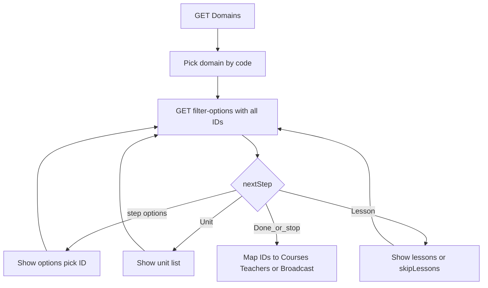
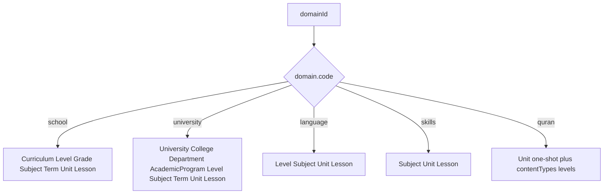

# Student filter-options — frontend guide

> **Audience:** Flutter / student app. Drive the education wizard once, reuse it for **Courses**, **Teachers**, and **OSR Broadcast**.
>
> Trees: [`EducationFilterService.cs`](../Qalam.Service/Implementations/EducationFilterService.cs) · Deep API samples: [`Education_Business_Logic.md`](../Qalam.Data/AppMetaData/docs/Education_Business_Logic.md) · University: [`university-multi-tenant-outline.md`](university-multi-tenant-outline.md) · OSR: [`S2-FLOW-AND-ENDPOINTS.md`](S2-FLOW-AND-ENDPOINTS.md)

---

## Frontend checklist

1. Login → send `Authorization: Bearer {token}` on every call below.
2. `GET /Education/Domains` → pick by **`code`**, store `domainId` + `code` (never hardcode ids).
3. One shared wizard state object; every `filter-options` call resends **all** selected ids.
4. Follow `nextStep` + `rule.*` — do not hardcode step order alone.
5. Stop at **Subject** for Courses/Teachers; continue to Unit/Lesson for Broadcast.
6. Map only the query/body fields each API accepts (§5). Reset **list** `pageNumber` to `1` when filters change.
7. Broadcast: **omit** `targetedTeacherId`.

---

## 1. Auth

| Call | Endpoint |
|------|----------|
| Domains | `GET /Api/V1/Education/Domains` |
| Wizard | `GET /Api/V1/Education/filter-options?...` |

```http
Authorization: Bearer {token}
```

Any logged-in role. Wizard is **stateless** (all ids in query string).

---

## 2. Shared wizard loop



**Client steps**

1. Load domains → user picks one → keep `domainId` + `code`.
2. Call `filter-options` with current state (+ paging only for Quran units — §6).
3. Render `options[]`, or `unit[]` / `contentTypes` / `levels` (Quran).
4. Append chosen id(s); call again.
5. Stop at consumer stop depth (§4) or `nextStep === "Done"`.

---

## 3. Domain trees

| `code` | Path |
|--------|------|
| `school` | Curriculum → Level → Grade → Subject → Term → Unit → Lesson? → Done |
| `university` | University → College → Department → AcademicProgram → Level → Subject → [Term?] (`skipTerm`) → Unit → Lesson? → Done |
| `language` | Level → Subject → Unit → Lesson? → Done |
| `skills` | Subject → Unit → Lesson? → Done |
| `quran` | One-shot `Unit`: auto `subject` + `contentTypes[]` + `levels[]` + **paginated** `unit[]` → Lesson? → Done |



**UI notes**

- Branch Quran with `code === "quran"`, not a fixed numeric id.
- University params: `universityId`, `collegeId`, `departmentId`, `academicProgramId`, `skipTerm`.
- Quran: `unitTypeCode` (`QuranPart` \| `QuranSurah`), `pageNumber` / `pageSize` for units; keep `quranContentTypeId` / `quranLevelId` in client state.
- After `contentUnitId`: pick `lessonIds[]` or `skipLessons=true` → Done.

**`rule` flags to drive UI:** `hasCurriculum`, `hasEducationLevel`, `hasGrade`, `hasUniversity`, `hasCollege`, `hasDepartment`, `hasAcademicProgram`, `hasAcademicTerm`, `academicTermOptional`, `hasContentUnits`, `hasLessons`, Quran requires*, `minSessions` / `maxSessions` / `defaultSessionDurationMinutes`.

---

## 4. Where to stop

| Domain | Courses / Teachers | OSR Broadcast |
|--------|--------------------|---------------|
| `school` | After Subject | Term → Unit → Lesson |
| `university` | After Subject (still walk institution path in wizard) | Term? → Unit → Lesson |
| `language` | After Subject | Unit → Lesson |
| `skills` | After Subject | Unit → Lesson |
| `quran` | Subject + optional Quran content/level (**Teachers** only; Courses has no Quran filters) | Units + Lesson; session fields |

---

## 5. Map IDs → APIs

### Accepted fields today

| API | Fields |
|-----|--------|
| `GET /Student/Courses` | `DomainId`, `CurriculumId`, `LevelId`, `GradeId`, `SubjectId`, `TeachingModeId`, `TeacherId`, **`PageNumber`**, **`PageSize`** |
| `GET /Student/Teachers` | `DomainId`, `SubjectId`, `LevelId`, `GradeId`, `QuranContentTypeId`, `QuranLevelId`, `Search`, `MinRating`, `SortBy`, **`PageNumber`**, **`PageSize`** |
| `POST /Student/OpenSessionRequests` | `domainId`, `subjectId`, optional `curriculumId`/`levelId`/`gradeId`/`termId`, `teachingModeId`, `sessions[]` — **no** `targetedTeacherId` |

### Per domain

| Domain | Courses | Teachers | Broadcast |
|--------|---------|----------|-----------|
| `school` | Domain + Curriculum + Level + Grade + Subject | Domain + Level + Grade + Subject (no Curriculum) | + `termId` + `sessions[].units[]` |
| `university` | Domain + Level + Subject | Same | Same + optional term + units |
| `language` | Domain + Level + Subject | Same | + units / lessons |
| `skills` | Domain + Subject | Same | + units / lessons |
| `quran` | Domain + Subject | + `QuranContentTypeId`, `QuranLevelId` | sessions: quran fields + units |

### Gap — university institution ids

Wizard collects `universityId` / `collegeId` / `departmentId` / `academicProgramId`. **List and create APIs do not accept them.** Pass `domainId` + `levelId` + `subjectId` only; keep institution ids client-side if needed for UI.

---

## 6. Pagination (frontend cases)

Three different paging surfaces. Do not mix them.

### 6.1 Summary

| Surface | Params | What is paged | Defaults / limits |
|---------|--------|---------------|-------------------|
| `filter-options` (Quran units) | `pageNumber`, `pageSize` | Only `unit[]` | Default `1` / `20`. `subject` / `contentTypes` / `levels` returned **in full every page** |
| `filter-options` (school / university / language / skills units) | Ignored for paging | All units in one response | Response often `pageNumber=1`, `pageSize=units.Count`, `totalPages=1` |
| `GET /Student/Courses` | `PageNumber`, `PageSize` | Course cards | Default `1` / `10`. Meta on response |
| `GET /Student/Teachers` | `PageNumber`, `PageSize` | Teacher cards | Default `1` / `10`; **max `PageSize` = 50** (clamped server-side) |
| OSR Broadcast create | — | No list paging | Quran **unit picker** still uses filter-options paging above |

### 6.2 filter-options — Quran units

```http
GET /Api/V1/Education/filter-options?domainId={quranId}&pageNumber=1&pageSize=20
GET /Api/V1/Education/filter-options?domainId={quranId}&pageNumber=2&pageSize=20
GET /Api/V1/Education/filter-options?domainId={quranId}&unitTypeCode=QuranSurah&pageNumber=1&pageSize=50
```

Response fields (on `data`): `unit[]`, `totalCount`, `pageNumber`, `pageSize`, `totalPages`.

| Case | What to do |
|------|------------|
| First open | `pageNumber=1`, `pageSize=20` (parts) or larger for surahs |
| Load next page | Same state + `pageNumber++`; **replace or append** `unit[]` only — do not clear subject/contentTypes/levels |
| Last page | `pageNumber === totalPages` → hide “Load more” |
| Empty units | `totalCount === 0` → empty state; keep filters |
| Switch Part ↔ Surah | Change `unitTypeCode` → **reset `pageNumber` to 1** |
| After picking a unit | Send `contentUnitId` (paging params no longer drive the list) |

### 6.3 filter-options — non-Quran Unit step

- Do **not** rely on `pageNumber`/`pageSize` for school/language/skills/university units — server returns the full unit list (`totalPages` typically `1`).
- Show all `unit[]` in one scrollable list (or client-side search), not server “next page”.

### 6.4 Courses list

```http
GET /Api/V1/Student/Courses?PageNumber=1&PageSize=10&DomainId=1&SubjectId=12
```

Meta (typical): `totalCount`, `pageNumber`, `pageSize`, `totalPages`, `hasPreviousPage`, `hasNextPage`.

| Case | What to do |
|------|------------|
| Initial / pull-to-refresh | `PageNumber=1` with current filters |
| Infinite scroll / next page | If `hasNextPage` (or `pageNumber < totalPages`) → `PageNumber++`, **keep all filter query params** |
| User changes domain/subject/… | **Reset `PageNumber=1`**, clear previous items, refetch |
| Empty page | `items.length === 0` and `totalCount === 0` → empty; if `pageNumber > 1` and empty, clamp back to last page or page 1 |
| Clear filters | Drop education query params, `PageNumber=1` |

### 6.5 Teachers list

```http
GET /Api/V1/Student/Teachers?PageNumber=1&PageSize=20&DomainId=3&SubjectId=42
```

| Case | What to do |
|------|------------|
| Same as Courses | Reset page on filter/search/sort change |
| `PageSize > 50` | Server clamps to **50** — UI should not offer larger |
| `PageSize < 1` | Server uses **10** |
| Search typing | Debounce; on each committed search → `PageNumber=1` |
| Quran filters | Changing `QuranContentTypeId` / `QuranLevelId` → `PageNumber=1` |

### 6.6 OSR Broadcast

- Create is a single `POST` — no pagination.
- During Broadcast content pick for **Quran**, use §6.2 unit paging.
- For other domains’ unit step, use §6.3 (full list).

### 6.7 Quick rules for FE

```
onFilterChange → pageNumber = 1; refetch
onLoadMore     → if hasNextPage: pageNumber++; append results
onUnitTypeChange (quran) → pageNumber = 1; replace unit[]
never page Courses/Teachers with filter-options pageNumber
never expect server paging for non-quran filter-options units
```

---

## 7. HTTP examples

### Wizard — school through subject

```http
GET /Api/V1/Education/filter-options?domainId=1&curriculumId=1&levelId=2&gradeId=5&subjectId=12
Authorization: Bearer {token}
```

### Courses — school (page 1)

```http
GET /Api/V1/Student/Courses?PageNumber=1&PageSize=10&DomainId=1&CurriculumId=1&LevelId=2&GradeId=5&SubjectId=12
Authorization: Bearer {token}
```

### Courses — next page (same filters)

```http
GET /Api/V1/Student/Courses?PageNumber=2&PageSize=10&DomainId=1&CurriculumId=1&LevelId=2&GradeId=5&SubjectId=12
Authorization: Bearer {token}
```

### Teachers — language

```http
GET /Api/V1/Student/Teachers?DomainId=3&LevelId=1&SubjectId=42&PageNumber=1&PageSize=20
Authorization: Bearer {token}
```

### Teachers — quran

```http
GET /Api/V1/Student/Teachers?DomainId=2&SubjectId=7&QuranContentTypeId=1&QuranLevelId=2&PageNumber=1&PageSize=20
Authorization: Bearer {token}
```

### Courses / Teachers — university (after Subject)

Institution ids stay client-side:

```http
GET /Api/V1/Student/Courses?DomainId=5&LevelId=10&SubjectId=20&PageNumber=1&PageSize=10
GET /Api/V1/Student/Teachers?DomainId=5&LevelId=10&SubjectId=20&PageNumber=1&PageSize=20
```

### Courses — skills

```http
GET /Api/V1/Student/Courses?DomainId=4&SubjectId=10&PageNumber=1&PageSize=10
```

### filter-options — Quran page 2

```http
GET /Api/V1/Education/filter-options?domainId=2&pageNumber=2&pageSize=20
Authorization: Bearer {token}
```

### Broadcast — school (omit targetedTeacherId)

```json
{
  "data": {
    "studentId": 1,
    "domainId": 1,
    "curriculumId": 1,
    "levelId": 2,
    "gradeId": 5,
    "subjectId": 12,
    "termId": 1,
    "teachingModeId": 1,
    "totalSessionsCount": 2,
    "sessions": [
      {
        "sequenceNumber": 1,
        "preferredDate": "2026-08-20",
        "timeSlotId": 3,
        "durationMinutes": 60,
        "units": [
          { "contentUnitId": 200, "includesAllLessons": true }
        ]
      }
    ]
  }
}
```

### Broadcast — quran

```json
{
  "data": {
    "studentId": 1,
    "domainId": 2,
    "subjectId": 7,
    "teachingModeId": 1,
    "totalSessionsCount": 1,
    "sessions": [
      {
        "sequenceNumber": 1,
        "preferredDate": "2026-08-21",
        "timeSlotId": 2,
        "durationMinutes": 60,
        "quranContentTypeId": 1,
        "quranLevelId": 2,
        "units": [
          { "contentUnitId": 501, "includesAllLessons": true }
        ]
      }
    ]
  }
}
```

### Broadcast — university

```json
{
  "data": {
    "studentId": 1,
    "domainId": 5,
    "levelId": 10,
    "subjectId": 20,
    "teachingModeId": 1,
    "totalSessionsCount": 1,
    "sessions": [
      {
        "sequenceNumber": 1,
        "preferredDate": "2026-08-22",
        "timeSlotId": 1,
        "durationMinutes": 60,
        "units": [
          { "contentUnitId": 300, "includesAllLessons": true }
        ]
      }
    ]
  }
}
```

---

## 8. OSR Broadcast notes

- **Broadcast** = omit `targetedTeacherId`. Targeted = see [S2 §6](S2-FLOW-AND-ENDPOINTS.md#6-targeted-teacher-wizard-screen--endpoint-map).
- Matching is **subject-based** today (institution/level/grade not used).
- Also: `GET /Teaching/Modes`, `GET /Teaching/TimeSlots`; content via filter-options or `/Content/Units` / `/Content/Lessons` — [S2 §4](S2-FLOW-AND-ENDPOINTS.md#4-backend-api--supporting-wizard), [§7](S2-FLOW-AND-ENDPOINTS.md#7-publish-contract).

---

## 9. Code anchors

| Layer | Path |
|-------|------|
| Wizard | `Qalam.Service/Implementations/EducationFilterService.cs` |
| Education API | `Qalam.Api/Controllers/Education/EducationController.cs` |
| Courses | `Qalam.Api/Controllers/Student/StudentCourseController.cs` |
| Teachers | `Qalam.Api/Controllers/Student/StudentTeacherController.cs` |
| OSR | `Qalam.Api/Controllers/Student/StudentOpenSessionRequestController.cs` |
| Create DTO | `Qalam.Data/DTOs/OpenSessionRequests/OpenSessionRequestDtos.cs` |
| Filter state | `Qalam.Data/DTOs/FilterStateDto.cs` |

---

_Last updated: 2026-08-05._
