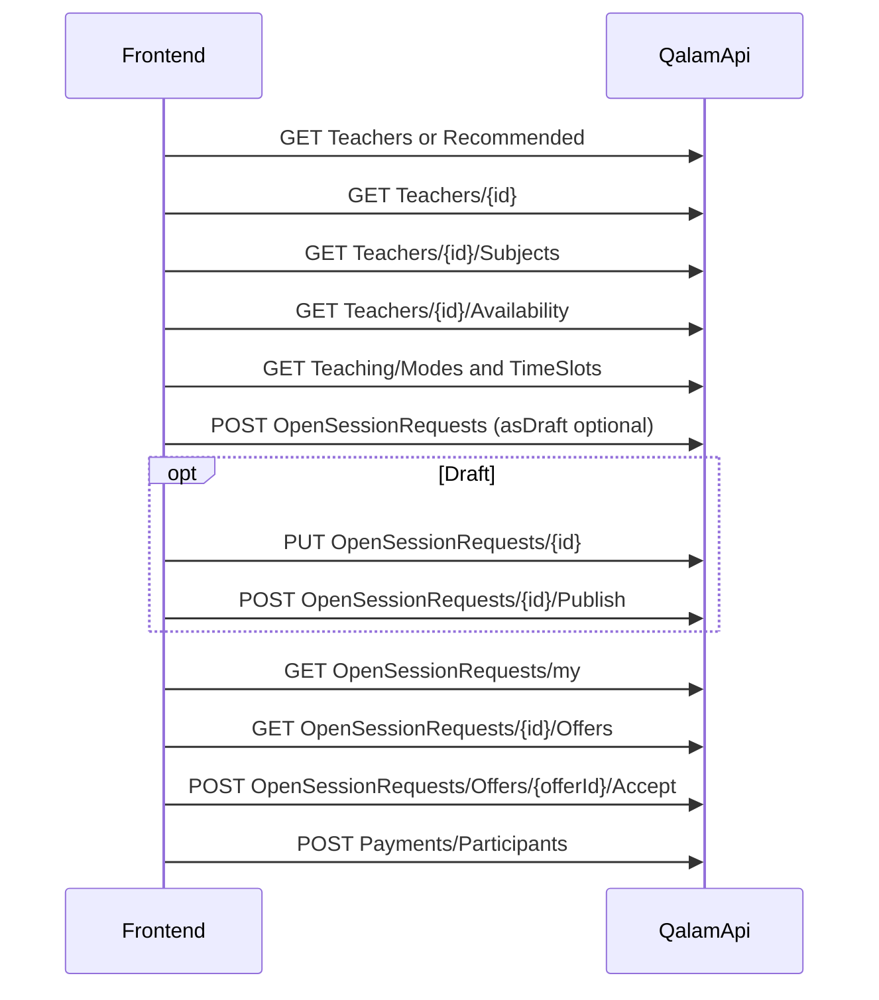

# Student request teacher — backend API (for frontend)

> **Audience:** Frontend (student app / web)  
> **Feature:** Open Session Request / Scenario 2 — discover a teacher and publish a session request  
> **Base path:** `/Api/V1`  
> **Source of truth:** controllers + DTOs in this repo (code wins over older BRDs)

**Related:** [S2 flow & endpoints](S2-FLOW-AND-ENDPOINTS.md) · [Scenario 2 user stories](USER-STORIES-Scenario-2.md) · [Teacher subject units (FE)](Teacher-Subject-Units-Frontend.md)

---

## 1. Purpose and backend verdict

Students can **browse teachers**, load **profile / subjects / availability**, and **publish** an Open Session Request (broadcast or targeted). Teachers then receive the request, may submit offers, and can chat.

| Area | Backend status |
|------|----------------|
| Teacher discovery (list, recommended, details, subjects, availability, reviews, certificates) | **Implemented** |
| Create / list / detail / cancel request + attachments + invite response | **Implemented** |
| Draft save (`asDraft`) + Publish | **Implemented** |
| Matching + teacher notify + teacher offers + offer expiry | **Implemented** |
| Offer conversation (HTTP) | **Implemented** |
| Student list / detail / accept / reject offers | **Implemented** |
| Payment + enrollment + schedules from accepted offer | **Implemented** (`POST /Student/Payments/Participants`) |
| Request auto-expiry (`ExpiresAt` → `Expired`) | **Implemented** |

Frontend can build discovery → draft/publish → list offers → accept → pay → schedules.

### Broadcast vs targeted

| Path | `targetedTeacherId` | Behavior |
|------|---------------------|----------|
| **Broadcast** | omit / `null` | Matching notifies qualified teachers |
| **Targeted** | set to teacher `id` | Skips broadcast; validates that teacher for subject/units |

---

## 2. Auth and response envelope

| | |
|--|--|
| **Roles (student teacher + OSR APIs)** | `Student`, `Guardian` |
| **JWT** | Required |
| **JSON** | camelCase; enums as **strings** (`JsonStringEnumConverter`) |

Typical success envelope:

```json
{
  "statusCode": 200,
  "succeeded": true,
  "message": "...",
  "data": { },
  "errors": null,
  "meta": null
}
```

List endpoints often put pagination in `meta`:

```json
{
  "totalCount": 42,
  "pageNumber": 1,
  "pageSize": 10,
  "totalPages": 5,
  "hasPreviousPage": false,
  "hasNextPage": true
}
```

Command bodies for OSR create/cancel/invite wrap the DTO in `data` (see examples below). Attachments use multipart (no `data` wrapper).

---

## 3. Frontend API sequence (targeted request)



Optional: Reviews / Certificates for display only. Reject via `POST .../Offers/{offerId}/Reject`.

---

## 4. Teacher discovery APIs

Controller: [`StudentTeacherController`](../Qalam.Api/Controllers/Student/StudentTeacherController.cs)  
Availability: [`StudentCourseController.GetTeacherAvailabilityByRange`](../Qalam.Api/Controllers/Student/StudentCourseController.cs)

All routes below require **Student** or **Guardian**.

### 4.1 List teachers

`GET /Student/Teachers`

| Query | Type | Default | Notes |
|-------|------|---------|--------|
| `subjectId` | int? | — | |
| `domainId` | int? | — | |
| `levelId` | int? | — | |
| `gradeId` | int? | — | |
| `quranContentTypeId` | int? | — | |
| `quranLevelId` | int? | — | |
| `location` | string enum? | — | `InsideSaudiArabia` \| `OutsideSaudiArabia` |
| `minRating` | decimal? | — | |
| `search` | string? | — | |
| `sortBy` | string | `Rating` | `Rating` \| `Newest` \| `NameAsc` |
| `pageNumber` | int | `1` | |
| `pageSize` | int | `10` | max 50 |

**`data`:** `TeacherCardDto[]`

| Field | Type |
|-------|------|
| `id` | int — use as `targetedTeacherId` |
| `userId` | int? |
| `fullName` | string |
| `profilePictureUrl` | string? |
| `bio` | string? |
| `ratingAverage` | number |
| `reviewsCount` | int |
| `location` | string enum? |
| `subjects` | preview ≤5 → `subjectId`, `subjectNameAr/En`, `domainId`, `domainCode`, `canTeachFullSubject`, `unitsCount` |

### 4.2 Recommended teachers

`GET /Student/Teachers/Recommended`

| Query | Type | Default | Notes |
|-------|------|---------|--------|
| `studentId` | int | caller’s student | Guardians without own student profile must pass child id |
| `take` | int? | `8` | |

**`data`:** same `TeacherCardDto[]`. Narrowed by student domain/level/grade.

### 4.3 Teacher details (profile)

`GET /Student/Teachers/{teacherId}`

**`data`:** `StudentTeacherProfileDto`

| Field | Type |
|-------|------|
| `id` | int |
| `userId` | int? |
| `fullName` | string |
| `profilePictureUrl` | string? |
| `bio` | string? |
| `ratingAverage` | number |
| `reviewsCount` | int |
| `location` | string enum? |
| `studentsCount` | int |
| `coursesCount` | int |
| `subjectsCount` | int |
| `subjects` | same card subject shape (preview; **no units**) |

404 if teacher missing/inactive.

### 4.4 Teacher subjects (+ units)

`GET /Student/Teachers/{teacherId}/Subjects`

**`data`:** `StudentTeacherSubjectDto[]` — subject pick list for create (`subjectId` / `domainId`)

| Field | Type |
|-------|------|
| `teacherSubjectId` | int → **Units** endpoint path (TeacherSubject.Id) |
| `subjectId` | int → create `subjectId` |
| `subjectNameAr` / `subjectNameEn` | string |
| `domainId` | int? → create `domainId` |
| `domainCode` | string? |
| `canTeachFullSubject` | bool |
| `units[]` | preview only when partial; may be **empty** when `canTeachFullSubject` |

**Unit preview (`StudentTeacherSubjectUnitDto`) on Subjects:**

| Field | Type |
|-------|------|
| `unitId` | int |
| `unitNameAr` / `unitNameEn` | string |
| `unitTypeCode` | string? |
| `quranContentTypeId` / names | for Quran |
| `quranLevelId` / names | for Quran |

Only **approved + active** teacher subjects are returned.

For session content pickers, always load repertoire via **§4.4b** using `teacherSubjectId` (do not use `GET /Content/Units?subjectId=`).

### 4.4b Teacher subject units (repertoire)

`GET /Student/Teachers/{teacherId}/Subjects/{teacherSubjectId}/Units`

Resolves allowed units through `ITeacherSubjectRepertoireService`:

- `canTeachFullSubject === true` → all active catalog units for that TeacherSubject’s subject
- otherwise → saved `TeacherSubjectUnits` only

404 if teacher inactive or TeacherSubject missing / not approved for that teacher.

**`data`:** `TeacherSubjectUnitOptionDto[]`

| Field | Type |
|-------|------|
| `id` | int → create `sessions[].units[].contentUnitId` |
| `nameAr` / `nameEn` | string |
| `quranContentTypeId` / `quranLevelId` | int? (when set on repertoire row) |

### 4.5 Teacher availability (calendar)

`GET /Student/Teachers/{teacherId}/Availability`

| Query | Type | Default | Notes |
|-------|------|---------|--------|
| `fromDate` | date (`YYYY-MM-DD`) | today | |
| `toDate` | date | from+30d | capped at from+90d; must be ≥ fromDate |

**`data`:** `TeacherAvailabilityByWeekdayRangeDto`

| Field | Type |
|-------|------|
| `teacherId` | int |
| `fromDate` / `toDate` | date |
| `weekdays[]` | weekday groups |

**Weekday:** `dayOfWeekId`, `dayNameEn`, `slots[]`  
**Slot:** `teacherAvailabilityId`, `timeSlotId`, `startTime`, `endTime`, `durationMinutes`, `labelEn`, `dates[]`  
**Date status:** `date`, `status` ∈ `Free` \| `Booked` \| `Blocked` \| `Past`

**Important for Open Session Request create:**

- Use dates with `status === "Free"`.
- Map into create as `sessions[].preferredDate` + `sessions[].timeSlotId` (+ optional `durationMinutes`).
- Create DTO does **not** take `teacherAvailabilityId` (that id is for **course enrollment** booking, not OSR).

### 4.6 Reviews

`GET /Student/Teachers/{teacherId}/Reviews?pageNumber=1&pageSize=10`

**`data`:** `{ id, rating, feedback, studentDisplayName, createdAt }[]` + pagination `meta`  
Display only for request-teacher.

### 4.7 Certificates

`GET /Student/Teachers/{teacherId}/Certificates?take=10`

**`data`:** `{ id, title, issuer, issueDate, fileUrl }[]`  
`take` default 10 (valid 1–50). Display only.

### 4.8 Mapping discovery → create

| Create field | Source |
|--------------|--------|
| `targetedTeacherId` | card/profile `id` |
| `subjectId` / `domainId` | **Subjects** endpoint (not card preview alone) |
| `sessions[].units[].contentUnitId` | **Units** `id` (`GET .../Subjects/{teacherSubjectId}/Units`) |
| `sessions[].quranContentTypeId` / `quranLevelId` | Units / Subjects unit Quran fields when domain is Quran |
| `sessions[].preferredDate` | Availability Free `dates[].date` |
| `sessions[].timeSlotId` | Availability slot `timeSlotId` |
| `sessions[].durationMinutes` | Availability `durationMinutes` (create default 60) |
| `teachingModeId` | `GET /Teaching/Modes` |

---

## 5. Supporting catalogs

Any authenticated role (`[Authorize]`).

| Method | Path | Used by create? |
|--------|------|-----------------|
| GET | `/Teaching/Modes?pageNumber&pageSize&search` | **Yes** → `teachingModeId` |
| GET | `/Teaching/TimeSlots?pageNumber&pageSize&activeOnly` | **Yes** → `sessions[].timeSlotId` (prefer `activeOnly=true`) |
| GET | `/Teaching/SessionTypes?...` | No (catalog only) |
| GET | `/Teaching/DaysOfWeek?...` | No |

Seeded modes include `in_person`, `online`.

---

## 6. Open Session Request APIs

Controller: [`StudentOpenSessionRequestController`](../Qalam.Api/Controllers/Student/StudentOpenSessionRequestController.cs)  
Roles: **Student**, **Guardian**.

### 6.1 Create / publish

`POST /Student/OpenSessionRequests`

Body: `{ "data": { ...CreateOpenSessionRequestDto } }`

#### Root fields

| Property | Type | Required | Notes |
|----------|------|----------|--------|
| `studentId` | int | **Yes** | Learner `Student.Id` (> 0) |
| `domainId` | int | **Yes** | |
| `subjectId` | int | **Yes** | |
| `curriculumId` | int? | No | |
| `levelId` | int? | No | |
| `gradeId` | int? | No | |
| `termId` | int? | No | |
| `teachingModeId` | int | **Yes** | From `/Teaching/Modes` |
| `targetedTeacherId` | int? | No | Targeted path |
| `groupType` | `OpenGroup` \| `InviteOnly`? | No | Not strictly validated today |
| `totalSessionsCount` | int | **Yes** | 1–50; must equal `sessions.length` |
| `studentNotes` | string? | No | max 1000 |
| `expiresAt` | datetime? | No | default ~published+7d; if set ~1–30 days from now |
| `sessions` | array | **Yes** | non-empty |
| `invitedStudentIds` | int[] | No | max 5, unique, not self → status `PendingInvitations` |

#### Session fields

| Property | Type | Required | Notes |
|----------|------|----------|--------|
| `sequenceNumber` | int | **Yes** | unique within request |
| `preferredDate` | date | **Yes** | ≥ today (UTC date rules) |
| `timeSlotId` | int | **Yes** | catalog TimeSlot id |
| `durationMinutes` | int | No (default **60**) | 15–360 |
| `quranContentTypeId` | int? | Cond. | required when domain name contains `"quran"` |
| `quranLevelId` | int? | Cond. | same |
| `notes` | string? | No | max 500 |
| `units` | array | No | |

#### Unit fields

| Property | Type | Required | Notes |
|----------|------|----------|--------|
| `contentUnitId` | int? | XOR | exactly one of `contentUnitId` / `lessonId` |
| `lessonId` | int? | XOR | |
| `includesAllLessons` | bool | No | stored; **not** returned on detail unit DTO |

#### Example (targeted)

```json
{
  "data": {
    "studentId": 5,
    "domainId": 1,
    "subjectId": 12,
    "teachingModeId": 1,
    "targetedTeacherId": 42,
    "totalSessionsCount": 2,
    "studentNotes": "Prefers evenings.",
    "invitedStudentIds": [],
    "sessions": [
      {
        "sequenceNumber": 1,
        "preferredDate": "2026-08-10",
        "timeSlotId": 3,
        "durationMinutes": 60,
        "units": [{ "contentUnitId": 115, "includesAllLessons": true }]
      },
      {
        "sequenceNumber": 2,
        "preferredDate": "2026-08-12",
        "timeSlotId": 3,
        "durationMinutes": 60,
        "units": []
      }
    ]
  }
}
```

**`data` response:** `OpenSessionRequestDetailDto` (see §6.3).

Initial status:

- `asDraft: true` → `Draft` (no matching)
- invitations present → `PendingInvitations`
- otherwise → `Active`

### 6.1b Update draft

`PUT /Student/OpenSessionRequests/{id}`

Body: same shape as create (`{ "data": { ... } }`). Only while status is `Draft`. Does **not** run matching.

### 6.1c Publish draft

`POST /Student/OpenSessionRequests/{id}/Publish`

Draft → `Active` or `PendingInvitations`, sets `PublishedAt`, runs matching / targeted notify when Active.

### 6.2 My requests (list)

`GET /Student/OpenSessionRequests/my`

| Query | Type | Default |
|-------|------|---------|
| `status` | enum string? | — |
| `pageNumber` | int | 1 |
| `pageSize` | int | 20 |

**`data`:** `OpenSessionRequestListItemDto[]`

| Field | Type |
|-------|------|
| `id` | int |
| `studentId` | int |
| `studentName` | string? |
| `subjectId` / `subjectName` | |
| `teachingModeId` / `teachingModeName` | |
| `groupType` | enum? |
| `status` | enum string |
| `totalSessionsCount` | int |
| `offersCount` | int |
| `targetedTeacherId` / `targetedTeacherName` | |
| `publishedAt` / `expiresAt` / `createdAt` | |

### 6.3 Detail

`GET /Student/OpenSessionRequests/{id}`

Accessible to owner/guardian or invitee.

**`data`:** `OpenSessionRequestDetailDto` — list fields plus:

| Field | Notes |
|-------|--------|
| `requestedByUserId` | |
| `createdByGuardianId` / `createdByGuardianName` | |
| `domainId` / `domainName` | |
| `curriculumId`, `levelId`, `gradeId`, `termId` | |
| `cancelledAt`, `cancellationReason` | |
| `studentNotes` | |
| `sessions[]` | `id`, `sequenceNumber`, `preferredDate`, `timeSlotId`, `durationMinutes`, Quran ids, `notes`, `units[]` |
| `units[]` on session | `id`, `contentUnitId`, `lessonId` only |
| `invitations[]` | `id`, `invitedStudentId`, names, `status`, `respondedAt` |
| `attachments[]` | see §6.5 |
| `offersCount` | count only — use §6.7 for offer cards |

### 6.4 Cancel

`POST /Student/OpenSessionRequests/{id}/Cancel`

Allowed statuses: `Draft`, `PendingInvitations`, `Active`, `ReceivingOffers`.  
Pending teacher offers are withdrawn.

```json
{ "data": { "reason": "Changed plans" } }
```

`reason` optional. Empty `{ "data": {} }` is fine.

### 6.5 Attachments

| Method | Path |
|--------|------|
| POST | `/Student/OpenSessionRequests/{id}/Attachments` |
| DELETE | `/Student/OpenSessionRequests/{id}/Attachments/{attachmentId}` |

| Rule | Value |
|------|--------|
| Content-Type | `multipart/form-data` |
| Form field | `file` |
| Types | `.pdf`, `.doc`, `.docx`, `.png`, `.jpg`, `.jpeg` |
| Max size | 25 MB |
| Max count | 10 per request |
| Editable statuses | same as cancel |

Upload is queued to OSS; `publicUrl` may appear immediately from configured base URL.

Attachment DTO: `id`, `fileName`, `contentType`, `fileSizeBytes`, `publicUrl`, `createdAt`.

### 6.6 Invitation response (members)

`POST /Student/OpenSessionRequests/{openSessionRequestId}/Members/Response`

```json
{
  "data": {
    "studentId": 55,
    "decision": "Accepted"
  }
}
```

`decision`: `Accepted` \| `Rejected` only.  
Adult invitee = invited student; minor = linked guardian.

### 6.7 Student offers (list / detail)

| Method | Path |
|--------|------|
| GET | `/Student/OpenSessionRequests/{id}/Offers` |
| GET | `/Student/OpenSessionRequests/{id}/Offers/{offerId}` |

Owner/guardian only. Excludes `Withdrawn`.

**List item:** `id`, `sessionRequestId`, `teacherId`, `teacherName`, `profilePictureUrl`, `ratingAverage`, `reviewsCount`, `isVerified`, `price`, `status`, `version`, `teacherNotes`, `expiresAt`, `createdAt`, `conversationId`.

**Detail:** list fields + `acceptedAt` / `rejectedAt` / `withdrawnAt` / `expiredAt`, `rejectionReason`, `subjectId`, `subjectName`, `totalSessionsCount`, `bio`, `subjectTags[]`, `sessionDurationMinutes`, `recentReviews[]` (`id`, `rating`, `feedback`, `studentDisplayName`, `createdAt` — top 2 approved).

Frontend screen map (card + Review Request): [`STUDENT-OFFER-CARD-REVIEW.md`](STUDENT-OFFER-CARD-REVIEW.md).

### 6.8 Accept / reject offer

| Method | Path | Result |
|--------|------|--------|
| POST | `/Student/OpenSessionRequests/Offers/{offerId}/Accept` | Creates `PendingPayment` enrollment |
| POST | `/Student/OpenSessionRequests/Offers/{offerId}/Reject` | Rejects one pending offer |

**Accept / reject** guards: offer `Pending` and not past `expiresAt`; request `Active` \| `ReceivingOffers`. Sibling pending offers on accept → `AutoRejected`. Request → `OfferAccepted` then `PaymentPending`.

Accept fails with **400** if a session cannot resolve to the teacher's weekly `TeacherAvailability` (same `timeSlotId` + weekday as `preferredDate`).

```json
// Accept response data
{
  "offerId": 10,
  "enrollmentId": 55,
  "participantId": 90,
  "amountDue": 250.00,
  "paymentDeadline": "2026-08-03T12:00:00Z",
  "requestStatus": "PaymentPending"
}
```

Pay with existing: `POST /Student/Payments/Participants` `{ "data": { "participantId": 90 } }`.  
On success for SessionRequest enrollments: generates `CourseSchedule`s; request → `Paid` then `Scheduled`.

Reject body (optional): `{ "data": { "reason": "Too expensive" } }`.

---

## 7. Conversations (after request exists)

Shared namespace: `/Conversations/...`  
Student may use when they are the request owner (`RequestedByUserId`).

| Method | Path | Notes |
|--------|------|--------|
| GET | `/Conversations/by-request/{requestId}/teacher/{teacherId}` | Find/create conversation for that pair |
| GET | `/Conversations/{conversationId}/messages` | Query: `cursor?`, `take=50`, `direction=older\|newer` |
| POST | `/Conversations/{conversationId}/messages` | `{ "content": "..." }` |
| POST | `/Conversations/{conversationId}/read` | `{ "upToMessageId": 123 }` optional |

Conversation DTO includes `conversationId`, `offerId` (0 if no offer yet), participants, unread, etc.

Teacher inbox / create-offer APIs are documented in [S2-FLOW-AND-ENDPOINTS.md](S2-FLOW-AND-ENDPOINTS.md) — not required for the student publish wizard.

---

## 8. Status enums (frontend-facing)

### `OpenSessionRequestStatus`

| Value | Name | Set by backend today? |
|------:|------|------------------------|
| 1 | `Draft` | **Yes** (`asDraft` / update draft) |
| 2 | `PendingInvitations` | **Yes** |
| 3 | `Active` | **Yes** |
| 4 | `ReceivingOffers` | **Yes** (first teacher offer) |
| 5 | `OfferAccepted` | **Yes** (accept, brief) |
| 6 | `PaymentPending` | **Yes** (after accept) |
| 7 | `Paid` | **Yes** (on payment, then Scheduled) |
| 8 | `Scheduled` | **Yes** (after payment schedules) |
| 9 | `InProgress` | No |
| 10 | `Completed` | No |
| 11 | `Cancelled` | **Yes** |
| 12 | `Expired` | **Yes** (request expiry job) |

### `OpenSessionOfferStatus` (teacher side; for UI awareness)

| Value | Name | Set today? |
|------:|------|------------|
| 1 | `Pending` | Yes |
| 2 | `Accepted` | **Yes** |
| 3 | `Rejected` | **Yes** |
| 4 | `AutoRejected` | **Yes** (siblings on accept) |
| 5 | `Withdrawn` | Yes |
| 6 | `Expired` | Yes (offer expiry job) |

### Invitation / group

- `OpenSessionRequestInvitationStatus`: `Pending`, `Accepted`, `Rejected`, `Expired`
- `OfferGroupType`: `OpenGroup`, `InviteOnly`

---

## 9. Formerly gaps (now implemented)

| Capability | Status |
|------------|--------|
| Student list offers on a request | **Done** — `GET .../{id}/Offers` |
| Student accept / reject offer | **Done** |
| Auto-reject other offers on accept | **Done** |
| Payment after accept (S2) | **Done** — reuse `POST /Student/Payments/Participants` |
| Create enrollment + schedules from offer | **Done** |
| Request auto-expiry → `Expired` | **Done** — `OpenSessionRequestExpirationService` |
| Server-side wizard draft API | **Done** — `asDraft` + PUT + Publish |

---

## 10. Quick endpoint index

### Discovery

| Method | Path |
|--------|------|
| GET | `/Student/Teachers` |
| GET | `/Student/Teachers/Recommended` |
| GET | `/Student/Teachers/{teacherId}` |
| GET | `/Student/Teachers/{teacherId}/Subjects` |
| GET | `/Student/Teachers/{teacherId}/Availability` |
| GET | `/Student/Teachers/{teacherId}/Reviews` |
| GET | `/Student/Teachers/{teacherId}/Certificates` |
| GET | `/Teaching/Modes` |
| GET | `/Teaching/TimeSlots` |

### Open Session Request

| Method | Path |
|--------|------|
| POST | `/Student/OpenSessionRequests` |
| PUT | `/Student/OpenSessionRequests/{id}` |
| POST | `/Student/OpenSessionRequests/{id}/Publish` |
| GET | `/Student/OpenSessionRequests/my` |
| GET | `/Student/OpenSessionRequests/{id}` |
| GET | `/Student/OpenSessionRequests/{id}/Offers` |
| GET | `/Student/OpenSessionRequests/{id}/Offers/{offerId}` |
| POST | `/Student/OpenSessionRequests/Offers/{offerId}/Accept` |
| POST | `/Student/OpenSessionRequests/Offers/{offerId}/Reject` |
| POST | `/Student/OpenSessionRequests/{id}/Cancel` |
| POST | `/Student/OpenSessionRequests/{id}/Attachments` |
| DELETE | `/Student/OpenSessionRequests/{id}/Attachments/{attachmentId}` |
| POST | `/Student/OpenSessionRequests/{openSessionRequestId}/Members/Response` |

### Payment (S2 after accept)

| Method | Path |
|--------|------|
| POST | `/Student/Payments/Participants` |

### Chat

| Method | Path |
|--------|------|
| GET | `/Conversations/by-request/{requestId}/teacher/{teacherId}` |
| GET | `/Conversations/{conversationId}/messages` |
| POST | `/Conversations/{conversationId}/messages` |
| POST | `/Conversations/{conversationId}/read` |
