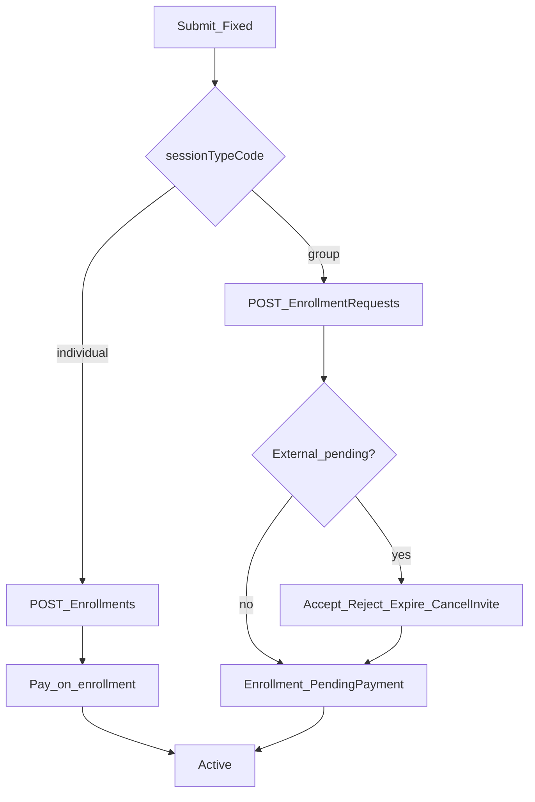
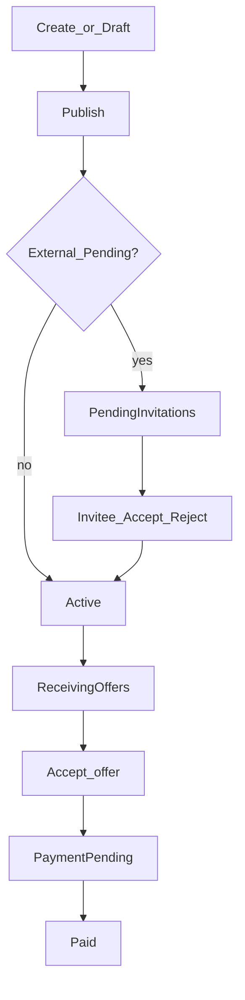

# Student Enrollment, Invitations & Open Session Requests — Frontend Guide

Self-contained API contract for the **student / guardian** app. Auth: Bearer token with role **Student** and/or **Guardian**. Base path prefix: `/Api/V1`.

---

## 1. Canonical rules

| Rule | Detail |
|------|--------|
| **S1 courses** | **Fixed only** (predefined sessions). Branch by course `sessionTypeCode`: `individual` vs `group`. |
| **Individual (S1)** | `POST /Student/Enrollments` — creates **Enrollment** directly (no request row). |
| **Group (S1)** | `POST /Student/EnrollmentRequests` — always a request; Fixed auto-**Approved** on submit. |
| **Owned learners** | Caller’s adult self and/or guardian children. Auto-confirmed / auto-accepted — **no Accept UI**. |
| **External invitees** | Must Accept/Reject (or expire). Appear in **Invitations** inbox for the invitee adult or **that child’s guardian**. |
| **Single payer** | Only the **owner** (request creator / `OwnerUserId`) pays **full** `amountDue` **once**. Invitees never pay. |
| **Invite deadline** | Default **48 hours** from invite `createdAt`. List exposes `respondByUtc`. After deadline → respond returns **400**; server expires invites. |
| **Child login** | Does **not** see invites to themselves; guardian manages those. |
| **Owner inbox** | Owners see **one row per sent request** in `GET /Invitations` (`isOwner: true`). Invitees see received invites. Both are filtered by `scope=Active|Archived`. |
| **OSR** | Session request (no course catalog book). Same ownership / pay / invite visibility as Group S1. |

### Actors

| Actor | Can |
|-------|-----|
| **Owner** | Create enrollment/request/OSR; cancel before pay; cancel pending invites (S1); pay full amount |
| **Invitee (adult)** | Accept/Reject own invite; **no Pay** |
| **Guardian of invited child** | Accept/Reject that child’s invite; **no Pay** |
| **Child account** | No invite inbox for self; cannot respond to own invite |

---

## 2. S1 — Course enrollment

### Branching

1. Load course detail → read `sessionTypeCode`.
2. `individual` → book with `POST /Student/Enrollments`.
3. `group` → book with `POST /Student/EnrollmentRequests` (never Enrollments).
4. Wrong path → **400**.



### Endpoints

| Method | Path | Notes |
|--------|------|-------|
| POST | `/Student/Enrollments` | **Individual only.** Returns `id`, `enrollmentStatus`, `amountDue`, `paymentDeadline`, `payParticipantId`, `canPay`. Free (`amountDue <= 0`) → often **Active** immediately. |
| GET | `/Student/Enrollments` | Enrollments where **at least one participant** is an owned learner (caller’s adult self and/or guardian children). Omit `StudentId` → all owned; pass `StudentId` to scope to one. `enrolledStudents` lists only those owned participants. Includes CourseRequest and SessionRequest (OSR) sources once an enrollment exists. |
| GET | `/Student/Enrollments/{id}` | Owner or participant. Flags: `isOwner`, `canPay`, `canCancel`, `amountDue`, `paymentDeadline`, `payParticipantId`. |
| POST | `/Student/Enrollments/{id}/Cancel` | Owner; **PendingPayment** only. |
| POST | `/Student/EnrollmentRequests` | **Group only.** Fixed → Approved. `proposedSessions` must be `[]`. |
| GET | `/Student/EnrollmentRequests` | Paginated my requests (`pageNumber`, `pageSize`; meta in response). |
| GET | `/Student/EnrollmentRequests/{id}` | Owner **or** invitee/guardian. Flags: `isOwner`, `canPay`, `canCancel`, `canCancelInvite`, `actionableMemberStudentIds`, `enrollmentId`, `enrollmentStatus`, `amountDue`, `paymentDeadline`, `payParticipantId`. |
| POST | `/Student/EnrollmentRequests/{id}/Cancel` | Owner; cancels request + unpaid enrollment; pending invites → Cancelled. |
| POST | `/Student/EnrollmentRequests/{enrollmentRequestId}/Members/Response` | Invitee respond. |
| POST | `/Student/EnrollmentRequests/{enrollmentRequestId}/Members/{studentId}/Cancel` | Owner cancels one pending invite. |

### Group body fields

| Field | Meaning |
|-------|---------|
| `studentIds` | Owned learners (self/children). Empty/`[]` → enroll caller’s own student only. Auto-**Confirmed**. |
| `invitedStudentIds` | External — Pending until Accept/Reject/expire/owner-cancel. |
| `selectedSessionSlots` | Per course session: `sessionNumber`, `teacherAvailabilityId`, `date`. |
| `proposedSessions` | Must be `[]` for Fixed. |

### Sample — Individual Fixed book

```http
POST /Api/V1/Student/Enrollments
Authorization: Bearer <token>
Content-Type: application/json
```

```json
{
  "data": {
    "courseId": 1,
    "studentIds": [],
    "invitedStudentIds": [],
    "selectedSessionSlots": [
      { "sessionNumber": 1, "teacherAvailabilityId": 26, "date": "2026-05-03" },
      { "sessionNumber": 2, "teacherAvailabilityId": 27, "date": "2026-05-10" }
    ],
    "notes": "Prefers evenings.",
    "proposedSessions": []
  }
}
```

`studentIds: []` → enroll caller’s own student. Do not use this endpoint for Group courses.

### Sample — Group Fixed with owned + external

```http
POST /Api/V1/Student/EnrollmentRequests
Authorization: Bearer <token>
Content-Type: application/json
```

```json
{
  "data": {
    "courseId": 7,
    "studentIds": [42],
    "invitedStudentIds": [55, 61],
    "selectedSessionSlots": [
      { "sessionNumber": 1, "teacherAvailabilityId": 26, "date": "2026-05-03" },
      { "sessionNumber": 2, "teacherAvailabilityId": 26, "date": "2026-05-10" }
    ],
    "notes": null,
    "proposedSessions": []
  }
}
```

- Owned `42` → Confirmed immediately.
- External `55`, `61` → Pending invites (inbox for invitee adult / child’s guardian).
- Enrollment created when **no Invited is still Pending** and ≥1 member is **Confirmed**.

### Sample — S1 respond to invite

```http
POST /Api/V1/Student/EnrollmentRequests/123/Members/Response
Authorization: Bearer <token>
Content-Type: application/json
```

```json
{
  "data": {
    "studentId": 55,
    "decision": "Confirmed"
  }
}
```

`decision`: `Confirmed` | `Rejected` (and cancel path uses owner Cancel endpoint). After deadline → **400**.

### CTA matrix (S1)

**Enrollment detail**

| State | Owner | Non-owner |
|-------|-------|-----------|
| PendingPayment | **Pay** + **Cancel** (`canCancel`) | Read-only |
| Active / Cancelled | Read-only | Read-only |

**Request detail (Group)**

| State | Owner | Invitee side |
|-------|-------|----------------|
| Pending invites | Cancel invite(s); **Cancel request**; **no Pay** | Accept / Reject |
| PendingPayment | Pay (`canPay`); Cancel request | Waiting for owner |
| Active | View enrollment | View enrollment |
| Cancelled | Status | Status |

### Activity tabs (S1)

| Tab | Individual after book | Group + external invites | Group ready to pay |
|-----|----------------------|--------------------------|--------------------|
| Requests | Not listed | Waiting invites | Awaiting payment |
| Enrollments | PendingPayment → Pay | Hidden until enrollment exists | Listed |
| Invitations | Empty (no invites) | Invitee all-status rows; owner: one row per sent request | Owner/invitee history rows remain |

### Navigation after book

| Kind | Success | Back stack tip |
|------|---------|----------------|
| Individual | Enrollment detail | Don’t return to booking review |
| Group | Request success → request detail | Don’t return to booking review |

---

## 3. Invitations inbox (S1 + OSR)

```http
GET /Api/V1/Student/Invitations?pageNumber=1&pageSize=10&scope=Active
Authorization: Bearer <token>
```

- `scope`: `Active` (default) = pending/actionable; `Archived` = history (accepted/rejected/cancelled/expired).
- Server filters before pagination (`totalCount` matches the selected scope).
- Invitee / guardian rows: one per parent request (multiple owned invitees on the same request collapse to one row). Owner rows: one per parent request.
- Paginated; meta: `totalCount`, `pageNumber`, `pageSize`, …
- `pageNumber >= 1`, `pageSize` 1–100.

### Visibility

| Caller | Sees (within `scope`) |
|--------|------|
| Adult student (no `GuardianId` on their student) | Invites where `invitedStudentId` is **themselves** (one row per parent) |
| Guardian | Invites where `invitedStudentId` is **one of their children** — **one row per parent** when multiple children are invited to the same request |
| Child login | **Empty** for invites to self |
| Request owner | **One row per sent request** (`isOwner: true`). Same parent as an invitee row → invitee row only |

### List item fields

| Field | Notes |
|-------|--------|
| `source` | `"EnrollmentRequest"` or `"OpenSessionRequest"` |
| `invitationId` | Row id (not globally unique across S1/OSR) |
| `invitationKey` | Use this for detail: `EnrollmentRequest-{invitationId}` or `OpenSessionRequest-{invitationId}` |
| `enrollmentRequestId` | Set for S1; null for OSR |
| `openSessionRequestId` | Set for OSR; null for S1 |
| `courseId`, `courseTitle`, `courseImageUrl`, `teacherDisplayName` | S1 course display |
| `titleEn`, `titleAr` | OSR subject titles |
| `invitedStudentId`, `invitedStudentName` | Who was invited |
| `requestedByUserName` | Who sent |
| `createdAt` | UTC |
| `respondByUtc` | `createdAt + InviteResponseDeadlineHours` (default 48h) — show countdown |
| `confirmationStatus` | Invite status (S1 + mapped OSR); use with `parentStatus` for badge |
| `isOwner` | `true` for sent (creator) rows — hide Accept/Reject |
| `parentStatus` | Parent request status — **always set** for invitee and owner rows (e.g. `Cancelled`) |
| `isGroup` | `true` when parent has **more than one Invited** member (`invitedStudentCount > 1`) |
| `invitedStudentCount` | Count of **Invited** members on the parent (Own excluded for S1) |
| `viewerInviteeCount` | Invitee rows only: how many of **this caller’s** visible students are invitees on that parent (set after collapse). Null/omitted on owner rows |

**Accept on list card:** only when a single learner can safely respond — if `isGroup` or `invitedStudentCount > 1` or `viewerInviteeCount > 1`, open detail instead (no Accept on the card).

### Sample list item (S1)

```json
{
  "source": "EnrollmentRequest",
  "invitationId": 901,
  "invitationKey": "EnrollmentRequest-901",
  "enrollmentRequestId": 123,
  "openSessionRequestId": null,
  "courseId": 7,
  "courseTitle": "Math Group",
  "courseImageUrl": "https://…",
  "teacherDisplayName": "Sara Ali",
  "titleEn": null,
  "titleAr": null,
  "invitedStudentId": 55,
  "invitedStudentName": "Omar",
  "requestedByUserName": "Guardian Name",
  "createdAt": "2026-08-10T10:00:00Z",
  "respondByUtc": "2026-08-12T10:00:00Z",
  "confirmationStatus": "Pending",
  "isOwner": false,
  "parentStatus": "Approved",
  "isGroup": true,
  "invitedStudentCount": 3,
  "viewerInviteeCount": 2
}
```

### Sample list item (OSR)

```json
{
  "source": "OpenSessionRequest",
  "invitationId": 44,
  "invitationKey": "OpenSessionRequest-44",
  "enrollmentRequestId": null,
  "openSessionRequestId": 88,
  "courseId": null,
  "courseTitle": null,
  "courseImageUrl": null,
  "teacherDisplayName": null,
  "titleEn": "Quran Memorization",
  "titleAr": "حفظ القرآن",
  "invitedStudentId": 55,
  "invitedStudentName": "Omar",
  "requestedByUserName": "Guardian Name",
  "createdAt": "2026-08-10T10:00:00Z",
  "respondByUtc": "2026-08-12T10:00:00Z",
  "confirmationStatus": "Pending",
  "isOwner": false,
  "parentStatus": "PendingInvitations",
  "isGroup": false,
  "invitedStudentCount": 1,
  "viewerInviteeCount": 1
}
```

Flutter Invitations tab: **dropdown** sends `scope=Active|Archived` on each load (server-filtered). Badge prefers terminal `parentStatus` (`Cancelled` / `Rejected` / `Expired`) over invite status.

### UI branching by `source`

| `source` | Title | Respond |
|----------|-------|---------|
| `EnrollmentRequest` | `courseTitle` (+ image/teacher) | `POST /Student/EnrollmentRequests/{enrollmentRequestId}/Members/Response` with `decision`: `Confirmed` \| `Rejected` |
| `OpenSessionRequest` | `titleAr` / `titleEn` | `POST /Student/OpenSessionRequests/{openSessionRequestId}/Members/Response` with `decision`: `Accepted` \| `Rejected` |

Always send `data.studentId` = `invitedStudentId`. Hide **Pay** on invitee flows. Hide Accept/Reject when `isOwner`. Open detail with `GET /Invitations/{invitationKey}` (no `source` query).

### Invitation detail

```http
GET /Api/V1/Student/Invitations/{invitationKey}
Authorization: Bearer <token>
```

`invitationKey` comes from the inbox list (`EnrollmentRequest-901`, `OpenSessionRequest-44`). Do **not** send a `source` query — type is baked into the key so S1 and OSR row ids cannot collide.

Detail expands to the **parent request** (all members Own + Invited + full sessions). Inbox includes invitee pending rows and owner sent rows; tap either with `invitationKey`. Owners may still open request detail screens.

Bare int (`GET /Invitations/44`) or malformed key → **400**. Unknown key / no access → **404**.

#### Who can open

| Caller | Can open | `InvitedStudents` | `ActionableStudentIds` |
|--------|----------|-------------------|------------------------|
| **Owner** | Yes | All members on parent (Own + Invited) | `[]` (owner does not Accept) |
| **Invited adult** (self student, no guardian) | Yes if their invite is on parent | All members on parent (Own + Invited) | Their student id if Pending Invited + in deadline + stage OK |
| **Guardian of invited child(ren)** | Yes if **any** invited student on parent is their child | All members on parent (Own + Invited) | All of **their** Invited children on this request who are still Pending + in deadline + stage OK |
| Child login as invited minor | No (same as inbox) | — | — |
| Unrelated user | 404 | — | — |

#### Response fields

| Field | Notes |
|-------|--------|
| `source` | `"EnrollmentRequest"` or `"OpenSessionRequest"` |
| `invitationId` | Opened inbox row id |
| `invitationKey` | Same key used to open this detail |
| `enrollmentRequestId` / `openSessionRequestId` | Parent request id |
| `courseId`, `courseTitle`, `courseImageUrl`, `teacherDisplayName` | S1 header |
| `titleEn`, `titleAr`, `domainName`, `subjectName` | OSR header |
| `teachingModeName`, `requestedByUserName`, `parentStatus` | Shared display |
| `createdAt`, `respondByUtc` | Opened invite created + deadline |
| `invitedStudents[]` | **All members** on parent (Own + Invited; wire name kept). Each: `invitationId`, `studentId`, `fullName`, `memberType` (`Own`\|`Invited`), `status`, `createdAt`, `respondByUtc`, `confirmedAt`, `confirmedByUserId`, `isViewerOwned`. OSR Own learner uses `invitationId: 0`. Ordered Own then Invited / by `createdAt` |
| `viewerStudentIds` | Caller’s owned students (adult self and/or guardian children) that appear on this request as **Own or Invited** |
| `sessions[]` | Date/time + `units[]` (En/Ar names). Empty `units` when the request has no content |
| `isOwner`, `canRespond`, `actionableStudentIds` | CTAs |
| `canCancelInvite`, `cancelableInviteStudentIds` | Owner S1 only — pending Invited student ids |
| `canCancel`, `canPay`, `enrollmentId`, `enrollmentStatus`, `amountDue`, `paymentDeadline`, `payParticipantId` | Owner cancel/pay |
| `respondPath` | Existing POST path |
| `respondAcceptDecision` / `respondRejectDecision` | `Confirmed`/`Rejected` (S1) or `Accepted`/`Rejected` (OSR) |

#### Sessions + content

| Source | Sessions | Content |
|--------|----------|---------|
| S1 | `selectedSessionSlots` if any, else `proposedSessions` (+ availability time labels) | Per-slot `units` (names En/Ar) when loaded |
| OSR | Sessions by `sequenceNumber` + time slot labels | Each session’s `units` (same shape as OSR unit DTO) |

#### CTAs (backend)

| Flag | Owner | Invitee adult | Guardian (1+ children invited) |
|------|--------|---------------|--------------------------------|
| `isOwner` | true | false | false |
| `actionableStudentIds` | `[]` | `[self]` if Invited Pending + deadline + stage OK | all owned Invited children on parent with Pending + deadline + stage OK |
| `canRespond` | false | `actionableStudentIds.length > 0` | same |
| `canCancelInvite` / `cancelableInviteStudentIds` | S1: pending Invited student ids; OSR: empty / false | empty / false | empty / false |
| `canCancel` | owner cancel-request rules | false | false |
| `canPay` | PendingPayment enrollment + deadline | false | false |

Respond: for each id in `actionableStudentIds`, POST the existing member-response endpoint (one call per student when a guardian acts for multiple children). Body: `{ "data": { "studentId", "decision" } }`.

| `source` | `respondPath` | Accept / Reject |
|----------|---------------|-----------------|
| `EnrollmentRequest` | `Api/V1/Student/EnrollmentRequests/{enrollmentRequestId}/Members/Response` | `Confirmed` / `Rejected` |
| `OpenSessionRequest` | `Api/V1/Student/OpenSessionRequests/{openSessionRequestId}/Members/Response` | `Accepted` / `Rejected` |

#### Sample — guardian with two children on the same OSR

```json
{
  "source": "OpenSessionRequest",
  "invitationId": 44,
  "invitationKey": "OpenSessionRequest-44",
  "openSessionRequestId": 88,
  "titleEn": "Quran Memorization",
  "titleAr": "حفظ القرآن",
  "parentStatus": "PendingInvitations",
  "invitedStudents": [
    { "invitationId": 0, "studentId": 10, "fullName": "Parent Learner", "memberType": "Own", "status": "Confirmed", "isViewerOwned": false },
    { "invitationId": 44, "studentId": 55, "fullName": "Omar", "memberType": "Invited", "status": "Pending", "isViewerOwned": true },
    { "invitationId": 45, "studentId": 56, "fullName": "Lina", "memberType": "Invited", "status": "Pending", "isViewerOwned": true },
    { "invitationId": 46, "studentId": 90, "fullName": "External Peer", "memberType": "Invited", "status": "Pending", "isViewerOwned": false }
  ],
  "viewerStudentIds": [55, 56],
  "actionableStudentIds": [55, 56],
  "sessions": [
    {
      "sequenceNumber": 1,
      "date": "2026-06-15",
      "durationMinutes": 90,
      "timeSlotLabelEn": "Evening",
      "units": [
        { "contentUnitId": 12, "contentUnitNameEn": "Juz 30", "contentUnitNameAr": "الجزء ٣٠", "includesAllLessons": true }
      ]
    }
  ],
  "isOwner": false,
  "canRespond": true,
  "canCancelInvite": false,
  "canCancel": false,
  "canPay": false,
  "respondPath": "Api/V1/Student/OpenSessionRequests/88/Members/Response",
  "respondAcceptDecision": "Accepted",
  "respondRejectDecision": "Rejected"
}
```

Guardian POSTs twice (Omar then Lina) with `decision: Accepted` or `Rejected`.

#### Sample — invited adult (S1)

Single `actionableStudentIds: [<self>]`; `invitedStudents` lists **all** members (Own + Invited) for context. `respondAcceptDecision` = `Confirmed`.

#### Sample — owner

`isOwner: true`, `canRespond: false`, `actionableStudentIds: []`, `viewerStudentIds` = owned students on the request (Own or Invited). S1 `invitedStudents` includes Own members first. S1 may set `canCancelInvite` + `cancelableInviteStudentIds` (pending Invited only). `canPay` / `canCancel` follow owner rules. Sessions + units included when present.

---

## 4. OSR — Open Session Requests (Scenario 2)

Student (or guardian for a child) creates a **session request**; teachers send **offers**; owner **accepts one offer** then **pays**.



### Status meanings (UI)

| Status | Meaning for student UI |
|--------|-------------------------|
| `Draft` | Editable; Publish required |
| `PendingInvitations` | Waiting on external invitees |
| `Active` | Matching / waiting for offers |
| `ReceivingOffers` | Has pending teacher offers — review list |
| `PaymentPending` | Offer accepted; **owner must Pay** |
| `Paid` | Done — enrollment owns schedules |
| `Cancelled` / `Expired` / `Rejected` | Terminal |

### Invite semantics

| `invitedStudentIds` entry | Behavior |
|---------------------------|----------|
| Owned self/child | Invitation stored as **Accepted** immediately — **no** Accept UI; no Pending wait for that row |
| External | **Pending** until Accept/Reject/expire |
| Only owned / none external | After create/publish → **Active** (dispatch/matching) |
| Any external Pending | **PendingInvitations** until all resolved |

Max **5** invitees; Group teaching modes only. Do not put primary `studentId` in `invitedStudentIds`.

### Endpoints

| Method | Path | Notes |
|--------|------|-------|
| POST | `/Student/OpenSessionRequests` | Create; default publish. `asDraft: true` → Draft. |
| PUT | `/Student/OpenSessionRequests/{id}` | Replace **Draft** only. |
| POST | `/Student/OpenSessionRequests/{id}/Publish` | Draft → PendingInvitations or Active (+ matching/targeted notify). |
| GET | `/Student/OpenSessionRequests/my` | My requests (optional `status` query). Register `/my` before `/{id}`. |
| GET | `/Student/OpenSessionRequests/{id}` | Detail. |
| POST | `/Student/OpenSessionRequests/{id}/Members/Response` | Invitee Accept/Reject. |
| GET | `/Student/OpenSessionRequests/{id}/Offers` | Offers on request. |
| GET | `/Student/OpenSessionRequests/{id}/Offers/{offerId}` | Offer detail. |
| GET | `/Student/OpenSessionRequests/Offers/{offerId}/availability-check` | Pre-check slots before accept. |
| POST | `/Student/OpenSessionRequests/Offers/{offerId}/Accept` | Owner accepts offer → enrollment PendingPayment. |
| POST | `/Student/OpenSessionRequests/Offers/{offerId}/Reject` | Reject offer. |
| POST | `/Student/OpenSessionRequests/{id}/Cancel` | Cancel while open (Draft / PendingInvitations / Active / ReceivingOffers). Body may include `reason`. |
| POST | `/Student/OpenSessionRequests/{id}/Attachments` | Upload attachment. |
| DELETE | `/Student/OpenSessionRequests/{id}/Attachments/{attachmentId}` | Delete attachment. |

### Auth for create / act

- Adult: `studentId` = own Student.Id.
- Guardian: `studentId` = child; server sets `createdByGuardianId`.
- Invite respond: adult invitee = self; child invitee = **that child’s guardian only**.

### Targeted vs broadcast

- `targetedTeacherId` omitted → broadcast matching when Active.
- `targetedTeacherId` set → only that teacher; server validates teacher + subject + per-session `units[]`.

### Units per session

Exactly one of `contentUnitId` or `lessonId` per unit row:

- `{ contentUnitId, includesAllLessons: true }` — all lessons in unit  
- `{ contentUnitId, includesAllLessons: false }` — unit as topic  
- `{ lessonId }` — single lesson (`includesAllLessons` must be false/omitted)

### Quran domain

When domain is Quran, every session needs `quranContentTypeId` and `quranLevelId` or publish/create → **400**.

### Lead time

First session must start after minimum lead (broadcast vs targeted). Too soon → **400** on create (non-draft) / publish.

### Sample — create with owned + external invitees

```http
POST /Api/V1/Student/OpenSessionRequests
Authorization: Bearer <token>
Content-Type: application/json
```

```json
{
  "data": {
    "studentId": 5,
    "domainId": 1,
    "subjectId": 12,
    "teachingModeId": 2,
    "groupType": "InviteOnly",
    "totalSessionsCount": 2,
    "invitedStudentIds": [6, 19],
    "sessions": [
      {
        "sequenceNumber": 1,
        "preferredDate": "2026-06-15",
        "timeSlotId": 4,
        "durationMinutes": 90,
        "units": []
      },
      {
        "sequenceNumber": 2,
        "preferredDate": "2026-06-17",
        "timeSlotId": 4,
        "durationMinutes": 90,
        "units": []
      }
    ]
  }
}
```

If `6` is an owned child → auto-Accepted. If `19` is external → Pending; status **PendingInvitations** until they respond (or expire).

### Sample — draft then publish

```json
{
  "data": {
    "asDraft": true,
    "studentId": 5,
    "domainId": 1,
    "subjectId": 12,
    "teachingModeId": 1,
    "totalSessionsCount": 1,
    "sessions": [
      {
        "sequenceNumber": 1,
        "preferredDate": "2026-06-10",
        "timeSlotId": 3,
        "durationMinutes": 60,
        "units": []
      }
    ]
  }
}
```

```http
POST /Api/V1/Student/OpenSessionRequests/{id}/Publish
Authorization: Bearer <token>
```

### Sample — OSR invite respond

```http
POST /Api/V1/Student/OpenSessionRequests/88/Members/Response
Authorization: Bearer <token>
Content-Type: application/json
```

```json
{
  "data": {
    "studentId": 19,
    "decision": "Accepted"
  }
}
```

`decision`: `Accepted` | `Rejected` only. After deadline / non-Pending → **400**.

When last pending invite resolves: any Accepted → **Active** (+ matching); all rejected/expired with none Accepted → **Cancelled**.

### Sample — accept offer then pay

1. Optional: `GET .../Offers/{offerId}/availability-check`
2. `POST /Api/V1/Student/OpenSessionRequests/Offers/{offerId}/Accept`
3. Use returned enrollment’s `payParticipantId` / detail `canPay`
4. `POST /Api/V1/Student/Payments/Participants` (owner only)

Invitees enrolled via Accepted invitations become participants but **still do not pay**.

### OSR Activity / CTAs (student)

| Status | Owner CTAs |
|--------|------------|
| Draft | Edit, Publish, Cancel |
| PendingInvitations | Wait / Cancel (no Pay) |
| Active / ReceivingOffers | View offers; Accept/Reject offer; Cancel |
| PaymentPending | **Pay** (+ cancel enrollment if exposed via enrollment APIs) |
| Paid | Sessions / enrollment |

Invitee: only via **Invitations** tab → Accept/Reject; never Pay.

---

## 5. Payment (shared S1 + OSR)

| Method | Path |
|--------|------|
| POST | `/Student/Payments/Participants` |
| GET | `/Student/Payments/Enrollments/{enrollmentId}/Summary` |

```http
POST /Api/V1/Student/Payments/Participants
Authorization: Bearer <token>
Content-Type: application/json
```

```json
{
  "data": {
    "participantId": 501
  }
}
```

| Rule | Behavior |
|------|----------|
| Who | Only enrollment **owner** (`RequestedByUserId` if request-backed, else `OwnerUserId`) |
| Amount | Full `amountDue` once — not per member |
| Success | All participants Succeeded; enrollment **Active**; schedules generated |
| Non-owner | **400** |
| Deadline unpaid | Enrollment **Cancelled** by job |

UI: show Pay only when `canPay` / `isOwner` and status is PendingPayment. Prefer `payParticipantId` from detail/create response.

---

## 6. Errors cheat sheet

| Situation | Typical HTTP |
|-----------|----------------|
| Individual booked via EnrollmentRequests (or Group via Enrollments) | 400 |
| Non-owner Pay | 400 |
| Respond after `respondByUtc` / non-Pending invite | 400 |
| Child responds to own invite (must be guardian) | 400 / unauthorized |
| Adult invitee: another user responds | 400 |
| Child login: empty Invitations | 200 + `[]` (expected) |
| Invitation detail: unrelated / unknown key | 404 |
| Invitation detail: bare int or malformed `invitationKey` | 400 |
| OSR publish non-Draft / no sessions / count mismatch | 400 |
| OSR Quran sessions missing Quran fields | 400 |
| OSR first session inside minimum lead | 400 |
| Targeted teacher / units invalid | 400 |
| Accept offer with schedule conflict | Conflict (availability block meta) |

---

## 7. Quick reference — decision tree

1. **Booking a published course?** → S1. Use `sessionTypeCode` → Enrollments vs EnrollmentRequests.  
2. **Requesting custom sessions / teacher offers?** → OSR create/publish.  
3. **Someone invited you / your child?** → `GET /Invitations` → `GET /Invitations/{invitationKey}` → Respond using `respondPath` + decision strings (`actionableStudentIds`). Never Pay unless `canPay`.  
4. **Ready to pay?** → Owner only → `POST /Payments/Participants` with `payParticipantId`.
