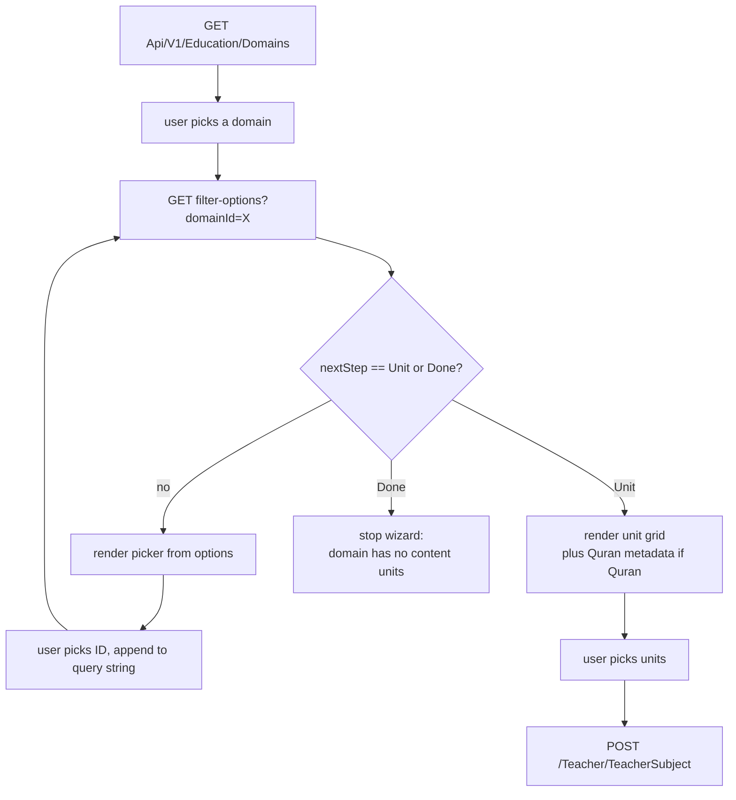
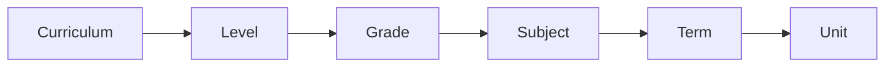
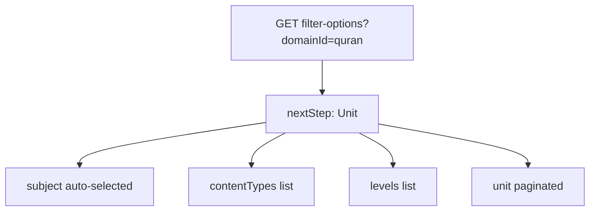
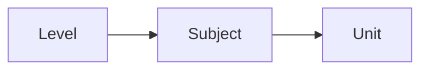
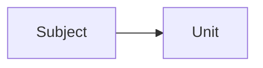
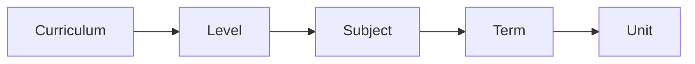
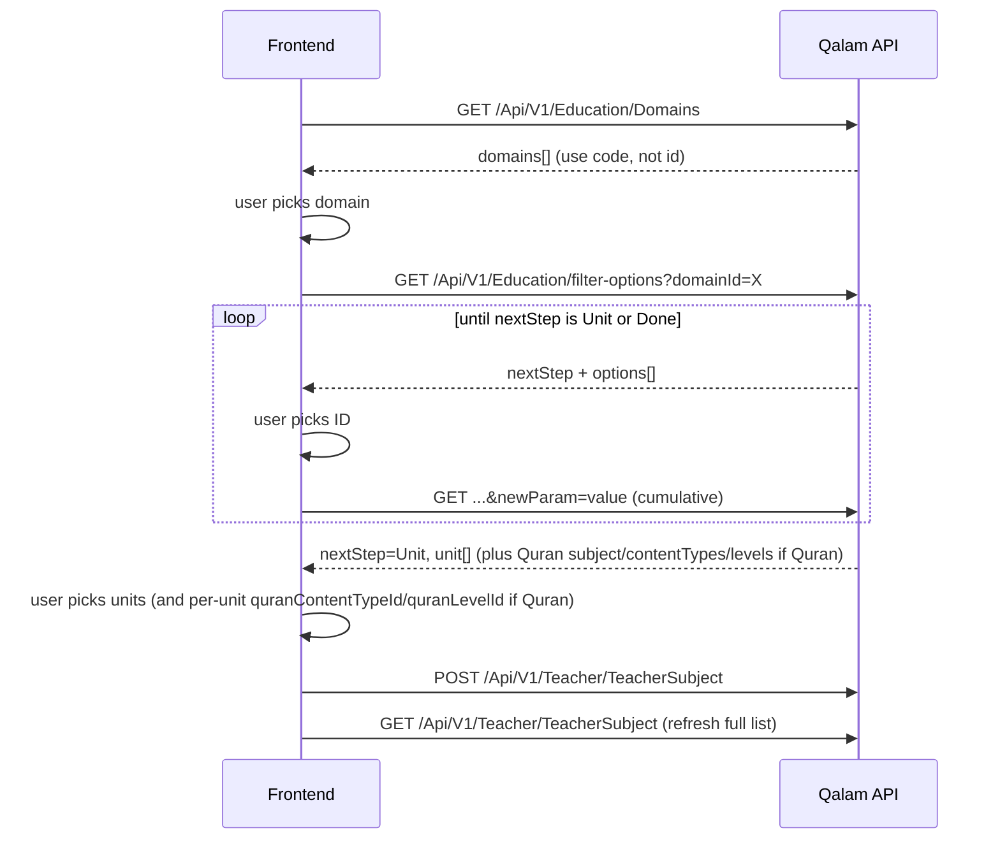
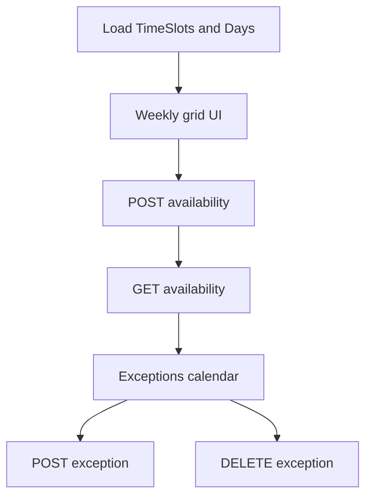

# Teacher Availability & Teacher Subjects — API Guide

Practical reference for teacher-facing endpoints that define **what** a teacher can teach and **when** they are available. Use this when building the teacher onboarding/profile screens or integrating with the mobile app.

For Quran unit specialization details, see [Teacher-Quran-Specialization-Design.md](./Teacher-Quran-Specialization-Design.md).  
For how students see bookable slots on a calendar, see [DATE_RANGE_AND_AVAILABILITY.md](../DATE_RANGE_AND_AVAILABILITY.md).

---

## TL;DR

| Area | Base path | Auth |
|------|-----------|------|
| Subjects | `GET` / `POST` `/Api/V1/Teacher/TeacherSubject` | `Teacher` |
| Availability | `GET` / `POST` `/Api/V1/Teacher/TeacherAvailability` | `Teacher` |
| Exceptions | `POST` / `DELETE` `/Api/V1/Teacher/TeacherAvailability/exceptions` | `Teacher` |
| Filter wizard | `GET` `/Api/V1/Education/filter-options` (see below) | Any authenticated user |
| Lookups | `/Api/V1/Subjects`, `/Api/V1/Content/Units`, `/Api/V1/Teaching/TimeSlots`, `/Api/V1/Teaching/DaysOfWeek` | Any authenticated user |

- Send `Authorization: Bearer <teacher-jwt>`. The API resolves the teacher from the token; do **not** send `userId` in the body.
- **Subjects** and **weekly availability** are **additive**: new items are merged in; exact duplicates are skipped.
- **POST subject** response includes only subjects **newly added** in that call; call **GET** for the full list.
- There is **no public API** today to remove a weekly time slot or delete a single subject (`DELETE /TeacherSubject/{id}` returns “Not implemented yet”).

---

## Prerequisites

1. Teacher account is registered and logged in (JWT with role `Teacher`).
2. Typically used **after admin approval** (`Active` status), same as course creation.
3. Seed data (or admin setup) provides subjects, content units, time slots, and days of week.

---

## Teacher subjects

Teachers declare which subjects (and optionally which units) they can teach. Each saved row becomes a `teacherSubjectId` used when creating courses (`teacherSubjectId` on `POST /Api/V1/Teacher/TeacherCourse`).

### Endpoints

| Method | Path | Description |
|--------|------|-------------|
| `GET` | `/Api/V1/Teacher/TeacherSubject` | List all active subjects and units for the current teacher |
| `POST` | `/Api/V1/Teacher/TeacherSubject` | Add new subject/unit offerings (skips duplicates) |
| `DELETE` | `/Api/V1/Teacher/TeacherSubject/{id}` | **Not implemented** — returns placeholder message |

### Lookup data (build the picker UI)

**Preferred:** use the cascading **filter-options** API (one endpoint, domain-aware steps). Legacy flat lookups still work for simple lists.

| Method | Path | Use |
|--------|------|-----|
| `GET` | `/filter-options` | **Recommended** — next wizard step + options (see [Education filter options](#education-filter-options-getfilteroptions)) |
| `GET` | `/Api/V1/Education/Domains` | List domains (pick `domainId` for first filter call) |
| `GET` | `/Api/V1/Subjects` | All subjects (paginated/filters via query) |
| `GET` | `/Api/V1/Subjects/Grade/{gradeId}` | Subjects for a grade |
| `GET` | `/Api/V1/Subjects/Domain/{domainId}` | Subjects for a domain (e.g. Quran) |
| `GET` | `/Api/V1/Content/Units` | Content units (Surahs, parts, chapters, etc.) |

---

## Education filter options (`GetFilterOptions`)

When a teacher adds subjects, the UI must load **different dropdowns** depending on the education domain. Hardcoding five flows on the client doesn't scale, so the server walks a per-domain wizard for you: one endpoint, called repeatedly, where each call answers **what is the next question, and what are the valid answers?**

| Item | Value |
|------|-------|
| HTTP | `GET /Api/V1/Education/filter-options` |
| Auth | `[Authorize]` — any authenticated user (not Teacher-only) |
| Controller / handler | [`EducationController.GetFilterOptions`](../Qalam.Api/Controllers/Education/EducationController.cs) → `GetFilterOptionsQueryHandler` → `EducationFilterService.GetFilterOptionsAsync` |
| Binding | `[FromQuery] GetFilterOptionsQuery` |

**The single rule the client must remember:** the query string IS the wizard state. The server stores nothing between calls. Every call sends the full bag of selected IDs collected so far.

```
client state (query params)  --->  GET /filter-options  --->  response
                                       ├── nextStep:    what screen to show next
                                       ├── options:     choices for that screen (intermediate steps)
                                       ├── unit:        units to pick (when nextStep === "Unit")
                                       ├── subject:     auto-selected (Quran only)
                                       ├── contentTypes / levels: Quran metadata
                                       ├── pagination:  Quran units only
                                       └── rule:        which steps exist for this domain
```

---

### End-to-end flow (every domain)

**Mermaid:**



**ASCII:**

```
   GET /Api/V1/Education/Domains
            |
            v
   user picks domainId
            |
            +---> GET /filter-options?domainId=X  <-----+
            |              |                            |
            |              v                            |
            |     read nextStep + payload               |
            |              |                            |
            |     nextStep in {Curriculum, Level,       |
            |     Grade, Subject, Term}?                |
            |              |                            |
            |              +-- yes -> user picks -------+
            |                          add param to query
            |
            +---> nextStep == "Unit"   -> user picks units -> POST /Teacher/TeacherSubject
            |
            +---> nextStep == "Done"   -> stop wizard (no content units configured)
```

---

### The seven `nextStep` states (every state, in one place)

Every response carries exactly one `nextStep` value. The client decides what to render and which query parameter to append next.

| `nextStep` | UI to render | Response field with choices | Query param to append | Error this step can throw |
|------------|--------------|------------------------------|------------------------|---------------------------|
| `Curriculum` | Curriculum dropdown | `options[]` | `curriculumId` | — |
| `Level` | Level dropdown | `options[]` | `levelId` | — |
| `Grade` | Grade dropdown | `options[]` | `gradeId` | **404** `"LevelId is required before selecting Grade"` if user sends `gradeId` without `levelId` (only reachable via handcrafted URL — normal wizard order prevents it) |
| `Subject` | Subject dropdown | `options[]` | `subjectId` | — |
| `Term` | Term **multi-select** | `options[]` | `termIds` (one or more, repeated: `termIds=1&termIds=2`) | **404** `"CurriculumId is required before selecting Term"` |
| `Unit` | Unit multi-select | `unit[]` (plus `subject`, `contentTypes`, `levels` for Quran) | — wizard ends here | **404** `"Quran subject not found"` if Quran subject is not seeded |
| `Done` | Wizard finished | `options[]` is empty | — wizard ends here | — |

**Important:** Subject has **no `HasSubject` flag** in `EducationRule`. Whether you hit the Subject step depends only on whether prior steps (Curriculum / Level / Grade) are required for the domain. Once you reach it, Subject is always mandatory to advance.

---

### Step-resolution algorithm (from `EducationFilterService`)

Lifted directly from [`EducationFilterService.cs`](../Qalam.Service/Implementations/EducationFilterService.cs):

1. **Validate domain** (lines 43–57).
   - `state.DomainId` null → **400** `"DomainId is required"`.
   - Domain has no `EducationRule` → **404** `"Domain with ID '{id}' not found or has no rules configured"`.
   - Domain row not found → **404** `"Domain with ID '{id}' not found"`.

2. **Branch by domain code, NOT by ID** (line 109). The service does `domain.Code?.ToLowerInvariant() == "quran"`. If true, take the Quran path; otherwise the standard chain.

3. **Quran path** (`DetermineQuranNextStepAsync`, one-shot, lines 147–199):
   - Auto-resolve the single seeded Quran subject (`InvalidOperationException("Quran subject not found")` → **404** if missing).
   - Auto-set `state.SubjectId` if null. Auto-default `state.UnitTypeCode` to `"QuranPart"` if null/empty.
   - Fetch `contentTypes`, `levels`, and a **paginated** unit list (`pageNumber`/`pageSize` respected).
   - Return `nextStep = "Unit"` with `subject`, `contentTypes`, `levels`, `unit`, `totalCount`, `pageNumber`, `pageSize`, `totalPages` populated.

4. **Standard path** (`DetermineStandardNextStepAsync`, sequential, lines 204–277). Each check is `if (rule.HasX && !state.XId.HasValue)`:
   1. `HasCurriculum && !CurriculumId` → `nextStep = "Curriculum"`.
   2. `HasEducationLevel && !LevelId` → `nextStep = "Level"`.
   3. `HasGrade && !GradeId` → `nextStep = "Grade"`. Throws `"LevelId is required before selecting Grade"` (**404**) if `!LevelId`.
   4. `!SubjectId` → `nextStep = "Subject"`. **No `HasSubject` flag** — always asked once prior steps are satisfied.
   5. `HasAcademicTerm && (TermIds == null || TermIds.Count == 0)` → `nextStep = "Term"`. Throws `"CurriculumId is required before selecting Term"` (**404**) if `!CurriculumId`.
   6. `HasContentUnits` → `nextStep = "Unit"`. Returns ALL matching units in one page (`pageNumber=1`, `pageSize=units.Count`, `totalPages=1` — pagination params are **ignored** for standard domains).
   7. Else → `nextStep = "Done"` with empty `options`. Only reachable when `HasContentUnits == false`, which no seeded domain currently has.

5. **Quran auto-clear** (lines 85–96). After the step result returns, if domain is Quran and `result.Options.Count == 1` (the single auto-fetched subject), the service moves it from `options` → `subject` (`SelectedSubject`) and clears `options`. So Quran clients always see `options: []` and use the `subject` field instead.

---

### Domains and their rule flags

Verified against [`EducationDomainsSeeder.cs`](../Qalam.Infrastructure/Seeding/EducationDomainsSeeder.cs):

| Domain | `code` | Curriculum | Level | Grade | AcademicTerm | ContentUnits | Quran type/level (UI hints only) |
|--------|--------|:---:|:---:|:---:|:---:|:---:|:---:|
| School Education | `school` | yes | yes | yes | yes | yes | — |
| Quran | `quran` | — | — | — | — | yes | yes (UI only — see gotchas) |
| Languages | `language` | — | yes | — | — | yes | — |
| General Skills | `skills` | — | — | — | — | yes | — |
| University Education | `university` | yes | yes | — | yes | yes | — |

**On IDs:** the seeder does NOT hardcode `Id` — EF assigns them at insert time. On a fresh database seeded in this order, you get IDs 1–5 in this order, but **the service matches by `domain.Code`, not by `Id`**. Clients should call `GET /Api/V1/Education/Domains` once and key off `code`, not bake `domainId=2` into a Quran button.

---

### Client implementation checklist

1. **Load domains** — `GET /Api/V1/Education/Domains` and store `code` alongside `id`.
2. **Loop** — `GET /Api/V1/Education/filter-options` with all params collected so far.
3. **Read `nextStep`** — render exactly one picker (or the unit grid when `Unit`).
4. **On user selection** — append the query param the table above tells you to append and call again.
5. **Do not send `userId`** — the filter API has no concept of user identity beyond `[Authorize]`.
6. **Quran** — one call returns everything. Use `pageNumber` / `pageSize` for the unit list; pick `quranContentTypeId` / `quranLevelId` locally **per unit** at save time, not on the wizard URL.
7. **Terms (school / university)** — when `nextStep === "Term"`, the user must pick at least one term (`termIds=1&termIds=2`). The wizard will keep returning `Term` until at least one is sent. To collapse the Term step entirely, send every term ID upfront.
8. **Save** — when the user confirms units, `POST /Api/V1/Teacher/TeacherSubject`.

`currentState` in every response echoes the server-side bag (including Quran auto-fills like `subjectId` and `unitTypeCode`).

### Query parameters

Bound from the query string by `[FromQuery] GetFilterOptionsQuery` ([`GetFilterOptionsQuery.cs`](../Qalam.Core/Features/Education/Queries/GetFilterOptions/GetFilterOptionsQuery.cs)):

| Parameter | Type | Required | Notes |
|-----------|------|:---:|------|
| `domainId` | `int` | **yes** | **400** if missing. |
| `curriculumId` | `int?` | step-dependent | |
| `levelId` | `int?` | step-dependent | Must precede `gradeId`. |
| `gradeId` | `int?` | step-dependent | |
| `termIds` | `int[]` | step-dependent | Multi-value: `?termIds=1&termIds=2`. `termIds=` empty and `termIds` omitted are treated identically. Must follow `curriculumId` if `HasAcademicTerm`. |
| `subjectId` | `int?` | always asked if reached | No flag — always required to advance past step 4. |
| `quranContentTypeId` | `int?` | optional | **Echoed in `currentState` only.** Not used to filter units server-side. Send it later in `POST /Teacher/TeacherSubject`. |
| `quranLevelId` | `int?` | optional | Same as above — echo only. |
| `unitTypeCode` | `string?` | Quran-meaningful | Defaults to `"QuranPart"` for Quran. Standard domains call the repo with `unitTypeCode: null`, so the param is accepted but **ignored** unless Quran. Values: `"QuranPart"` (30 Juz), `"QuranSurah"` (114 Surahs), `"SchoolUnit"`, `"LanguageModule"`. |
| `pageNumber` | `int` | Quran only | Default `1`. **Ignored** for standard domains. |
| `pageSize` | `int` | Quran only | Default `20`. **Ignored** for standard domains. |

**Extra params are silently ignored**, never 400'd. Sending `curriculumId` to a `skills` flow is a no-op.

---

### Response envelope

[`FilterOptionsResponseDto`](../Qalam.Data/DTOs/FilterOptionsResponseDto.cs). JSON property names below match the actual serialization (note the `[JsonPropertyName]` attributes for `unit`, `subject`, `contentTypes`, `levels`):

```json
{
  "succeeded": true,
  "data": {
    "currentState": { "domainId": 1, "curriculumId": null, "levelId": null, "gradeId": null,
                      "termIds": null, "subjectId": null,
                      "quranContentTypeId": null, "quranLevelId": null, "unitTypeCode": null },
    "rule": {
      "hasCurriculum": true, "hasEducationLevel": true, "hasGrade": true,
      "hasAcademicTerm": true, "hasContentUnits": true, "hasLessons": true,
      "requiresQuranContentType": false, "requiresQuranLevel": false,
      "requiresUnitTypeSelection": false
    },
    "nextStep": "Curriculum",
    "options": [ { "id": 1, "nameAr": "...", "nameEn": "...", "code": null } ],
    "unit": null,
    "totalCount": null, "pageNumber": null, "pageSize": null, "totalPages": null,
    "contentTypes": null,
    "levels": null,
    "subject": null
  }
}
```

| Field | When populated | Meaning |
|-------|---------------|---------|
| `currentState` | always | Echo of the query string state (including Quran auto-fills). Use to re-hydrate form state / deep links. |
| `rule` | always | Use to render or hide wizard steps in your UI. |
| `nextStep` | always | One of `Curriculum`, `Level`, `Grade`, `Subject`, `Term`, `Unit`, `Done`. |
| `options[]` | intermediate steps | Choices for the current step. Empty when `nextStep === "Unit"` or `"Done"`. Also cleared on Quran (the subject is moved to `subject`). |
| `unit[]` | `nextStep === "Unit"` | The units the user can pick. |
| `totalCount`, `pageNumber`, `pageSize`, `totalPages` | Quran units | Pagination metadata. Standard domains always set `pageNumber=1`, `pageSize=units.Count`, `totalPages=1`. |
| `subject` | Quran | Auto-selected Quran subject. `options` is cleared. |
| `contentTypes`, `levels` | Quran | All Quran content types and levels — for the teacher's per-unit specialization UI. |

Each `options[i]` / `unit[i]` / `subject` is a `FilterOptionDto` with `id`, `nameAr`, `nameEn`, and optional `code`.

---

### TypeScript types (copy-paste ready)

```ts
// Generic API envelope used everywhere in Qalam
interface ApiResponse<T> {
  succeeded: boolean;
  message?: string | null;
  data: T;
  errors?: string[] | null;
}

// One picker option — used in `options[]`, `unit[]`, `subject`, `contentTypes[]`, `levels[]`
interface FilterOption {
  id: number;
  nameAr: string;
  nameEn: string;
  code?: string | null;     // populated for domains and Quran units (e.g. "QuranPart")
}

// Echo of every filter parameter the wizard has collected so far
interface FilterState {
  domainId: number | null;
  curriculumId: number | null;
  levelId: number | null;
  gradeId: number | null;
  termIds: number[] | null;
  subjectId: number | null;
  quranContentTypeId: number | null;  // echo only
  quranLevelId: number | null;        // echo only
  unitTypeCode: string | null;        // "QuranPart" | "QuranSurah" | "SchoolUnit" | "LanguageModule"
}

// `rule` block — use to render/hide wizard steps in your UI
interface EducationRule {
  hasCurriculum: boolean;
  hasEducationLevel: boolean;
  hasGrade: boolean;
  hasAcademicTerm: boolean;
  hasContentUnits: boolean;
  hasLessons: boolean;
  requiresQuranContentType: boolean;  // UI hint only
  requiresQuranLevel: boolean;        // UI hint only
  requiresUnitTypeSelection: boolean; // UI hint only
}

type NextStep =
  | "Curriculum"
  | "Level"
  | "Grade"
  | "Subject"
  | "Term"
  | "Unit"
  | "Done";

// Full response payload from GET /Api/V1/Education/filter-options
interface FilterOptionsResponse {
  currentState: FilterState;
  rule: EducationRule;
  nextStep: NextStep;

  options: FilterOption[];          // empty for "Unit" and "Done", and for Quran (use `subject` instead)
  unit: FilterOption[] | null;      // populated only when nextStep === "Unit"

  // Pagination (only meaningful for Quran)
  totalCount: number | null;
  pageNumber: number | null;
  pageSize: number | null;
  totalPages: number | null;

  // Quran-only fields
  subject: FilterOption | null;         // auto-selected Quran subject
  contentTypes: FilterOption[] | null;  // Memorization / Recitation / Tajweed
  levels: FilterOption[] | null;        // Noorani / Beginner / Intermediate / Advanced
}

// What you POST to /Api/V1/Teacher/TeacherSubject after the wizard ends
interface SaveTeacherSubjectsRequest {
  subjects: {
    subjectId: number;
    canTeachFullSubject: boolean;
    units: {
      unitId: number;
      quranContentTypeId?: number | null;  // Quran only — null = all types
      quranLevelId?: number | null;        // Quran only — null = all levels
    }[];
  }[];
}
```

### Error codes summary

| Trigger | HTTP | Message |
|---------|:---:|---------|
| `domainId` missing | **400** | `"DomainId is required"` |
| Domain ID has no `EducationRule` | **404** | `"Domain with ID '{id}' not found or has no rules configured"` |
| Domain row not found at all | **404** | `"Domain with ID '{id}' not found"` |
| Quran domain but no Quran subject seeded | **404** | `"Quran subject not found"` |
| `gradeId` supplied without `levelId` | **404** | `"LevelId is required before selecting Grade"` |
| Reaches Term step on a curriculum-required domain without `curriculumId` | **404** | `"CurriculumId is required before selecting Term"` |
| Missing / invalid bearer token | **401** | — |

Mapping is in [`GetFilterOptionsQueryHandler`](../Qalam.Core/Features/Education/Queries/GetFilterOptions/GetFilterOptionsQueryHandler.cs): `ArgumentException → 400`, `InvalidOperationException → 404`. Success path returns **200** with `succeeded: true`.

**Sample error payloads** the frontend must be ready to render:

`GET /Api/V1/Education/filter-options` (no `domainId`):

```json
{
  "succeeded": false,
  "message": "DomainId is required",
  "data": null,
  "errors": null
}
```

`GET /Api/V1/Education/filter-options?domainId=99999`:

```json
{
  "succeeded": false,
  "message": "Domain with ID '99999' not found or has no rules configured",
  "data": null,
  "errors": null
}
```

`GET /Api/V1/Education/filter-options?domainId=2` when the Quran subject row is missing:

```json
{
  "succeeded": false,
  "message": "Quran subject not found",
  "data": null,
  "errors": null
}
```

`GET /Api/V1/Education/filter-options?domainId=5&levelId=3&subjectId=20` (university — reached Term step without `curriculumId`):

```json
{
  "succeeded": false,
  "message": "CurriculumId is required before selecting Term",
  "data": null,
  "errors": null
}
```

Display `message` as a toast / inline error. None of these are user-recoverable through retry; treat them as configuration bugs.

---

### Frontend integration tips

How to wire the wizard end-to-end. Framework-agnostic; adapt to React Query / SWR / Zustand / Vue / Flutter as needed.

#### 1. State shape

Mirror the server's `FilterState` exactly. Two extra client-only fields make the UI easier:

```ts
interface WizardState {
  // Server-mirrored — everything below maps 1:1 to a query string param.
  domainId: number | null;
  curriculumId: number | null;
  levelId: number | null;
  gradeId: number | null;
  termIds: number[];                  // [] until the user picks at least one
  subjectId: number | null;
  unitTypeCode: "QuranPart" | "QuranSurah" | "SchoolUnit" | "LanguageModule" | null;

  // Client-only — track what the user has chosen so far.
  selectedUnitIds: number[];          // multi-select state for the final step
  perUnitQuranSpec: Record<number, { quranContentTypeId: number | null; quranLevelId: number | null }>;
}
```

#### 2. Build the URL from state

```ts
function buildFilterUrl(state: WizardState): string {
  const params = new URLSearchParams();
  if (state.domainId != null)         params.set("domainId", String(state.domainId));
  if (state.curriculumId != null)     params.set("curriculumId", String(state.curriculumId));
  if (state.levelId != null)          params.set("levelId", String(state.levelId));
  if (state.gradeId != null)          params.set("gradeId", String(state.gradeId));
  if (state.subjectId != null)        params.set("subjectId", String(state.subjectId));
  if (state.unitTypeCode)             params.set("unitTypeCode", state.unitTypeCode);
  state.termIds.forEach(id => params.append("termIds", String(id)));
  return `/Api/V1/Education/filter-options?${params.toString()}`;
}
```

Repeat `termIds` is critical — `URLSearchParams.append` (not `set`) produces `?termIds=1&termIds=2`.

#### 3. Fetch the next step

```ts
async function loadNextStep(state: WizardState, token: string): Promise<FilterOptionsResponse> {
  const res = await fetch(buildFilterUrl(state), {
    headers: { Authorization: `Bearer ${token}` },
  });
  const envelope: ApiResponse<FilterOptionsResponse> = await res.json();
  if (!envelope.succeeded) {
    throw new Error(envelope.message ?? "Filter wizard failed");
  }
  return envelope.data;
}
```

#### 4. Render the current step

```tsx
function WizardStep({ data, onPick }: { data: FilterOptionsResponse; onPick: (key: keyof WizardState, value: number | number[]) => void }) {
  switch (data.nextStep) {
    case "Curriculum": return <SingleSelect title="Pick a curriculum"      options={data.options} onPick={id => onPick("curriculumId", id)} />;
    case "Level":      return <SingleSelect title="Pick an education level" options={data.options} onPick={id => onPick("levelId", id)} />;
    case "Grade":      return <SingleSelect title="Pick a grade"            options={data.options} onPick={id => onPick("gradeId", id)} />;
    case "Subject":    return <SingleSelect title="Pick a subject"          options={data.options} onPick={id => onPick("subjectId", id)} />;
    case "Term":       return <MultiSelect  title="Pick one or more terms"  options={data.options} minSelection={1} onSubmit={ids => onPick("termIds", ids)} />;
    case "Unit":       return <UnitPicker   data={data} />;  // see step 5
    case "Done":       return <DonePanel    subjectId={data.currentState.subjectId} />;
  }
}
```

**Why `minSelection={1}` for Term:** without at least one selected `termId`, the server returns `nextStep: "Term"` again — the submit button must be disabled until the user picks at least one.

#### 5. The Unit step (different for Quran vs everything else)

```tsx
function UnitPicker({ data }: { data: FilterOptionsResponse }) {
  const isQuran = data.subject !== null;  // Quran is the only domain that populates `subject`
  return (
    <div>
      {isQuran && (
        <>
          <p>{data.subject!.nameAr} / {data.subject!.nameEn}</p>
          {/* For each unit the teacher picks, also let them choose
              quranContentTypeId (from data.contentTypes) and quranLevelId (from data.levels) */}
        </>
      )}
      <MultiSelect title="Pick units to teach" options={data.unit ?? []} />
      <PaginationBar totalPages={data.totalPages ?? 1} /* only meaningful for Quran */ />
    </div>
  );
}
```

#### 6. Save the result

```ts
async function saveSubjects(state: WizardState, token: string) {
  const body: SaveTeacherSubjectsRequest = {
    subjects: [{
      subjectId: state.subjectId!,
      canTeachFullSubject: state.selectedUnitIds.length === 0,
      units: state.selectedUnitIds.map(unitId => ({
        unitId,
        quranContentTypeId: state.perUnitQuranSpec[unitId]?.quranContentTypeId ?? null,
        quranLevelId:       state.perUnitQuranSpec[unitId]?.quranLevelId       ?? null,
      })),
    }],
  };
  const res = await fetch("/Api/V1/Teacher/TeacherSubject", {
    method: "POST",
    headers: { "Content-Type": "application/json", Authorization: `Bearer ${token}` },
    body: JSON.stringify(body),
  });
  return res.json();
}
```

#### 7. Disable / enable rules at a glance

| Condition | UI rule |
|-----------|---------|
| `nextStep === "Term"` and 0 terms picked | Submit button **disabled** (server will just return Term again) |
| `nextStep === "Unit"` and 0 units picked | Save button **disabled** unless `canTeachFullSubject` is true |
| Quran units, `requiresQuranContentType === true` but user didn't pick a content type per unit | Save button **disabled** (UI-side enforcement; server doesn't validate this) |
| Quran units, `requiresQuranLevel === true` but user didn't pick a level per unit | Save button **disabled** |
| Response has `nextStep === "Done"` | Hide the unit grid; offer "Save full subject" or "Back" |

#### 8. Caching & re-entry

- The wizard URL **fully encodes state**. Deep links (`/teacher/subjects/wizard?domainId=1&curriculumId=1&levelId=2`) work out of the box.
- Cache `GET /Api/V1/Education/Domains` once per session — domains rarely change.
- Cache each `GET /filter-options?...` response keyed by the cumulative query string. Going Back in the wizard re-uses the cached response instead of refetching.

---

### Domain walkthroughs

Each walkthrough below follows the same pattern: **rule flags → flow diagram → every call in order → first/final request samples → gotchas.** IDs in examples assume a freshly seeded database (1=school, 2=quran, 3=language, 4=skills, 5=university); resolve them at runtime from `GET /Api/V1/Education/Domains` if you don't trust the seed order.

### Case 1 — School (`code = "school"`)

**Rule flags:** Curriculum ✓ Level ✓ Grade ✓ AcademicTerm ✓ ContentUnits ✓

**Step order:**



```
domainId=school → Curriculum → Level → Grade → Subject → Term → Unit
```

**Every call in order:**

| # | Cumulative query | `nextStep` | Response fields populated | User action |
|:-:|---|---|---|---|
| 1 | `?domainId=1` | `Curriculum` | `options[]` = curricula | Pick → add `curriculumId=1` |
| 2 | `?domainId=1&curriculumId=1` | `Level` | `options[]` = levels for that curriculum | Pick → add `levelId=2` |
| 3 | `...&levelId=2` | `Grade` | `options[]` = grades within the level | Pick → add `gradeId=5` |
| 4 | `...&gradeId=5` | `Subject` | `options[]` = subjects matching domain+curriculum+level+grade | Pick → add `subjectId=12` |
| 5 | `...&subjectId=12` | `Term` | `options[]` = terms for the curriculum | Pick one or more → add `termIds=1&termIds=2` |
| 6 | `...&termIds=1&termIds=2` | `Unit` | `unit[]` = units filtered by the selected terms; `options: []`; `totalPages: 1` | Multi-select units → wizard ends |

**First call (curricula):**

```http
GET /Api/V1/Education/filter-options?domainId=1
Authorization: Bearer <token>
```

**Response after the first call** (`nextStep: "Curriculum"`):

```json
{
  "succeeded": true,
  "data": {
    "currentState": {
      "domainId": 1, "curriculumId": null, "levelId": null, "gradeId": null,
      "termIds": null, "subjectId": null,
      "quranContentTypeId": null, "quranLevelId": null, "unitTypeCode": null
    },
    "rule": {
      "hasCurriculum": true, "hasEducationLevel": true, "hasGrade": true,
      "hasAcademicTerm": true, "hasContentUnits": true, "hasLessons": true,
      "requiresQuranContentType": false, "requiresQuranLevel": false,
      "requiresUnitTypeSelection": false
    },
    "nextStep": "Curriculum",
    "options": [
      { "id": 1, "nameAr": "المنهج السعودي",     "nameEn": "Saudi Curriculum",       "code": "saudi" },
      { "id": 2, "nameAr": "المنهج البريطاني",   "nameEn": "British Curriculum",     "code": "british" },
      { "id": 3, "nameAr": "المنهج الأمريكي",    "nameEn": "American Curriculum",    "code": "american" }
    ],
    "unit": null,
    "totalCount": null, "pageNumber": null, "pageSize": null, "totalPages": null,
    "subject": null, "contentTypes": null, "levels": null
  }
}
```

**Response on the Subject step** (`?domainId=1&curriculumId=1&levelId=2&gradeId=5`):

```json
{
  "succeeded": true,
  "data": {
    "currentState": {
      "domainId": 1, "curriculumId": 1, "levelId": 2, "gradeId": 5,
      "termIds": null, "subjectId": null,
      "quranContentTypeId": null, "quranLevelId": null, "unitTypeCode": null
    },
    "rule": { "hasCurriculum": true, "hasEducationLevel": true, "hasGrade": true,
              "hasAcademicTerm": true, "hasContentUnits": true, "hasLessons": true,
              "requiresQuranContentType": false, "requiresQuranLevel": false,
              "requiresUnitTypeSelection": false },
    "nextStep": "Subject",
    "options": [
      { "id": 12, "nameAr": "الرياضيات",     "nameEn": "Mathematics", "code": null },
      { "id": 13, "nameAr": "العلوم",        "nameEn": "Science",     "code": null },
      { "id": 14, "nameAr": "اللغة العربية", "nameEn": "Arabic",      "code": null }
    ],
    "unit": null,
    "totalCount": null, "pageNumber": null, "pageSize": null, "totalPages": null,
    "subject": null, "contentTypes": null, "levels": null
  }
}
```

**Response on the Term step** (`?domainId=1&curriculumId=1&levelId=2&gradeId=5&subjectId=12`):

```json
{
  "data": {
    "currentState": { "domainId": 1, "curriculumId": 1, "levelId": 2, "gradeId": 5, "subjectId": 12, "termIds": null },
    "nextStep": "Term",
    "options": [
      { "id": 1, "nameAr": "الفصل الأول",  "nameEn": "Term 1" },
      { "id": 2, "nameAr": "الفصل الثاني", "nameEn": "Term 2" },
      { "id": 3, "nameAr": "الفصل الثالث", "nameEn": "Term 3" }
    ]
  }
}
```

**Final call (units, specific terms):**

```http
GET /Api/V1/Education/filter-options?domainId=1&curriculumId=1&levelId=2&gradeId=5&subjectId=12&termIds=1&termIds=2
```

```json
{
  "succeeded": true,
  "data": {
    "currentState": {
      "domainId": 1, "curriculumId": 1, "levelId": 2, "gradeId": 5,
      "subjectId": 12, "termIds": [1, 2]
    },
    "rule": { "hasCurriculum": true, "hasEducationLevel": true, "hasGrade": true,
              "hasAcademicTerm": true, "hasContentUnits": true, "hasLessons": true,
              "requiresQuranContentType": false, "requiresQuranLevel": false,
              "requiresUnitTypeSelection": false },
    "nextStep": "Unit",
    "options": [],
    "unit": [
      { "id": 201, "nameAr": "الأعداد والعمليات",  "nameEn": "Numbers and Operations", "code": "SchoolUnit" },
      { "id": 202, "nameAr": "الكسور والنسب",       "nameEn": "Fractions and Ratios",   "code": "SchoolUnit" },
      { "id": 203, "nameAr": "الجبر",               "nameEn": "Algebra",                "code": "SchoolUnit" }
    ],
    "totalCount": 3, "pageNumber": 1, "pageSize": 3, "totalPages": 1,
    "subject": null, "contentTypes": null, "levels": null
  }
}
```

**What the client does next:** show a multi-select of `unit[]`, let the teacher confirm, then `POST /Api/V1/Teacher/TeacherSubject` with the chosen `subjectId` and `unitId`s.

**Gotchas:**
- **Collapse the Term step** by passing every `termId` upfront in one request (`termIds=1&termIds=2&termIds=3`) — the server skips straight to `Unit`.
- The Subject query is **not** filtered by term (subjects are year-long): it's filtered by domain + curriculum + level + grade ([EducationFilterService.cs:236-242](../Qalam.Service/Implementations/EducationFilterService.cs#L236)).
- When `nextStep === "Term"`, the multi-select should not allow "Submit" with zero terms — the server will just return `Term` again.

---

### Case 2 — Quran (`code = "quran"`)

**Rule flags:** ContentUnits ✓ — plus UI hints `RequiresQuranContentType`, `RequiresQuranLevel`, `RequiresUnitTypeSelection`. The API does NOT use these to filter units; they're for client-side validation before saving.

**No multi-step wizard.** One call returns everything.



```
GET ?domainId=<quran>&unitTypeCode=QuranPart&pageNumber=1&pageSize=20
        |
        +-- subject       (single Quran subject — auto)
        +-- contentTypes  (1=حفظ Memorization / 2=تلاوة Recitation / 3=تجويد Tajweed)
        +-- levels        (1=نوراني / 2=مبتدئ / 3=متوسط / 4=متقدم)
        +-- unit[]        (30 Juz or 114 Surahs — paginated)
```

**Defaults the server applies** ([EducationFilterService.cs:60-63, 167-173](../Qalam.Service/Implementations/EducationFilterService.cs#L60)):
- `unitTypeCode` → `"QuranPart"` (30 Juz) when omitted.
- `subjectId` → auto-set to the single seeded Quran subject. Echoed back in `currentState.subjectId`.
- `options[]` → cleared after the subject is moved to the `subject` field.

**First call (default Juz, page 1):**

```http
GET /Api/V1/Education/filter-options?domainId=2&pageNumber=1&pageSize=20
Authorization: Bearer <token>
```

**Switch to Surahs:**

```http
GET /Api/V1/Education/filter-options?domainId=2&unitTypeCode=QuranSurah&pageNumber=1&pageSize=50
```

**Sample response (shape):**

```json
{
  "succeeded": true,
  "data": {
    "currentState": { "domainId": 2, "subjectId": 499, "unitTypeCode": "QuranPart" },
    "rule": { "hasContentUnits": true, "requiresQuranContentType": true, "requiresQuranLevel": true,
              "requiresUnitTypeSelection": true,
              "hasCurriculum": false, "hasEducationLevel": false, "hasGrade": false,
              "hasAcademicTerm": false, "hasLessons": false },
    "nextStep": "Unit",
    "options": [],
    "subject": { "id": 499, "nameAr": "القرآن الكريم", "nameEn": "Quran", "code": "quran" },
    "contentTypes": [
      { "id": 1, "nameAr": "حفظ",    "nameEn": "Memorization" },
      { "id": 2, "nameAr": "تلاوة",  "nameEn": "Recitation" },
      { "id": 3, "nameAr": "تجويد",  "nameEn": "Tajweed" }
    ],
    "levels": [
      { "id": 1, "nameAr": "نوراني", "nameEn": "Noorani" },
      { "id": 2, "nameAr": "مبتدئ",  "nameEn": "Beginner" },
      { "id": 3, "nameAr": "متوسط",  "nameEn": "Intermediate" },
      { "id": 4, "nameAr": "متقدم",  "nameEn": "Advanced" }
    ],
    "unit": [ { "id": 115, "nameAr": "الجزء الأول",  "nameEn": "Part 1", "code": "QuranPart" } ],
    "totalCount": 30, "pageNumber": 1, "pageSize": 20, "totalPages": 2
  }
}
```

**Gotchas:**
- `quranContentTypeId` / `quranLevelId` on the wizard URL are **echoed in `currentState` only** — they do NOT filter `unit[]`. They are saved per-unit in the `POST /Teacher/TeacherSubject` payload.
- Pagination matters: 30 Juz fits in one page at `pageSize=20` is two pages; 114 Surahs spans six pages at `pageSize=20`.
- If the seeder didn't run, you'll see **404 `"Quran subject not found"`**. Run the database seeder.

---

### Case 3 — Languages (`code = "language"`)

**Rule flags:** EducationLevel ✓ ContentUnits ✓ (no curriculum, no grade, no term)



```
domainId=language → Level → Subject → Unit
```

**Every call in order:**

| # | Cumulative query | `nextStep` | User action |
|:-:|---|---|---|
| 1 | `?domainId=3` | `Level` | Pick → add `levelId` |
| 2 | `?domainId=3&levelId=1` | `Subject` | Pick → add `subjectId` |
| 3 | `?domainId=3&levelId=1&subjectId=42` | `Unit` | Multi-select units → wizard ends |

```http
GET /Api/V1/Education/filter-options?domainId=3&levelId=1&subjectId=42
```

**Response on the Level step** (`?domainId=3`):

```json
{
  "succeeded": true,
  "data": {
    "currentState": { "domainId": 3, "levelId": null, "subjectId": null },
    "rule": { "hasCurriculum": false, "hasEducationLevel": true, "hasGrade": false,
              "hasAcademicTerm": false, "hasContentUnits": true, "hasLessons": true,
              "requiresQuranContentType": false, "requiresQuranLevel": false,
              "requiresUnitTypeSelection": false },
    "nextStep": "Level",
    "options": [
      { "id": 1, "nameAr": "مبتدئ",  "nameEn": "Beginner" },
      { "id": 2, "nameAr": "متوسط",  "nameEn": "Intermediate" },
      { "id": 3, "nameAr": "متقدم",  "nameEn": "Advanced" }
    ],
    "unit": null,
    "subject": null, "contentTypes": null, "levels": null
  }
}
```

**Response on the Subject step** (`?domainId=3&levelId=1`):

```json
{
  "data": {
    "currentState": { "domainId": 3, "levelId": 1, "subjectId": null },
    "nextStep": "Subject",
    "options": [
      { "id": 42, "nameAr": "اللغة الإنجليزية", "nameEn": "English" },
      { "id": 43, "nameAr": "اللغة الفرنسية",   "nameEn": "French" },
      { "id": 44, "nameAr": "اللغة الإسبانية",  "nameEn": "Spanish" }
    ]
  }
}
```

**Response on the Unit step** (`?domainId=3&levelId=1&subjectId=42`):

```json
{
  "data": {
    "currentState": { "domainId": 3, "levelId": 1, "subjectId": 42 },
    "nextStep": "Unit",
    "options": [],
    "unit": [
      { "id": 301, "nameAr": "النحو الأساسي",   "nameEn": "Basic Grammar",      "code": "LanguageModule" },
      { "id": 302, "nameAr": "المفردات",         "nameEn": "Vocabulary",         "code": "LanguageModule" },
      { "id": 303, "nameAr": "مهارات المحادثة", "nameEn": "Speaking Skills",    "code": "LanguageModule" }
    ],
    "totalCount": 3, "pageNumber": 1, "pageSize": 3, "totalPages": 1
  }
}
```

**Gotchas:** No curriculum, no grade, no term. If you send any of those (`curriculumId`, `gradeId`, `termIds`), they're silently dropped — no error.

---

### Case 4 — General Skills (`code = "skills"`)

**Rule flags:** ContentUnits ✓ — shortest path.



```
domainId=skills → Subject → Unit
```

**Every call in order:**

| # | Cumulative query | `nextStep` | User action |
|:-:|---|---|---|
| 1 | `?domainId=4` | `Subject` | Pick → add `subjectId` |
| 2 | `?domainId=4&subjectId=10` | `Unit` | Multi-select units → wizard ends |

```http
GET /Api/V1/Education/filter-options?domainId=4&subjectId=10
```

**Response on the Subject step** (`?domainId=4`):

```json
{
  "succeeded": true,
  "data": {
    "currentState": { "domainId": 4, "subjectId": null },
    "rule": { "hasCurriculum": false, "hasEducationLevel": false, "hasGrade": false,
              "hasAcademicTerm": false, "hasContentUnits": true, "hasLessons": true,
              "requiresQuranContentType": false, "requiresQuranLevel": false,
              "requiresUnitTypeSelection": false },
    "nextStep": "Subject",
    "options": [
      { "id": 10, "nameAr": "البرمجة",          "nameEn": "Programming" },
      { "id": 11, "nameAr": "التصوير",          "nameEn": "Photography" },
      { "id": 12, "nameAr": "الكتابة الإبداعية", "nameEn": "Creative Writing" }
    ],
    "unit": null,
    "subject": null, "contentTypes": null, "levels": null
  }
}
```

**Response on the Unit step** (`?domainId=4&subjectId=10`):

```json
{
  "data": {
    "currentState": { "domainId": 4, "subjectId": 10 },
    "nextStep": "Unit",
    "options": [],
    "unit": [
      { "id": 401, "nameAr": "أساسيات بايثون",      "nameEn": "Python Basics",        "code": "SchoolUnit" },
      { "id": 402, "nameAr": "هياكل البيانات",      "nameEn": "Data Structures",      "code": "SchoolUnit" },
      { "id": 403, "nameAr": "تطوير الواجهات",       "nameEn": "Frontend Development", "code": "SchoolUnit" }
    ],
    "totalCount": 3, "pageNumber": 1, "pageSize": 3, "totalPages": 1
  }
}
```

**Gotchas:** Subject is the only step. No flags gate it — Subject is always required once reached. Sending `levelId`/`gradeId`/`termIds` is silently ignored.

---

### Case 5 — University Education (`code = "university"`)

**Rule flags:** Curriculum ✓ EducationLevel ✓ AcademicTerm ✓ ContentUnits ✓ — **no Grade step**.



```
domainId=university → Curriculum → Level → Subject → Term → Unit
                                                (no Grade step)
```

**Every call in order:**

| # | Cumulative query | `nextStep` | User action |
|:-:|---|---|---|
| 1 | `?domainId=5` | `Curriculum` | Pick → add `curriculumId=2` |
| 2 | `?domainId=5&curriculumId=2` | `Level` | Pick → add `levelId=3` |
| 3 | `...&levelId=3` | `Subject` | Pick → add `subjectId=20` |
| 4 | `...&subjectId=20` | `Term` | Pick one or more → add `termIds=1` |
| 5 | `...&termIds=1` | `Unit` | Multi-select units → wizard ends |

```http
GET /Api/V1/Education/filter-options?domainId=5&curriculumId=2&levelId=3&subjectId=20&termIds=1
```

**Response on the Curriculum step** (`?domainId=5`):

```json
{
  "succeeded": true,
  "data": {
    "currentState": { "domainId": 5, "curriculumId": null, "levelId": null,
                      "subjectId": null, "termIds": null },
    "rule": { "hasCurriculum": true, "hasEducationLevel": true, "hasGrade": false,
              "hasAcademicTerm": true, "hasContentUnits": true, "hasLessons": true,
              "requiresQuranContentType": false, "requiresQuranLevel": false,
              "requiresUnitTypeSelection": false },
    "nextStep": "Curriculum",
    "options": [
      { "id": 2, "nameAr": "بكالوريوس علوم الحاسب", "nameEn": "BSc Computer Science", "code": "bsc_cs" },
      { "id": 3, "nameAr": "بكالوريوس هندسة",        "nameEn": "BSc Engineering",      "code": "bsc_eng" }
    ],
    "unit": null,
    "subject": null, "contentTypes": null, "levels": null
  }
}
```

**Response on the Subject step** (`?domainId=5&curriculumId=2&levelId=3`):

```json
{
  "data": {
    "currentState": { "domainId": 5, "curriculumId": 2, "levelId": 3, "subjectId": null },
    "nextStep": "Subject",
    "options": [
      { "id": 20, "nameAr": "هياكل البيانات", "nameEn": "Data Structures" },
      { "id": 21, "nameAr": "الخوارزميات",    "nameEn": "Algorithms" },
      { "id": 22, "nameAr": "قواعد البيانات", "nameEn": "Databases" }
    ]
  }
}
```

**Response on the Term step** (`?domainId=5&curriculumId=2&levelId=3&subjectId=20`):

```json
{
  "data": {
    "currentState": { "domainId": 5, "curriculumId": 2, "levelId": 3, "subjectId": 20, "termIds": null },
    "nextStep": "Term",
    "options": [
      { "id": 1, "nameAr": "الفصل الخريفي", "nameEn": "Fall Semester" },
      { "id": 2, "nameAr": "الفصل الربيعي", "nameEn": "Spring Semester" }
    ]
  }
}
```

**Response on the Unit step** (`?domainId=5&curriculumId=2&levelId=3&subjectId=20&termIds=1`):

```json
{
  "data": {
    "currentState": { "domainId": 5, "curriculumId": 2, "levelId": 3, "subjectId": 20, "termIds": [1] },
    "nextStep": "Unit",
    "options": [],
    "unit": [
      { "id": 501, "nameAr": "المصفوفات",         "nameEn": "Arrays",         "code": "SchoolUnit" },
      { "id": 502, "nameAr": "القوائم المتصلة",   "nameEn": "Linked Lists",   "code": "SchoolUnit" },
      { "id": 503, "nameAr": "الأشجار والرسوم",   "nameEn": "Trees & Graphs", "code": "SchoolUnit" }
    ],
    "totalCount": 3, "pageNumber": 1, "pageSize": 3, "totalPages": 1
  }
}
```

**Gotchas:**
- If you somehow reach the Term step without `curriculumId` (only via handcrafted URL), you get **404 `"CurriculumId is required before selecting Term"`**.
- Just like Case 1, you can collapse the Term step by sending every term ID upfront in one call.

---

### Case 6 — Terminal states

| `nextStep` | Meaning | What the client does |
|------------|---------|----------------------|
| `Unit` | Units are loaded; user picks them and you build the `POST /Teacher/TeacherSubject` body. | End the wizard. |
| `Done` | The domain has no content units (`HasContentUnits == false`). No seeded domain currently returns this, but it's the legitimate end-state for any future flag-only domain. | Stop the wizard. There's nothing to save as units; you can still `POST /Teacher/TeacherSubject` with `canTeachFullSubject: true` using the `subjectId` collected earlier. |

---

### Edge cases & gotchas (in one place)

- **Extra / wrong-domain query params** are silently ignored. Sending `gradeId` to a Quran or Skills flow is a no-op, never a 400.
- **`pageNumber` / `pageSize`** are honored **only** on the Quran path. Standard domains call the repo without pagination and force `totalPages: 1`, `pageSize: units.Count`.
- **`termIds=` (empty value) vs `termIds` omitted** are equivalent — both trigger the Term step. Check: [EducationFilterService.cs:247](../Qalam.Service/Implementations/EducationFilterService.cs#L247) `(state.TermIds == null || !state.TermIds.Any())`.
- **`quranContentTypeId` / `quranLevelId`** are echoed in `currentState` but never used to filter units server-side. They're per-unit specializations saved via `POST /Teacher/TeacherSubject` (see [Quran content types / levels tables below](#request-save-subjects)).
- **`requiresQuranContentType`, `requiresQuranLevel`, `requiresUnitTypeSelection`** are UI hints in `rule` — the API doesn't enforce them. They tell the frontend to require these picks in its own validation before saving.
- **Domain code, not ID.** The service branches on `domain.Code == "quran"`, not on `domain.Id == 2`. Clients should resolve domains from `/Api/V1/Education/Domains` and key off `code`, not bake `domainId=N` into buttons.
- **Auth:** `[Authorize]` only, no role check. The same wizard works for an admin previewing what a teacher would see — handy for support tooling.
- **No `HasSubject` flag.** Subject is always required once prior steps are satisfied; you can't skip it via a flag.
- **JSON property renames:** `unit`, `subject`, `contentTypes`, `levels` are explicitly renamed via `[JsonPropertyName]` on `FilterOptionsResponseDto`. Other fields use default camelCase.

---

### From `nextStep === "Unit"` to `POST /Teacher/TeacherSubject`

When `nextStep === "Unit"`, the wizard is done. Map the response to the body of `POST /Api/V1/Teacher/TeacherSubject`:

**Full subject (any non-Quran domain — teacher will teach the whole subject):**

```json
{
  "subjects": [{
    "subjectId": 12,
    "canTeachFullSubject": true,
    "units": []
  }]
}
```

**Partial subject with selected units (any domain, including Quran):**

```json
{
  "subjects": [{
    "subjectId": 499,
    "canTeachFullSubject": false,
    "units": [
      { "unitId": 115, "quranContentTypeId": 1, "quranLevelId": null }
    ]
  }]
}
```

For Quran, set `quranContentTypeId` / `quranLevelId` **per unit** at save time — they were never used by the filter API, only echoed.

**End-to-end sequence (frontend ⇄ API):**



```
Frontend                                              API
   |                                                    |
   |--- GET /Api/V1/Education/Domains ----------------->|
   |<-- domains[] (read code, not id) ------------------|
   |                                                    |
   |--- GET /filter-options?domainId=X ---------------->|
   |<-- nextStep: Curriculum, options[] ----------------|
   |    (user picks)                                    |
   |--- GET ...&curriculumId=1 ------------------------>|
   |<-- nextStep: Level, options[] ---------------------|
   |    ... repeat until nextStep=Unit (or Done) ...    |
   |<-- nextStep: Unit, unit[] (Quran: + subject/...) --|
   |                                                    |
   |--- POST /Api/V1/Teacher/TeacherSubject ----------->|
   |<-- 200 { teacherId, subjects: [newly added] } -----|
   |--- GET /Api/V1/Teacher/TeacherSubject ------------>|
   |<-- 200 [all subjects with units, full names] ------|
```

---

### Request: save subjects

```json
{
  "subjects": [
    {
      "subjectId": 1,
      "canTeachFullSubject": true,
      "units": []
    },
    {
      "subjectId": 499,
      "canTeachFullSubject": false,
      "units": [
        { "unitId": 115, "quranContentTypeId": 1, "quranLevelId": null },
        { "unitId": 116, "quranContentTypeId": 1, "quranLevelId": 2 }
      ]
    }
  ]
}
```

| Field | Type | Notes |
|-------|------|--------|
| `subjectId` | `int` | Must exist in `education.Subjects` |
| `canTeachFullSubject` | `bool` | `true` = entire subject; `false` = only listed units |
| `units` | array | **Required** when `canTeachFullSubject` is `false` |
| `unitId` | `int` | Content unit ID |
| `quranContentTypeId` | `int?` | Quran only; `null` = all types |
| `quranLevelId` | `int?` | Quran only; `null` = all levels |

**Quran content types**

| ID | Arabic | English |
|----|--------|---------|
| 1 | حفظ | Memorization |
| 2 | تلاوة | Recitation |
| 3 | تجويد | Tajweed |

**Quran levels**

| ID | Arabic | English |
|----|--------|---------|
| 1 | نوراني | Noorani |
| 2 | مبتدئ | Beginner |
| 3 | متوسط | Intermediate |
| 4 | متقدم | Advanced |

The same unit may appear multiple times with different `quranContentTypeId` / `quranLevelId` pairs (separate teaching offerings).

### Additive behavior (duplicates)

`POST` does **not** replace all subjects. It compares each payload item to existing offerings using a signature:

- `subjectId` + full vs partial + ordered unit list (including Quran IDs).

Matching offerings are **skipped**. Only new signatures are inserted.

After `POST`, call `GET` to refresh the full list. The `POST` response `data.subjects` contains **only rows added in that request** (may be empty if everything was duplicate).

### Response: GET subjects

Returns a standard envelope with `data` as an **array** of subjects (not `{ teacherId, subjects }`):

```json
{
  "succeeded": true,
  "data": [
    {
      "id": 12,
      "subjectId": 1,
      "subjectNameAr": "الرياضيات",
      "subjectNameEn": "Mathematics",
      "domainCode": "education",
      "canTeachFullSubject": true,
      "isActive": true,
      "units": []
    }
  ]
}
```

Unit objects include names and resolved Quran type/level labels when applicable.

### Response: POST subjects

```json
{
  "succeeded": true,
  "message": "Teacher subjects saved successfully",
  "data": {
    "teacherId": 7,
    "subjects": [ /* only newly added items */ ]
  }
}
```

### Validation errors

| Condition | HTTP | Message (example) |
|-----------|------|-------------------|
| No teacher profile for token | 404 | `Teacher not found` |
| Invalid `subjectId` | 400 | `Subjects not found: 99999` |
| `canTeachFullSubject: false` with empty `units` | 400 | `Units are required when CanTeachFullSubject is false for subjects: …` |
| Missing / invalid token | 401 | — |

---

## Teacher availability

Teachers set a **recurring weekly schedule** (day of week + platform time slots). They can add **per-date exceptions** (blocked day off or extra slot outside the weekly pattern).

Student booking uses the derived calendar API documented in [DATE_RANGE_AND_AVAILABILITY.md](../DATE_RANGE_AND_AVAILABILITY.md) (`GET /Api/V1/Student/Teachers/{teacherId}/Availability`).

### Endpoints

| Method | Path | Description |
|--------|------|-------------|
| `GET` | `/Api/V1/Teacher/TeacherAvailability` | Weekly schedule + exceptions in a date range |
| `POST` | `/Api/V1/Teacher/TeacherAvailability` | Add weekly slots (skips duplicates) |
| `POST` | `/Api/V1/Teacher/TeacherAvailability/exceptions` | Add one date exception |
| `DELETE` | `/Api/V1/Teacher/TeacherAvailability/exceptions/{id}` | Remove an exception |

There is **no** teacher endpoint to remove a weekly slot; `RemoveAllTeacherAvailabilityAsync` exists in the data layer but is not exposed on the API.

### Lookup data

| Method | Path | Use |
|--------|------|-----|
| `GET` | `/Api/V1/Teaching/TimeSlots` | Platform time slots (`id`, start/end, labels) |
| `GET` | `/Api/V1/Teaching/DaysOfWeek` | Days (`id`, names, order) |

**Day of week IDs** (used in `dayOfWeekId`):

| ID | Day |
|----|-----|
| 1 | Sunday |
| 2 | Monday |
| 3 | Tuesday |
| 4 | Wednesday |
| 5 | Thursday |
| 6 | Friday |
| 7 | Saturday |

### GET availability

**Query parameters**

| Param | Default | Description |
|-------|---------|-------------|
| `fromDate` | Today (UTC date) | Filter **exceptions** from this date |
| `toDate` | Today + 90 days | Filter **exceptions** to this date |

Weekly schedule is always the full active template (not filtered by these dates).

**Example**

```http
GET /Api/V1/Teacher/TeacherAvailability?fromDate=2026-05-01&toDate=2026-08-01
Authorization: Bearer <token>
```

**Response shape**

```json
{
  "succeeded": true,
  "data": {
    "teacherId": 7,
    "weeklySchedule": [
      {
        "dayOfWeekId": 1,
        "dayNameAr": "الأحد",
        "dayNameEn": "Sunday",
        "timeSlots": [
          {
            "id": 3,
            "availabilityId": 42,
            "startTime": "16:00:00",
            "endTime": "17:00:00",
            "durationMinutes": 60,
            "labelAr": "بعد الظهر",
            "labelEn": "Afternoon"
          }
        ]
      }
    ],
    "exceptions": [
      {
        "id": 5,
        "date": "2026-05-17",
        "timeSlot": { "id": 3, "availabilityId": 0, "startTime": "16:00:00", "endTime": "17:00:00", "durationMinutes": 60, "labelEn": "Afternoon" },
        "exceptionType": "Blocked",
        "exceptionTypeDisplay": "Blocked",
        "reason": "Public holiday"
      }
    ]
  }
}
```

- `timeSlots[].id` — platform **time slot** ID (use when posting new weekly slots or exceptions).
- `timeSlots[].availabilityId` — row ID in `teacher.TeacherAvailability` (used internally for bookings).

### POST weekly schedule (additive)

Adds `(dayOfWeekId, timeSlotId)` pairs that are not already active. Sending an empty `daySchedules` array returns **400**.

```json
{
  "daySchedules": [
    { "dayOfWeekId": 1, "timeSlotIds": [1, 2, 3] },
    { "dayOfWeekId": 3, "timeSlotIds": [4, 5] }
  ]
}
```

On success, the response is the same shape as **GET** (full schedule + exceptions), with message `Teacher availability saved successfully`.

### POST exception

```json
{
  "date": "2026-05-17",
  "timeSlotId": 5,
  "exceptionType": "Blocked",
  "reason": "Public holiday"
}
```

| `exceptionType` | Value | Meaning |
|-----------------|-------|---------|
| Blocked | `1` or `"Blocked"` | Unavailable on this date/slot (holiday, personal day) |
| Extra | `2` or `"Extra"` | Available outside the normal weekly pattern |

Duplicate `(date, timeSlotId)` for the same teacher returns **400**: `An exception already exists for this date and time slot`.

### DELETE exception

```http
DELETE /Api/V1/Teacher/TeacherAvailability/exceptions/5
Authorization: Bearer <token>
```

Returns **404** if the exception does not exist or belongs to another teacher.

### How weekly + exceptions affect students

For each calendar date in a range, the platform:

1. Expands the teacher’s weekly template for that weekday.
2. Applies `Blocked` exceptions → slot status `Blocked`.
3. Marks slots with an existing scheduled course → `Booked`.
4. Remaining slots → `Free`.

See [DATE_RANGE_AND_AVAILABILITY.md](../DATE_RANGE_AND_AVAILABILITY.md) for student endpoint parameters, caps (`fromDate` + max 90 days), and sample payloads.

### Recommended UI flow



**ASCII:**

```
TimeSlots + DaysOfWeek -> weekly grid -> POST schedule -> GET schedule
                                              |
                                    exceptions UI -> POST/DELETE exception
```

---

## Typical onboarding order

1. Complete registration, documents, and admin approval.
2. **Subjects** — `GET /Api/V1/Education/filter-options` to pick domain/subject/units, then `POST /Teacher/TeacherSubject` (then `GET` to confirm).
3. **Availability** — `POST /Teacher/TeacherAvailability` for weekly grid; add exceptions as needed.
4. **Courses** — `POST /Teacher/TeacherCourse` using `teacherSubjectId` from step 2. See [CreateCourse.md](./CreateCourse.md).

---

## Related docs & tests

| Document | Focus |
|----------|--------|
| [TeacherSubject-Testing-Guide.md](./TeacherSubject-Testing-Guide.md) | Postman-style test scenarios (note: some examples mention `curriculumId` / replace behavior that no longer match the API) |
| [Teacher-Quran-Specialization-Design.md](./Teacher-Quran-Specialization-Design.md) | Quran unit / content type / level model |
| [DATE_RANGE_AND_AVAILABILITY.md](../DATE_RANGE_AND_AVAILABILITY.md) | Student calendar and slot statuses |
| [CreateCourse.md](./CreateCourse.md) | Creating courses after subjects are set |

---

## Quick checklist

**Subjects**

- [ ] Walk `GET /Api/V1/Education/filter-options` per domain (all cases above) or use flat lookup APIs
- [ ] `POST` with valid `subjectId` and units when partial subject
- [ ] Handle empty `POST` response when duplicates skipped
- [ ] `GET` for full profile display
- [ ] Use returned `id` as `teacherSubjectId` when creating courses

**Availability**

- [ ] Load time slots and days of week
- [ ] `POST` weekly grid (additive)
- [ ] `GET` with exception date range for calendar UI
- [ ] Add/remove exceptions via `POST` / `DELETE`
- [ ] Do not assume weekly slots can be removed via API
