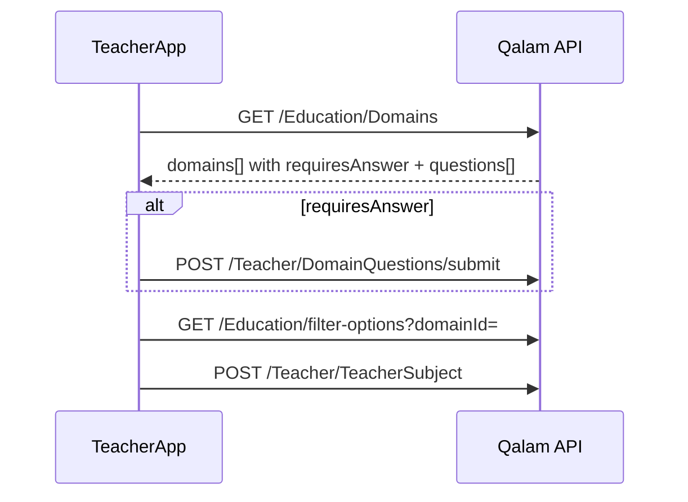

# Teacher domain questions

Admin-defined questions shown when a teacher adds subjects in an education domain (school, quran, etc.). Each question is answered **once per teacher per domain**.

## Overview

| Concern | Behavior |
|---------|----------|
| Scope | Per **education domain** (`EducationDomain`) |
| Frequency | Once per teacher per domain; skip on later subject adds in same domain |
| Admin review | Per-question `requiresAdminReview` flag |
| Empty catalog | No change — same flow as before |

## Teacher flow



### 1. Load domains

```http
GET /Api/V1/Education/Domains
Authorization: Bearer <teacher-jwt>
```

For authenticated teachers, each domain includes:

```json
{
  "id": 1,
  "nameEn": "School",
  "code": "school",
  "requiresAnswer": true,
  "questions": [
    {
      "code": "school_experience_years",
      "nameEn": "Years of experience",
      "requirementType": "Text",
      "isRequired": true,
      "requiresAdminReview": false,
      "isSubmitted": false,
      "verificationStatus": null
    }
  ]
}
```

| Field | Meaning |
|-------|---------|
| `requiresAnswer` | `true` when at least one **active required** question has no submission |
| `questions[]` | Active catalog for the domain |
| `isSubmitted` | Teacher already answered (immutable in v1) |
| `verificationStatus` | `null` if not submitted; else `Pending` / `Approved` / `Rejected` |

Non-teacher callers receive the same shape with `requiresAnswer: false` and `questions: []`.

### 2. Submit answers

```http
POST /Api/V1/Teacher/DomainQuestions/submit
Authorization: Bearer <teacher-jwt>
Content-Type: multipart/form-data

domainId=1
answers[0].code=school_experience_years
answers[0].textValue=5
answers[1].code=school_teaching_license
answers[1].files=@license.pdf
```

| Answer field | Used when `requirementType` is |
|--------------|-------------------------------|
| `code` | Always (required per item) |
| `textValue` | Text |
| `boolValue` | Boolean (`true`/`false`) |
| `selectedValues[]` | Selection (repeatable for multi-select) |
| `files[]` | File (repeatable) |

**Legacy (still supported when `answers` is omitted):** prefix fields `file_{code}`, `text_{code}`, `bool_{code}`, `select_{code}`.

Rules:

- All **required** active questions for the domain must be present in one submit.
- Re-submit for an already-answered question returns `400`.
- Unknown `code` in `answers[]` returns `400`.
- Response includes `submittedCodes[]` for the codes processed in this call.
- `requiresAdminReview=false` → submission `Approved` immediately.
- `requiresAdminReview=true` → submission `Pending` until admin approves.

### 3. Continue subject wizard

Only proceed when `requiresAnswer === false` for the selected domain.

`POST /Api/V1/Teacher/TeacherSubject` returns `400` if required domain questions are still missing for any domain of the requested subjects.

## Admin — catalog CRUD (SuperAdmin)

Base path: `/Api/V1/Admin/TeacherDomainQuestions`

**Sample payloads & seeded defaults:** `docs/seed-data/teacher-domain-questions.json` (also inserted on startup via `TeacherDomainQuestionsSeeder` for `school`, `quran`, `language` domains).

| Method | Path | Notes |
|--------|------|-------|
| GET | `?domainId=` | List (optional filter) |
| GET | `/{id}` | Detail |
| POST | `/` | Create (`domainId` + question payload) |
| PUT | `/{id}` | Update labels, flags, options |
| DELETE | `/{id}` | Blocked if submissions exist |
| PATCH | `/{id}/active` | Toggle `isActive` |

Question types reuse `RegistrationRequirementType`: `File`, `Text`, `Boolean`, `Selection`.

## Admin — review submissions

On teacher detail (`GET /Api/V1/Admin/TeacherManagement/{teacherId}`), `domainQuestionSubmissions` groups answers by domain.

| Method | Path |
|--------|------|
| POST | `/Api/V1/Admin/TeacherManagement/DomainQuestionSubmissions/{submissionId}/Approve` |
| POST | `/Api/V1/Admin/TeacherManagement/DomainQuestionSubmissions/{submissionId}/Reject` |

Body for reject: `{ "reason": "..." }` (same as document reject).

Only meaningful when `requiresAdminReview=true`; auto-approved answers are already `Approved`.

## Activation gate

Account activation (`canBeActivated` / `POST …/Activate`) additionally requires:

- For each domain in the teacher's **subject offerings**: all **required** questions submitted.
- For questions with `requiresAdminReview=true`: must be `Approved`.

## v1 limitations

- No re-submit after admin reject (contact support or wait for v2).
- Questions are domain-wide only (not per curriculum/level).

See also: [Teacher-Registration-Flow.md](Teacher-Registration-Flow.md), [Teacher-Registration-Guide.md](Teacher-Registration-Guide.md).
