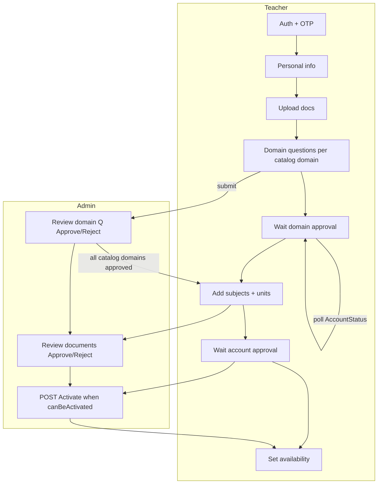
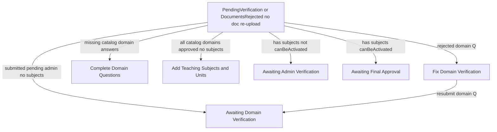
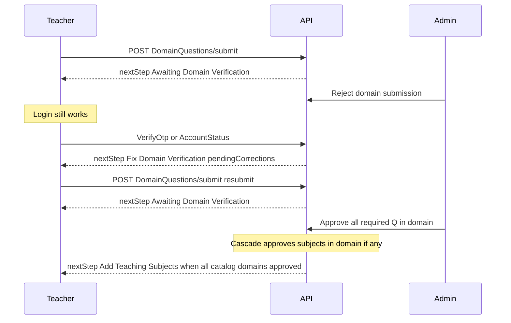
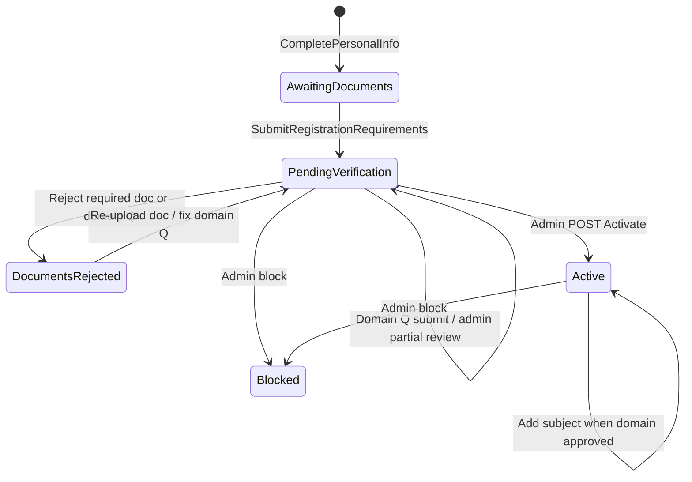

# Teacher registration — full cycle

Single reference for the end-to-end teacher onboarding cycle: auth → documents → **domain questions** → admin domain review → **subjects** → admin activation → availability.

Related docs:

- [Teacher-Registration-Guide.md](Teacher-Registration-Guide.md) — API payloads and Postman examples
- [Teacher-Registration-Flow.md](Teacher-Registration-Flow.md) — step-by-step teacher/admin screens
- [Teacher-Domain-Questions.md](Teacher-Domain-Questions.md) — domain question catalog and submit format
- [Admin-Teacher-Subjects-Frontend.md](Admin-Teacher-Subjects-Frontend.md) — admin subject tab (post-activation moderation)

---

## Cycle at a glance

| # | Phase | Who | `TeacherStatus` (typical) | `nextStepName` (typical) |
|---|--------|-----|---------------------------|--------------------------|
| 0 | Auth config + OTP | Teacher | — | Complete Personal Information |
| 1 | Personal info | Teacher | `AwaitingDocuments` | Upload Documents |
| 2 | Registration requirements | Teacher | `PendingVerification` | **Complete Domain Questions** |
| 3 | Domain questions (all catalog domains) | Teacher | `PendingVerification` | Complete Domain Questions → Awaiting Domain Verification |
| 4 | Domain admin review | Admin | `PendingVerification` / `DocumentsRejected` | **Awaiting Domain Verification** (teacher waits) |
| 5 | Add subjects | Teacher | `PendingVerification` | **Add Teaching Subjects and Units** |
| 6 | Document + account review | Admin | `PendingVerification` | Awaiting Admin Verification / Awaiting Final Approval |
| 7 | Activate account | Admin | `Active` | Dashboard |
| 8 | Set availability | Teacher | `Active` | Dashboard (`requiresAvailabilitySetup` if empty) |

**Core rule:** domain verification is **before** subjects. Admin reviews **domain question submissions**, not individual subject rows during registration.

---

## End-to-end diagram



---

## Login and routing (not blocking)

Login is tied to registration progress through **`nextStep`**, not by denying access.

| `TeacherStatus` | OTP / JWT | Notes |
|-----------------|-----------|--------|
| `AwaitingDocuments` | Allowed | Route to upload requirements |
| `PendingVerification` | Allowed | Route by `nextStep` (domain Q, wait, subjects, etc.) |
| `DocumentsRejected` | Allowed | Re-upload docs and/or fix domain Q |
| `Active` | Allowed | Dashboard (+ availability flag if needed) |
| `Blocked` | **Denied** | 403 on all authenticated APIs |

**Entrypoints that return `nextStep`:**

| API | Use |
|-----|-----|
| `POST /Api/V1/Authentication/Teacher/VerifyOtp` | After login |
| `GET /Api/V1/Authentication/Teacher/AccountStatus` | Poll waiting screens |
| `POST /Api/V1/Teacher/DomainQuestions/submit` | Optional `nextStep` on response |

Backend source: `TeacherRegistrationService.GetNextRegistrationStepAsync` → `BuildPostRegistrationStepAsync`.

---

## `nextStepName` routing priority

After registration documents are submitted, `BuildPostRegistrationStepAsync` evaluates in this order:



### Full matrix

| `teacher.Status` | Condition | `nextStepName` | Teacher screen |
|------------------|-----------|----------------|----------------|
| *(no profile)* | — | Complete Personal Information | Step 3 |
| `AwaitingDocuments` | — | Upload Documents | Requirements form |
| `PendingVerification` or `DocumentsRejected` | Any catalog domain answer **Rejected** | **Fix Domain Verification** | Domain questions + `pendingCorrections[]` |
| Same | Required domain answers **missing** | **Complete Domain Questions** | Domain questions checklist |
| Same | All submitted; admin review **pending** | **Awaiting Domain Verification** | Waiting / poll `AccountStatus` |
| Same | All catalog domains **approved**; no subjects | **Add Teaching Subjects and Units** | Subject wizard |
| `PendingVerification` | Has subjects; review in progress | **Awaiting Admin Verification** | Waiting |
| `PendingVerification` | Has subjects; `canBeActivated` | **Awaiting Final Approval** | Waiting (final approval banner) |
| `DocumentsRejected` | Rejected registration **documents** | **Re-upload Rejected Documents** | Documents list (priority over domain routing) |
| `Active` | — | **Dashboard** | Dashboard (`requiresAvailabilitySetup` if no availability) |
| `Blocked` | — | Login **denied** | Support message |

---

## Domain questions cycle

### Scope

Every active **education domain** that has at least one **active required** `TeacherDomainQuestion` in the catalog (typically `school`, `quran`, `language` from seed). Domains with no required questions are skipped.

### Teacher steps

1. `GET /Api/V1/Teacher/DomainQuestions/status` — per-domain checklist
2. For each catalog domain: `POST /Api/V1/Teacher/DomainQuestions/submit` (multipart)
3. Response includes `submittedCodes[]` and optional `nextStep`

### Admin steps

- Review submissions on teacher detail / domain question admin endpoints
- `POST .../DomainQuestionSubmissions/{id}/Approve`
- `POST .../DomainQuestionSubmissions/{id}/Reject` (reason required)

### Domain reject → resubmit loop



**On domain reject:**

1. Submission → `Rejected` (+ linked document if file question)
2. Existing **subjects in that domain** → cascade-rejected (`rejectionSource: DomainQuestionCascade`)
3. Teacher status may become `DocumentsRejected` — **login still allowed**
4. Teacher cannot add **new** subjects until domain is approved again

**On domain approve (all required Q in domain approved):**

- All teacher subjects in that domain → `Approved`, `IsActive = true`

---

## Subjects cycle

### When subjects can be added

- `nextStepName === "Add Teaching Subjects and Units"`
- **All** catalog domains with required questions are fully **approved**
- `POST /Api/V1/Teacher/TeacherSubject` returns `400` otherwise

### New subject rows

- Created as `verificationStatus = Approved`, `isActive = true` (no per-subject admin review during registration)
- Per-domain save guard still applies via `ValidateSubjectsDomainQuestionsAsync`

### Subject wizard

1. `GET /Api/V1/Education/filter-options?domainId=`
2. `POST /Api/V1/Teacher/TeacherSubject` with subjects + units

---

## Admin registration review

### Queue

```http
GET /Api/V1/Admin/TeacherManagement/Pending
```

Teachers in `PendingVerification` or `DocumentsRejected`.

### Teacher detail

```http
GET /Api/V1/Admin/TeacherManagement/{teacherId}
```

Review:

- `registrationRequirements[]` — document checklist
- `domainQuestionSubmissions[]` — domain verification checklist
- `subjects[]` — informational (not individually approved during registration)
- `canBeActivated` — enable **Authorize account** when true

### Document actions

```http
POST /Api/V1/Admin/TeacherManagement/{teacherId}/Documents/{documentId}/Approve
POST /Api/V1/Admin/TeacherManagement/{teacherId}/Documents/{documentId}/Reject
```

### Subject moderation (post-activation only)

No registration **Approve/Reject** on individual subjects. Post-activation:

```http
POST .../Subjects/{teacherSubjectId}/Inactivate
POST .../Subjects/{teacherSubjectId}/Activate
POST .../Subjects/{teacherSubjectId}/Restore
```

### Activate account

```http
POST /Api/V1/Admin/TeacherManagement/{teacherId}/Activate
```

When `canBeActivated === true`.

---

## Activation checklist (`canBeActivated`)

All must be true:

1. Teacher is not already `Active` or `Blocked`
2. Every **active required** registration submission → `Approved`
3. Every **required** domain question in **catalog domains** → `Approved`
4. At least **one** `TeacherSubject` row exists

Subject row `Pending`/`Rejected` does **not** block activation (domain gate handles verification). Admin must still call **Activate** explicitly.

---

## Teacher status machine



| Status | Value | Meaning |
|--------|-------|---------|
| `AwaitingDocuments` | 1 | Profile created; must submit requirements |
| `PendingVerification` | 2 | In registration / review pipeline |
| `Active` | 3 | Account activated |
| `Blocked` | 4 | No API access |
| `DocumentsRejected` | 5 | Corrections needed (docs and/or domain Q) |

---

## API quick reference

### Teacher — registration

| Purpose | Method | Path |
|---------|--------|------|
| Auth config | GET | `/Api/V1/Authentication/Config` |
| Send OTP | POST | `/Api/V1/Authentication/Teacher/LoginOrRegister` |
| Verify OTP | POST | `/Api/V1/Authentication/Teacher/VerifyOtp` |
| Personal info | POST | `/Api/V1/Authentication/Teacher/CompletePersonalInfo` |
| Requirements catalog | GET | `/Api/V1/Authentication/Teacher/RegistrationRequirements` |
| Submit requirements | POST | `/Api/V1/Authentication/Teacher/SubmitRegistrationRequirements` |
| Account status poll | GET | `/Api/V1/Authentication/Teacher/AccountStatus` |
| Full checklist | GET | `/Api/V1/Teacher/TeacherDocuments/Status` |
| Re-upload document | PUT | `/Api/V1/Teacher/TeacherDocuments/{id}/Reupload` |
| Domain Q status | GET | `/Api/V1/Teacher/DomainQuestions/status` |
| Domain Q submit | POST | `/Api/V1/Teacher/DomainQuestions/submit` |
| Education domains | GET | `/Api/V1/Education/Domains` |
| Filter wizard | GET | `/Api/V1/Education/filter-options` |
| Save subjects | POST | `/Api/V1/Teacher/TeacherSubject` |
| List subjects | GET | `/Api/V1/Teacher/TeacherSubject` |
| Availability | GET/POST | `/Api/V1/Teacher/TeacherAvailability` |

### Admin — registration

| Purpose | Method | Path |
|---------|--------|------|
| Pending queue | GET | `/Api/V1/Admin/TeacherManagement/Pending` |
| Teacher detail | GET | `/Api/V1/Admin/TeacherManagement/{teacherId}` |
| Approve document | POST | `.../Documents/{documentId}/Approve` |
| Reject document | POST | `.../Documents/{documentId}/Reject` |
| Approve domain Q | POST | `.../DomainQuestionSubmissions/{submissionId}/Approve` |
| Reject domain Q | POST | `.../DomainQuestionSubmissions/{submissionId}/Reject` |
| Activate account | POST | `.../Activate` |
| Block / unblock | POST | `.../Block` |

---

## Frontend routing (recommended)

Branch on `nextStep.nextStepName` from **VerifyOtp**, **AccountStatus**, and **DomainQuestions/submit**:

| `nextStepName` | Route / screen |
|----------------|----------------|
| Complete Personal Information | `/registration/personal-info` |
| Upload Documents | `/registration/documents` |
| Complete Domain Questions | `/registration/domain-questions` |
| Awaiting Domain Verification | `/registration/waiting` (poll `AccountStatus`) |
| Fix Domain Verification | `/registration/domain-questions` (show `pendingCorrections[]`) |
| Add Teaching Subjects and Units | `/registration/subjects` |
| Awaiting Admin Verification | `/registration/waiting` |
| Awaiting Final Approval | `/registration/waiting` (final approval section) |
| Re-upload Rejected Documents | `/registration/documents` |
| Dashboard | `/dashboard` |

**Do not** block login or invalidate JWT when domain answers are pending or rejected — use `nextStep` only.

---

## Backend implementation map

| Concern | Location |
|---------|----------|
| Registration `nextStep` routing | `TeacherRegistrationService.BuildPostRegistrationStepAsync` |
| Catalog domain resolution | `TeacherDomainQuestionStatusService` |
| Domain approve → auto-approve subjects | `TeacherDomainSubjectCascadeService.ApproveSubjectsInDomainAsync` |
| Domain reject → cascade-reject subjects | `TeacherDomainSubjectCascadeService.RejectSubjectsInDomainAsync` |
| Subject save gate | `SaveTeacherSubjectsCommandHandler` |
| Activation gate | `TeacherRegistrationCompletionService.CanActivateTeacherAccountAsync` |
| Blocked teacher middleware | `BlockedTeacherMiddleware` |

---

## Empty catalog fallback

If no education domain has active **required** domain questions, steps 3–4 (domain Q + domain wait) are skipped and the teacher goes directly to **Add Teaching Subjects and Units** after document upload.
