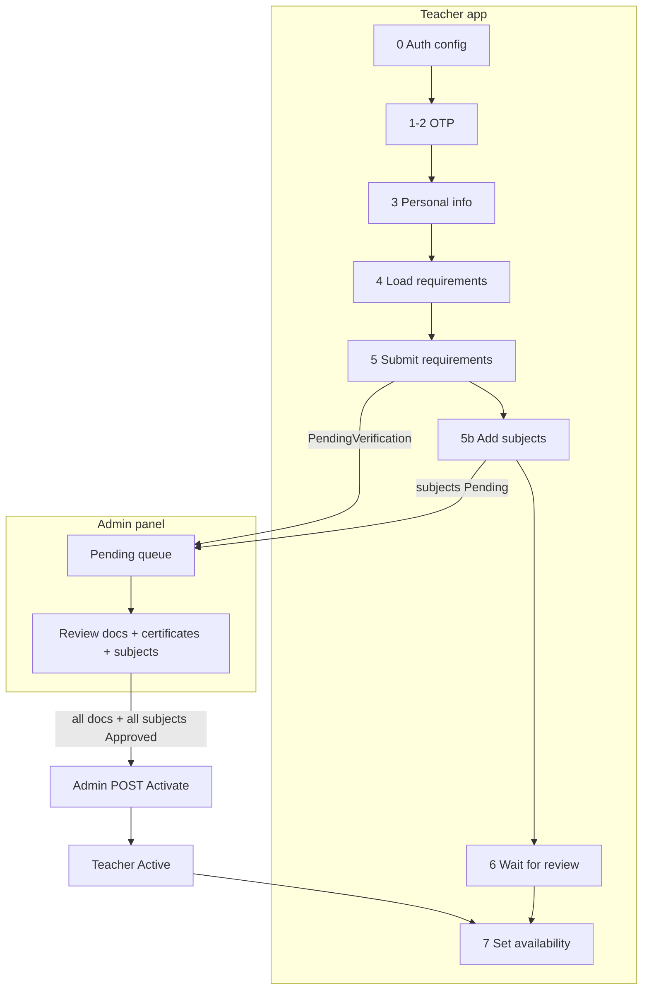
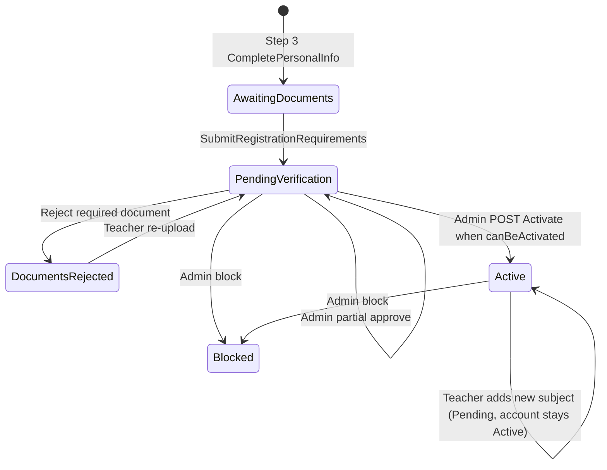

# Teacher registration flow (v2)

End-to-end onboarding for new teachers: auth → documents → **subjects (before activation)** → admin review → **Active** → availability.

> **Full API reference:** [Teacher-Registration-Guide.md](Teacher-Registration-Guide.md)  
> **Subject picker wizard:** [Education_Business_Logic.md](../Qalam.Data/AppMetaData/docs/Education_Business_Logic.md) + [Teacher-Availability-and-Subjects.md](Teacher-Availability-and-Subjects.md)  
> **Admin subject review UI:** [Admin-Teacher-Subjects-Frontend.md](Admin-Teacher-Subjects-Frontend.md)  
> **Teacher app screens:** [TEACHER_PROFILE_SETTINGS_GUIDE.md](../TEACHER_PROFILE_SETTINGS_GUIDE.md)

---

## What changed (v1 → v2)

| Topic | v1 | v2 (current) |
|-------|----|--------------|
| When teacher adds subjects | After admin sets account **Active** | While **`PendingVerification`** (also allowed in `AwaitingDocuments`, `DocumentsRejected`, `Active`) |
| New `TeacherSubject` status | Auto-**Approved** | **Pending** until admin approves |
| Account activation | All required documents approved | Docs + ≥1 subject approved → admin **POST Activate** |
| Admin subject action | Inactivate / Reject / Restore only | **Approve** for pending rows + existing moderation |
| Certificate check | N/A at subject level | Admin compares certificate documents to subject scope **manually** (no FK) |
| Active teacher adds subject | Immediately usable | Row **Pending**; teacher stays **Active**; new subject unusable until approved |

---

## Summary

| Phase | Who | What |
|-------|-----|------|
| 1 — Auth | Teacher | OTP login/register, name + password |
| 2 — Requirements | Teacher | Upload identity + certificates, bio, location (dynamic catalog) |
| 3 — Subjects | Teacher | Pick catalog subjects/units via `filter-options` → `POST /Teacher/TeacherSubject` |
| 4 — Review | Admin | Approve/reject **documents** and **subjects** (compare certificates manually) |
| 5 — Active | Admin | `POST /TeacherManagement/{teacherId}/Activate` when `canBeActivated` is true |
| 6 — Availability | Teacher | Weekly schedule (after Active only) |

**Key change from v1:** subjects are added **while** `PendingVerification`, not after admin activates the account. Each new subject starts **`Pending`** until admin approves it.

---

## Flow diagram



---

## Teacher status machine



| `TeacherStatus` | Meaning |
|-----------------|--------|
| `AwaitingDocuments` | Profile created; must submit requirements |
| `PendingVerification` | Requirements submitted; may still need subjects or admin review |
| `DocumentsRejected` | A required document was rejected; re-upload needed |
| `Active` | Fully approved; can set availability and create courses |
| `Blocked` | Admin blocked account | No authenticated API access (global middleware) |

---

## Step-by-step (teacher)

### Steps 0–3 — Auth & profile

| Step | API | Notes |
|------|-----|-------|
| 0 | `GET /Api/V1/Authentication/Config` | Phone/email/OTP UI rules |
| 1 | `POST /Api/V1/Authentication/Teacher/LoginOrRegister` | Send OTP |
| 2 | `POST /Api/V1/Authentication/Teacher/VerifyOtp` | Returns JWT; `nextStep` in response |
| 3 | `POST /Api/V1/Authentication/Teacher/CompletePersonalInfo` | Creates teacher → `AwaitingDocuments` |

Use `nextStep` from VerifyOtp / CompletePersonalInfo (via `GetNextRegistrationStepAsync`) to drive the wizard.

### Step 4 — Load requirements

```http
GET /Api/V1/Authentication/Teacher/RegistrationRequirements
```

Build dynamic form from `requirements[]` (file, text, boolean, selection fields).

### Step 5 — Submit requirements

```http
POST /Api/V1/Authentication/Teacher/SubmitRegistrationRequirements
Authorization: Bearer <teacher-jwt>
Content-Type: multipart/form-data
```

Sets `teacher.Status = PendingVerification`. Files queue to OSS via RabbitMQ → MessagingApi.

**Response** includes `nextStep` (usually → **Add Teaching Subjects and Units**):

```json
{
  "succeeded": true,
  "data": {
    "message": "Registration submitted successfully. Add your teaching subjects to continue.",
    "nextStep": {
      "currentStep": 4,
      "nextStep": 5,
      "nextStepName": "Add Teaching Subjects and Units",
      "isRegistrationComplete": false
    }
  }
}
```

Track progress:

```http
GET /Api/V1/Teacher/TeacherDocuments/Status
```

### Step 5b — Add teaching subjects (before activation)

**When:** `PendingVerification` and `nextStepName === "Add Teaching Subjects and Units"` (no subject offerings yet).  
**Also allowed:** `AwaitingDocuments`, `DocumentsRejected`, and `Active` (blocked only: `Blocked`).

1. Run the education wizard — `GET /Api/V1/Education/filter-options` (see [Education_Business_Logic.md](../Qalam.Data/AppMetaData/docs/Education_Business_Logic.md)).
2. Save selection:

```http
POST /Api/V1/Teacher/TeacherSubject
Authorization: Bearer <teacher-jwt>
Content-Type: application/json

{
  "subjects": [
    {
      "subjectId": 12,
      "canTeachFullSubject": false,
      "units": [{ "unitId": 44, "quranContentTypeId": null, "quranLevelId": null }]
    }
  ]
}
```

Each new row: `verificationStatus = Pending`, `isActive = true`. Teacher sees **Pending review** pill.

**Response** (`POST` success, newly added subject):

```json
{
  "succeeded": true,
  "data": {
    "teacherId": 12,
    "subjects": [
      {
        "id": 101,
        "subjectId": 12,
        "subjectNameAr": "الرياضيات",
        "subjectNameEn": "Mathematics",
        "domainCode": "school",
        "canTeachFullSubject": false,
        "isActive": true,
        "verificationStatus": 1,
        "rejectionReason": null,
        "reviewedAt": null,
        "units": [{ "id": 1, "unitId": 44, "unitNameAr": "...", "unitNameEn": "..." }]
      }
    ],
    "nextStep": {
      "currentStep": 5,
      "nextStep": 0,
      "nextStepName": "Awaiting Admin Verification",
      "isRegistrationComplete": false
    }
  }
}
```

List offerings:

```http
GET /Api/V1/Teacher/TeacherSubject
```

### Step 6 — Awaiting admin verification

When at least one subject exists and docs are submitted, `nextStepName === "Awaiting Admin Verification"`.

Teacher waits; admin approves documents and subjects. When `canBeActivated === true` on `GET /Admin/TeacherManagement/{teacherId}`, admin authorizes the account:

```http
POST /Api/V1/Admin/TeacherManagement/{teacherId}/Activate
```

Prerequisites:

- Every **active required** registration submission is `Approved`, **and**
- `subjectSummary.totalSubjects >= 1`, **and**
- No subject is `Pending` or `Rejected`.

### Step 7 — Availability (after Active)

```http
GET /Api/V1/Teacher/TeacherAvailability?fromDate=...&toDate=...
POST /Api/V1/Teacher/TeacherAvailability
```

Requires `TeacherStatus.Active`.

---

## Teacher lifecycle emails

Queued bilingual emails (EN/AR) via RabbitMQ → Messaging API. Login links use `PlatformSettings.WebAppBaseUrl` (env: `PLATFORM_WEB_APP_BASE_URL`, default `https://qalam.net.sa/`).

| Event | When | Login CTA |
|-------|------|-----------|
| Registration received | First submit (`AwaitingDocuments` → `PendingVerification`) | Yes |
| Document rejected | Admin rejects a document | Yes |
| Subject rejected | Admin rejects a subject | Yes |
| Account activated | Admin `POST .../Activate` succeeds | Yes |
| Account blocked | Admin toggles Block on | No (support copy only) |
| Account unblocked | Admin toggles Block off (same endpoint) | Yes |

**Not emailed:** per-document/subject approve, “ready for activation” nudge, teacher re-upload back to pending.

Email failures are logged only — they never roll back the underlying status change.

---

## Blocked teacher access control

When `Teacher.Status = Blocked`, **every authenticated API request** for that user is rejected by [`BlockedTeacherMiddleware`](../Qalam.Core/MiddleWare/BlockedTeacherMiddleware.cs) with **403 Forbidden** and the localized `AccountBlocked` message — courses, availability, documents, registration, refresh token, etc.

Unauthenticated entrypoints (`LoginOrRegister`, `VerifyOtp`) still rely on handler checks so blocked users cannot obtain a new session. Existing JWTs remain valid until expiry but cannot call any authenticated endpoint.

---

## Admin review

### Queue

```http
GET /Api/V1/Admin/TeacherManagement/Pending?pageNumber=1&pageSize=10
```

Teachers in `PendingVerification` or `DocumentsRejected`.

### Teacher detail

```http
GET /Api/V1/Admin/TeacherManagement/{teacherId}
```

Use:

- `documents[]` — identity + **certificates** (`documentType === 2`) for manual comparison
- `subjects[]` + `subjectSummary` — pending subject offerings
- `canBeActivated` — `true` when docs + subjects ready; admin must `POST .../Activate`
- `registrationRequirements[]` — dynamic catalog checklist

### Document actions

```http
POST /Api/V1/Admin/TeacherManagement/{teacherId}/Documents/{documentId}/Approve
POST /Api/V1/Admin/TeacherManagement/{teacherId}/Documents/{documentId}/Reject
Body: { "reason": "..." }
```

### Subject actions (during registration)

```http
POST /Api/V1/Admin/TeacherManagement/{teacherId}/Subjects/{teacherSubjectId}/Approve
POST /Api/V1/Admin/TeacherManagement/{teacherId}/Subjects/{teacherSubjectId}/Reject
Body: { "reason": "..." }
```

**Certificate comparison (v1):** manual — admin opens certificate files from `documents[]` and compares title/issuer/subject scope to each pending `subjects[]` row. No FK links subject to a specific certificate document.

Pending subjects queue (all teachers):

```http
GET /Api/V1/Admin/TeacherManagement/Subjects?verificationStatus=1
```

**Approve response:** `"Teacher subject approved successfully."` — does **not** auto-activate; use `POST .../Activate` when `canBeActivated` is true.

---

## Backend implementation

| Concern | Location |
|---------|----------|
| New subjects → `Pending` | `TeacherSubjectRepository.AddNewSubjectsAsync`, entity default + migration `TeacherSubjectPendingByDefault` |
| Pre-activation POST allowed | `SaveTeacherSubjectsCommandHandler` (blocked users rejected by middleware) |
| Registration wizard order | `TeacherRegistrationService.GetNextRegistrationStepAsync` |
| Activation gate (docs + subjects) | `TeacherRegistrationCompletionService.CanActivateTeacherAccountAsync` |
| Admin authorize account | `POST .../Activate` → `ActivateTeacherAccountAsync` |
| Courses / matching (unchanged) | Require `VerificationStatus.Approved` + `TeacherStatus.Active` |

**Deploy:** apply migration `TeacherSubjectPendingByDefault`, then `docker compose ... up -d --build`.

---

## `nextStep` guide (teacher app)

Derived from `GetNextRegistrationStepAsync` + auth responses:

| `teacher.Status` | Condition | `nextStepName` | UI |
|------------------|-----------|----------------|-----|
| *(no profile)* | — | Complete Personal Information | Step 3 |
| `AwaitingDocuments` | — | Upload Documents | Step 5 form |
| `PendingVerification` | no subjects | Add Teaching Subjects and Units | filter-options wizard |
| `PendingVerification` | has subjects | Awaiting Admin Verification | waiting screen |
| `DocumentsRejected` | rejected docs exist | Re-upload Rejected Documents | documents list |
| `DocumentsRejected` | no rejected docs, no subjects | Add Teaching Subjects and Units | filter-options wizard |
| `DocumentsRejected` | no rejected docs, has subjects | Awaiting Admin Verification | waiting screen |
| `Active` | no availability | Set Your Availability | availability screen |
| `Active` | has availability | Registration Complete | home / dashboard |

Poll `GET /Teacher/TeacherDocuments/Status` or re-call VerifyOtp `nextStep` after submit/subject add.

---

## Subject verification states

| `verificationStatus` | Teacher UI | Admin actions | Usable for courses? |
|---------------------|------------|---------------|---------------------|
| `Pending` (1) | Pending review | Approve, Reject | No |
| `Approved` (2) | Active / Inactive | Inactivate, Reject | Yes (if `Active` teacher + `isActive`) |
| `Rejected` (3) | Rejected + reason | Restore | No |

New subjects from `POST /Teacher/TeacherSubject` always start **Pending**, including when an already-**Active** teacher adds another subject later (account stays Active; new row waits for admin).

---

## Activation checklist

All must be true for `canBeActivated` (admin **Authorize account** button):

1. Teacher not already `Active` or `Blocked`
2. All **active required** `TeacherRegistrationSubmission` rows → `Approved`
3. At least **one** `TeacherSubject` row exists
4. **Every** `TeacherSubject` → `Approved` (zero `Pending`, zero `Rejected`)

Then admin calls `POST /Api/V1/Admin/TeacherManagement/{teacherId}/Activate`.

---

## Document file URLs (OSS)

Uploaded files are stored in Alibaba OSS. `filePath` in API responses is the object URL. If the bucket is private, opening the URL in a browser returns `AccessDenied` — configure bucket read policy or use presigned URLs. See [deployment/06-oss-storage.md](deployment/06-oss-storage.md).

---

## Related endpoints (quick list)

| Purpose | Method | Path |
|---------|--------|------|
| Auth config | GET | `/Api/V1/Authentication/Config` |
| OTP | POST | `/Api/V1/Authentication/Teacher/LoginOrRegister`, `.../VerifyOtp` |
| Personal info | POST | `/Api/V1/Authentication/Teacher/CompletePersonalInfo` |
| Requirements catalog | GET | `/Api/V1/Authentication/Teacher/RegistrationRequirements` |
| Submit requirements | POST | `/Api/V1/Authentication/Teacher/SubmitRegistrationRequirements` |
| Registration status | GET | `/Api/V1/Teacher/TeacherDocuments/Status` |
| Re-upload document | PUT | `/Api/V1/Teacher/TeacherDocuments/{id}/Reupload` |
| Filter wizard | GET | `/Api/V1/Education/filter-options` |
| Save subjects | POST | `/Api/V1/Teacher/TeacherSubject` |
| List subjects | GET | `/Api/V1/Teacher/TeacherSubject` |
| Admin pending | GET | `/Api/V1/Admin/TeacherManagement/Pending` |
| Admin detail | GET | `/Api/V1/Admin/TeacherManagement/{teacherId}` |
| Approve subject | POST | `/Api/V1/Admin/TeacherManagement/{teacherId}/Subjects/{teacherSubjectId}/Approve` |
| Activate account | POST | `/Api/V1/Admin/TeacherManagement/{teacherId}/Activate` |
| Reject subject | POST | `/Api/V1/Admin/TeacherManagement/{teacherId}/Subjects/{teacherSubjectId}/Reject` |
| Pending subjects list | GET | `/Api/V1/Admin/TeacherManagement/Subjects?verificationStatus=1` |

---

## Out of scope (v1)

- Linking each subject to a specific certificate document ID
- Teacher delete subject (`DELETE` stubbed)
- Demoting `Active` teachers when they add a new pending subject
- Automated certificate OCR / subject matching
