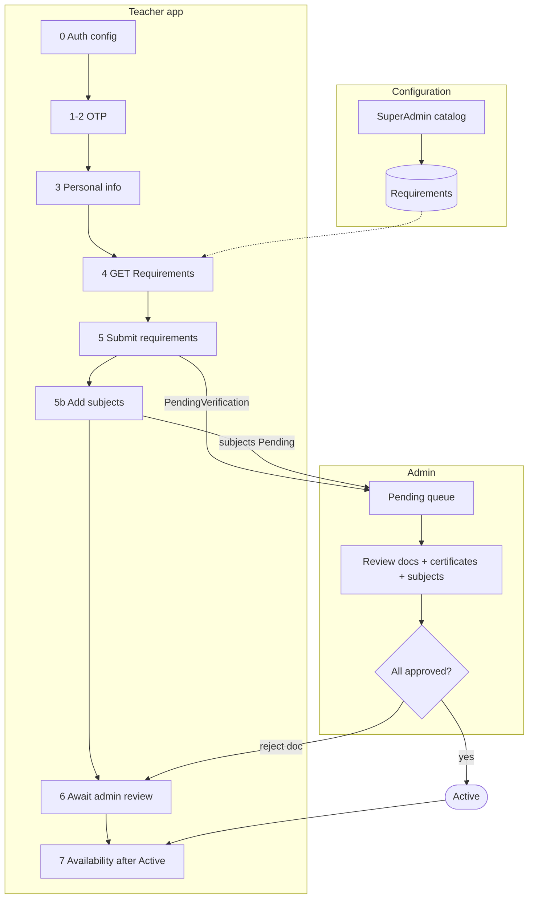
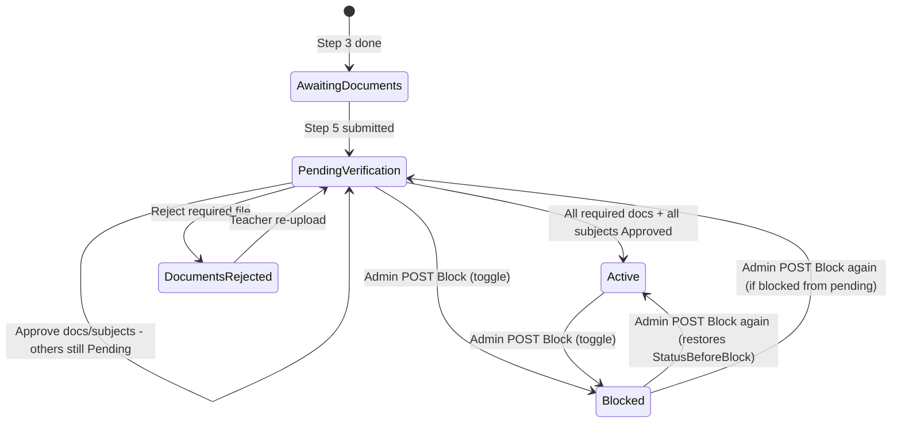

# Teacher registration — complete guide

Single reference for **teacher onboarding**: auth config, OTP, personal info, admin-configured requirements, **subjects before activation**, admin review, activation, and deployment.

> **End-to-end flow (v2):** [Teacher-Registration-Flow.md](Teacher-Registration-Flow.md) — recommended starting point for FE/QA  
> **Audience:** teacher app, admin panel, QA, DevOps  
> **Scalar / Swagger:** `/scalar/v1` — tags **Teacher Authentication**, **Admin · Teacher registration requirements**, **Teacher · Documents**, **Authentication Config (Public)**

---

## Table of contents

1. [Overview & flow](#overview--flow)
2. [Step 0 — Auth config](#step-0--auth-config)
3. [Steps 1–2 — OTP](#steps-12--otp)
4. [Step 3 — Personal info](#step-3--personal-info)
5. [Steps 4–6 — Requirements & status](#steps-46--requirements--status)
6. [Admin — SuperAdmin catalog](#admin--superadmin-catalog)
7. [Admin — Review teachers](#admin--review-teachers)
8. [Backend data model](#backend-data-model)
9. [Activation rules](#activation-rules)
10. [Frontend form builder](#frontend-form-builder)
11. [Deployment & troubleshooting](#deployment--troubleshooting)
12. [Environment & admin login](#environment--admin-login)
13. [Checklists](#checklists)
14. [Source code index](#source-code-index)
15. [After activation](#after-activation)
16. [Out of scope (v1)](#out-of-scope-v1)

---

## Overview & flow

| # | Screen | Method | Path | Auth |
|---|--------|--------|------|------|
| 0 | Load auth UI rules | GET | `/Api/V1/Authentication/Config` | None |
| 1 | Send OTP | POST | `/Api/V1/Authentication/Teacher/LoginOrRegister` | None |
| 2 | Verify OTP | POST | `/Api/V1/Authentication/Teacher/VerifyOtp` | None |
| 3 | Name + password | POST | `/Api/V1/Authentication/Teacher/CompletePersonalInfo` | Bearer (step 2) |
| 4 | Load dynamic fields | GET | `/Api/V1/Authentication/Teacher/RegistrationRequirements` | None |
| 5 | Submit documents / bio / location | POST | `/Api/V1/Authentication/Teacher/SubmitRegistrationRequirements` | Bearer (Teacher) |
| 5b | Add teaching subjects | POST | `/Api/V1/Teacher/TeacherSubject` | Bearer (Teacher) — see [filter-options](Teacher-Availability-and-Subjects.md) |
| 6 | Poll account status | GET | `/Api/V1/Authentication/Teacher/AccountStatus` | Bearer (Teacher) |
| 6b | Full checklist + re-upload | GET | `/Api/V1/Teacher/TeacherDocuments/Status` | Bearer (Teacher) |
| 7 | Set availability (after Active) | POST | `/Api/V1/Teacher/TeacherAvailability` | Bearer (Teacher) |

**Legacy (deprecated):** `POST …/Teacher/UploadDocuments` — same handler as step 5.

**Flow summary (v2):** Submit requirements → add subjects while `PendingVerification` → admin approves docs + subjects → **Active** → availability. Details: [Teacher-Registration-Flow.md](Teacher-Registration-Flow.md).



**Prerequisites (backend):**

1. Migration `AddTeacherRegistrationRequirements` applied.
2. Default catalog seeded (4 system rows on API startup, or SQL script).
3. Codes present: `identity_document`, `certificate`, `bio`, `location`.

---

## Step 0 — Auth config

Call on app load **before** login/register UI.

```http
GET /Api/V1/Authentication/Config
```

No auth header.

### Response (`data`)

| Block | Use |
|-------|-----|
| `teacher` | Teacher app login/register |
| `otp.length` | OTP input maxlength |
| `otp.expirySeconds` | Optional countdown |

### Teacher persona fields

| Field | UI |
|-------|-----|
| `showPhoneField` | Show country code + phone |
| `showEmailField` | Show email on step 1 |
| `phoneRequired` | Validate phone before submit |
| `emailRequired` | Validate email before submit |
| `otpDelivery` | `"Email"` or `"Sms"` — drives copy |
| `otpHintEn` / `otpHintAr` | Subtitle on verify screen |
| `loginMethod` | `"Otp"` — OTP flow (not password login) |

### Example (email OTP, default seed)

```json
{
  "succeeded": true,
  "data": {
    "teacher": {
      "loginMethod": "Otp",
      "otpDelivery": "Email",
      "showPhoneField": true,
      "showEmailField": true,
      "phoneRequired": true,
      "emailRequired": true,
      "otpHintEn": "We sent a 4-digit code to your email",
      "otpHintAr": "أرسلنا رمزاً من 4 أرقام إلى بريدك الإلكتروني"
    },
    "otp": { "length": 4, "expirySeconds": 300 }
  }
}
```

Settings come from DB key `Auth.Settings` (no server cache). SuperAdmin changes via `GET/PUT /Api/V1/Admin/SystemSettings/Auth`.

**Email OTP pipeline:** OTP generated → bilingual HTML email → RabbitMQ → Messaging API → SMTP.

---

## Steps 1–2 — OTP

### Step 1 — Send OTP

```http
POST /Api/V1/Authentication/Teacher/LoginOrRegister
Content-Type: application/json

{
  "countryCode": "+966",
  "phoneNumber": "501234567",
  "email": "teacher@example.com"
}
```

Include `email` when `data.teacher.emailRequired` is true.

| Response field | Meaning |
|----------------|---------|
| `otpSentTo` | `"email"` or `"sms"` |
| `maskedDestination` | Where the code was sent |
| `isNewUser` | Registration vs login |

### Step 2 — Verify OTP

```http
POST /Api/V1/Authentication/Teacher/VerifyOtp
Content-Type: application/json

{
  "countryCode": "+966",
  "phoneNumber": "501234567",
  "otpCode": "1234"
}
```

Returns JWT. Use `otpHintEn` + `maskedDestination` on the verify screen.

**Token note:** Replace stored token when a new one is returned. After step 3, the token includes the `Teacher` role — required for steps 5–6.

---

## Step 3 — Personal info

**No email field on this screen** when email was collected in step 1 (typical flow).

```http
POST /Api/V1/Authentication/Teacher/CompletePersonalInfo
Authorization: Bearer {tokenFromVerifyOtp}
Content-Type: application/json

{
  "firstName": "Ahmed",
  "lastName": "Ali",
  "password": "SecurePass1!"
}
```

| Field | Required | Notes |
|-------|----------|-------|
| `firstName` | Yes | Max 50 chars |
| `lastName` | Yes | Max 50 chars |
| `password` | Yes | 8+ chars, upper, lower, digit, special |
| `email` | No | Omit if set at OTP; only send to add/change |

Password rules enforced by validator. Email format validated only when provided.

---

## Steps 4–6 — Requirements & status

### Default seeded fields

| Code | Type | Required | Form fields |
|------|------|----------|-------------|
| `identity_document` | File | Yes | `identityType`, `documentNumber`, `issuingCountryCode`, `identityDocumentFile` |
| `certificate` | File | Yes (1–5) | `certificates[i].file`, title, issuer, `issueDate` |
| `bio` | Text | No | `bio` (max 500) |
| `location` | Boolean | Yes | `isInSaudiArabia` |
| *custom* | File | varies | `file_{code}` e.g. `file_custom_cv` |
| *custom* | Text | varies | `text_{code}` |
| *custom* | Boolean | varies | `bool_{code}` (`true` / `false`) |
| *custom* | Selection | varies | `select_{code}` — repeat the key per chosen option value when `maxCount > 1` |

Seed JSON: [`seed-data/teacher-registration-requirements.json`](seed-data/teacher-registration-requirements.json)

**Helper GETs:**

| Path | Purpose |
|------|---------|
| `/Api/V1/Authentication/IdentityTypes?isInSaudiArabia=true\|false` | Identity dropdown |
| `/Api/V1/Authentication/DocumentTypes` | Legacy labels |

---

### Step 4 — Load requirements

```http
GET /Api/V1/Authentication/Teacher/RegistrationRequirements
```

No auth. Returns **active** requirements only.

```json
{
  "requirements": [
    {
      "code": "identity_document",
      "nameAr": "وثيقة الهوية",
      "nameEn": "Identity document",
      "requirementType": "File",
      "isRequired": true,
      "sortOrder": 10,
      "minCount": 1,
      "maxCount": 1,
      "maxFileSizeBytes": 10485760,
      "allowedExtensions": [".pdf", ".jpg", ".jpeg", ".png"]
    }
  ]
}
```

**UI rules:**

1. Sort by `sortOrder`.
2. Render by `requirementType`:
   - `File` → file picker(s)
   - `Text` → textarea / input
   - `Boolean` → toggle
   - `Selection` → dropdown (single when `maxCount == 1`) or checkbox group (multi when `maxCount > 1`). Use `options[]` from the response — each item is `{ value, labelAr, labelEn }`.
3. Badge when `isRequired`.
4. Files: enforce `minCount`/`maxCount`, `allowedExtensions`, `maxFileSizeBytes`.
5. System codes → fixed fields (table above). Custom requirements → prefixed wire format: `file_{code}`, `text_{code}`, `bool_{code}`, `select_{code}`.

---

### Step 5 — Submit (multipart)

```http
POST /Api/V1/Authentication/Teacher/SubmitRegistrationRequirements
Authorization: Bearer {teacherJwt}
Content-Type: multipart/form-data
```

The form body bundles **every active requirement** in one request. The FE iterates `requirements[]` from step 4 and appends fields per requirement using the mapping below. Binding is `[FromForm]` and field names are **case-insensitive**. Anything outside the mapping is silently ignored.

#### Field reference — per requirement code / type

| `code` (step 4) | `requirementType` | Multipart form field(s) the FE appends | Bound to |
|---|---|---|---|
| `identity_document` (system) | `File` | `IdentityType` (int or enum name) · `DocumentNumber` (string) · `IssuingCountryCode` (string, only for Passport / DrivingLicense) · `IdentityDocumentFile` (one binary) | `IdentityType`, `DocumentNumber`, `IssuingCountryCode`, `IdentityDocumentFile` |
| `certificate` (system) | `File` (1..5) | For each `i` in `0..count-1`: `Certificates[i].file` (binary), `Certificates[i].title`, `Certificates[i].issuer`, `Certificates[i].issueDate` (`YYYY-MM-DD`) | `Certificates[]` (`CertificateUploadDto`) |
| `bio` (system) | `Text` | `Bio` (string, ≤ `maxLength`) | `Bio` |
| `location` (system) | `Boolean` | `IsInSaudiArabia` (`true` / `false`) | `IsInSaudiArabia` (nullable) |
| *any custom code* | `File` | `file_{code}` — one entry per file; repeat the field for multi-file rows | `CustomFilesByCode[code]` |
| *any custom code* | `Text` | `text_{code}` (string, ≤ `maxLength`) | `TextValuesByCode[code]` |
| *any custom code* | `Boolean` | `bool_{code}` (`true` / `false`) | `BoolValuesByCode[code]` |
| *any custom code* | `Selection` | `select_{code}` = `<optionValue>` — repeat the key per chosen option when `maxCount > 1` | `SelectionsByCode[code]` |

The four `*_{code}` prefixes are parsed by [`TeacherRegistrationFormHelper`](../Qalam.Api/Helpers/TeacherRegistrationFormHelper.cs). After parsing, the controller also **normalizes** the system Text/Boolean fields into the same dicts (`TextValuesByCode["bio"] = Bio`, `BoolValuesByCode["location"] = IsInSaudiArabia`) so the validator and persistence service dispatch off `code` uniformly — no hardcoded system-code branches except for the two structurally-complex codes (`identity_document`, `certificate`).

#### Dispatch logic (server-side, in plain English)

1. Read the active+required catalog rows in `sortOrder`.
2. For each:
   - If `code == "identity_document"` → check `IdentityDocumentFile` is present and the Saudi/Identity business rules pass.
   - If `code == "certificate"` → check at least `minCount` certs, each with a `.file`.
   - Else dispatch by `requirementType`:
     - `File` → `CustomFilesByCode[code].Count >= minCount`
     - `Text` → `TextValuesByCode[code]` non-empty (≤ `maxLength` if set)
     - `Boolean` → `BoolValuesByCode[code]` non-null
     - `Selection` → `SelectionsByCode[code]` count in `[minCount..maxCount]`, every value found in the requirement's `options[]`
3. If any check fails, return 400 with a specific message (table at the bottom of this section).
4. Otherwise persist inside a transaction: clean any orphans from prior partial attempts, then write one `TeacherRegistrationSubmission` per requirement.

System Text (`bio`) and Boolean (`location`) also mirror into the `Teacher` entity's dedicated columns (`teacher.Bio`, `teacher.Location`) because admin views read those directly. Selection values are stored comma-joined in `TextValue`; on read, the status reader resolves each option back to its bilingual label.

#### Why this hybrid (generic + 2 hardcoded codes)

`identity_document` and `certificate` carry **non-generic shapes** — four cross-validated fields and a list-of-tuples respectively. Forcing them through a code-keyed dict would lose FluentValidation, Scalar/Swagger typing, and the Saudi cross-field rules. Everything else (system `bio` / `location`, plus any custom `File` / `Text` / `Boolean` / `Selection`) is a single value per code → the generic dispatch covers it cleanly. Adding a new requirement type to the catalog is now an admin-side change, not a code deploy.

#### `IdentityType` (int / name) enum

| Value | Name | Used when |
|:---:|---|---|
| `1` | `NationalId` | `IsInSaudiArabia=true` |
| `2` | `Iqama` | `IsInSaudiArabia=true` |
| `3` | `Passport` | `IsInSaudiArabia=false` — `IssuingCountryCode` required |
| `4` | `DrivingLicense` | `IsInSaudiArabia=false` — `IssuingCountryCode` required |

Both the integer (`1`) and the enum name (`NationalId`) bind correctly; pick one and be consistent.

#### Worked example — catalog with system + custom rows

Assume the admin catalog has these nine active requirements (mix of system + custom, all from earlier examples in this guide):

| `sortOrder` | `code` | Type | Required | Notes |
|:---:|---|---|:---:|---|
| 0 | `test` | File | ✅ | custom |
| 10 | `identity_document` | File | ✅ | system |
| 20 | `certificate` | File | ✅ | system, min 1, max 5 |
| 25 | `teaching_subjects` | Selection | ✅ | custom, min 1, max 3, options: `math` / `quran` / `arabic` / `english` / `science` |
| 28 | `teaching_mode` | Selection | ✅ | custom, single (max 1), options: `online` / `in_person` / `hybrid` |
| 30 | `bio` | Text | ⛔ optional | system, ≤ 500 chars |
| 40 | `location` | Boolean | ✅ | system |
| 60 | `motto` | Text | ⛔ optional | custom, ≤ 200 chars |
| 70 | `accepts_payment_split` | Boolean | ✅ | custom |

#### Postman form-data — happy path (15 rows → 200)

Open Postman → **Body → form-data**. Type each row exactly as listed. Set the **type** dropdown on the right of the value cell to **File** for the three binary rows, **Text** for the rest. **Don't add a `UserId` row** — the server reads it from the JWT.

| Key | Value | Type |
|---|---|---|
| `file_test` | `<select PDF/JPG/PNG ≤ 10 MB>` | **File** |
| `IsInSaudiArabia` | `true` | Text |
| `IdentityType` | `NationalId` | Text |
| `DocumentNumber` | `1234567890` | Text |
| `IdentityDocumentFile` | `<binary>` | **File** |
| `Certificates[0].file` | `<binary>` | **File** |
| `Certificates[0].title` | `Bachelor of Education` | Text |
| `Certificates[0].issuer` | `King Saud University` | Text |
| `Certificates[0].issueDate` | `2020-06-01` | Text |
| `select_teaching_subjects` | `math` | Text |
| `select_teaching_subjects` | `quran` | Text |
| `select_teaching_mode` | `online` | Text |
| `bool_accepts_payment_split` | `true` | Text |
| `Bio` | `Experienced Quran teacher with 8 years of online teaching.` | Text |
| `text_motto` | `Knowledge is light.` | Text |

`select_teaching_subjects` appears **twice** with two different values — Postman accepts duplicate keys; just add two rows.

Expected response:

```json
{
  "statusCode": "OK",
  "succeeded": true,
  "message": "Registration submitted successfully. Your information is pending verification.",
  "data": null,
  "errors": null,
  "meta": null
}
```

#### Same body in `curl`

```sh
echo "%PDF-1.4" > /tmp/dummy.pdf
TOKEN="<paste teacher JWT>"

curl -i -X POST "http://localhost:8080/Api/V1/Authentication/Teacher/SubmitRegistrationRequirements" \
  -H "Authorization: Bearer $TOKEN" \
  -F "file_test=@/tmp/dummy.pdf" \
  -F "IsInSaudiArabia=true" \
  -F "IdentityType=NationalId" \
  -F "DocumentNumber=1234567890" \
  -F "IdentityDocumentFile=@/tmp/dummy.pdf" \
  -F "Certificates[0].file=@/tmp/dummy.pdf" \
  -F "Certificates[0].title=Bachelor of Education" \
  -F "Certificates[0].issuer=King Saud University" \
  -F "Certificates[0].issueDate=2020-06-01" \
  -F "select_teaching_subjects=math" \
  -F "select_teaching_subjects=quran" \
  -F "select_teaching_mode=online" \
  -F "bool_accepts_payment_split=true" \
  -F "Bio=Experienced Quran teacher with 8 years of online teaching." \
  -F "text_motto=Knowledge is light."
```

#### Minimum acceptable body — required only (9 rows → 200)

Drop the two optional rows (`Bio`, `text_motto`):

| Key | Value | Type |
|---|---|---|
| `file_test` | `<binary>` | **File** |
| `IsInSaudiArabia` | `true` | Text |
| `IdentityType` | `NationalId` | Text |
| `DocumentNumber` | `1234567890` | Text |
| `IdentityDocumentFile` | `<binary>` | **File** |
| `Certificates[0].file` | `<binary>` | **File** |
| `select_teaching_subjects` | `math` | Text |
| `select_teaching_mode` | `online` | Text |
| `bool_accepts_payment_split` | `true` | Text |

Cert metadata (`.title`/`.issuer`/`.issueDate`) is all optional — server stores `null` for missing fields. `IssuingCountryCode` must be **omitted** for `NationalId`/`Iqama`; for `Passport`/`DrivingLicense` it's required (ISO 3166-1 alpha-3 like `EGY`).

#### Verify what landed in the DB

```sql
-- Resolve teacherId
SELECT t.Id, t.Status, t.Bio, t.Location FROM dbo.Teachers t WHERE t.UserId = <yourUserId>;

-- 1 row per active requirement (or per cert/file for File requirements)
SELECT r.Code, r.RequirementType, s.VerificationStatus, s.TextValue, s.BoolValue, s.TeacherDocumentId
FROM teacher.TeacherRegistrationSubmissions s
JOIN teacher.TeacherRegistrationRequirements r ON r.Id = s.RequirementId
WHERE s.TeacherId = <yourTeacherId>
ORDER BY r.SortOrder;
```

Expected after the 15-row happy path above:

| Code | TextValue | BoolValue | TeacherDocumentId | VerificationStatus |
|---|---|:---:|:---:|:---:|
| `test` | NULL | NULL | (id) | Pending |
| `identity_document` | NULL | NULL | (id) | Pending |
| `certificate` | NULL | NULL | (id) | Pending |
| `teaching_subjects` | `math,quran` | NULL | NULL | Approved |
| `teaching_mode` | `online` | NULL | NULL | Approved |
| `bio` | `Experienced…` | NULL | NULL | Approved |
| `location` | NULL | `1` | NULL | Approved |
| `motto` | `Knowledge is light.` | NULL | NULL | Approved |
| `accepts_payment_split` | NULL | `1` | NULL | Approved |

Also: `teacher.Status = PendingVerification`, `teacher.Bio = "Experienced…"`, `teacher.Location = InsideSaudiArabia`.

#### Failure matrix — drop one row at a time, expect 400

In Postman, **uncheck** the row instead of deleting it so you can re-enable.

| Disable this row | `message` returned |
|---|---|
| `file_test` | `"Requirement 'test' requires at least 1 file(s)."` |
| `IdentityDocumentFile` | `"Identity document is required."` |
| `DocumentNumber` | `"Document number is required"` (ASP.NET implicit-required) |
| all four `Certificates[0].*` rows | `"At least 1 certificate(s) required."` |
| `IsInSaudiArabia` | `"Requirement 'location' is required."` |
| both `select_teaching_subjects` rows | `"Requirement 'teaching_subjects' requires at least 1 selection(s)."` |
| `select_teaching_mode` | `"Requirement 'teaching_mode' requires at least 1 selection(s)."` |
| `bool_accepts_payment_split` | `"Requirement 'accepts_payment_split' is required."` |
| Only `Bio` and/or `text_motto` | **200 OK** — both are optional |

#### Boundary / cross-field failures — add extra rows

Keep the happy-path rows enabled, then **add** one of these:

| Add this | `message` returned |
|---|---|
| Two more `select_teaching_subjects` values (total 4 picks, maxCount=3) | `"At most 3 selection(s) allowed for 'teaching_subjects'."` |
| `select_teaching_subjects` = `physics` (not in options) | `"'physics' is not a valid option for 'teaching_subjects'."` |
| Second `select_teaching_mode` = `hybrid` (maxCount=1) | `"At most 1 selection(s) allowed for 'teaching_mode'."` |
| `text_motto` = 250-char string (maxLength=200) | `"Requirement 'motto' exceeds the maximum length of 200 characters."` |
| Change `IdentityType` to `Passport`, leave `IsInSaudiArabia=true` | `"Teachers inside Saudi Arabia must use National ID or Iqama"` (localized) |
| Set `IdentityType=Passport`, `IsInSaudiArabia=false`, no `IssuingCountryCode` | `"Issuing country is required for Passport / Driving License"` |
| Add `IssuingCountryCode=EGY` while `IdentityType=NationalId` | `"Issuing country should not be provided for National ID / Iqama"` |
| Send a teacher's own previously-registered `DocumentNumber` | `"This identity document is already registered in the system."` |

#### Reset between attempts

A successful submit flips `teacher.Status` to `PendingVerification`, which the handler then refuses on subsequent submits with `"Documents already pending verification"`. For repeated testing in a single teacher account:

```sql
UPDATE dbo.Teachers SET Status = 1 WHERE Id = <yourTeacherId>;
DELETE FROM teacher.TeacherRegistrationSubmissions WHERE TeacherId = <yourTeacherId>;
DELETE FROM dbo.TeacherDocuments WHERE TeacherId = <yourTeacherId> AND VerificationStatus = 1;
```

Status enum: `AwaitingDocuments=1`, `PendingVerification=2`, `Active=3`, `Blocked=4`, `DocumentsRejected=5`. The submit handler also wipes orphans internally on each attempt (transactional cleanup), so the second submit doesn't need the manual DELETE rows above — they're just useful for a known-clean baseline.

#### What gets persisted (server-side recap)

- `File` requirements (`identity_document`, `certificate`, `test`, any custom File): one `TeacherDocument` row per file + one `TeacherRegistrationSubmission` row pointing at it. `VerificationStatus = Pending` — admin must approve.
- `Text` requirements (`bio`, `motto`, any custom Text): submission row with `TextValue = <input>`. Auto-`Approved`. `bio` also mirrors into `teacher.Bio`.
- `Boolean` requirements (`location`, `accepts_payment_split`, any custom Boolean): submission row with `BoolValue = <true|false>`. Auto-`Approved`. `location` also mirrors into `teacher.Location` enum.
- `Selection` requirements (`teaching_subjects`, `teaching_mode`, any custom Selection): submission row with `TextValue = <comma-joined option values>`. Auto-`Approved`. Status reader splits on `,` and resolves each value to a bilingual label via the requirement's `OptionsJson`.

**Re-submission:** if the teacher is in `DocumentsRejected` and wants to fix individual rejected files, do **not** re-call this endpoint — use the per-document re-upload route covered in §Step 6 + Step F of §Admin Review.

#### After submit — registration `nextStep` order

`VerifyOtp` and `AccountStatus` both return `nextStep` from `GetNextRegistrationStepAsync`. After documents are submitted (`PendingVerification`), the typical sequence is:

| Order | `nextStepName` | When |
|-------|----------------|------|
| 1 | **Complete Domain Questions** | Catalog domains have required Q not yet answered |
| 2 | **Awaiting Domain Verification** | All catalog domains submitted; admin review pending |
| 3 | **Fix Domain Verification** | Admin rejected one or more domain answers (login still allowed) |
| 4 | **Add Teaching Subjects and Units** | All catalog domains approved |
| 5 | **Awaiting Admin Verification** / **Awaiting Final Approval** | Subjects added; account review |

`POST /Teacher/DomainQuestions/submit` may include `nextStep` in the response for immediate navigation.

---

### Step 6 — Account status poll & full checklist

**Poll account status (waiting screen):**

```http
GET /Api/V1/Authentication/Teacher/AccountStatus
Authorization: Bearer {teacherJwt}
```

```json
{
  "teacherStatus": "PendingVerification",
  "isAccountActivated": false,
  "canBeActivated": true,
  "awaitingFinalApproval": true,
  "requiresAvailabilitySetup": false,
  "nextStep": {
    "nextStepName": "Awaiting Final Approval",
    "isRegistrationComplete": false,
    "awaitingFinalApproval": true,
    "requiresAvailabilitySetup": false
  }
}
```

Poll every few seconds on the waiting page. When `isAccountActivated` becomes true and `requiresAvailabilitySetup` is true, route to availability setup. When activated with availability configured, route to dashboard via `nextStep.nextStepName`.

**Full checklist (rejection reasons + re-upload IDs):**

```http
GET /Api/V1/Teacher/TeacherDocuments/Status
Authorization: Bearer {teacherJwt}
```

```json
{
  "teacherStatus": "PendingVerification",
  "isAccountActivated": false,
  "canBeActivated": true,
  "awaitingFinalApproval": true,
  "requiresAvailabilitySetup": false,
  "subjectSummary": {
    "totalSubjects": 2,
    "activeSubjects": 2,
    "pendingSubjects": 0,
    "inactiveSubjects": 0,
    "rejectedSubjects": 0
  },
  "requirements": [
    {
      "code": "identity_document",
      "requirementType": "File",
      "isRequired": true,
      "isSubmitted": true,
      "verificationStatus": "Pending",
      "teacherDocumentId": 42
    },
    {
      "code": "bio",
      "requirementType": "Text",
      "isRequired": false,
      "isSubmitted": true,
      "verificationStatus": "Approved",
      "textValue": "Experienced Quran teacher with 8 years of online teaching."
    },
    {
      "code": "location",
      "requirementType": "Boolean",
      "isRequired": true,
      "isSubmitted": true,
      "verificationStatus": "Approved",
      "boolValue": true
    },
    {
      "code": "teaching_subjects",
      "requirementType": "Selection",
      "isRequired": true,
      "isSubmitted": true,
      "verificationStatus": "Approved",
      "textValue": "math,quran",
      "selectedOptions": [
        { "value": "math",  "labelAr": "رياضيات", "labelEn": "Math" },
        { "value": "quran", "labelAr": "قرآن",    "labelEn": "Quran" }
      ]
    }
  ],
  "legacyDocuments": []
}
```

For Selection rows, the FE can render directly off `selectedOptions[]` (bilingual labels resolved server-side from the requirement's `OptionsJson`). `textValue` still holds the raw comma-joined option values for reference; on re-submit, split it by `,` to pre-fill the picker.

| Field | When true | FE action |
|-------|-----------|-----------|
| `awaitingFinalApproval` | All docs + subjects approved; admin has not `POST Activate` yet | Show **Awaiting final approval** section on waiting page |
| `isAccountActivated` | `teacherStatus === Active` | Account live — leave waiting page |
| `requiresAvailabilitySetup` | Active and no weekly availability rows | After activation, route to availability wizard |
| `canBeActivated` | Same as admin `canBeActivated` on teacher detail | Informational; prefer `awaitingFinalApproval` for UI |

Poll this endpoint on the waiting screen every few seconds. When `isAccountActivated` becomes `true` and `requiresAvailabilitySetup` is `true`, navigate to availability. When activated and availability exists, go to dashboard.

| `verificationStatus` | UI |
|---------------------|-----|
| `Pending` | Under review |
| `Approved` | Checkmark |
| `Rejected` | Show `rejectionReason`; re-upload via `PUT …/Teacher/TeacherDocuments/{teacherDocumentId}/Reupload` |

---

### Teacher account statuses

| Status | Meaning |
|--------|---------|
| `PendingVerification` | Submitted; awaiting admin |
| `DocumentsRejected` | Required item rejected |
| `Active` | All active required items approved |
| `Blocked` | Admin blocked |

---

## Admin — SuperAdmin catalog

**Role:** `SuperAdmin`  
**Base:** `/Api/V1/Admin/TeacherRegistrationRequirements`

| Method | Path | Action |
|--------|------|--------|
| GET | `/` | List all (incl. inactive) |
| GET | `/{id}` | Detail |
| POST | `/` | Create custom requirement |
| PUT | `/{id}` | Update labels, limits, active/required |
| DELETE | `/{id}` | Delete (not system, no submissions) |
| PATCH | `/{id}/active` | Toggle `isActive` |

### Create custom requirement

```json
{
  "code": "custom_cv",
  "nameAr": "السيرة الذاتية",
  "nameEn": "CV",
  "requirementType": 1,
  "isActive": true,
  "isRequired": false,
  "sortOrder": 50,
  "minCount": 0,
  "maxCount": 1,
  "maxFileSizeBytes": 10485760,
  "allowedExtensions": [".pdf"],
  "mapsToDocumentType": 3
}
```

### Create a Selection requirement (picklist)

`requirementType: 4` opens a bilingual single- or multi-select control. `maxCount` controls cardinality (`1` = single radio/dropdown, `>1` = multi). `options[]` is required and each entry must carry `value`, `labelAr`, and `labelEn`.

```json
{
  "code": "teaching_subjects",
  "nameAr": "المواد التي تدرسها",
  "nameEn": "Subjects you teach",
  "requirementType": 4,
  "isActive": true,
  "isRequired": true,
  "sortOrder": 25,
  "minCount": 1,
  "maxCount": 3,
  "options": [
    { "value": "math",  "labelAr": "رياضيات", "labelEn": "Math" },
    { "value": "quran", "labelAr": "قرآن",   "labelEn": "Quran" },
    { "value": "lang",  "labelAr": "لغات",    "labelEn": "Languages" }
  ]
}
```

Validation enforced server-side: `options` non-empty, each entry's three fields non-empty, `value`s unique, `1 <= MinCount <= MaxCount <= options.Count`.

| Enum | Values |
|------|--------|
| `requirementType` | `1` File, `2` Text, `3` Boolean, `4` Selection |
| `mapsToDocumentType` | `1` Identity, `2` Certificate, `3` Other |

**Rules:** unique `code` (snake_case); don’t delete system rows — use `PATCH …/active`; delete fails if submissions exist.

### Auth OTP settings (separate)

`GET/PUT /Api/V1/Admin/SystemSettings/Auth` — controls step 0–2 only, not registration fields.

---

## Admin — Review teachers

**Role:** `Admin` or `SuperAdmin`
**Base:** `/Api/V1/Admin/TeacherManagement`

The review cycle starts the moment a teacher submits step 5 (status flips to `PendingVerification`) and ends with `Active`, `DocumentsRejected`, or `Blocked`. Approve/reject of any single document is idempotent server-side and **automatically refreshes the teacher's status** via `ITeacherRegistrationCompletionService.RefreshTeacherStatusAfterReviewAsync`.

**Lifecycle emails** (queued, bilingual, login link from `PLATFORM_WEB_APP_BASE_URL`): registration received (first submit only), document rejected, subject rejected, account activated, account blocked/unblocked. See [Teacher-Registration-Flow.md](Teacher-Registration-Flow.md#teacher-lifecycle-emails).

### Lifecycle (state diagram)



| State | Set by | Admin actions available |
|-------|--------|-------------------------|
| `AwaitingDocuments` | Step 3 (CompletePersonalInfo) | wait — teacher hasn't submitted yet |
| `PendingVerification` | Step 5 (SubmitRegistrationRequirements) OR re-upload | Approve / Reject documents; Approve / Reject subjects; Block |
| `DocumentsRejected` | Any required file rejected during review | Approve remaining; Block (re-upload comes from teacher) |
| `Active` | All required docs **and all subjects** approved | Block only |
| `Blocked` | Admin POST Block (toggle — call again to unblock) | none |

### All endpoints (complete reference)

**Auth (every row):** `Authorization: Bearer <admin-jwt>` · roles `Admin` or `SuperAdmin`  
**Envelope:** `{ "succeeded", "message", "data", "meta"?, "errors" }` — paginated lists put rows in `data` and page info in `meta`.

| # | Method | Full path | Query / body | Response `data` |
|---|--------|-----------|--------------|-----------------|
| 1 | GET | `/Api/V1/Admin/TeacherManagement/Teachers` | `pageNumber`, `pageSize`, `status`, `location`, `subjectId`, `search`, `sortBy` | `AdminTeacherListItemDto[]` + `meta` |
| 2 | GET | `/Api/V1/Admin/TeacherManagement/Pending` | `pageNumber`, `pageSize` | `PendingTeacherDto[]` + `meta` |
| 3 | GET | `/Api/V1/Admin/TeacherManagement/{teacherId}` | — | `TeacherDetailsDto` (documents, checklist, subjects, `canBeActivated`) |
| 4 | POST | `/Api/V1/Admin/TeacherManagement/{teacherId}/Documents/{documentId}/Approve` | — | `"Document approved successfully."` |
| 5 | POST | `/Api/V1/Admin/TeacherManagement/{teacherId}/Documents/{documentId}/Reject` | `{ "reason": "…" }` required, max 500 | `"Document rejected successfully."` |
| 6 | POST | `/Api/V1/Admin/TeacherManagement/{teacherId}/Block` | `{ "reason": "…" }` optional, max 500 | `"Teacher blocked successfully."` |
| 6b | POST | `/Api/V1/Admin/TeacherManagement/{teacherId}/Activate` | — | `"Teacher account activated successfully."` (when `canBeActivated`; queues welcome email) |
| 7 | GET | `/Api/V1/Admin/TeacherManagement/Subjects` | `pageNumber`, `pageSize`, `teacherId`, `subjectId`, `isActive`, `verificationStatus` | `AdminTeacherSubjectDto[]` + `meta` |
| 8 | GET | `/Api/V1/Admin/TeacherManagement/{teacherId}/Subjects` | — | `AdminTeacherSubjectDto[]` |
| 9 | GET | `/Api/V1/Admin/TeacherManagement/{teacherId}/Subjects/{teacherSubjectId}` | — | `AdminTeacherSubjectDto` |
| 10 | POST | `/Api/V1/Admin/TeacherManagement/{teacherId}/Subjects/{teacherSubjectId}/Approve` | — | `"Teacher subject approved successfully."` |
| 11 | POST | `/Api/V1/Admin/TeacherManagement/{teacherId}/Subjects/{teacherSubjectId}/Inactivate` | — | `"Teacher subject inactivated successfully."` |
| 12 | POST | `/Api/V1/Admin/TeacherManagement/{teacherId}/Subjects/{teacherSubjectId}/Activate` | — | `"Teacher subject activated successfully."` |
| 13 | POST | `/Api/V1/Admin/TeacherManagement/{teacherId}/Subjects/{teacherSubjectId}/Reject` | `{ "reason": "…" }` required, max 500 | `"Teacher subject rejected successfully."` |
| 14 | POST | `/Api/V1/Admin/TeacherManagement/{teacherId}/Subjects/{teacherSubjectId}/Restore` | — | `"Teacher subject restored successfully."` |

**Query reference (quick)**

| Param | Endpoints | Values |
|-------|-----------|--------|
| `pageNumber`, `pageSize` | #1, #2, #7 | Pagination; #1 max `pageSize` 50 |
| `status` | #1 | See [Endpoint 1 filters](#endpoint-1--browse-all-teachers) |
| `location` | #1 | `InsideSaudiArabia`, `OutsideSaudiArabia` |
| `subjectId` | #1, #7 | Catalog subject id |
| `search` | #1 | Substring on name, phone, email |
| `sortBy` | #1 | `1` Newest, `2` NameAsc, `3` Status |
| `teacherId` | #7 | Filter global subjects list to one teacher |
| `isActive` | #7 | `true` / `false` |
| `verificationStatus` | #7 | `1` Pending, `2` Approved, `3` Rejected |

`GET /{teacherId}` (#3) also returns `subjects` and `subjectSummary` for the **Subjects** tab. New teacher subjects start **Pending** on `POST /Api/V1/Teacher/TeacherSubject`; admin uses **Approve** (#10) or **Reject** (#13) during review, then #11–#12/#14 for moderation after activation.

**UI guide (Subjects tab):** [Admin-Teacher-Subjects-Frontend.md](Admin-Teacher-Subjects-Frontend.md) · **Postman:** `Postman/Admin/TeacherManagement.postman_collection.json`

---

### Endpoint 1 — Browse all teachers

```http
GET /Api/V1/Admin/TeacherManagement/Teachers?pageNumber=1&pageSize=10&status=Active&location=InsideSaudiArabia&subjectId=5&search=ahmed&sortBy=1
Authorization: Bearer <admin-jwt>
```

All query parameters are **optional**. When more than one is sent, filters are **AND-combined** (a row must match every supplied filter).

#### Filters

| Param | Type | Default | Description |
|-------|------|---------|-------------|
| `pageNumber` | int | `1` | 1-based page index. Values `< 1` are treated as `1`. |
| `pageSize` | int | `10` | Rows per page. Clamped to **max 50** (`> 50` → `50`; `< 1` → `10`). |
| `status` | string | *(none)* | Exact match on `Teacher.Status`. Case-insensitive enum name. Omit to include **all** statuses. |
| `location` | string | *(none)* | Exact match on `Teacher.Location`. Case-insensitive enum name. |
| `subjectId` | int | *(none)* | Teachers who have **at least one** `TeacherSubject` row with this catalog `subjectId` (any approval/active state). |
| `search` | string | *(none)* | Case-sensitive **substring** (`Contains`) on concatenated `firstName + " " + lastName`, `phoneNumber`, or `email`. Whitespace trimmed. |
| `sortBy` | int | `1` | Sort order (see below). |

#### `status` values

| Value | Meaning |
|-------|---------|
| `AwaitingDocuments` | Step 3 done; registration requirements not yet submitted |
| `PendingVerification` | Submitted; awaiting admin document review |
| `DocumentsRejected` | At least one required document rejected |
| `Active` | All active required submissions approved |
| `Blocked` | Admin blocked the account |

Invalid `status` → **400** with message listing valid values.

#### `location` values

| Value | Meaning |
|-------|---------|
| `InsideSaudiArabia` | Teacher declared inside KSA |
| `OutsideSaudiArabia` | Teacher declared outside KSA |

#### `sortBy` values

| Value | Enum | Order |
|-------|------|-------|
| `1` | `Newest` (default) | `createdAt` descending |
| `2` | `NameAsc` | `firstName`, then `lastName` ascending |
| `3` | `Status` | `status` ascending, then `createdAt` descending |

You may also pass the enum name (`sortBy=NameAsc`) — ASP.NET binds it the same way.

#### Example requests

```http
# Active teachers in KSA, newest first
GET .../Teachers?status=Active&location=InsideSaudiArabia

# Teachers who teach Mathematics (catalog subject id 5)
GET .../Teachers?subjectId=5&status=Active

# Search by name or phone (combine with status)
GET .../Teachers?search=966501&status=PendingVerification&sortBy=2

# All teachers, page 2
GET .../Teachers?pageNumber=2&pageSize=20
```

#### Response

`data` is `AdminTeacherListItemDto[]`. Pagination is in `meta`:

```json
{
  "succeeded": true,
  "data": [ /* rows */ ],
  "meta": {
    "pageNumber": 1,
    "pageSize": 10,
    "totalCount": 42,
    "totalPages": 5,
    "hasPreviousPage": false,
    "hasNextPage": true
  }
}
```

Sample row:

```json
[
  {
    "teacherId": 12,
    "userId": 84,
    "fullName": "Ahmed Ali",
    "phoneNumber": "+966501234567",
    "email": "ahmed@example.com",
    "status": "Active",
    "location": "InsideSaudiArabia",
    "createdAt": "2026-05-15T08:00:00Z",
    "totalDocuments": 3,
    "pendingDocuments": 0,
    "approvedDocuments": 3,
    "rejectedDocuments": 0
  }
]
```

| Response field | Notes |
|----------------|-------|
| `status` | String form of `TeacherStatus` (e.g. `"Active"`) |
| `location` | `InsideSaudiArabia` or `OutsideSaudiArabia`, or `null` if not set |
| `totalDocuments` / `pendingDocuments` / `approvedDocuments` / `rejectedDocuments` | Counts over all `TeacherDocument` rows for that teacher |

Use for the main **Teachers** list (all statuses, filterable). For the verification queue only (`PendingVerification` + `DocumentsRejected`, no other filters), use endpoint #2.

---

### Endpoint 2 — Pending queue

Returns teachers in `PendingVerification` **or** `DocumentsRejected` (awaiting admin action or re-upload).

```http
GET /Api/V1/Admin/TeacherManagement/Pending
Authorization: Bearer <admin-jwt>
```

Returns the queue. Sample `data[]` (shape = `PendingTeacherDto`):

```json
[
  {
    "teacherId": 12,
    "userId": 84,
    "fullName": "Ahmed Ali",
    "phoneNumber": "+966501234567",
    "email": "ahmed@example.com",
    "status": "PendingVerification",
    "location": "InsideSaudiArabia",
    "createdAt": "2026-05-15T08:00:00Z",
    "totalDocuments": 3,
    "pendingDocuments": 2,
    "approvedDocuments": 1,
    "rejectedDocuments": 0
  }
]
```

UI: render a row per teacher with status pill + counts. Tap → fetch endpoint #3.

---

### Endpoint 3 — Preview teacher data

```http
GET /Api/V1/Admin/TeacherManagement/{teacherId}
Authorization: Bearer <admin-jwt>
```

Returns everything the admin needs to decide: profile, every document (with file path for the viewer), the registration requirements checklist, summary counts, and the `canBeActivated` flag. Shape = `TeacherDetailsDto`.

```json
{
  "teacherId": 12,
  "userId": 84,
  "fullName": "Ahmed Ali",
  "phoneNumber": "+966501234567",
  "email": "ahmed@example.com",
  "bio": "Experienced Quran teacher with 8 years of online teaching.",
  "status": "PendingVerification",
  "location": "InsideSaudiArabia",
  "createdAt": "2026-05-15T08:00:00Z",

  "documents": [
    {
      "id": 41,
      "documentType": 1,
      "filePath": "/uploads/teachers/12/identity/abc.pdf",
      "verificationStatus": 1,
      "rejectionReason": null,
      "reviewedAt": null,
      "documentNumber": "1234567890",
      "identityType": 1,
      "issuingCountryCode": null,
      "createdAt": "2026-05-15T08:00:00Z"
    },
    {
      "id": 42,
      "documentType": 2,
      "filePath": "/uploads/teachers/12/certificates/cert.pdf",
      "verificationStatus": 1,
      "rejectionReason": null,
      "certificateTitle": "BSc Mathematics",
      "issuer": "King Saud University",
      "issueDate": "2018-06-01",
      "createdAt": "2026-05-15T08:00:00Z"
    }
  ],

  "registrationRequirements": [
    { "code": "identity_document", "isRequired": true, "isSubmitted": true, "verificationStatus": "Pending", "teacherDocumentId": 41 },
    { "code": "certificate",       "isRequired": true, "isSubmitted": true, "verificationStatus": "Pending", "teacherDocumentId": 42 },
    { "code": "bio",               "isRequired": false, "isSubmitted": true, "verificationStatus": "Approved", "teacherDocumentId": null },
    { "code": "location",          "isRequired": true, "isSubmitted": true, "verificationStatus": "Approved", "teacherDocumentId": null }
  ],

  "totalDocuments": 2,
  "pendingDocuments": 2,
  "approvedDocuments": 0,
  "rejectedDocuments": 0,
  "canBeActivated": false,

  "subjectSummary": {
    "totalSubjects": 2,
    "activeSubjects": 1,
    "pendingSubjects": 0,
    "inactiveSubjects": 0,
    "rejectedSubjects": 1
  },
  "subjects": [
    {
      "id": 101,
      "teacherId": 12,
      "teacherFullName": "Ahmed Ali",
      "subjectId": 5,
      "subjectNameAr": "الرياضيات",
      "subjectNameEn": "Mathematics",
      "domainCode": "general_education",
      "canTeachFullSubject": true,
      "isActive": true,
      "verificationStatus": 2,
      "rejectionReason": null,
      "reviewedAt": null,
      "createdAt": "2026-05-20T10:00:00Z",
      "units": []
    }
  ]
}
```

**UI conventions:**

- Header: name, phone, email, status pill, "Created" timestamp, `Block` button (top-right destructive).
- Left pane: documents list — each row clickable to open `filePath` in a preview pane / new tab, with **Approve** / **Reject** buttons.
- Right pane: registration-requirements checklist driven by `registrationRequirements[]` — a green check when `verificationStatus === "Approved"`, a yellow dot for `Pending`, a red X for `Rejected` + the reason.
- Bottom: counts strip (Total / Pending / Approved / Rejected) and an **Authorize account** button enabled when `canBeActivated === true` → `POST .../Activate`.
- **Subjects** tab: `subjectSummary` chips + `subjects[]` cards; pending rows → **Approve** (#10) / **Reject** (#13); post-activation moderation → #11–#12 / #14

`canBeActivated === true` ↔ every active+required requirement is `Approved` **and** `subjectSummary.totalSubjects >= 1` **and** all required domain questions are `Approved` per relevant domain.

---

### Endpoint 4 — Approve a document

```http
POST /Api/V1/Admin/TeacherManagement/{teacherId}/Documents/{documentId}/Approve
Authorization: Bearer <admin-jwt>
```

No body. Response: `{ "succeeded": true, "data": "Document approved successfully." }`.

**Server side effects** (`TeacherManagementService.ApproveDocumentAsync` →
`TeacherRegistrationCompletionService.RefreshTeacherStatusAfterReviewAsync`):

1. `TeacherDocument.VerificationStatus = Approved`, `ReviewedByAdminId = adminId`, `ReviewedAt = now`, `RejectionReason = null`.
2. Linked `TeacherRegistrationSubmission` row is synced to `Approved` (so the checklist re-renders correctly).
3. The teacher's status is recomputed across **all active+required submissions**:
   - All approved → status becomes `Active`.
   - At least one required still `Pending` → stays `PendingVerification`.
   - At least one required `Rejected` → flips to `DocumentsRejected` (rare on Approve — happens when this was the LAST pending and another was already rejected).
4. The next admin preview reflects updated counts + `canBeActivated`.

After **Active**, no further document actions are needed — the teacher gets the `Teacher` role's full capabilities (subjects, availability, courses). Subject moderation uses endpoints #7–#13.

---

### Endpoint 5 — Reject a document

```http
POST /Api/V1/Admin/TeacherManagement/{teacherId}/Documents/{documentId}/Reject
Authorization: Bearer <admin-jwt>
Content-Type: application/json

{ "reason": "Scan is too blurry — please re-upload a clearer copy." }
```

Validation: `reason` is **required**, max 500 chars. 400 otherwise.

Response: `{ "succeeded": true, "data": "Document rejected successfully." }`.

**Server side effects:**

1. `TeacherDocument.VerificationStatus = Rejected`, `ReviewedByAdminId`, `ReviewedAt`, `RejectionReason = <reason>`.
2. Linked submission row syncs to `Rejected` + `RejectionReason`.
3. If the rejected document is **required**, teacher status → `DocumentsRejected`. Otherwise the recompute keeps `PendingVerification`.
4. The teacher's next call to `GET /Api/V1/Teacher/TeacherDocuments/Status` shows the rejection reason and exposes the **Re-upload** affordance (see [Re-upload cycle](#re-upload-cycle-teacher)).

UI: Reject button opens a modal with a `reason` textarea (required, max 500) + Cancel/Confirm. Pre-fill with the most common reasons as quick chips.

---

### Endpoint 6 — Block / unblock teacher (toggle)

```http
POST /Api/V1/Admin/TeacherManagement/{teacherId}/Block
Authorization: Bearer <admin-jwt>
Content-Type: application/json

{ "reason": "Multiple policy violations after warnings." }
```

`reason` is optional (max 500 chars), used when **blocking** only.

**If teacher is not blocked:** sets `Status = Blocked`, `IsActive = false`, stores previous status in `StatusBeforeBlock`, queues **blocked** email (no login link).

**If teacher is already blocked:** restores `Status` from `StatusBeforeBlock` (defaults to `PendingVerification`), sets `IsActive = true` when restored to `Active`, queues **unblocked** email with login CTA.

Response examples:

- `{ "succeeded": true, "data": "Teacher account blocked successfully." }`
- `{ "succeeded": true, "data": "Teacher account unblocked successfully." }`

While blocked:

- `POST /Authentication/Teacher/LoginOrRegister` rejects the teacher's phone with **400** `"Your account has been blocked. Please contact support."`.
- **Any authenticated request** (teacher routes, registration, refresh token, etc.) returns **403** via `BlockedTeacherMiddleware` with the localized `AccountBlocked` message — even if the JWT has not expired.

UI: Block button toggles label (Block / Unblock). Confirm modal explains the action. Optional reason field when blocking.

---

### Endpoint 7 — Global teacher subjects list

```http
GET /Api/V1/Admin/TeacherManagement/Subjects?pageNumber=1&pageSize=10&verificationStatus=3
Authorization: Bearer <admin-jwt>
```

Optional filters: `teacherId`, `subjectId`, `isActive`, `verificationStatus` (see table above).

Sample `data[]` (`AdminTeacherSubjectDto`):

```json
[
  {
    "id": 102,
    "teacherId": 12,
    "teacherFullName": "Ahmed Ali",
    "subjectId": 8,
    "subjectNameAr": "القرآن",
    "subjectNameEn": "Quran",
    "domainCode": "quran",
    "canTeachFullSubject": false,
    "isActive": false,
    "verificationStatus": 3,
    "rejectionReason": "Qualification for this subject could not be verified.",
    "reviewedAt": "2026-05-21T14:30:00Z",
    "createdAt": "2026-05-19T09:00:00Z",
    "units": [
      {
        "id": 201,
        "unitId": 44,
        "unitNameAr": "سورة البقرة",
        "unitNameEn": "Surah Al-Baqarah",
        "unitTypeCode": "surah",
        "quranContentTypeId": 1,
        "quranContentTypeNameAr": "حفظ",
        "quranContentTypeNameEn": "Memorization",
        "quranLevelId": 2,
        "quranLevelNameAr": "مبتدئ",
        "quranLevelNameEn": "Beginner"
      }
    ]
  }
]
```

Operations view across all teachers; link each row to endpoint #3 (teacher detail **Subjects** tab).

---

### Endpoint 8 — Teacher subjects list

```http
GET /Api/V1/Admin/TeacherManagement/{teacherId}/Subjects
Authorization: Bearer <admin-jwt>
```

Returns `data: AdminTeacherSubjectDto[]` (same shape as `subjects` on endpoint #3). **404** if teacher does not exist. Use when the Subjects tab lazy-loads without re-fetching the full preview.

---

### Endpoint 9 — Single teacher subject detail

```http
GET /Api/V1/Admin/TeacherManagement/{teacherId}/Subjects/{teacherSubjectId}
Authorization: Bearer <admin-jwt>
```

Returns one `AdminTeacherSubjectDto` with `units[]` (Quran specialization fields when `domainCode === "quran"`). **404** if `teacherSubjectId` does not belong to `teacherId`.

---

### Endpoint 10 — Inactivate teacher subject

```http
POST /Api/V1/Admin/TeacherManagement/{teacherId}/Subjects/{teacherSubjectId}/Inactivate
Authorization: Bearer <admin-jwt>
```

No body. Sets `isActive = false`; `verificationStatus` unchanged. Blocks new courses and matching; existing published courses stay as-is (v1).

Response: `{ "succeeded": true, "data": "Teacher subject inactivated successfully." }`

---

### Endpoint 11 — Activate teacher subject

```http
POST /Api/V1/Admin/TeacherManagement/{teacherId}/Subjects/{teacherSubjectId}/Activate
Authorization: Bearer <admin-jwt>
```

No body. Reactivates a subject that was inactivated but **not** rejected (`verificationStatus === 2`).

**400** if subject is rejected: *"Rejected subjects must be restored before activation."* — use endpoint #13 instead.

---

### Endpoint 12 — Reject teacher subject

```http
POST /Api/V1/Admin/TeacherManagement/{teacherId}/Subjects/{teacherSubjectId}/Reject
Authorization: Bearer <admin-jwt>
Content-Type: application/json

{ "reason": "Qualification for this subject could not be verified." }
```

`reason` required, max 500 chars. Sets `verificationStatus = Rejected` (3), `isActive = false`, stores `rejectionReason` and `reviewedAt`.

Response: `{ "succeeded": true, "data": "Teacher subject rejected successfully." }`

---

### Endpoint 13 — Restore teacher subject

```http
POST /Api/V1/Admin/TeacherManagement/{teacherId}/Subjects/{teacherSubjectId}/Restore
Authorization: Bearer <admin-jwt>
```

No body. Clears rejection, sets `verificationStatus = Approved` (2), `isActive = true`, clears `rejectionReason`.

Response: `{ "succeeded": true, "data": "Teacher subject restored successfully." }`

After any #10–#13 command, refresh via endpoint #3 or #8.

| Subject state | Show actions |
|---------------|--------------|
| Pending (`verificationStatus === 1`) | Approve (#10), Reject (#13) |
| Active (`isActive && verificationStatus === 2`) | Inactivate (#11), Reject (#13) |
| Inactive (`!isActive && verificationStatus === 2`) | Activate (#12), Reject (#13) |
| Rejected (`verificationStatus === 3`) | Restore (#14) only |

---

### Re-upload cycle (teacher)

A teacher in `DocumentsRejected` doesn't need admin help — they re-upload the rejected file themselves:

```http
PUT /Api/V1/Teacher/TeacherDocuments/{documentId}/Reupload
Authorization: Bearer <teacher-jwt>
Content-Type: multipart/form-data
```

`TeacherDocument.VerificationStatus` flips back to `Pending`, `RejectionReason = null`. The status-refresh recomputes:

- If any required submission is still `Rejected` → teacher stays `DocumentsRejected`.
- Otherwise (the just-re-uploaded one was the last rejection) → teacher → `PendingVerification`.

The document re-enters the admin's pending queue (endpoint #2). Loop back to endpoint #3.

---

### Server-side state-transition cheat sheet

| Trigger | Document status before | Document status after | Teacher status after |
|---------|----------------------|----------------------|---------------------|
| Approve document | Pending or Rejected | Approved | `Active` if all required docs **and all subjects** approved; else `PendingVerification` |
| Approve subject | Pending | Approved | `Active` if all required docs **and all subjects** approved; else `PendingVerification` |
| Reject subject | Pending or Approved | Rejected | stays `PendingVerification` (blocks activation until restored) |
| Reject document (required) | Pending or Approved | Rejected | `DocumentsRejected` |
| Reject document (non-required) | Pending or Approved | Rejected | unchanged (stays `PendingVerification`) |
| Re-upload (teacher) | Rejected | Pending | `PendingVerification` if no other rejections remain; else stays `DocumentsRejected` |
| Block (any source state) | unchanged | unchanged | `Blocked` |

### Errors

| HTTP | Trigger | Message |
|---|:---:|---|
| 400 | Reject with empty / missing `reason` | `"Reason is required"` |
| 400 | Reject with `reason` length > 500 | validation error |
| 401 | Missing / expired admin token | — |
| 403 | Token holder lacks `Admin` / `SuperAdmin` role | — |
| 404 | Teacher or document not found, or `documentId` doesn't belong to that `teacherId` | `"Document {id} not found for teacher {teacherId}"` |
| 400 | Invalid `status` on `GET /Teachers` | Lists valid status strings |
| 400 | Activate (#11) on rejected subject | `"Rejected subjects must be restored before activation."` |
| 404 | Unknown `teacherId` or `teacherSubjectId` on subject endpoints | Subject / teacher not found |

---

## Backend data model

| Table | Schema | Purpose |
|-------|--------|---------|
| `TeacherRegistrationRequirements` | `teacher` | Catalog (code, type, labels, validation, active/required) |
| `TeacherRegistrationSubmissions` | `teacher` | Per teacher × requirement (status, text/bool, link to document) |
| `TeacherSubjects` | `education` | Teaching offerings per teacher (`VerificationStatus`, units via `TeacherSubjectUnits`) |
| `TeacherDocuments` | `teacher` | Uploaded identity / certificate / other files |

**System codes:** `identity_document`, `certificate`, `bio`, `location` (`IsSystem = true`).

**Subject verification (v2):** new `TeacherSubject` rows default to `VerificationStatus = Pending` (migration `TeacherSubjectPendingByDefault`). Existing rows are unchanged.

---

## Activation rules

- Only **active + required** catalog rows count toward document approval.
- **File** with `maxCount > 1`: need ≥ `minCount` submissions; any rejection → `DocumentsRejected`.
- **Text / Boolean / Selection**: auto-**Approved** on submit (v1) — no manual review.
- Admin approve/reject on documents syncs linked `TeacherRegistrationSubmission` via `ITeacherRegistrationCompletionService`.
- **Subjects (v2):** teacher must add ≥1 subject while `PendingVerification`; each saved `TeacherSubject` is **Approved** when domain requirements are met. `canBeActivated` is true when all required submissions, domain questions, and ≥1 subject are ready; admin must `POST .../Activate` to set **Active**. See [Teacher-Registration-Flow.md](Teacher-Registration-Flow.md).

---

## Frontend form builder

```ts
type RequirementOption = { value: string; labelAr: string; labelEn: string };

type Requirement = {
  code: string;
  requirementType: 'File' | 'Text' | 'Boolean' | 'Selection';
  isRequired: boolean;
  minCount: number;
  maxCount: number;
  maxFileSizeBytes: number;
  allowedExtensions: string[];
  maxLength?: number;
  options?: RequirementOption[]; // populated for Selection
  nameAr: string;
  nameEn: string;
};

function renderRequirement(req: Requirement) {
  switch (req.requirementType) {
    case 'File':
      if (req.code === 'identity_document') return <IdentityDocumentSection />;
      if (req.code === 'certificate') return <CertificateList min={req.minCount} max={req.maxCount} />;
      return <GenericFileUpload name={`file_${req.code}`} />;
    case 'Text':
      if (req.code === 'bio') return <BioField maxLength={req.maxLength} />;
      return <TextField name={`text_${req.code}`} maxLength={req.maxLength} />;
    case 'Boolean':
      if (req.code === 'location') return <LocationToggle />;
      return <BooleanToggle name={`bool_${req.code}`} />;
    case 'Selection':
      return req.maxCount > 1
        ? <CheckboxGroup name={`select_${req.code}`} options={req.options ?? []} max={req.maxCount} />
        : <Dropdown      name={`select_${req.code}`} options={req.options ?? []} />;
  }
}
```

### Building the multipart body

The FE never hardcodes the body. It walks `requirements[]` from step 4 and emits multipart entries per row using the mapping above. The builder is **catalog-agnostic** — admin can add a new `select_*` or `text_*` row tomorrow and the same code handles it.

```ts
type SubmitValues = {
  // System codes — fixed wire format
  isInSaudiArabia?: boolean;
  bio?: string;
  identityType?: 'NationalId' | 'Iqama' | 'Passport' | 'DrivingLicense';
  documentNumber?: string;
  issuingCountryCode?: string;
  identityDocumentFile?: File;
  certificates?: { file: File; title?: string; issuer?: string; issueDate?: string }[];
  // Generic by code
  customFiles?:    Record<string, File[]>;
  customTexts?:    Record<string, string>;
  customBools?:    Record<string, boolean>;
  customSelections?: Record<string, string[]>;
};

function buildSubmitForm(reqs: Requirement[], v: SubmitValues): FormData {
  const fd = new FormData();
  for (const r of reqs) {
    switch (r.code) {
      case 'identity_document':
        if (!v.identityType || !v.documentNumber || !v.identityDocumentFile) break;
        fd.append('IdentityType', v.identityType);
        fd.append('DocumentNumber', v.documentNumber);
        if (v.issuingCountryCode) fd.append('IssuingCountryCode', v.issuingCountryCode);
        fd.append('IdentityDocumentFile', v.identityDocumentFile);
        break;
      case 'certificate':
        (v.certificates ?? []).slice(0, r.maxCount).forEach((c, i) => {
          fd.append(`Certificates[${i}].file`, c.file);
          if (c.title)     fd.append(`Certificates[${i}].title`, c.title);
          if (c.issuer)    fd.append(`Certificates[${i}].issuer`, c.issuer);
          if (c.issueDate) fd.append(`Certificates[${i}].issueDate`, c.issueDate);
        });
        break;
      case 'bio':
        if (v.bio) fd.append('Bio', v.bio);
        break;
      case 'location':
        if (typeof v.isInSaudiArabia === 'boolean')
          fd.append('IsInSaudiArabia', String(v.isInSaudiArabia));
        break;
      default:
        switch (r.requirementType) {
          case 'File':
            (v.customFiles?.[r.code] ?? []).slice(0, r.maxCount)
              .forEach(f => fd.append(`file_${r.code}`, f));
            break;
          case 'Text':
            { const t = v.customTexts?.[r.code]; if (t) fd.append(`text_${r.code}`, t); }
            break;
          case 'Boolean':
            { const b = v.customBools?.[r.code]; if (typeof b === 'boolean') fd.append(`bool_${r.code}`, String(b)); }
            break;
          case 'Selection':
            (v.customSelections?.[r.code] ?? []).slice(0, r.maxCount)
              .forEach(value => fd.append(`select_${r.code}`, value));
            break;
        }
    }
  }
  return fd;
}
```

---

## Deployment & troubleshooting

### Apply migration

```sh
dotnet ef database update --project Qalam.Infrastructure --startup-project Qalam.Api
```

Or restart API (Development/Staging auto-migrate).

### Verify seed

```sql
SELECT Code, NameEn, IsActive, IsRequired, SortOrder
FROM teacher.TeacherRegistrationRequirements
ORDER BY SortOrder;
```

If empty: run `scripts/seed-teacher-registration-requirements.sql`

### Common issues

| Issue | Fix |
|-------|-----|
| `Invalid object name 'teacher.TeacherRegistrationRequirements'` | Run migration or `scripts/apply-teacher-registration-requirements.sql` |
| Scenario2 / `SessionRequests` already exists | `scripts/repair-scenario2-migration.sql` then `database update` |
| Empty requirements list | Seed SQL or restart API |
| Submit 400 “No active requirements” | Catalog empty or all inactive |
| Custom file ignored | Field must be `file_{code}` exactly |

**Scripts:**

| Script | Purpose |
|--------|---------|
| [`scripts/seed-teacher-registration-requirements.sql`](../scripts/seed-teacher-registration-requirements.sql) | Seed 4 default rows |
| [`scripts/apply-teacher-registration-requirements.sql`](../scripts/apply-teacher-registration-requirements.sql) | Emergency tables + seed |
| [`scripts/repair-scenario2-migration.sql`](../scripts/repair-scenario2-migration.sql) | Fix EF history mismatch |

---

## Environment & admin login

| Environment | SuperAdmin | Config file |
|-------------|------------|-------------|
| Local Docker | `admin@qalam.local` / `Admin@123` | `.env` (Development) |
| Staging | `admin@staging.qalam.net.sa` | `.env.staging` |
| Production | One-time boot only | `.env.prod` then `SEED_DEFAULT_ADMIN=false` |

Staging env vars:

```env
SEED_DEFAULT_ADMIN=true
DEFAULT_ADMIN_EMAIL=admin@staging.qalam.net.sa
DEFAULT_ADMIN_PASSWORD=<your-password>
```

Edit: `nano .env.staging` (dot, not hyphen).

```http
POST /Api/V1/Authentication/Admin/Login
{ "userNameOrEmail": "admin@staging.qalam.net.sa", "password": "…" }
```

> `superadmin@qalam.com` is **not** seeded — legacy unused `UserSeeder` only.

---

## Checklists

### Teacher app

- [ ] `GET /Authentication/Config` on load
- [ ] OTP steps 1–2; email on step 1 when required
- [ ] Step 3: firstName, lastName, password only (no email)
- [ ] `GET /Teacher/RegistrationRequirements` before documents step
- [ ] Dynamic UI from `requirements[]`
- [ ] `POST /Teacher/SubmitRegistrationRequirements`
- [ ] **Step 5b:** `filter-options` wizard → `POST /Teacher/TeacherSubject` (while `PendingVerification`)
- [ ] Poll account status via `GET /Authentication/Teacher/AccountStatus`
- [ ] Full checklist via `GET /Teacher/TeacherDocuments/Status`
- [ ] Re-upload on reject
- [ ] After Active: `POST /Teacher/TeacherAvailability`

### Admin panel

- [ ] SuperAdmin: requirements CRUD (`/Api/V1/Admin/TeacherRegistrationRequirements`)
- [ ] `GET /TeacherManagement/Teachers` — browse all teachers (filters + pagination)
- [ ] `GET /TeacherManagement/Pending` — verification queue
- [ ] `GET /TeacherManagement/{teacherId}` — preview, checklist, `canBeActivated`, subjects tab
- [ ] Approve / reject documents; **approve / reject subjects**; block teacher
- [ ] Subject moderation: `GET /Subjects`, `GET /{teacherId}/Subjects`, approve / reject / inactivate / activate / restore

### DevOps

- [ ] Migration applied + 4 seed rows
- [ ] Staging `.env.staging` admin password
- [ ] CORS for teacher/admin staging origins

---

## Source code index

| Area | Path |
|------|------|
| Auth + registration | `Qalam.Api/Controllers/Authentication/Core/AuthController.cs` |
| Admin requirements CRUD | `Qalam.Api/Controllers/Admin/TeacherRegistrationRequirementsController.cs` |
| Teacher status | `Qalam.Api/Controllers/Teacher/TeacherDocumentsController.cs` |
| Admin review | `Qalam.Api/Controllers/Admin/TeacherManagementController.cs` |
| Submit handler | `Qalam.Core/Features/Teacher/Commands/SubmitTeacherRegistrationRequirements/` |
| Personal info | `Qalam.Core/Features/Authentication/Commands/CompletePersonalInfo/` |
| Activation service | `Qalam.Service/Implementations/TeacherRegistrationCompletionService.cs` |
| Teacher subjects (save) | `Qalam.Core/Features/Teacher/Commands/SaveTeacherSubjects/` |
| Subject admin approve/reject | `Qalam.Service/Implementations/TeacherSubjectAdminService.cs` |
| Registration next step | `Qalam.Service/Implementations/TeacherRegistrationService.cs` |
| Subject repository | `Qalam.Infrastructure/Repositories/TeacherSubjectRepository.cs` |
| Migration (Pending default) | `Qalam.Infrastructure/Migrations/*TeacherSubjectPendingByDefault*` |
| Default seed | `Qalam.Data/AppMetaData/TeacherRegistrationRequirementsDefaults.cs` |
| Seeder | `Qalam.Infrastructure/Seeding/TeacherRegistrationRequirementsSeeder.cs` |
| Admin user seed | `Qalam.Infrastructure/Seeding/AdminUserSeeder.cs` |

---

## After activation

Once `TeacherStatus` is **Active** (all required documents **and all subjects** approved):

1. Availability — [`Teacher-Availability-and-Subjects.md`](Teacher-Availability-and-Subjects.md)
2. Additional subjects — same `POST /Api/V1/Teacher/TeacherSubject` (new rows start **Pending** until admin approves)
3. Quran specialization — [`Teacher-Quran-Specialization-Design.md`](Teacher-Quran-Specialization-Design.md)
4. Courses — [`CreateCourse.md`](CreateCourse.md), [`CourseManagement.md`](CourseManagement.md)

**Registration order:** Submit requirements → **Add subjects** (while `PendingVerification`) → admin reviews documents + certificates against subjects → **Active** → set availability.

Staging setup — [`deployment/03-staging-setup.md`](deployment/03-staging-setup.md)

---

## Out of scope (v1)

- Re-validating **Active** teachers when admin adds new required fields
- Student/parent registration requirements catalog
- Name/password in requirements catalog (step 3 stays separate)