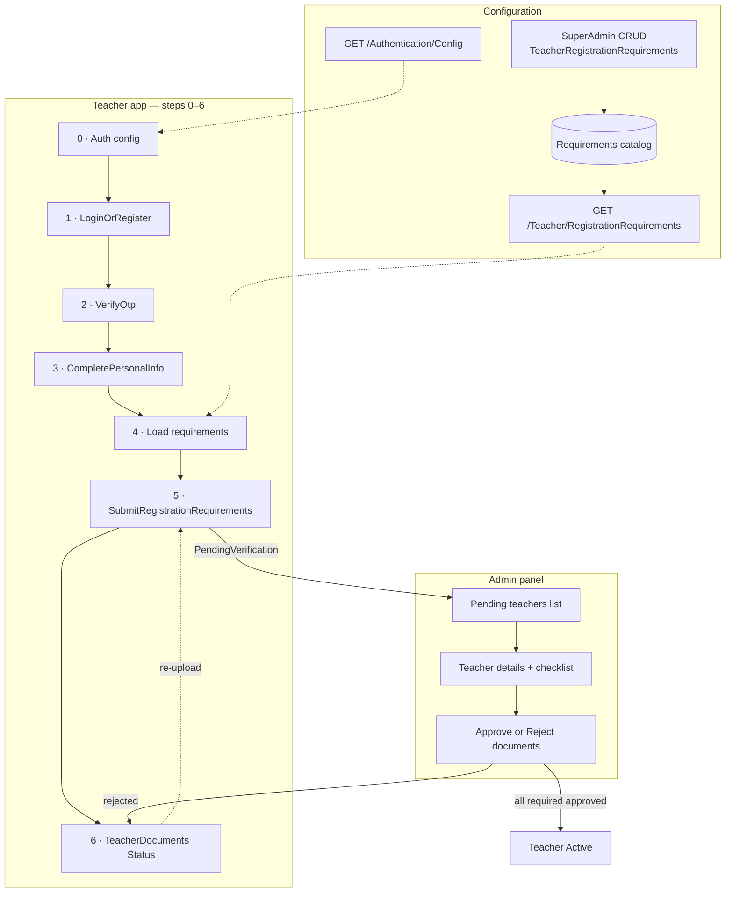

# Teacher registration — complete guide

Single reference for **teacher onboarding**: auth config, OTP, personal info, admin-configured requirements, admin review, activation, and deployment.

> **Audience:** teacher app, admin panel, QA, DevOps  
> **Scalar / Swagger:** `/scalar/v1` — tags **Teacher Authentication**, **Admin · Teacher registration requirements**, **Teacher · Documents**, **Authentication Config (Public)**

---

## Table of contents

1. [Overview & flow](#overview--flow)
2. [Step 0 — Auth config](#step-0--auth-config)
3. [Steps 1–2 — OTP](#steps-12--otp)
4. [Step 3 — Personal info](#step-3--personal-info)
5. [Steps 4–6 — Requirements & status](#steps-46--requirements--status)
6. [Admin — SuperAdmin catalog](#admin--superadmin-catalog)
7. [Admin — Review teachers](#admin--review-teachers)
8. [Backend data model](#backend-data-model)
9. [Activation rules](#activation-rules)
10. [Frontend form builder](#frontend-form-builder)
11. [Deployment & troubleshooting](#deployment--troubleshooting)
12. [Environment & admin login](#environment--admin-login)
13. [Checklists](#checklists)
14. [Source code index](#source-code-index)
15. [After activation](#after-activation)
16. [Out of scope (v1)](#out-of-scope-v1)

---

## Overview & flow

| # | Screen | Method | Path | Auth |
|---|--------|--------|------|------|
| 0 | Load auth UI rules | GET | `/Api/V1/Authentication/Config` | None |
| 1 | Send OTP | POST | `/Api/V1/Authentication/Teacher/LoginOrRegister` | None |
| 2 | Verify OTP | POST | `/Api/V1/Authentication/Teacher/VerifyOtp` | None |
| 3 | Name + password | POST | `/Api/V1/Authentication/Teacher/CompletePersonalInfo` | Bearer (step 2) |
| 4 | Load dynamic fields | GET | `/Api/V1/Authentication/Teacher/RegistrationRequirements` | None |
| 5 | Submit documents / bio / location | POST | `/Api/V1/Authentication/Teacher/SubmitRegistrationRequirements` | Bearer (Teacher) |
| 6 | Track review | GET | `/Api/V1/Teacher/TeacherDocuments/Status` | Bearer (Teacher) |

**Legacy (deprecated):** `POST …/Teacher/UploadDocuments` — same handler as step 5.



**Prerequisites (backend):**

1. Migration `AddTeacherRegistrationRequirements` applied.
2. Default catalog seeded (4 system rows on API startup, or SQL script).
3. Codes present: `identity_document`, `certificate`, `bio`, `location`.

---

## Step 0 — Auth config

Call on app load **before** login/register UI.

```http
GET /Api/V1/Authentication/Config
```

No auth header.

### Response (`data`)

| Block | Use |
|-------|-----|
| `teacher` | Teacher app login/register |
| `otp.length` | OTP input maxlength |
| `otp.expirySeconds` | Optional countdown |

### Teacher persona fields

| Field | UI |
|-------|-----|
| `showPhoneField` | Show country code + phone |
| `showEmailField` | Show email on step 1 |
| `phoneRequired` | Validate phone before submit |
| `emailRequired` | Validate email before submit |
| `otpDelivery` | `"Email"` or `"Sms"` — drives copy |
| `otpHintEn` / `otpHintAr` | Subtitle on verify screen |
| `loginMethod` | `"Otp"` — OTP flow (not password login) |

### Example (email OTP, default seed)

```json
{
  "succeeded": true,
  "data": {
    "teacher": {
      "loginMethod": "Otp",
      "otpDelivery": "Email",
      "showPhoneField": true,
      "showEmailField": true,
      "phoneRequired": true,
      "emailRequired": true,
      "otpHintEn": "We sent a 4-digit code to your email",
      "otpHintAr": "أرسلنا رمزاً من 4 أرقام إلى بريدك الإلكتروني"
    },
    "otp": { "length": 4, "expirySeconds": 300 }
  }
}
```

Settings come from DB key `Auth.Settings` (no server cache). SuperAdmin changes via `GET/PUT /Api/V1/Admin/SystemSettings/Auth`.

**Email OTP pipeline:** OTP generated → bilingual HTML email → RabbitMQ → Messaging API → SMTP.

---

## Steps 1–2 — OTP

### Step 1 — Send OTP

```http
POST /Api/V1/Authentication/Teacher/LoginOrRegister
Content-Type: application/json

{
  "countryCode": "+966",
  "phoneNumber": "501234567",
  "email": "teacher@example.com"
}
```

Include `email` when `data.teacher.emailRequired` is true.

| Response field | Meaning |
|----------------|---------|
| `otpSentTo` | `"email"` or `"sms"` |
| `maskedDestination` | Where the code was sent |
| `isNewUser` | Registration vs login |

### Step 2 — Verify OTP

```http
POST /Api/V1/Authentication/Teacher/VerifyOtp
Content-Type: application/json

{
  "countryCode": "+966",
  "phoneNumber": "501234567",
  "otpCode": "1234"
}
```

Returns JWT. Use `otpHintEn` + `maskedDestination` on the verify screen.

**Token note:** Replace stored token when a new one is returned. After step 3, the token includes the `Teacher` role — required for steps 5–6.

---

## Step 3 — Personal info

**No email field on this screen** when email was collected in step 1 (typical flow).

```http
POST /Api/V1/Authentication/Teacher/CompletePersonalInfo
Authorization: Bearer {tokenFromVerifyOtp}
Content-Type: application/json

{
  "firstName": "Ahmed",
  "lastName": "Ali",
  "password": "SecurePass1!"
}
```

| Field | Required | Notes |
|-------|----------|-------|
| `firstName` | Yes | Max 50 chars |
| `lastName` | Yes | Max 50 chars |
| `password` | Yes | 8+ chars, upper, lower, digit, special |
| `email` | No | Omit if set at OTP; only send to add/change |

Password rules enforced by validator. Email format validated only when provided.

---

## Steps 4–6 — Requirements & status

### Default seeded fields

| Code | Type | Required | Form fields |
|------|------|----------|-------------|
| `identity_document` | File | Yes | `identityType`, `documentNumber`, `issuingCountryCode`, `identityDocumentFile` |
| `certificate` | File | Yes (1–5) | `certificates[i].file`, title, issuer, `issueDate` |
| `bio` | Text | No | `bio` (max 500) |
| `location` | Boolean | Yes | `isInSaudiArabia` |
| *custom* | File | varies | `file_{code}` e.g. `file_custom_cv` |

Seed JSON: [`seed-data/teacher-registration-requirements.json`](seed-data/teacher-registration-requirements.json)

**Helper GETs:**

| Path | Purpose |
|------|---------|
| `/Api/V1/Authentication/IdentityTypes?isInSaudiArabia=true\|false` | Identity dropdown |
| `/Api/V1/Authentication/DocumentTypes` | Legacy labels |

---

### Step 4 — Load requirements

```http
GET /Api/V1/Authentication/Teacher/RegistrationRequirements
```

No auth. Returns **active** requirements only.

```json
{
  "requirements": [
    {
      "code": "identity_document",
      "nameAr": "وثيقة الهوية",
      "nameEn": "Identity document",
      "requirementType": "File",
      "isRequired": true,
      "sortOrder": 10,
      "minCount": 1,
      "maxCount": 1,
      "maxFileSizeBytes": 10485760,
      "allowedExtensions": [".pdf", ".jpg", ".jpeg", ".png"]
    }
  ]
}
```

**UI rules:**

1. Sort by `sortOrder`.
2. Render by `requirementType`: `File` → pickers, `Text` → textarea, `Boolean` → toggle.
3. Badge when `isRequired`.
4. Files: enforce `minCount`/`maxCount`, `allowedExtensions`, `maxFileSizeBytes`.
5. System codes → fixed fields (table above). Custom files → `file_{code}`.

---

### Step 5 — Submit (multipart)

```http
POST /Api/V1/Authentication/Teacher/SubmitRegistrationRequirements
Authorization: Bearer {teacherJwt}
Content-Type: multipart/form-data
```

| `code` | Form fields |
|--------|-------------|
| `identity_document` | `identityType`, `documentNumber`, `issuingCountryCode`, `identityDocumentFile` |
| `certificate` | `certificates[0].file`, `certificates[0].title`, … |
| `bio` | `bio` |
| `location` | `isInSaudiArabia` |
| other file | `file_{code}` |

Example:

```
isInSaudiArabia: true
identityType: 1
documentNumber: "1234567890"
identityDocumentFile: (binary)
certificates[0].file: (binary)
certificates[0].title: "Bachelor of Education"
certificates[0].issuer: "University"
certificates[0].issueDate: "2020-06-01"
bio: "Experienced Quran teacher..."
```

**On success:** status → `PendingVerification`; files → **Pending** review; text/boolean → **Approved** (v1).

---

### Step 6 — Status & re-upload

```http
GET /Api/V1/Teacher/TeacherDocuments/Status
Authorization: Bearer {teacherJwt}
```

```json
{
  "requirements": [
    {
      "code": "identity_document",
      "requirementType": "File",
      "isRequired": true,
      "isSubmitted": true,
      "verificationStatus": "Pending",
      "teacherDocumentId": 42
    }
  ],
  "legacyDocuments": []
}
```

| `verificationStatus` | UI |
|---------------------|-----|
| `Pending` | Under review |
| `Approved` | Checkmark |
| `Rejected` | Show `rejectionReason`; re-upload via `PUT …/Teacher/TeacherDocuments/{teacherDocumentId}/Reupload` |

---

### Teacher account statuses

| Status | Meaning |
|--------|---------|
| `PendingVerification` | Submitted; awaiting admin |
| `DocumentsRejected` | Required item rejected |
| `Active` | All active required items approved |
| `Blocked` | Admin blocked |

---

## Admin — SuperAdmin catalog

**Role:** `SuperAdmin`  
**Base:** `/Api/V1/Admin/TeacherRegistrationRequirements`

| Method | Path | Action |
|--------|------|--------|
| GET | `/` | List all (incl. inactive) |
| GET | `/{id}` | Detail |
| POST | `/` | Create custom requirement |
| PUT | `/{id}` | Update labels, limits, active/required |
| DELETE | `/{id}` | Delete (not system, no submissions) |
| PATCH | `/{id}/active` | Toggle `isActive` |

### Create custom requirement

```json
{
  "code": "custom_cv",
  "nameAr": "السيرة الذاتية",
  "nameEn": "CV",
  "requirementType": 1,
  "isActive": true,
  "isRequired": false,
  "sortOrder": 50,
  "minCount": 0,
  "maxCount": 1,
  "maxFileSizeBytes": 10485760,
  "allowedExtensions": [".pdf"],
  "mapsToDocumentType": 3
}
```

| Enum | Values |
|------|--------|
| `requirementType` | `1` File, `2` Text, `3` Boolean |
| `mapsToDocumentType` | `1` Identity, `2` Certificate, `3` Other |

**Rules:** unique `code` (snake_case); don’t delete system rows — use `PATCH …/active`; delete fails if submissions exist.

### Auth OTP settings (separate)

`GET/PUT /Api/V1/Admin/SystemSettings/Auth` — controls step 0–2 only, not registration fields.

---

## Admin — Review teachers

**Role:** `Admin` or `SuperAdmin`  
**Base:** `/Api/V1/Admin/TeacherManagement`

| Method | Path | Action |
|--------|------|--------|
| GET | `/Pending` | Teachers awaiting review |
| GET | `/{teacherId}` | Details + `registrationRequirements` + `canBeActivated` |
| POST | `/{teacherId}/Documents/{documentId}/Approve` | Approve → syncs submission |
| POST | `/{teacherId}/Documents/{documentId}/Reject` | Reject with `{ "reason": "…" }` |
| POST | `/{teacherId}/Block` | Block account |

Teacher detail includes checklist:

```json
{
  "teacherId": 12,
  "status": "PendingVerification",
  "registrationRequirements": [
    {
      "code": "identity_document",
      "isRequired": true,
      "isSubmitted": true,
      "verificationStatus": "Pending",
      "teacherDocumentId": 42
    }
  ],
  "canBeActivated": false
}
```

`canBeActivated === true` when every **required** item is **Approved**.

---

## Backend data model

| Table | Schema | Purpose |
|-------|--------|---------|
| `TeacherRegistrationRequirements` | `teacher` | Catalog (code, type, labels, validation, active/required) |
| `TeacherRegistrationSubmissions` | `teacher` | Per teacher × requirement (status, text/bool, link to document) |

**System codes:** `identity_document`, `certificate`, `bio`, `location` (`IsSystem = true`).

---

## Activation rules

- Only **active + required** catalog rows count toward activation.
- **File** with `maxCount > 1`: need ≥ `minCount` submissions; any rejection → `DocumentsRejected`.
- **Text/Boolean** (`bio`, `location`): auto-**Approved** on submit (v1).
- Admin approve/reject on documents syncs linked `TeacherRegistrationSubmission` via `ITeacherRegistrationCompletionService`.

---

## Frontend form builder

```typescript
type Requirement = {
  code: string;
  requirementType: 'File' | 'Text' | 'Boolean';
  isRequired: boolean;
  minCount: number;
  maxCount: number;
  maxFileSizeBytes: number;
  allowedExtensions: string[];
  maxLength?: number;
  nameAr: string;
  nameEn: string;
};

function renderRequirement(req: Requirement) {
  switch (req.requirementType) {
    case 'File':
      if (req.code === 'identity_document') return <IdentityDocumentSection />;
      if (req.code === 'certificate') return <CertificateList min={req.minCount} max={req.maxCount} />;
      return <GenericFileUpload name={`file_${req.code}`} />;
    case 'Text':
      if (req.code === 'bio') return <BioField maxLength={req.maxLength} />;
      return null;
    case 'Boolean':
      if (req.code === 'location') return <LocationToggle />;
      return null;
  }
}
```

---

## Deployment & troubleshooting

### Apply migration

```bash
dotnet ef database update --project Qalam.Infrastructure --startup-project Qalam.Api
```

Or restart API (Development/Staging auto-migrate).

### Verify seed

```sql
SELECT Code, NameEn, IsActive, IsRequired, SortOrder
FROM teacher.TeacherRegistrationRequirements
ORDER BY SortOrder;
```

If empty: run `scripts/seed-teacher-registration-requirements.sql`

### Common issues

| Issue | Fix |
|-------|-----|
| `Invalid object name 'teacher.TeacherRegistrationRequirements'` | Run migration or `scripts/apply-teacher-registration-requirements.sql` |
| Scenario2 / `SessionRequests` already exists | `scripts/repair-scenario2-migration.sql` then `database update` |
| Empty requirements list | Seed SQL or restart API |
| Submit 400 “No active requirements” | Catalog empty or all inactive |
| Custom file ignored | Field must be `file_{code}` exactly |

**Scripts:**

| Script | Purpose |
|--------|---------|
| [`scripts/seed-teacher-registration-requirements.sql`](../scripts/seed-teacher-registration-requirements.sql) | Seed 4 default rows |
| [`scripts/apply-teacher-registration-requirements.sql`](../scripts/apply-teacher-registration-requirements.sql) | Emergency tables + seed |
| [`scripts/repair-scenario2-migration.sql`](../scripts/repair-scenario2-migration.sql) | Fix EF history mismatch |

---

## Environment & admin login

| Environment | SuperAdmin | Config file |
|-------------|------------|-------------|
| Local Docker | `admin@qalam.local` / `Admin@123` | `.env` (Development) |
| Staging | `admin@staging.qalam.net.sa` | `.env.staging` |
| Production | One-time boot only | `.env.prod` then `SEED_DEFAULT_ADMIN=false` |

Staging env vars:

```env
SEED_DEFAULT_ADMIN=true
DEFAULT_ADMIN_EMAIL=admin@staging.qalam.net.sa
DEFAULT_ADMIN_PASSWORD=<your-password>
```

Edit: `nano .env.staging` (dot, not hyphen).

```http
POST /Api/V1/Authentication/Admin/Login
{ "userNameOrEmail": "admin@staging.qalam.net.sa", "password": "…" }
```

> `superadmin@qalam.com` is **not** seeded — legacy unused `UserSeeder` only.

---

## Checklists

### Teacher app

- [ ] `GET /Authentication/Config` on load
- [ ] OTP steps 1–2; email on step 1 when required
- [ ] Step 3: firstName, lastName, password only (no email)
- [ ] `GET /Teacher/RegistrationRequirements` before documents step
- [ ] Dynamic UI from `requirements[]`
- [ ] `POST /Teacher/SubmitRegistrationRequirements`
- [ ] Status via `GET /Teacher/TeacherDocuments/Status`
- [ ] Re-upload on reject

### Admin panel

- [ ] SuperAdmin: requirements CRUD
- [ ] Review: pending list + checklist + `canBeActivated`
- [ ] Approve/reject documents

### DevOps

- [ ] Migration applied + 4 seed rows
- [ ] Staging `.env.staging` admin password
- [ ] CORS for teacher/admin staging origins

---

## Source code index

| Area | Path |
|------|------|
| Auth + registration | `Qalam.Api/Controllers/Authentication/Core/AuthController.cs` |
| Admin requirements CRUD | `Qalam.Api/Controllers/Admin/TeacherRegistrationRequirementsController.cs` |
| Teacher status | `Qalam.Api/Controllers/Teacher/TeacherDocumentsController.cs` |
| Admin review | `Qalam.Api/Controllers/Admin/TeacherManagementController.cs` |
| Submit handler | `Qalam.Core/Features/Teacher/Commands/SubmitTeacherRegistrationRequirements/` |
| Personal info | `Qalam.Core/Features/Authentication/Commands/CompletePersonalInfo/` |
| Activation service | `Qalam.Service/Implementations/TeacherRegistrationCompletionService.cs` |
| Default seed | `Qalam.Data/AppMetaData/TeacherRegistrationRequirementsDefaults.cs` |
| Seeder | `Qalam.Infrastructure/Seeding/TeacherRegistrationRequirementsSeeder.cs` |
| Admin user seed | `Qalam.Infrastructure/Seeding/AdminUserSeeder.cs` |

---

## After activation

Once `TeacherStatus` is **Active**:

1. Availability & subjects — [`Teacher-Availability-and-Subjects.md`](Teacher-Availability-and-Subjects.md)
2. Quran specialization — [`Teacher-Quran-Specialization-Design.md`](Teacher-Quran-Specialization-Design.md)
3. Courses — [`CreateCourse.md`](CreateCourse.md), [`CourseManagement.md`](CourseManagement.md)

Staging setup — [`deployment/03-staging-setup.md`](deployment/03-staging-setup.md)

---

## Out of scope (v1)

- Re-validating **Active** teachers when admin adds new required fields
- Student/parent registration requirements catalog
- Name/password in requirements catalog (step 3 stays separate)
