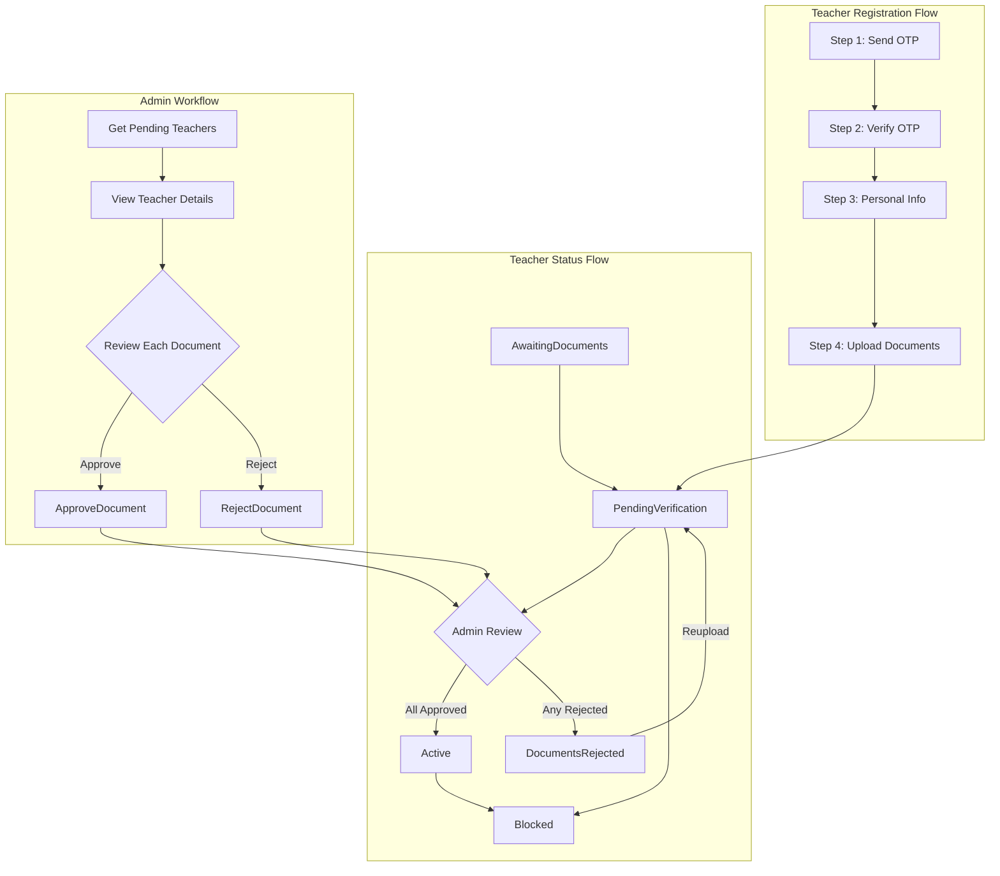

# دليل اختبار سيناريوهات المعلم والإدارة
# Teacher & Admin Testing Workflow Guide

هذا الدليل يشرح جميع سيناريوهات الاختبار لعمليات تسجيل المعلم ومراجعة الإدارة.

This guide covers all testing scenarios for teacher registration and admin review workflows.

---

## نظرة عامة على النظام | System Overview



---

## الجزء الأول: سيناريوهات اختبار المعلم | Part 1: Teacher Testing Scenarios

### السيناريو 1: التسجيل الناجح (المسار الصحيح) | Scenario 1: Successful Registration (Happy Path)

**خطوات الاختبار | Test Steps:**

#### الخطوة 1 - إرسال رمز OTP | Step 1 - Send OTP

```http
POST /Api/V1/Authentication/Teacher/Step1-SendOtp
Content-Type: application/json

{
  "countryCode": "+966",
  "phoneNumber": "503333256"
}
```

**النتيجة المتوقعة | Expected Result:**
- Status: `200 OK`
- رسالة نجاح | Success message
- ملاحظة: رمز OTP للاختبار هو `"1234"` | Note: Test OTP code is `"1234"`

---

#### الخطوة 2 - التحقق من OTP | Step 2 - Verify OTP

```http
POST /Api/V1/Authentication/Teacher/Step2-VerifyOtp
Content-Type: application/json

{
  "phoneNumber": "503333256",
  "otpCode": "1234"
}
```

**النتيجة المتوقعة | Expected Result:**
```json
{
  "Succeeded": true,
  "Data": {
    "Token": "eyJhbGciOiJIUzI1NiIs...",
    "UserId": 1,
    "PhoneNumber": "+966503333256",
    "NextStep": {
      "CurrentStep": 2,
      "NextStepName": "CompletePersonalInfo",
      "IsRegistrationComplete": false
    }
  }
}
```

> **مهم:** احفظ الـ Token لاستخدامه في الخطوات التالية
> **Important:** Save the Token for the next steps

---

#### الخطوة 3 - إكمال المعلومات الشخصية | Step 3 - Complete Personal Info

```http
POST /Api/V1/Authentication/Teacher/Step3-PersonalInfo
Content-Type: application/json
Authorization: Bearer {token}

{
  "firstName": "أحمد",
  "lastName": "محمد",
  "email": "ahmed@example.com",
  "password": "Pass@123456"
}
```

**النتيجة المتوقعة | Expected Result:**
```json
{
  "Succeeded": true,
  "Data": {
    "Account": {
      "Token": "eyJhbGciOiJIUzI1NiIs...",
      "UserId": 1,
      "FirstName": "أحمد",
      "LastName": "محمد"
    },
    "NextStep": {
      "CurrentStep": 3,
      "NextStepName": "UploadDocuments",
      "IsRegistrationComplete": false
    }
  }
}
```

---

#### الخطوة 4 - رفع الوثائق | Step 4 - Upload Documents

```http
POST /Api/V1/Authentication/Teacher/Step4-UploadDocuments
Authorization: Bearer {token}
Content-Type: multipart/form-data

Form Data:
- IsInSaudiArabia: true
- IdentityType: 1 (NationalId=1, Iqama=2, Passport=3)
- DocumentNumber: "1234567890"
- IdentityDocumentFile: [PDF/Image file]
- Certificates[0].File: [Certificate file]
- Certificates[0].Title: "Bachelor in Education"
- Certificates[0].Issuer: "King Saud University"
- Certificates[0].IssueDate: "2020-06-15"
```

**النتيجة المتوقعة | Expected Result:**
- Status: `200 OK`
- حالة المعلم: `PendingVerification`
- Teacher Status: `PendingVerification`

---

### السيناريو 2: أخطاء التحقق | Scenario 2: Validation Errors

| حالة الاختبار | Test Case | الـ Endpoint | المدخلات | الخطأ المتوقع |
|---------------|-----------|--------------|----------|---------------|
| رقم مكرر | Duplicate phone | Step 1 | Existing phone | "Phone number already registered" |
| OTP خاطئ | Invalid OTP | Step 2 | Wrong OTP code | "Invalid OTP code" |
| OTP منتهي | Expired OTP | Step 2 | After 5 minutes | "OTP has expired" |
| كلمة مرور ضعيفة | Weak password | Step 3 | "123" | Password validation error |
| جواز سفر داخل السعودية | Passport in Saudi | Step 4 | Passport + InsideSaudiArabia=true | "Passport not allowed inside Saudi Arabia" |
| هوية وطنية خارج السعودية | NationalId outside | Step 4 | NationalId + InsideSaudiArabia=false | "National ID only valid inside Saudi Arabia" |
| أكثر من 5 شهادات | Too many certificates | Step 4 | 6+ files | "Maximum 5 certificates allowed" |
| نوع ملف غير صالح | Invalid file type | Step 4 | .exe file | "Invalid file type" |
| ملف كبير جداً | File too large | Step 4 | >10MB file | "File size exceeds limit" |

---

### السيناريو 3: إعادة رفع الوثائق المرفوضة | Scenario 3: Document Reupload After Rejection

#### 3.1 عرض حالة الوثائق | Get Documents Status

```http
GET /Api/V1/Teacher/TeacherDocuments/Status
Authorization: Bearer {teacher_token}
Accept-Language: ar-EG
```

**النتيجة المتوقعة | Expected Result:**
```json
{
  "Succeeded": true,
  "Data": [
    {
      "DocumentId": 1,
      "DocumentType": "IdentityDocument",
      "VerificationStatus": "Rejected",
      "RejectionReason": "الوثيقة غير واضحة"
    },
    {
      "DocumentId": 2,
      "DocumentType": "Certificate",
      "VerificationStatus": "Approved"
    }
  ]
}
```

#### 3.2 إعادة رفع وثيقة مرفوضة | Reupload Rejected Document

```http
PUT /Api/V1/Teacher/TeacherDocuments/{documentId}/Reupload
Authorization: Bearer {teacher_token}
Content-Type: multipart/form-data

Form Data:
- file: [New document file]
```

**النتيجة المتوقعة | Expected Result:**
- حالة الوثيقة: `Pending`
- حالة المعلم: `PendingVerification`

---

## الجزء الثاني: سيناريوهات اختبار الإدارة | Part 2: Admin Testing Scenarios

### المتطلبات الأساسية | Prerequisites

تسجيل الدخول كمسؤول | Login as Admin:

```http
POST /Api/V1/Authentication/Login
Content-Type: application/json

{
  "userName": "admin",
  "password": "Admin@123456"
}
```

---

### السيناريو 1: عرض المعلمين المعلقين | Scenario 1: View Pending Teachers

```http
GET /Api/V1/Admin/TeacherManagement/Pending?pageNumber=1&pageSize=10
Authorization: Bearer {admin_token}
Accept-Language: ar-EG
```

**النتيجة المتوقعة | Expected Result:**
```json
{
  "Succeeded": true,
  "Data": {
    "Items": [
      {
        "TeacherId": 1,
        "FullName": "أحمد محمد",
        "PhoneNumber": "+966503333256",
        "Status": "PendingVerification",
        "TotalDocuments": 2,
        "PendingDocuments": 2,
        "ApprovedDocuments": 0,
        "RejectedDocuments": 0,
        "CreatedAt": "2026-01-25T10:30:00Z"
      }
    ],
    "TotalCount": 1,
    "PageNumber": 1,
    "PageSize": 10
  }
}
```

---

### السيناريو 2: مسار الموافقة الكامل | Scenario 2: Full Approval Flow

#### 2.1 عرض تفاصيل المعلم | Get Teacher Details

```http
GET /Api/V1/Admin/TeacherManagement/{teacherId}
Authorization: Bearer {admin_token}
Accept-Language: ar-EG
```

**النتيجة المتوقعة | Expected Result:**
```json
{
  "Succeeded": true,
  "Data": {
    "TeacherId": 1,
    "FullName": "أحمد محمد",
    "Email": "ahmed@example.com",
    "PhoneNumber": "+966503333256",
    "Status": "PendingVerification",
    "Documents": [
      {
        "DocumentId": 1,
        "DocumentType": "IdentityDocument",
        "IdentityType": "NationalId",
        "DocumentNumber": "1234567890",
        "FilePath": "/uploads/teachers/1/identity/doc.pdf",
        "VerificationStatus": "Pending"
      },
      {
        "DocumentId": 2,
        "DocumentType": "Certificate",
        "CertificateTitle": "Bachelor in Education",
        "Issuer": "King Saud University",
        "VerificationStatus": "Pending"
      }
    ],
    "Summary": {
      "TotalDocuments": 2,
      "PendingDocuments": 2,
      "ApprovedDocuments": 0,
      "RejectedDocuments": 0
    },
    "CanBeActivated": false
  }
}
```

#### 2.2 الموافقة على وثيقة | Approve Document

```http
POST /Api/V1/Admin/TeacherManagement/{teacherId}/Documents/{documentId}/Approve
Authorization: Bearer {admin_token}
Content-Type: application/json
```

**النتيجة المتوقعة | Expected Result:**
- Status: `200 OK`
- حالة الوثيقة: `Approved`
- إذا تمت الموافقة على جميع الوثائق: حالة المعلم = `Active`

---

### السيناريو 3: مسار الرفض | Scenario 3: Rejection Flow

#### 3.1 رفض وثيقة | Reject Document

```http
POST /Api/V1/Admin/TeacherManagement/{teacherId}/Documents/{documentId}/Reject
Authorization: Bearer {admin_token}
Content-Type: application/json

{
  "reason": "الوثيقة غير واضحة، يرجى رفع نسخة عالية الجودة"
}
```

**النتيجة المتوقعة | Expected Result:**
- Status: `200 OK`
- حالة الوثيقة: `Rejected`
- حالة المعلم: `DocumentsRejected`

---

### السيناريو 4: حظر المعلم | Scenario 4: Block Teacher

```http
POST /Api/V1/Admin/TeacherManagement/{teacherId}/Block
Authorization: Bearer {admin_token}
Content-Type: application/json

{
  "reason": "وثائق مزورة مشتبه بها"
}
```

**النتيجة المتوقعة | Expected Result:**
- Status: `200 OK`
- حالة المعلم: `Blocked`
- IsActive: `false`

---

## الجزء الثالث: سيناريوهات الاختبار الشاملة | Part 3: End-to-End Test Scenarios

### E2E السيناريو 1: المسار الصحيح الكامل | Complete Happy Path

```
المعلم: الخطوة 1 → الخطوة 2 → الخطوة 3 → الخطوة 4 (الحالة: PendingVerification)
Teacher: Step1 → Step2 → Step3 → Step4 (Status: PendingVerification)

المسؤول: عرض → الموافقة على جميع الوثائق (الحالة: Active)
Admin: View → Approve All Documents (Status: Active)

المعلم: يمكنه الآن الوصول إلى ميزات المعلم
Teacher: Can now access teacher features
```

### E2E السيناريو 2: الرفض وإعادة الرفع | Rejection and Reupload

```
المعلم: إكمال التسجيل (الحالة: PendingVerification)
Teacher: Complete Registration (Status: PendingVerification)

المسؤول: رفض وثيقة واحدة (الحالة: DocumentsRejected)
Admin: Reject 1 Document (Status: DocumentsRejected)

المعلم: فحص الحالة → إعادة الرفع (الحالة: PendingVerification)
Teacher: Check Status → Reupload (Status: PendingVerification)

المسؤول: الموافقة على الجميع (الحالة: Active)
Admin: Approve All (Status: Active)
```

### E2E السيناريو 3: الموافقة الجزئية | Partial Approval

```
المعلم: رفع 3 شهادات
Teacher: Upload 3 certificates

المسؤول: الموافقة على الهوية + شهادتين، رفض شهادة واحدة
Admin: Approve Identity + 2 certificates, Reject 1 certificate

المعلم: إعادة رفع الشهادة المرفوضة
Teacher: Reupload rejected certificate

المسؤول: الموافقة على الشهادة الأخيرة (الحالة: Active)
Admin: Approve final certificate (Status: Active)
```

### E2E السيناريو 4: سيناريو الحظر | Block Scenario

```
المعلم: إكمال التسجيل
Teacher: Complete Registration

المسؤول: اكتشاف وثيقة مزورة → حظر المعلم
Admin: Detect fraudulent document → Block Teacher

المعلم: لا يمكنه تسجيل الدخول أو الوصول إلى أي ميزات
Teacher: Cannot login or access any features
```

---

## الجزء الرابع: ملخص نقاط API | Part 4: API Endpoints Summary

### نقاط المعلم | Teacher Endpoints

| الطريقة | Method | النقطة | Endpoint | المصادقة | Auth | الوصف | Description |
|---------|--------|--------|----------|----------|------|-------|-------------|
| POST | `/Api/V1/Authentication/Teacher/Step1-SendOtp` | بدون | None | إرسال OTP | Send OTP |
| POST | `/Api/V1/Authentication/Teacher/Step2-VerifyOtp` | بدون | None | التحقق وإنشاء الحساب | Verify & create account |
| POST | `/Api/V1/Authentication/Teacher/Step3-PersonalInfo` | Token | Token | إكمال الملف الشخصي | Complete profile |
| POST | `/Api/V1/Authentication/Teacher/Step4-UploadDocuments` | معلم | Teacher | رفع الوثائق | Upload documents |
| GET | `/Api/V1/Teacher/TeacherDocuments/Status` | معلم | Teacher | حالة الوثائق | Get documents status |
| PUT | `/Api/V1/Teacher/TeacherDocuments/{id}/Reupload` | معلم | Teacher | إعادة رفع وثيقة | Reupload rejected doc |

### نقاط الإدارة | Admin Endpoints

| الطريقة | Method | النقطة | Endpoint | المصادقة | Auth | الوصف | Description |
|---------|--------|--------|----------|----------|------|-------|-------------|
| GET | `/Api/V1/Admin/TeacherManagement/Pending` | مسؤول | Admin | قائمة المعلقين | List pending teachers |
| GET | `/Api/V1/Admin/TeacherManagement/{teacherId}` | مسؤول | Admin | تفاصيل المعلم | Teacher details |
| POST | `.../Documents/{docId}/Approve` | مسؤول | Admin | الموافقة على وثيقة | Approve document |
| POST | `.../Documents/{docId}/Reject` | مسؤول | Admin | رفض وثيقة | Reject with reason |
| POST | `.../{teacherId}/Block` | مسؤول | Admin | حظر المعلم | Block teacher |

---

## الجزء الخامس: متطلبات بيانات الاختبار | Part 5: Test Data Requirements

### الملفات المطلوبة للاختبار | Required Test Files

| الملف | File | الغرض | Purpose |
|-------|------|-------|---------|
| `test-id.pdf` | وثيقة هوية صالحة | Valid identity document |
| `test-certificate.jpg` | صورة شهادة صالحة | Valid certificate image |
| `test-invalid.exe` | ملف غير صالح للاختبار السلبي | Invalid file for negative testing |
| `test-large.pdf` (>10MB) | ملف كبير للتحقق من الحجم | Large file for size validation |

### حسابات الاختبار المطلوبة | Required Test Accounts

| الحساب | Account | اسم المستخدم | Username | كلمة المرور | Password | الدور | Role |
|--------|---------|--------------|----------|--------------|----------|-------|------|
| المسؤول | Admin | `admin` | `Admin@123456` | SuperAdmin |
| معلم جديد | New Teacher | (رقم هاتف جديد) | (new phone) | - | Teacher |

### رمز OTP للاختبار | Test OTP Code

استخدم `"1234"` للتطوير والاختبار (يتجاوز التحقق الفعلي من OTP)

Use `"1234"` for development/testing (bypasses actual OTP verification)

---

## الجزء السادس: مرجع الملفات الرئيسية | Part 6: Key Files Reference

| الملف | File | الوصف | Description |
|-------|------|-------|-------------|
| `Qalam.Api/Controllers/Authentication/Core/AuthController.cs` | متحكم المصادقة | Auth Controller |
| `Qalam.Api/Controllers/Teacher/TeacherDocumentsController.cs` | متحكم وثائق المعلم | Teacher Documents Controller |
| `Qalam.Api/Controllers/Admin/TeacherManagementController.cs` | متحكم إدارة المعلمين | Teacher Management Controller |
| `Qalam.Data/Entity/Common/Enums/TeacherEnums.cs` | حالات المعلم | Teacher Status Enum |
| `Postman/Admin/TeacherManagement.postman_collection.json` | مجموعة Postman | Postman Collection |

---

## الجزء السابع: قائمة التحقق من الاختبار | Part 7: Testing Checklist

### اختبارات المعلم | Teacher Tests

- [ ] التسجيل الناجح (الخطوات 1-4) | Successful registration (Steps 1-4)
- [ ] رقم هاتف مكرر | Duplicate phone number
- [ ] رمز OTP خاطئ | Wrong OTP code
- [ ] رمز OTP منتهي الصلاحية | Expired OTP
- [ ] كلمة مرور ضعيفة | Weak password
- [ ] نوع هوية خاطئ (داخل/خارج السعودية) | Wrong identity type (in/out Saudi)
- [ ] عدد شهادات أكثر من المسموح | Too many certificates
- [ ] نوع ملف غير صالح | Invalid file type
- [ ] حجم ملف كبير | Large file size
- [ ] عرض حالة الوثائق | View documents status
- [ ] إعادة رفع وثيقة مرفوضة | Reupload rejected document

### اختبارات الإدارة | Admin Tests

- [ ] تسجيل دخول المسؤول | Admin login
- [ ] عرض قائمة المعلمين المعلقين | View pending teachers list
- [ ] عرض تفاصيل المعلم | View teacher details
- [ ] الموافقة على وثيقة واحدة | Approve single document
- [ ] الموافقة على جميع الوثائق (تفعيل المعلم) | Approve all documents (activate teacher)
- [ ] رفض وثيقة مع سبب | Reject document with reason
- [ ] حظر معلم | Block teacher

### اختبارات E2E | E2E Tests

- [ ] المسار الصحيح الكامل | Complete happy path
- [ ] الرفض وإعادة الرفع | Rejection and reupload
- [ ] الموافقة الجزئية | Partial approval
- [ ] سيناريو الحظر | Block scenario
