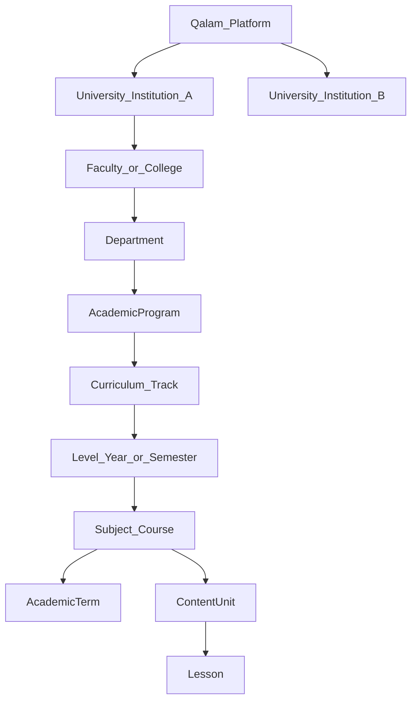

# University multi-tenant catalog (Phase 2 outline)

**Status:** Design stub — not implemented. Phase 1 hand-add samples cover **language** and **skills** only ([seed-data/education-catalog-language-skills.json](seed-data/education-catalog-language-skills.json)).

## Problem with current `university` domain

Today, `university` is a single row in `EducationDomains` with an `EducationRule` (see `EducationDomainsSeeder.cs` / `EducationRuleDefaults.University()`):

- Wizard: Curriculum → Level → Subject → Term → Unit → Lesson (no Grade)
- **No** seeded university curriculum or terms (terms exist only on school Saudi curriculum, `curriculumId = 1`)
- **No** institution model (faculties, departments, degree programs)
- `SchoolUnit` requires `termId`; hand-added university curricula cannot complete units without a Terms API or seeder

This does **not** meet the requirement:

> Configurable multi-university platform where each university manages its own colleges, programs, departments, curricula, and policies independently.

## Target hierarchy

### Proposed entities (new or extended)

| Entity | Role |
|--------|------|
| `University` (tenant) | Institution root: name, country, policies, branding, `isActive` |
| `Faculty` | College / faculty under one university |
| `Department` | Department under faculty |
| `AcademicProgram` | Diploma, Bachelor, Master, PhD (or custom); links to department |
| `Curriculum` | Program track or catalog edition; **scoped** `universityId` + optional `programId` |
| `EducationLevel` | Year, semester band, or stage within curriculum |
| `Subject` | Course; FKs to program/level; optional `creditHours` |
| `AcademicTerm` | Semester/term **per university curriculum** (CRUD required) |
| `ContentUnit` / `Lesson` | Modules and lessons under course |

Existing tables (`Curriculum`, `EducationLevel`, `Subject`, …) may gain optional `UniversityId` (and related FKs) rather than duplicating the whole tree.

### EducationRule

- Template per **program type** (e.g. Bachelor vs PhD) or per university default
- Admin configures which wizard steps appear (term optional, lessons on/off)
- Not a single global rule on domain code `university` only

### APIs (Phase 2)

| Area | Endpoints |
|------|-----------|
| Institutions | CRUD universities, faculties, departments, programs |
| Terms | `POST/GET /Education/Terms` scoped to `curriculumId` |
| Catalog | Existing Subject/Unit/Lesson POST with `universityId` / program FKs |
| Wizard | Extend `filter-options` state with `universityId`, `facultyId`, `programId` as needed |
| Admin | Per-university tree; tenant isolation in list queries |

### Tenant isolation

- All catalog reads/writes filter by `universityId` (and admin role scope)
- Teachers/students associate offerings to courses under one institution
- Platform admins may manage multiple universities; university admins scoped to one tenant

## Relationship to existing docs

| Doc | Relevance |
|-----|-----------|
| [DATABASE_ANALYSIS.md](../DATABASE_ANALYSIS.md) | Optional `Faculty` / `Major` sketches |
| [Education-Management-CRUD.md](Education-Management-CRUD.md) | Current flat CRUD; Terms gap |
| [SEEDING_STRUCTURE.md](../SEEDING_STRUCTURE.md) | No university catalog seeder today |

## Suggested implementation phases

1. **Data model** — migrations for `University`, `Faculty`, `Department`, `AcademicProgram`; FKs on catalog tables
2. **Terms API** — required before `SchoolUnit` workflows per university curriculum
3. **Filter-options** — extend `FilterStateDto` + `EducationFilterService` for institutional steps
4. **Admin UI** — university onboarding, nested tree, replace flat `/domains/{id}/tree` for `code=university`
5. **Seed / samples** — `education-catalog-university.json` after model is stable

## Out of scope for Phase 2 stub

- Implementation details, EF mappings, or breaking API changes
- Replacing school/quran/language/skills domains
