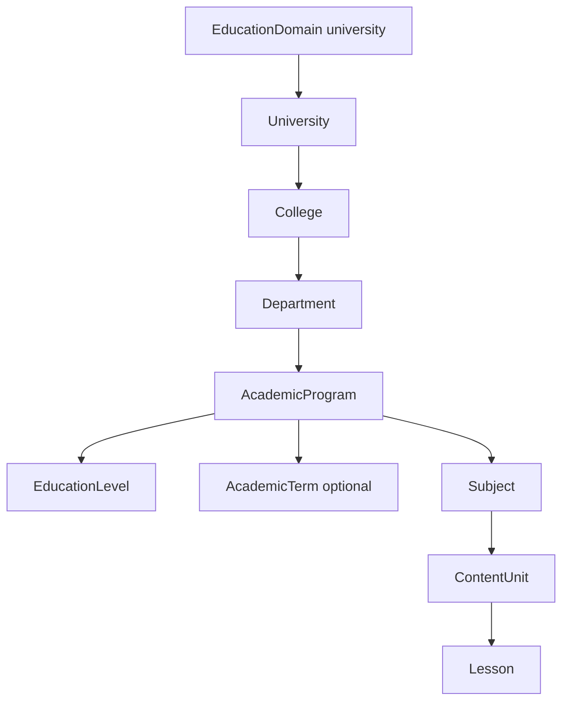

# University multi-tenant catalog

**Status:** Phase 1 **implemented** — institution hierarchy + filter-options + seed for top 3 Saudi universities (KSU, KAU, KFUPM). Per-university admin tenancy / branding deferred.

## Implemented hierarchy

Wizard (`GET /Api/V1/Education/filter-options`):  
`University → College → Department → AcademicProgram → Level → Subject → [Term?] → Unit → Lesson`

School path unchanged: `Curriculum → Level → Grade → Subject → Term → Unit → Lesson`.

## Seed data

See [seed-data/education-catalog-university.json](seed-data/education-catalog-university.json). Seeded by `UniversityCatalogSeeder` when `Universities` is empty.

## APIs

| Area | Routes |
|------|--------|
| Institutions | `/Api/V1/Education/Universities`, `/Colleges`, `/Departments`, `/AcademicPrograms` |
| Wizard | `GET /Api/V1/Education/filter-options` (new state: universityId, collegeId, departmentId, academicProgramId, skipTerm) |
| Subjects / Levels / Terms | Accept `academicProgramId` on create |

## Deferred (Phase 2+)

- Multi-tenant university admins and branding/policies per institution
- Separate payment rules per university
- Forking Course/Enrollment logic (not needed — still Subject → TeacherSubject → Course)
