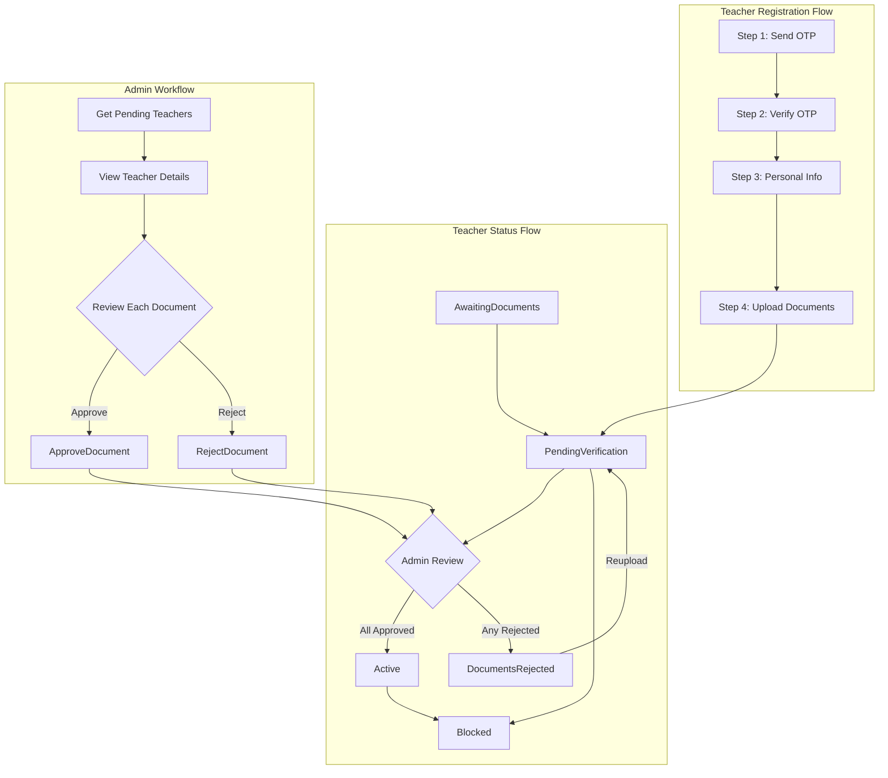

# Teacher and Admin Testing Workflow

## System Overview



---

## Part 1: Teacher Testing Scenarios

### Scenario 1: Successful Registration (Happy Path)

**Test Steps:**

1. **Step 1 - Send OTP**
   - `POST /Api/V1/Authentication/Teacher/Step1-SendOtp`
   - Body: `{ "countryCode": "+966", "phoneNumber": "5XXXXXXXX" }`
   - Expected: 200 OK with success message
   - Note: Test OTP code is `"1234"`

2. **Step 2 - Verify OTP**
   - `POST /Api/V1/Authentication/Teacher/Step2-VerifyOtp`
   - Body: `{ "countryCode": "+966", "phoneNumber": "5XXXXXXXX", "otpCode": "1234" }`
   - Expected: JWT token + UserId returned
   - Save token for next steps

3. **Step 3 - Complete Personal Info**
   - `POST /Api/V1/Authentication/Teacher/Step3-PersonalInfo`
   - Headers: `Authorization: Bearer {token}`
   - Body: `{ "firstName": "Ahmed", "lastName": "Mohammed", "email": "ahmed@test.com", "password": "Test@123" }`
   - Expected: New JWT token + TeacherAccountDto

4. **Step 4 - Upload Documents**
   - `POST /Api/V1/Authentication/Teacher/Step4-UploadDocuments`
   - Headers: `Authorization: Bearer {token}`
   - Form-data:
     - `InsideSaudiArabia`: true
     - `IdentityType`: 1 (NationalId) or 2 (Iqama)
     - `IdentityDocumentNumber`: "1234567890"
     - `IdentityDocument`: (PDF/image file)
     - `Certificates`: (1-5 files)
   - Expected: Teacher status = `PendingVerification`

### Scenario 2: Registration Validation Errors

| Test Case | Endpoint | Input | Expected Error |
|-----------|----------|-------|----------------|
| Duplicate phone | Step 1 | Existing phone | "Phone number already registered" |
| Invalid OTP | Step 2 | Wrong OTP code | "Invalid OTP code" |
| Expired OTP | Step 2 | After 5 minutes | "OTP has expired" |
| Weak password | Step 3 | "123" | Password validation error |
| Wrong identity type (Saudi) | Step 4 | Passport inside Saudi | "Passport not allowed inside Saudi Arabia" |
| Wrong identity type (International) | Step 4 | NationalId outside Saudi | "National ID only valid inside Saudi Arabia" |
| Too many certificates | Step 4 | 6+ files | "Maximum 5 certificates allowed" |
| Invalid file type | Step 4 | .exe file | "Invalid file type" |
| File too large | Step 4 | >10MB file | "File size exceeds limit" |

### Scenario 3: Document Reupload After Rejection

1. Complete registration (Steps 1-4)
2. Admin rejects a document (see Admin Scenario 3)
3. **Get Document Status**
   - `GET /Api/V1/Teacher/TeacherDocuments/Status`
   - Headers: `Authorization: Bearer {token}`
   - Expected: List of documents with `Rejected` status

4. **Reupload Rejected Document**
   - `PUT /Api/V1/Teacher/TeacherDocuments/{documentId}/Reupload`
   - Headers: `Authorization: Bearer {token}`
   - Form-data: New document file
   - Expected: Document status = `Pending`, Teacher status = `PendingVerification`

---

## Part 2: Admin Testing Scenarios

### Scenario 1: View Pending Teachers

1. **Login as Admin**
   - Use admin credentials
   - Save admin JWT token

2. **Get Pending Teachers List**
   - `GET /Api/V1/Admin/TeacherManagement/Pending?pageNumber=1&pageSize=10`
   - Headers: `Authorization: Bearer {adminToken}`
   - Expected: Paginated list of `PendingTeacherDto`

### Scenario 2: Full Approval Flow

1. **Get Teacher Details**
   - `GET /Api/V1/Admin/TeacherManagement/{teacherId}`
   - Expected: `TeacherDetailsDto` with all documents

2. **Approve Identity Document**
   - `POST /Api/V1/Admin/TeacherManagement/{teacherId}/Documents/{identityDocId}/Approve`
   - Expected: Document status = `Approved`

3. **Approve All Certificates**
   - Repeat for each certificate
   - After last approval: Teacher status = `Active`

### Scenario 3: Rejection Flow

1. **Reject Document**
   - `POST /Api/V1/Admin/TeacherManagement/{teacherId}/Documents/{documentId}/Reject`
   - Body: `{ "reason": "Document is blurry, please reupload a clear copy" }`
   - Expected: 
     - Document status = `Rejected`
     - Teacher status = `DocumentsRejected`

2. **After Teacher Reuploads**
   - Teacher status returns to `PendingVerification`
   - Document appears in pending list again

### Scenario 4: Block Teacher

- `POST /Api/V1/Admin/TeacherManagement/{teacherId}/Block`
- Body: `{ "reason": "Fraudulent documents" }`
- Expected: Teacher status = `Blocked`, IsActive = false

---

## Part 3: End-to-End Test Scenarios

### E2E Scenario 1: Complete Happy Path
```
Teacher: Step1 → Step2 → Step3 → Step4 (Status: PendingVerification)
Admin: View → Approve All Documents (Status: Active)
Teacher: Can now access teacher features
```

### E2E Scenario 2: Rejection and Reupload
```
Teacher: Complete Registration (Status: PendingVerification)
Admin: Reject 1 Document (Status: DocumentsRejected)
Teacher: Check Status → Reupload (Status: PendingVerification)
Admin: Approve All (Status: Active)
```

### E2E Scenario 3: Partial Approval
```
Teacher: Upload 3 certificates
Admin: Approve Identity + 2 certificates, Reject 1 certificate
Teacher: Reupload rejected certificate
Admin: Approve final certificate (Status: Active)
```

### E2E Scenario 4: Block Scenario
```
Teacher: Complete Registration
Admin: Detect fraudulent document → Block Teacher
Teacher: Cannot login or access any features
```

---

## Part 4: API Endpoints Summary

### Teacher Endpoints

| Method | Endpoint | Auth | Description |
|--------|----------|------|-------------|
| POST | `/Api/V1/Authentication/Teacher/Step1-SendOtp` | None | Send OTP |
| POST | `/Api/V1/Authentication/Teacher/Step2-VerifyOtp` | None | Verify & create account |
| POST | `/Api/V1/Authentication/Teacher/Step3-PersonalInfo` | Token | Complete profile |
| POST | `/Api/V1/Authentication/Teacher/Step4-UploadDocuments` | Teacher | Upload documents |
| GET | `/Api/V1/Teacher/TeacherDocuments/Status` | Teacher | Get documents status |
| PUT | `/Api/V1/Teacher/TeacherDocuments/{id}/Reupload` | Teacher | Reupload rejected doc |

### Admin Endpoints

| Method | Endpoint | Auth | Description |
|--------|----------|------|-------------|
| GET | `/Api/V1/Admin/TeacherManagement/Pending` | Admin | List pending teachers |
| GET | `/Api/V1/Admin/TeacherManagement/{teacherId}` | Admin | Teacher details |
| POST | `.../Documents/{docId}/Approve` | Admin | Approve document |
| POST | `.../Documents/{docId}/Reject` | Admin | Reject with reason |
| POST | `.../{teacherId}/Block` | Admin | Block teacher |

---

## Part 5: Test Data Requirements

### Required Test Files
- Valid PDF (identity document)
- Valid JPG/PNG (certificate images)
- Invalid file type (.exe, .txt) for negative testing
- Large file (>10MB) for size validation testing

### Required Test Accounts
- Admin account (seeded via `AdminUserSeeder`)
- Multiple phone numbers for teacher registration testing

### Test OTP Code
- Use `"1234"` for development/testing (bypasses actual OTP verification)

---

## Key Files Reference

- **Auth Controller**: `Qalam.Api/Controllers/Authentication/Core/AuthController.cs`
- **Teacher Documents Controller**: `Qalam.Api/Controllers/Teacher/TeacherDocumentsController.cs`
- **Admin Controller**: `Qalam.Api/Controllers/Admin/TeacherManagementController.cs`
- **Teacher Status Enum**: `Qalam.Data/Entity/Common/Enums/TeacherEnums.cs`
- **Postman Collection**: `Postman/Admin/TeacherManagement.postman_collection.json`
